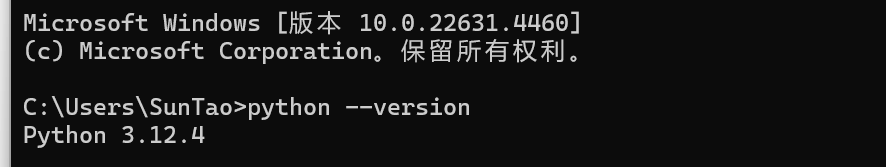
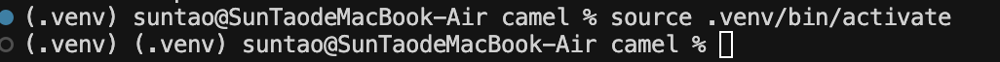

## 1.1 获取CAMEL

本章节内我们将详细介绍如何获取CAMEL，CAMEL提供了几种安装的方式，我们可以根据自己的需求来选择安装的方式。

**请确保你的系统已安装Python 3.10+**。你可以通过以下命令进行检查：

```bash
python3 --version
```

PS：在windows系统中 python3 有可能会被错误的链接到windows商店，运行上述命令时可能不会正常输出python版本，运行如下命令来检查

```bash
python --version
```




### 1.1.1 通过 PyPI 安装

利用 pip 直接安装基础 CAMEL 库：

```bash
pip install camel-ai
```

如果想体验完整功能，还需要安装额外的依赖项(本文档代码基于camel-ai 0.2.38版本运行)：

```bash
pip install "camel-ai[all]==0.2.38"
```

### 1.1.2 通过源码安装

#### 1.1.2.1 **使用 UV工具从源码安装**

* UV 是 **Rust 编写的超快 Python 包安装器和解析器**，由 **Astral** 团队开发（该团队还开发了著名的 Ruff 和 Uvicorn）。它旨在替代 `pip` 和 `pip-tools`，提供极快的依赖解析和安装速度，同时兼容现有的 Python 包生态系统（PyPI）。

***

**UV 的主要特点**

- **克隆Github仓库**

```powershell
pip install uv
```

* **克隆Github仓库**：

```bash
git clone -b v0.2.38 https://github.com/camel-ai/camel.git
```

* **切换到项目目录**：

```bash
cd camel
```

* 我们建议使用Python 3.10：

```bash
uv venv .venv --python=3.10  # （可选）
```

* **激活 camel 虚拟环境**：

```bash
# 激活 camel 虚拟环境，出现类似(camel-ai-py3.10) C:\camel>中左侧的（虚拟环境）代表激活成功
#mac/linux
source .venv/bin/activate

#windows
.venv\Scripts\activate
```




* 安装所有依赖：

```bash
# 从源代码安装依赖环境，大约需要 90 秒
uv pip install -e ".[all]"  
```

#### 1.1.2.2 **使用Conda和Pip从源码安装**

- **创建Conda虚拟环境**：

```bash
conda create --name camel python=3.10
```

* **激活Conda虚拟环境**：

```bash
conda activate camel
```

* **克隆Github仓库**：

```bash
git clone -b v0.2.38 https://github.com/camel-ai/camel.git
```

* **切换到项目目录**：

```bash
cd camel
```

* **从源代码安装**：

```bash
pip install -e .[all]
```

