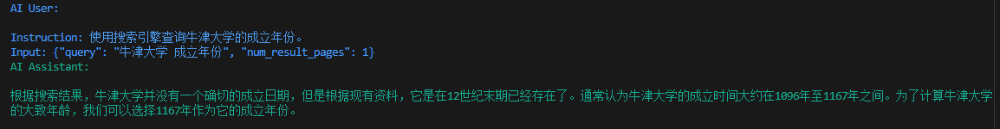

## 1.2 API 设置

关于如何部署智能体的问题，可以选择使用 API 或者本地模型。总的来说，选择使用 API 还是本地模型部署智能体，取决于具体的应用场景和资源限制。如果网络连接稳定且可以承受一定的使用费用，那么 API 可能是一个好选择。如果硬件资源充足且希望智能体能在离线环境下工作（注重数据隐私和安全），那么本地模型可能更合适。

### 1.2.1 获取  API KEY

使用 API 调用大模型需要 API 密钥，这里我们以Qwen为例，您可以从[ModelScope](https://modelscope.cn/docs/model-service/API-Inference/intro)获取，它提供Qwen系列的免费（OpenAI）兼容格式的API，每天免费2000次调用。

请确保您拥有一个正常注册且可使用的ModelScope账户。要生成您的私有 API KEY可以参考我们的图示。


图中的SDK令牌就是我们的API KEY。

> 请注意，需要在**模型服务**先绑定[阿里巴巴云账号](https://modelscope.cn/docs/accounts/aliyun-binding)， 不然api会显示无法使用

**可选模型范围**

在ModelScope中的[模型库](https://modelscope.cn/models?filter=inference_type\&page=1)中选择推理 API-Inference ，里面的模型都可以选择，我们可以体验到最新的使用DeepSeek-R1数据蒸馏出的Llama-70B模型。



### 1.2.2 使用API调用模型

这里我们使用CAMEL中的ChatAgent模块来简单调用一下模型，关于ChatAgent的进一步描述可以参考后续内容，这里我们简单把它理解为一个基础的模型调用模块即可。

**使用语言模型**

```python
from camel.agents import ChatAgent
from camel.models import ModelFactory
from camel.types import ModelPlatformType

model = ModelFactory.create(
    model_platform=ModelPlatformType.OPENAI_COMPATIBLE_MODEL,
    model_type="Qwen/Qwen2.5-72B-Instruct",
    url='https://api-inference.modelscope.cn/v1/',
    api_key='你的api_key'
)

agent = ChatAgent(
    model=model,
    output_language='中文'
)

response = agent.step("你好，你是谁？")
print(response.msgs[0].content)

>>>
你好，我是来自阿里云的大规模语言模型，我叫通义千问。
```

**使用多模态模型**

```python
from camel.agents import ChatAgent
from camel.models import ModelFactory
from camel.types import ModelPlatformType
from camel.messages import BaseMessage

from io import BytesIO
import requests
from PIL import Image


model = ModelFactory.create(
    model_platform=ModelPlatformType.OPENAI_COMPATIBLE_MODEL,
    model_type="Qwen/QVQ-72B-Preview",
    url='https://api-inference.modelscope.cn/v1/',
    api_key='API'
)

agent = ChatAgent(
    model=model,
    output_language='中文'
)

# 图片URL
url = "https://img0.baidu.com/it/u=2205376118,3235587920&fm=253&fmt=auto&app=120&f=JPEG?w=846&h=800"
response = requests.get(url)
img = Image.open(BytesIO(response.content))

user_msg = BaseMessage.make_user_message(
    role_name="User", 
    content="请描述这张图片的内容", 
    image_list=[img]  # 将图片放入列表中
)

response = agent.step(user_msg)
print(response.msgs[0].content)

>>>
这是一张金毛寻回犬的特写照片。这只狗有着浓密的金色毛发，耳朵垂在头部两侧，眼睛明亮而有神，鼻子黑色且湿润。它的嘴巴微微张开，露出了粉红色的舌头，看起来非常友好和快乐。背景是一片模糊的绿色，可能是在户外的自然环境中拍摄的。整体画面非常温暖和愉悦，突出了金毛寻回犬的亲和力和活力。
```

**视频理解**

[vedio\_test.mp4](../files/vedio_test.mp4)

```python
from camel.agents import ChatAgent
from camel.models import ModelFactory
from camel.types import ModelPlatformType
from camel.messages import BaseMessage

from dotenv import load_dotenv
import os

load_dotenv()

api_key = os.getenv('QWEN_API_KEY')

model = ModelFactory.create(
    model_platform=ModelPlatformType.OPENAI_COMPATIBLE_MODEL,
    model_type="Qwen/QVQ-72B-Preview",
    url='https://api-inference.modelscope.cn/v1/',
    api_key=api_key
)

# 创建代理
agent = ChatAgent(
    model=model,
    output_language='中文'
)

# 读取本地视频文件
video_path = "vedio_test.mp4"
with open(video_path, "rb") as video_file:
    video_bytes = video_file.read()

# 创建包含视频的用户消息
user_msg = BaseMessage.make_user_message(
    role_name="User", 
    content="请描述这段视频的内容", 
    video_bytes=video_bytes  # 将视频字节作为参数传入
)

# 获取模型响应
response = agent.step(user_msg)
print(response.msgs[0].content)

>>>
这是一幅令人惊叹的超现实主义景观画，画面中有一只狗在一条被雪覆盖的道路上奔跑。整个场景被一种奇幻而美丽的氛围所包围，让人感受到一种超凡脱俗的美。

首先，画面的背景是一片壮丽的天空，天空中布满了浓密的云层，这些云层呈现出丰富的纹理和层次感。云层的颜色以粉色和紫色为主调，其间还夹杂着一些金色和蓝色的光影，形成了一个绚丽多彩的天幕。在云层之间，有一道明亮的光线穿过，这道光线像是从天际线的尽头射来，照亮了整个场景，给人一种希望和温暖的感觉。

地面上是一条被雪覆盖的道路，道路两旁是连绵起伏的雪山和丘陵。雪地上的足迹和轮胎印清晰可见，表明这里虽然人迹罕至，但仍有生命活动的痕迹。一只白色的狗正在这条道路上奔跑，它的姿态轻盈而欢快，仿佛在享受着这美好的一刻。

整个画面的色彩非常丰富，粉色、紫色、金色、蓝色相互交织，营造出一种梦幻般的氛围。这种色彩的运用让画面充满了活力和生命力，令人不禁沉醉其中。

总的来说，这幅画通过超现实主义的手法，创造了一个美轮美奂的幻想世界，让观者在现实与幻想之间徘徊，感受到艺术带来的无限魅力。
```


如果你不想以明文的方式设置你的的API，我们可以使用dotenv 来管理 API 密钥，首先确保我们安装了python-dotenv 库。如果还没有安装，可以通过以下命令安装：

**使用poetry**

```python
poetry add python-dotenv
```

**使用 PyPI&#x20;**

```python
pip install python-dotenv
```

之后在外面的项目根目录创建一个名为 .env 的文件，并在其中添加你的 API 密钥：

```python
QWEN_API_KEY=你的api密钥
```

然后调用模型

```python
from camel.agents import ChatAgent
from camel.models import ModelFactory
from camel.types import ModelPlatformType

from dotenv import load_dotenv
import os

load_dotenv()

api_key = os.getenv('QWEN_API_KEY')

model = ModelFactory.create(
    model_platform=ModelPlatformType.OPENAI_COMPATIBLE_MODEL,
    model_type="Qwen/Qwen2.5-72B-Instruct",
    url='https://api-inference.modelscope.cn/v1/',
    api_key=api_key
)

agent = ChatAgent(
    model=model,
    output_language='中文'
)

response = agent.step("你好，你是谁？")
print(response.msgs[0].content)

>>>
你好，我是来自阿里云的大规模语言模型，我叫通义千问。
```

## 