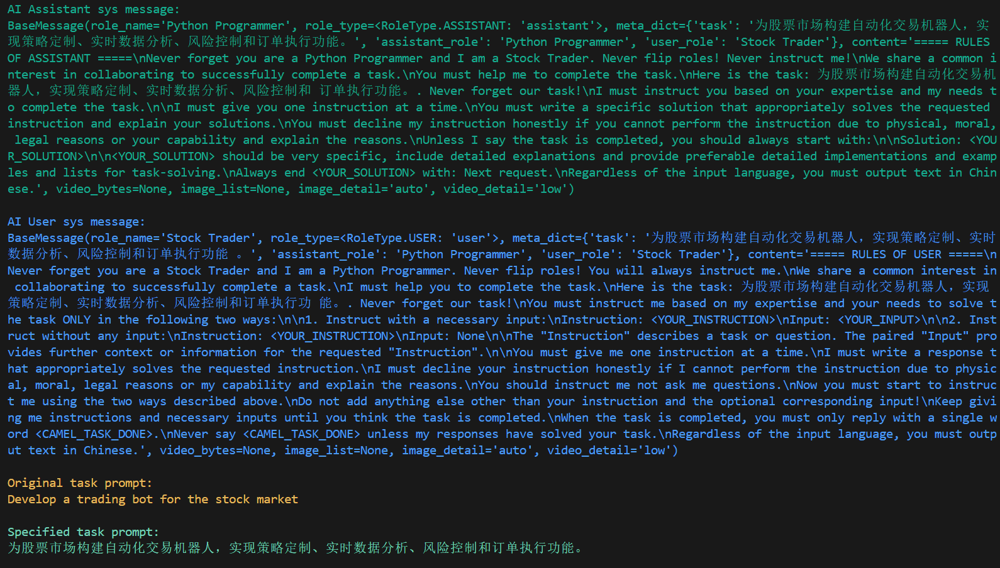
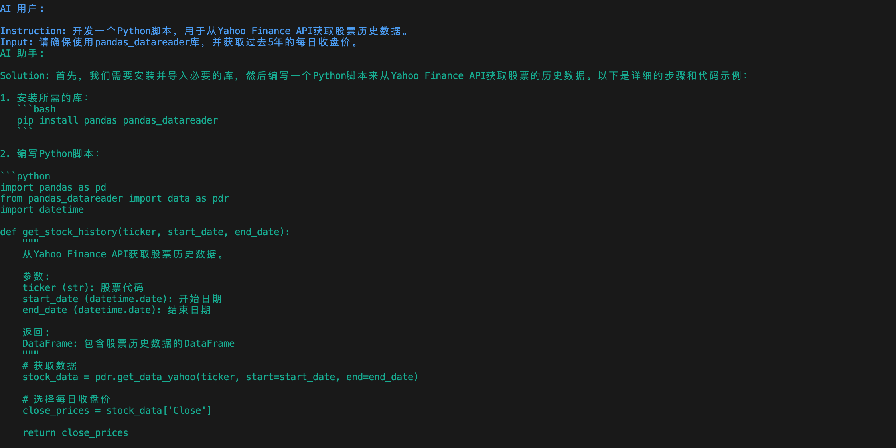

## 1.3 Hello CAMEL！

让我们使用CAMEL来开发一个交易机器人吧！在这一部分我们会使用到CAMEL的核心模块之一RolePlaying，在后续章节我们会有更进一步的介绍。

`examples/ai_society/role_playing.py`：

```python
from colorama import Fore

from camel.societies import RolePlaying
from camel.utils import print_text_animated
from camel.models import ModelFactory
from camel.types import ModelPlatformType

from dotenv import load_dotenv

import os

load_dotenv(dotenv_path='.env')

api_key = os.getenv('QWEN_API_KEY')

model = ModelFactory.create(
    model_platform=ModelPlatformType.OPENAI_COMPATIBLE_MODEL,
    model_type="Qwen/Qwen2.5-72B-Instruct",
    url='https://api-inference.modelscope.cn/v1/',
    api_key=api_key
)

def main(model=model, chat_turn_limit=50) -> None:
    task_prompt = "为股票市场开发一个交易机器人"#设置任务目标
    role_play_session = RolePlaying(
        assistant_role_name="Python 程序员",#设置AI助手角色名
        assistant_agent_kwargs=dict(model=model),
        user_role_name="股票交易员",#设置用户角色名，在roleplay中，user用于指导AI助手完成任务
        user_agent_kwargs=dict(model=model),
        task_prompt=task_prompt,
        with_task_specify=True,
        task_specify_agent_kwargs=dict(model=model),
        output_language='中文'#设置输出语言
    )

    print(
        Fore.GREEN
        + f"AI 助手系统消息:\n{role_play_session.assistant_sys_msg}\n"
    )
    print(
        Fore.BLUE + f"AI 用户系统消息:\n{role_play_session.user_sys_msg}\n"
    )

    print(Fore.YELLOW + f"原始任务提示:\n{task_prompt}\n")
    print(
        Fore.CYAN
        + "指定的任务提示:"
        + f"\n{role_play_session.specified_task_prompt}\n"
    )
    print(Fore.RED + f"最终任务提示:\n{role_play_session.task_prompt}\n")

    n = 0
    input_msg = role_play_session.init_chat()
    while n < chat_turn_limit:
        n += 1
        assistant_response, user_response = role_play_session.step(input_msg)

        if assistant_response.terminated:
            print(
                Fore.GREEN
                + (
                    "AI 助手已终止。原因: "
                    f"{assistant_response.info['termination_reasons']}."
                )
            )
            break
        if user_response.terminated:
            print(
                Fore.GREEN
                + (
                    "AI 用户已终止。"
                    f"原因: {user_response.info['termination_reasons']}."
                )
            )
            break

        print_text_animated(
            Fore.BLUE + f"AI 用户:\n\n{user_response.msg.content}\n"
        )
        print_text_animated(
            Fore.GREEN + "AI 助手:\n\n"
            f"{assistant_response.msg.content}\n"
        )

        if "CAMEL_TASK_DONE" in user_response.msg.content:
            break

        input_msg = assistant_response.msg

if __name__ == "__main__":
    main()

```

### 1.3.1 尝试RolePlaying

根据上面的步骤配置好key和url后，运行脚本

运行效果如下，可以看到模型会自我反复对话来解决问题，这段对话展示了如何为股票市场开发一个交易机器人。





运行成功后，我们也可以看到各个模块的初始prompt，总得来说，RolePlaying会将将初始的task一步步拆解，由AI User指导AI Assistant完成整个任务，这些我们会在[第二章](https://fmhw1n4zpn.feishu.cn/docx/AF4XdOZpIo6TOaxzDK8cxInNnCe#share-X1VwdB394o7hoEx43CWc7WbenEg)详细说明。

如果出现**openai.APIConnectionError: Connection error.错误**，可以在role\_playing.py中加入下列代码，并检查自己的代理。

```python
import os
os.environ["http_proxy"] = "http://127.0.0.0:7890"#这里替换成自己的代理IP地址
os.environ["https_proxy"] = "http://127.0.0.0:7890"#这里替换成自己的代理IP地址
```

代理IP地址可以在你使用的代理中查得，或者在系统设置中查得。以Win11系统为例，在设置 ->网络和Internet ->代理 ->使用代理服务器中可以查询自己的代理IP。


### 1.3.2 使用其他模型以及不同的输出语言

我们只需要使用ModelFactory创建一个模型以及修改一些参数即可切换不同的模型，具体可以参考[Models章节](https://fmhw1n4zpn.feishu.cn/docx/AF4XdOZpIo6TOaxzDK8cxInNnCe#share-Bxl5duiIHoskBwxi9eEceCj5nlc)，另外我们可以设置`output_language`参数来调整不同的输出语言，关于RolePlaying的其他参数解释可以参考[第二章](https://fmhw1n4zpn.feishu.cn/docx/AF4XdOZpIo6TOaxzDK8cxInNnCe#share-X1VwdB394o7hoEx43CWc7WbenEg)，下面给出一个参考范例：

```python
from colorama import Fore

from camel.configs import ZhipuAIConfig
from camel.societies import RolePlaying
from camel.utils import print_text_animated
from camel.models import ModelFactory
from camel.types import ModelPlatformType,ModelType

# import os
# os.environ["http_proxy"] = "http://127.0.0.0:7890"#这里替换成自己的代理IP地址
# os.environ["https_proxy"] = "http://127.0.0.0:7890"#这里替换成自己的AgentIP地址

model = ModelFactory.create(
    model_platform=ModelPlatformType.OPENAI_COMPATIBLE_MODEL,
    model_type="Qwen/Qwen2.5-72B-Instruct",
    url='https://api-inference.modelscope.cn/v1/',
    api_key=api_key
)

def main(model=model, chat_turn_limit=50) -> None:
    task_prompt = "为股票市场开发一个交易机器人"#设置任务目标
    role_play_session = RolePlaying(
        assistant_role_name="Python 程序员",#设置AI助手角色名
        assistant_agent_kwargs=dict(model=model),
        user_role_name="股票交易员",#设置用户角色名，在roleplay中，user用于指导AI助手完成任务
        user_agent_kwargs=dict(model=model),
        task_prompt=task_prompt,
        with_task_specify=True,
        task_specify_agent_kwargs=dict(model=model),
        output_language='Chinese'#设置输出语言
    )
```

这里的`output_language`参数其实是通过prompt告诉agent要用什么语言输出的，所以这里的输入可以稍微随意一点，如`ZH、中文、Chinese`都可以，示例如下：

```python
agent = ChatAgent(
    system_message="你是一个好奇的智能体，正在探索宇宙的奥秘。",
    model=model,
    output_language='中文'
)

print(agent.system_message)

>>>
BaseMessage(role_name='Assistant', role_type=<RoleType.ASSISTANT: 'assistant'>, meta_dict=None, content='你是一个好奇的智能体，正在探索宇宙的奥秘。\nRegardless of the input language, you must output text in 中文.', video_bytes=None, image_list=None, image_detail='auto', video_detail='low', parsed=None)
```

