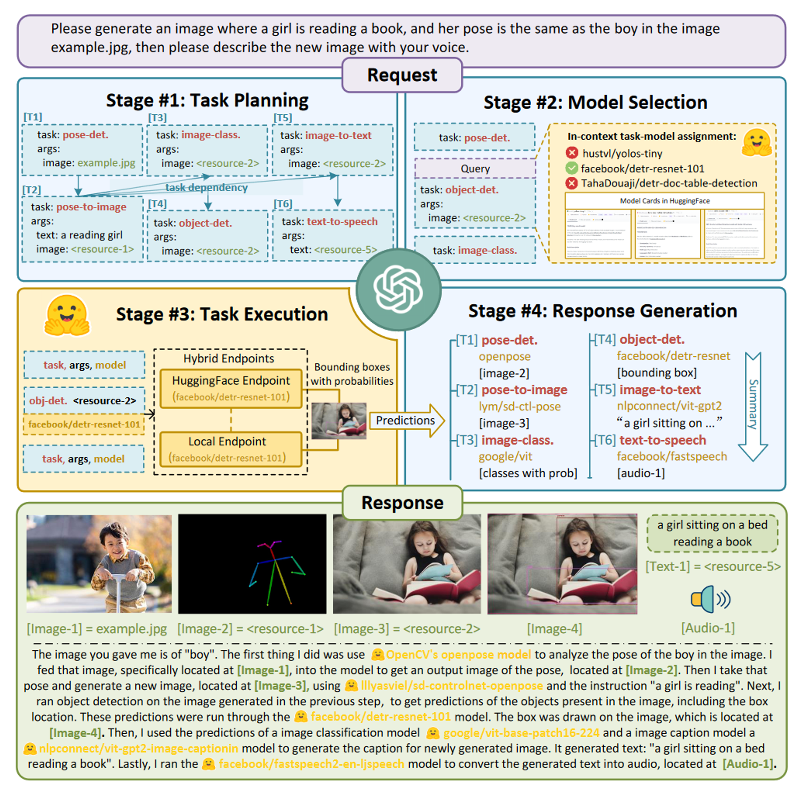

* ## 2.1 智能体概述

  智能体是一个能够感知环境并在环境中自主行动以实现特定目标的系统。它具有以下几个关键特征：

  1. 自主性 - 智能体可以在没有直接人为干预的情况下运作，能够自行决策和行动。

  2. 响应性 - 能够感知环境并对环境变化做出及时响应。

  3. 主动性 - 不仅被动响应环境,还可以主动采取行动来实现目标。

  4. 社交能力 - 能够与其他智能体或人类进行交互和协作。

  从应用角度，智能体可以分为几类：

  1. 任务型智能体 - 专注于完成特定任务,如虚拟助手、智能客服等

  2. 学习型智能体 - 通过与环境交互不断学习和改进,如强化学习智能体

  3. 协作型智能体 - 多个智能体协同工作,形成多智能体系统

  4. 对话型智能体 - 专门用于自然语言交互的智能体,如我这样的语言模型

  在实现方面，现代智能体通常基于以下技术：

  * 大语言模型(LLM)作为认知和决策的核心

  * 规划系统用于制定行动计划

  * 记忆系统存储相关信息和经验

  * 工具使用能力来扩展行动范围

  该领域的发展时间线如下(不完全统计）：

  * **「CAMEL」- 发布于2023年3月21日（详情请见章节2.3）：**&#x43;AMEL-AI是一个开源社区，致力于研究自主和交流Agent。该社区认为，大规模研究这些Agent可以提供有关其行为、能力和潜在风险的宝贵见解。为了促进该领域的研究，CAMEL框架提供、实施和支持各种类型的Agent、任务等。[【1】](https://www.camel-ai.org/?_blank)。CAMEL-AI的官方网站是www.camel-ai.org，它是一个关于交流Agent用于探索大型语言模型社会的平台，由Guohao Li, Hasan Abed Al Kader Hammoud, Hani Itani, Dmitrii Khizbullin, Bernard Ghanem等人于2023年3月31日提交，并于2023年11月2日进行了修订[【2】](https://github.com/camel-ai/camel?_blank)。CAMEL框架旨在设计实用的通用人工智能，作为最早的基于大型语言模型的多Agent框架，现在是一个通用框架，用于构建和使用基于大型语言模型的Agent来解决现实世界的任务[【3】](https://arxiv.org/abs/2303.17760?_blank)。此外，CAMEL AI framework的GitHub页面camel-ai/camel提供了公共通知、分支、星级等信息，其中v0.2.20a1是最新的版本，发布于2025年02月07日[【4】](https://camel-ai.github.io/camel/?_blank)。

  * **「AutoGPT」 - 发布于2023年3月30日：**&#x41;uto-GPT基于GPT-4，允许AI自主行动，无需用户详尽提示每个动作。用户可以为Auto-GPT制定一个总体目标，然后由它逐步采取行动以实现目标。与ChatGPT不同，Auto-GPT可以自主作出决策，这是ChatGPT所没有的功能。它可以自动提示和生成完成任务所需的每一个必要提示。

  * **「HuggingGPT」- 发布于2023年3月30日：**&#x48;uggingGPT是一个基于ChatGPT的Agent，旨在利用Hugging Face上的AI模型解决跨领域和多模态的复杂AI任务。该框架通过ChatGPT根据用户请求制定任务计划，然后选择Hugging Face上的AI模型来执行子任务，最后总结执行结果并给出响应。HuggingGPT在语言、视觉、语音等任务中都取得了很好的效果。该框架首次提交于2023年3月30日，最新版本发布于2023年12月3日[【1】](https://arxiv.org/abs/2303.17580?_blank). HuggingGPT的核心思想是利用大型语言模型（LLMs）作为控制器，管理和组织专家模型的合作，以解决复杂的AI任务[【2】](https://ar5iv.labs.arxiv.org/html/2303.17580?_blank). 该框架的发布标志着向人工通用智能（AGI）迈出了关键一步[【3】](https://blog.csdn.net/weixin_43336281/article/details/139123423?_blank).

    

    图 2-9  HuggingGPT工作原理图

  

  * **「Westworld」模拟（斯坦福西部世界小镇）— 发布于2023年4月7日:&#x20;**&#x53;mallville的虚拟小镇，用于研究人工智能在社会互动中的行为。这个小镇拥有25个AI智能体，它们具有工作、社交、结交朋友、甚至举办情人节派对等能力。每个AI智能体都有独特的个性和背景故事，它们在Smallville小镇的公共场景中自由活动，如咖啡馆、酒吧、公园、学校、宿舍、房屋和商店。Smallville小镇的AI智能体展现出了类似人类的行为，例如在看到早餐着火时会去关掉炉子，看到浴室有人时会在外面等待，遇到想交谈的个体时会停下来聊天。这个项目在AI社区引起了轰动，被认为是2023年最激动人心的Agent实验之一。Smallville项目地址为：[https://github.com/joonspk-research/generative_agents](https://github.com/joonspk-research/generative_agents)。这使得研究人员和开发者可以访问和研究这个虚拟小镇的代码和架构，进一步探索人工智能在社会互动领域的潜力。

  * **「VOYAGER」 - 发布于2023年5月25日：&#x20;**&#x56;OYAGER 是一个创新的开源 AI 智能体项目，它展示了大语言模型在游戏环境中的自主学习能力。这个项目在 Minecraft 游戏世界中运行，能够通过环境交互来学习新技能、制定计划并执行复杂任务。它采用了课程学习方法，并集成了技能库系统来存储和复用已学习的技能，是首个在 Minecraft 中展现持续学习能力的 AI 智能体。该项目由 MineDojo 团队开发，其源代码可在 GitHub (github.com/MineDojo/Voyager) 查看，相关研究发表在论文 "VOYAGER: An Open-Ended Embodied Agent with Large Language Models" 中，项目详情可访问 minedojo.org 了解更多。这个开创性的项目对理解 AI 在开放环境中的持续学习能力具有重要意义。

  * **「MetaGPT」- 发布于2023年7月：** MetaGPT是一个将LLM转变为多个协作的软件公司角色的框架。它能够将一个产品需求转化为完整的软件项目，包括分析、设计、编码等全过程。每个角色（如产品经理、架构师、程序员等）都由一个LLM Agent扮演，它们协同工作以完成软件开发任务。 参考链接：<https://github.com/geekan/MetaGPT>

  * **「ChatDev」 - 发布于2023年8月28日：**&#x43;hatDev的主要特点包括：

    1. **增量开发**：支持在现有代码基础上进行开发，通过指定源代码目录路径来实现。&#x20;

    2. **Docker支持**：通过Docker实现安全执行，这得益于ManindraDeMel的贡献。

    3. **多智能体协作**：不同角色的智能体在用户指定任务需求后进行交互式协同，生成完整的软件产品。

    4. **ChatDev IDE**：这是一个用于构建Agent的工具，支持JavaScript，可以加速提示工程，适用于游戏NPC或强大的Agent工具设计。

  ChatDev的潜力在于将大型语言模型（LLMs）整合到软件开发领域，为软件开发过程带来新的视角和可能性。它不仅提高了软件开发的效率和成本效益，还通过实验证明了其在软件开发过程中的优势。

  * **「XAgent」 - 发布于2023年10月23日：&#x20;**&#x662F;清华大学知识工程实验室开发的一个创新型自主Agent框架，它能够像人类开发者一样理解和执行复杂的计算机任务。该系统基于大语言模型构建，具备工作记忆和自我反思能力，可以通过任务分解、代码编写、调试和优化来解决各类问题。XAgent 采用模块化设计，集成了多种工具，包括代码执行、网页浏览和文件操作等功能，同时具备任务规划、动作执行和工具调用等核心组件。它不仅支持复杂任务的递归分解和执行监控，还具有失败恢复和重试机制，可广泛应用于软件开发、数据分析、自动化测试和文档管理等领域。项目完整源代码已在 GitHub (github.com/OpenBMB/XAgent) 开源，相关技术细节可参考其论文 "XAgent: An Autonomous Agent for Complex Task Solving"。

  * **「Amazon Bedrock Agents」- 2023年11月发布**：Amazon发布了Bedrock Agents，这是一个基于Amazon Bedrock构建的企业级AI Agent开发平台。它支持多种基础模型如Claude和Llama 2，并提供了完整的知识库管理和工具集成能力。开发者可以利用Bedrock Agents创建能执行特定任务的AI助手，同时确保企业级的安全性和合规性。

    紧接着在2023年12月，Amazon推出了AWS Q，这是一个专门面向AWS生态系统的AI助手。AWS Q能够协助开发者进行代码生成、问题诊断、系统架构设计等任务，并提供AWS最佳实践建议。它的推出标志着Amazon在专业领域AI助手方面的重要突破。

    进入2024年，Amazon继续加强其AI Agent产品线。2024年1月，公司推出了SageMaker Agents，这是一个专注于机器学习工作流程的智能助手系统。它能够自动化数据处理、模型训练和部署过程，显著提升了机器学习开发效率。2024年2月，CodeWhisperer Agent获得了重大更新，增加了完整的对话能力和代码解释功能，进一步强化了其作为代码AI助手的地位。

    Amazon的AI Agent战略特别强调企业级应用场景，注重安全性和可扩展性。通过与AWS云服务的深度集成，这些AI Agent能够无缝接入企业现有的技术栈。Bedrock Agents: <https://aws.amazon.com/bedrock/agents/>

  * **「OpenAssistant Pythia」- 发布于2024年1月：** 这是一个开源的对话式AI框架，由LAION和Anthropic等组织支持。它的目标是创建一个透明、开放的AI助手生态系统。该项目持续活跃，提供了多语言支持和各种任务处理能力。 参考链接：<https://github.com/LAION-AI/Open-Assistant>

  * **「Ray」- 2024版本：** 由Anyscale开发的分布式计算框架，Ray的Agent系统是一个完整的分布式AI框架，它整合了强化学习、模型服务和分布式训练等多个关键组件。在其核心，RLlib提供了丰富的强化学习算法支持，包括PPO、DQN和SAC等，并能够实现大规模的分布式训练。Ray Serve则负责Agent的部署和服务，提供了实时推理、负载均衡和A/B测试等功能。而Ray Train则专注于分布式训练的实现，支持超参数优化和进度追踪等特性。在技术实现上，Ray采用了Actor编程模型，使得开发者能够轻松构建和部署分布式Agent系统。每个Agent可以被视为一个独立的Actor，能够维护自己的状态并进行异步通信。系统支持自动的资源管理和调度，确保计算资源被高效利用。同时，Ray的容错机制能够自动处理节点失败等问题，保证系统的稳定性。参考链接：https://ray-project.github.io/q4-2021-docs-hackathon/0.4/ray-api-references/ray-rllib/agents/

  * **「OpenAI Swarm」 - 2024年初：** OpenAI Swarm是OpenAI推出的一个实验性框架，旨在帮助开发者协调多智能体系统。这是一个具有突破性的框架，它简化了多智能体系统的编排过程。它引入了智能体（agents）、交接（handoffs）、例程（routines）和函数调用（function calling）等先进概念，为实验多个AI智能体的协调提供了强大的工具。该框架的核心功能包括专门执行特定任务的AI单元、允许智能体之间无缝转换任务的交接机制、定义标准化工作流程的例程系统，以及实现智能体与外部系统交互的函数调用能力。参考链接：https://github.com/openai/swarm

