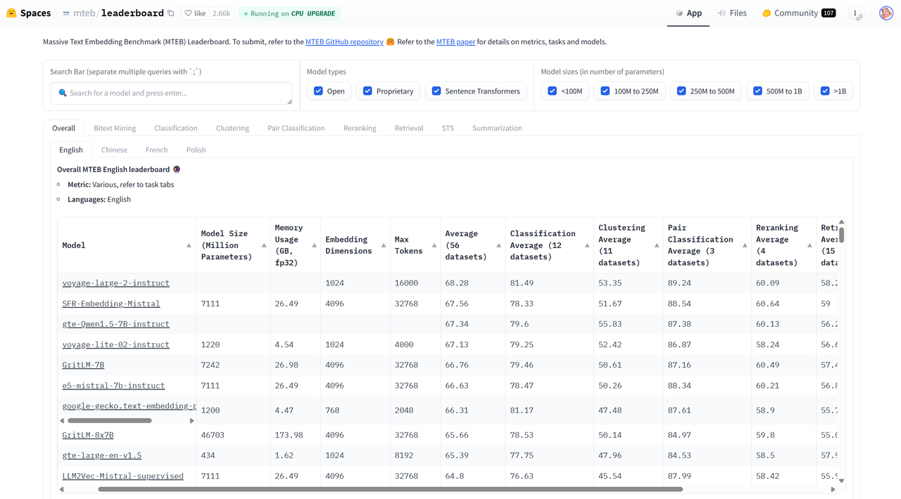

## 4.3 搭建知识库&#x20;

### 4.3.1 Embedding模型选择&#x20;

在搭建知识库时，常用的embedding model可选择：

* **Embedding API**：如OpenAI，Cohere，Mistral等的API服务，适用于项目或工程中需要方便直接的使用嵌入且不介意数据隐私的情况

* **Open Embedding Model**：适用于对数据隐私有要求或需要自定义模型本地部署的情况

以上两者的区别可以等价的理解成大语言模型API和开源本地LLM的区别。

在[HuggingFace的排行榜](https://huggingface.co/spaces/mteb/leaderboard)上可以看到各种各样开源好用的embedding模型。在具体研究和工程问题的选择中，其实没有一个明确的好坏评价标准，适合自己的数据处理场景才是最好的。一个常见的方法是构造自己应用场景的专有评测集，然后分别尝试，量化的方式来评估分数最后选择。

todo：评测集构建的例子

### 4.3.2 数据预处理&#x20;

当我们拿到一篇或多篇文章，它们的格式可能是pdf，txt，doc甚至是ppt，我们往往会对其进行数据的预处理，来帮助后续流程中更好地让大语言模型和embedding模型来发挥作用。

机器学习中有一句深刻的名言：Garbage in，Garbage out。这不仅仅可以用于机器学习模型的训练，推理时过于混乱的原始信息也可能会极大程度地干扰模型的回复效果。因此，**数据预处理至关重要！**

数据处理的常用手段包含格式统一转换和数据清洗

数据读取 → 数据格式转换 → 数据清洗

Todo：流程图

* **数据读取**：从文件、数据库或API获取原始数据

* **数据格式转换**：将多样的数据统一转换成方便模型处理的格式（常用的为Markdown format）

* **数据清洗**：去除噪声、纠正错误、信息筛选等

TODO：一个pdf转成Markdown的代码示例