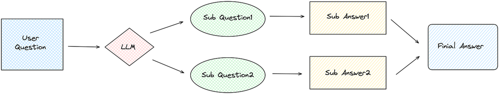

## 4.4 构建RAG应用&#x20;


### 4.4.1 Basic RAG&#x20;

RAG，全称为 Retrieval Argumented Generation，检索增强生成。

大语言模型通过预训练阶段在海量文本上的自监督训练中获得了大量的人类知识，但是依然存在一些诸如时效性和幻觉的问题。而RAG正是为了补充并增强大语言模型的能力，使其尽量和现实世界对齐的一种技术路线。

一个最为简单朴素的RAG的思想为：我有一些文本数据包含了有用的信息，我想让大语言模型利用这些文本信息来生成回复，而不是直接输出答案，因此在原先的交互流程中，我们要将外部文本信息组成上下文合并到prompt中，交付给LLM，以此来达成**增强生成（Argumented Generation）**&#x7684;目的，就是这么简单！

这个时候聪明的读者可能就会发现了，欸，那 **Retrieval** 去哪儿了呢。这是一个很好的问题，如果我现在有一篇800字的作文或者5000字的论文，那我直接将其简单处理后合并进prompt中就可以了，如下所示：

```python
essay = "800字的作文，以下省略800字..."
paper = "5000字的论文，以下省略5000字..."

system_prompt = "you are a helpful assistant"
user_prompt = f"帮我总结一下这篇文章，全文信息如下：{essay}"

prompt = system_prompt + user_prompt
```

但是，当我有100篇，甚至成千上万篇文章，以上亿token为单位的上下文长度时，很显然，会分分钟超出现在大语言模型所支持的上下文长度。此时，一个显而易见的解决方案便是：我只将我最关心的那一部分内容合并到 prompt 中交付给大模型。那如何才能知道大量文本中，哪些才是我最关心或者说和我的问题最相关的片段部分呢。欸，这就是 Retrieval 阶段的功能和作用。

CAMEL中对于Retrieval这一过程的功能实现在 `camel.retrievers` 中，具体参考https://docs.camel-ai.org/key\_modules/retrievers.html

根据匹配标准和算法的不同，常用的retriever大致可以分成两类，基于向量的稠密检索和基于关键词的稀疏检索，分别对应`camel.retrievers` 中的 `VectorRetriever` 和 `BM25Retriever`

```python
from camel.retrievers import VectorRetriever
from camel.retrievers import BM25Retriever

embedding_model=SentenceTransformerEncoder(model_name='intfloat/e5-large-v2')
vr = VectorRetriever(embedding_model=embedding_model)
br = BM25Retriever()
```


`VectorRetriever`，向量检索器利用数据的向量表示，将数据（如文本、图像或其他形式的信息）转换为高维空间中的数值向量。

以下是向量检索的工作流描述：

* **分块**：对于大型文档或其他形式的数据信息而言，需要按一定的划分规则将其分解为较小的块

* **嵌入**：对于每一个分块，使用嵌入模型将文本转换为高维的向量形式。

* **存储**：这些得到的向量会被存储在数据库中。

* **检索**：当提出问题或进行查询时，嵌入模型会将问题转换为向量，然后在此向量数据库中搜索相似度高的匹配向量（这里一般会用余弦相似度来计算两个向量之间的距离），从而返回最相关的信息片段。

`BM25Retriever`，关键词检索器从结果而言是一样的，只不过是从更加稀疏的关键词的维度来对文本进行召回。通过关键词匹配的算法获取相似度高的文本片段，尽可能筛选出最相关的信息片段。

最后将最相关的信息片段像之前演示的那样合并到 prompt 中，交给大语言模型生成检索增强后的回复


接下来我们通过一个demo来学习以下如何快速搭建一个Basic RAG的系统

**读取示例数据：**

这里我们首先下载一篇CAMEL的论文作为文本示例，该PDF就是我们的原始文件

```python
import os
import requests

os.makedirs('local_data', exist_ok=True)

url = "https://arxiv.org/pdf/2303.17760.pdf"
response = requests.get(url)
with open('local_data/camel_paper.pdf', 'wb') as file:
    file.write(response.content)
```

**实例化Embedding Model：**

这里使用 `VectorRetriever`，使用本地模型作为嵌入模型。

```python
from camel.embeddings import SentenceTransformerEncoder
from camel.retrievers import VectorRetriever

embedding_model=SentenceTransformerEncoder(model_name='intfloat/e5-large-v2')
# 初始化VectorRetriever实例并使用本地模型作为嵌入模型
vr = VectorRetriever(embedding_model= embedding_model)
```

**向量嵌入和存储数据：**

接下来，我们将原始的文档读取，分块并且通过embedding模型生成向量表示和索引并将其存储在专门用来存储向量数据的向量数据库，VectorDB中。CAMEL框架中的 `process` 函数其本质上就是将**文件读取、切块、嵌入并储存**这个固定的处理流程统一封装成了一个方法，使得开发者更加方便快速的搭建RAG应用。

```python
# 创建并初始化一个向量数据库 (以QdrantStorage为例)
from camel.storages.vectordb_storages import QdrantStorage

vector_storage = QdrantStorage(
    vector_dim=embedding_model.get_output_dim(),
    collection="demo_collection",
    path="storage_customized_run",
    collection_name="论文"
)

# 将文件读取、切块、嵌入并储存在向量数据库中，这大概需要1-2分钟
vr.process(
    content="local_data/camel_paper.pdf", 
    storage=vector_storage
)
```

这里如果出现`UserWarning: Failed to partition the file: local_data/camel_paper.pdf`

`warnings.warn(f"Failed to partition the file: {input_path}")`需要补充这个环境：

**Windows**

```python
pip install python-magic-bin
```

**Mac和Linux**

```python
pip install python-magic
#brew install libmagic#Mac需要额外配置
```

**执行检索，查看效果：**

完成向量数据库的构建和存储后，就可以根据问题来进行检索。这里调用 `query` 方法执行查询

```python
# 设定一个查询语句
query = "CAMEL是什么"

# 执行查询并获取结果
results = vr.query(query=query, top_k=1)
print(results)
```

这里的参数`top_k=1`是指定检索器返回最相关的文本内容，同时还有一个相似度阈值参数`similarity_threshold`，其值介于0到1之间，默认值是`0.75`，从而确保检索到的内容的相关程度，可以根据自己应用场景的实际需求更改 `top_k 或 similarity_threshold` 值。&#x20;

`"What is CAMEL"`得到回复为

```markdown
[{'similarity score': '0.8193796123510835', 'content path': 'local_data/camel_paper.pdf', 'metadata': {'filetype': 'application/pdf', 'languages': ['eng'], 'page_number': 1}, 'extra_info': {}, 'text': '3 2 0 2\n\nv o N 2\n\n] I\n\nA . s c [\n\n2 v 0 6 7 7 1 . 3 0 3 2 : v i X r a\n\nCAMEL: Communicative Agents for “Mind” Exploration of Large Language Model Society https://www.camel-ai.org\n\nGuohao Li∗ Hasan Abed Al Kader Hammoud*\n\nHani Itani*\n\nDmitrii Khizbullin\n\nBernard Ghanem\n\nKing Abdullah University of Science and Technology (KAUST)\n\nAbstract'}]
```

返回的字典包括：

* `similarity score` 相似性分数

* `content path` 内容路径

* `metadata` 元数据

* `text` 文本

当然，如果在实际应用中我们往往只关心模型的文本回复部分，我们可以在字典中取出`text`的值。

```python
print(results[0]["text"])
```

我们再尝试一个与论文内容无关的提问`"Compared with dumpling and rice, which should I take for dinner?"`：

```python
retrieved_info_irrevelant = vr.query(
    query="Compared with dumpling and rice, which should I take for dinner?",
    top_k=1,
    similarity_threshold=0.8
)

print(retrieved_info_irrevelant)
```

```markdown
[{'text': 'No suitable information retrieved from local_data/camel paper.pdf with similarity_threshold = 0.75.'}]
```

我们可以看到在相似度阈值为0.8的情况下，检索器没有找到论文中与提问有关内容，这和我们的预期是十分符合的。

到目前为止，整个RAG的流程还没结束，因为我们实际上目前为止只是把最相关的内容检索了出来，还差最后一步，结合大语言模型的生成。

聪明的读者可能已经想到了，此时我们只需要实例化一个LLM或者Agent就可以了，CAMEL中的一个用于一般对话场景的Agent为 `camel.agents` 中的 \`ChatAgent\`。

```python
from camel.agents import ChatAgent
from camel.models import ModelFactory
from camel.types import ModelPlatformType

from dotenv import load_dotenv
import os

load_dotenv()
api_key = os.getenv('QWEN_API_KEY')
retrieved_info = vr.query(
    query="what is roleplaying?",
    top_k=1,
)

assistant_sys_msg = """
你是一个帮助回答问题的助手，
我会给你原始查询和检索到的上下文，
根据检索到的上下文回答原始查询，
如果你无法回答问题就说我不知道。
"""

model = ModelFactory.create(
        model_platform=ModelPlatformType.OPENAI_COMPATIBLE_MODEL,
        model_type="Qwen/Qwen2.5-72B-Instruct",
        url='https://api-inference.modelscope.cn/v1/',
        api_key=api_key
    )

user_msg = retrieved_info[0]['text']
print(user_msg + '\n')

agent = ChatAgent(assistant_sys_msg,model=model)
# 使用step方法获得最终的检索增强生成的回复并打印
assistant_response = agent.step(user_msg)
print(assistant_response.msg.content)

>>>
novel communicative agent framework named role- playing . Our approach involves using inception prompting to guide chat agents toward task completion while maintaining consistency with human intentions. We showcase how role-playing can be used to generate conversational data for studying the behaviors and capabilities of a society of agents, providing a valuable resource for investigating conversational language models. In particular, we conduct com- prehensive studies on instruction-following

根据提供的上下文，这个新的沟通代理框架名为“角色扮演”（role-playing）。该方法通过使用启发式提示（inception prompting）来引导聊天代理完成任务，同时保持与人类意图的一致性。研究展示了如何利用角色扮演生成对话数据，以研究代理社会的行为和能力，为调查对话语言模型提供宝贵的资源。特别是，研究对指令遵循进行了全面的研究。如果你有更具体的问题或需要进一步的信息，请告诉我！
```


更进一步我们可以将这一个步骤封装到一个函数里：


```python
from camel.agents import ChatAgent
from camel.messages import BaseMessage
from camel.types import RoleType
from camel.retrievers import AutoRetriever
from camel.types import StorageType

def single_agent(query: str) ->str :
    # 设置agent角色
    assistant_sys_msg = """你是一个帮助回答问题的助手，
        我会给你原始查询和检索到的上下文，
        根据检索到的上下文回答原始查询，
        如果你无法回答问题就说我不知道。"""

    # 添加自动检索器
    auto_retriever = AutoRetriever(
            vector_storage_local_path="local_data2/",
            storage_type=StorageType.QDRANT,
            embedding_model=embedding_model)

    # 运行向量检索器
    retrieved_info = auto_retriever.run_vector_retriever(
        query=query,
        contents=[
            "local_data/camel_paper.pdf",  # 示例本地路径
            "https://github.com/camel-ai/camel/wiki/Contributing-Guidlines",  # 示例url
        ],
        top_k=1,
        return_detailed_info=False,
        similarity_threshold=0.5
    )

    # 将检索到的信息传递给agent
    user_msg = str(retrieved_info)
    agent = ChatAgent(assistant_sys_msg,model =model)

    # 获取响应
    assistant_response = agent.step(user_msg)
    return assistant_response.msg.content

print(single_agent("如果我对贡献CAMEL项目感兴趣，我应该怎么做？"))

>>>
如果您对贡献CAMEL项目感兴趣，您可以按照以下步骤进行：

1. **查看项目页面**：访问CAMEL项目的GitHub页面，了解项目的最新动态、功能和目标。
2. **阅读贡献指南**：在项目页面中查找并阅读“Contributing Guidelines”（贡献指南），了解如何参与项目、代码风格要求、提交Pull Request的流程等。
3. **参与讨论**：加入项目的Issues和Discussions部分，与其他贡献者交流，提出问题或建议。
4. **选择任务**：从Issues列表中选择一个适合您的任务开始。如果有疑问，可以在Issue下留言询问。
5. **提交代码**：完成任务后，提交Pull Request，并按照项目的要求进行代码审查。

希望您能顺利参与到CAMEL项目中！
```

```python
print(single_agent("什么是RolePlaying?"))

>>>
角色扮演（RolePlaying）是一种沟通代理框架，通过使用启发式提示来引导聊天代理完成任务，同时保持与人类意图的一致性。这种方法可以用于生成对话数据，以研究代理社会的行为和能力，为调查对话语言模型提供宝贵的资源。特别是在遵循指令方面进行了全面的研究。
```


至此，恭喜您已经搭建了一个Basic RAG，接下来我们将介绍更多RAG中的小技巧\~


**作业**：在自己准备的数据集上尝试搭建一个RAG应用并测试一下效果，如果效果不理想，是否有改进的方法呢？


### 4.4.2 Rewriting&#x20;

带着上一章作业的问题来看接下来的章节会更有收获哦！


在实际的应用中，很多时候我们可能会发现，用户的提问是不一定准确的，比如存在错别字，语义顺序颠倒等情况，甚至有时候用户对于自己的Query究竟要如何表达也是模糊不清的，而阅读并实践了上一章节的读者可能会有一个直观的感受，就是Query不仅会作用在检索的部分，还会作用在最后生成回复的部分，简而言之，Query的质量可能会极大程度地影响整个RAG系统的表现和性能。

因此在这里，我们尝试加入一个对于初始Query的改写或者澄清模块，又称为 `Rewriting` ，来尽可能提高Query的质量或增强之后RAG环节的质量。

我们不妨针对之前的分析来思考一下如何进行改写才能缓解之前提到的问题。

* **错字校正**：修正用户输入中可能存在的错别字的情况

* **句式调整**：重构Query来使得句子表达更加通顺严谨

对于这两个常规问题，我们可以使用LLM自我调整，通过提示词工程的方式令其自我优化提示词。

```python
original_query = "我盖如何解决CAMEL中文档冲服的问题问题呢，几个版本的文档可能存在代码结构的冲突"
sys_msg = '你是RAG模块中的Rewriting助手，目的是理解用户的提问，并且重新组织和优化用户的提问表达，修正用户输入中可能存在的错别字的情况并重构提问来使得句子表达更加通顺严谨'
from camel.models import ModelFactory
from camel.types import ModelPlatformType, ModelType
from camel.configs import ChatGPTConfig
from camel.agents import ChatAgent

from dotenv import load_dotenv
import os

load_dotenv()
api_key = os.getenv('QWEN_API_KEY')

# 定义模型
model = ModelFactory.create(
        model_platform=ModelPlatformType.OPENAI_COMPATIBLE_MODEL,
        model_type="Qwen/Qwen2.5-72B-Instruct",
        url='https://api-inference.modelscope.cn/v1/',
        api_key=api_key
    )
agent = ChatAgent(system_message=sys_msg, model=model)
# 定义Rewriting任务
usr_msg = f'用户的原始提问如下：{original_query}，请优化重写并直接输出新的Query。新的Query: ' 
response = agent.step(usr_msg)
print(response.msgs[0].content)
```

这里优化的轮数取决于需求，你可以让LLM不断优化，直到满足你的预期为止。

此外，Rewriting模块还存在很多其他优化技巧，比如：

* 子问题策略

也称为子查询，是一种用于生成子问题的技术。其核心思想是在问答过程中生成并提出与主问题相关的子问题，以便更好地理解和回答主问题。这些子问题通常更具体，可以帮助系统更深入地理解主问题，从而提高检索准确性和提供正确的答案。




* HyDE 查询转换

论&#x6587;**「Precise Zero-Shot Dense Retrieval without Relevance Labels」** 提出了一种名为假设文档嵌入 (HyDE) 的方法。HyDE (Hypothetical Document Embeddings) 的本质是使用 LLM 为用户查询生成假设文档。这些文档是根据 LLM 本身的知识生成的，可能包含错误或不准确之处。但是，它们与 RAG 知识库中的文档相关联。然后，通过使用这些假设文档来检索具有相似向量的真实文档，从而提高检索的准确性。


我们可以对比一下加入了Rewriting之后的回复生成效果和Basic RAG的结果

TODO：对比效果

作业：你还知道其他Rewriting的优化技巧和方法吗？能在CAMEL框架中实现上述的两个

### 4.4.3 Rerank

之前我们提到了可以通过向量和关键字等多种方式和不同的维度来进行检索，为了检索这一步结果的精确性和强相关性，我们往往会引入Rerank这一模块来对多路召回(多路指的是向量相似度，关键字匹配，基于规则的匹配，甚至结构化搜索等多种方式并行召回，往往召回的片段结果数量加起来比较多)的文档片段结果进行重排。因为数量越多，召回的内容相关度越可能存在问题，多数情况下score最高的片段相关度没问题，但是top2-5及往后的相关度就很随机了，这会对最终生成效果造成影响。

Rerank模块对初步检索结果重新排序可以简单概括为以下几步：

1. **初步检索**：获取（多路召回）初始文档片段

2. **特征计算**：评估每个文档的相关性

3. **重新排序**：根据特征得分排序

4. **选择最佳结果**：根据重排结果倒序排列，取前TOP-K个作为最终的最相关结果交给LLM生成回复

为了量化我们系统的有效性，我们主要依赖于两个被广泛接受的指标：**命中率(hit rate)&#x20;**&#x548C; **平均倒数排名(MRR)**。

**命中率(Hit Rate)：**

Hit rate计算在前k个检索文档中找到正确答案的查询比例。简单来说，它是关于我们的系统在前几次猜测中正确的频率。

**平均倒数排名(MRR)：**

对于每个查询，MRR通过查看排名最高的相关文档的排名来评估系统的准确性。具体来说，它是所有查询中这些秩的倒数的平均值。因此，如果第一个相关文档是顶部结果，则倒数排名为1; 如果是第二个，倒数是1/2，以此类推。

如果还没有太懂，不要紧，我们可以通过BAAI提供的Evaluation测评的结果来直观的理解，简单而言对于同一个embedding model，使用不同的rerank model，mrr和hit rate指标的分数越高，意味着效果越好！https://huggingface.co/BAAI/bge-reranker-v2-minicpm-layerwise


我们这里使用比较经典的RRF（Reciprocal Rank Fusion）算法来实现一个reranker。

倒数排序融合(RRF) 是一种将具有不同相关性指标的多个结果集组合成单个结果集的方法，不同的相关性指标也不必相互关联即可获得高质量的结果。该方法的优势在于不利用相关分数，而仅靠排名计算。


```python
from camel.embeddings import SentenceTransformerEncoder
from camel.retrievers import VectorRetriever, BM25Retriever
from camel.storages.vectordb_storages import QdrantStorage
from typing import List,Dict

def rrf(vector_results: List[Dict], text_results: List[Dict], k: int=10, m: int=60):
    """
    使用RRF算法对两组检索结果进行重排序
    
    params:
    vector_results (list): 向量召回的结果列表，每个元素是包含'text'的字典
    text_results (list): 文本召回的结果列表，每个元素是包含'text'的字典
    k(int): 排序后返回前k个
    m (int): 超参数
    
    return:
    重排序后的结果列表，每个元素是(文档内容, 融合分数)
    """
    doc_scores = {}
    
    # 遍历向量检索结果
    for rank, result in enumerate(vector_results):
        text = result['text']
        doc_scores[text] = doc_scores.get(text, 0) + 1 / (rank + m)
    
    # 遍历文本检索结果
    for rank, result in enumerate(text_results):
        text = result['text']
        doc_scores[text] = doc_scores.get(text, 0) + 1 / (rank + m)
    
    # 按融合分数排序并返回前k个结果
    sorted_results = sorted(doc_scores.items(), key=lambda x: x[1], reverse=True)[:k]
    return sorted_results

# 初始化检索器
embedding_model = SentenceTransformerEncoder(model_name='intfloat/e5-large-v2')
vector_storage = QdrantStorage(
    vector_dim=embedding_model.get_output_dim(),
    collection="demo_collection",
    path="storage_customized_run",
    collection_name="paper"
)

vr = VectorRetriever(embedding_model=embedding_model)
bm25r = BM25Retriever()

# 处理文档
content_path = "local_data/camel_paper.pdf"
vr.process(content=content_path, storage=vector_storage)
bm25r.process(content_input_path=content_path)

# 查询
query = "CAMEL是什么"
vector_results = vr.query(query=query, top_k=10)
bm25_results = bm25r.query(query=query, top_k=10)

# 融合排序
rrf_results = rrf(vector_results, bm25_results)
print(rrf_results)
```

我们可以进一步对比一下加入了ReRank之后的回复生成效果和Basic RAG的结果

TODO：对比效果

作业1：思考CAMEL框架中是否集成了reranker，能够通过调用API或本地部署reranker模型来快速将rerank模块集成到RAG应用中

https://github.com/camel-ai/camel/blob/master/camel/retrievers/cohere\_rerank\_retriever.py

作业2：使用大语言模型和简单的提示词工程在CAMEL框架下实现一个ReRanker，达成重排的效果（灵感来自CAMEL Shanghai Hackathon韬子哥QAQ）

https://github.com/fengju0213/NavigatorAI/blob/main/2Travel\_information\_generation.py