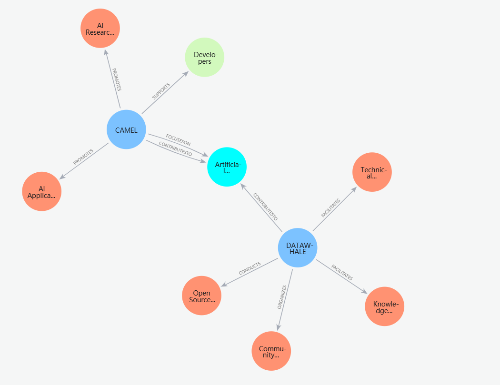

## 4.6 Graph RAG应用实战&#x20;

### 4.6.1 Graph RAG以及与传统RAG的优劣

Graph RAG 是将知识图谱（Knowledge Graph）引入检索增强生成（RAG）框架的一种扩展形式。它利用结构化的知识显式表示实体及其关系，从而显著提升系统的推理能力和回答准确性。相比于传统 RAG 仅基于向量检索的机制，Graph RAG 在复杂任务中具有独特的优势。

**优点：深度理解**：通过显式的实体和关系表达，Graph RAG 能够支持复杂的问答和逻辑推理。**高准确性**：由于知识图谱中知识的结构化表示，减少了生成模型出现幻觉现象（hallucination）的可能性。

**缺点：构建复杂**：知识图谱的构建和维护需要大量时间和资源投入。**灵活性有限**：对于实时更新和动态信息支持较差，难以应对快速变化的场景。

### 4.6.2 图数据库介绍

图数据库是 Graph RAG 的核心组件，用于存储和管理知识图谱。它能够高效处理复杂的关系查询，同时提供灵活的结构和强大的查询能力。

**特点：高效的关系查询**：图数据库优化了实体与实体之间关系的查找和操作，性能优于传统关系型数据库。**灵活的结构**：支持动态添加节点（实体）和边（关系），能够应对多样化的数据变化。**强大的查询语言**：如 Neo4j 的 Cypher，方便用户编写复杂查询逻辑。

**常用图数据库：**

* **Neo4j**：功能强大，易于使用的企业级图数据库。

* **JanusGraph**：分布式的开源图数据库，适合大规模图数据管理。

### 4.6.3 构建三元组并上传图数据库

知识图谱的核心是三元组（Triplets），由节点、关系、属性组成：

**节点（Node/Entity）**：表示实体，是图中的顶点

**关系（Relationship/Edge）**：表示实体之间的联系，是图中的边

**属性（Property/Attribute）**：节点或关系的特征描述

例如我们的有一段文本：

```python
text_example = """
CAMEL和DATAWHALE是两个活跃的AI开源社区。
CAMEL致力于推动人工智能技术的发展，帮助开发者更好地进行AI研究和应用。
DateWhale通过开源项目和社区活动，促进知识分享和技术交流。这两个社区都为AI领域的创新和进步做出了重要贡献。
"""
```

我们可以从中找出CAMEL、DataWhale等等这些节点，那么CAMEL和人工智能技术的发展之间的关系可以表述为：CAMEL"致力于"人工智能技术的发展。而CAMEL的属性可以为"AI开源社区"。

1. **信息抽取**

之前我们可能通过一些NLP技术来做信息的抽取，现在我们可以直接使用LLM来完成这件事情。例如我们通过一些简单的prompt工程来完成这个目的：

```python
from camel.models import ModelFactory
from camel.types import ModelPlatformType
from camel.loaders import UnstructuredIO
from camel.agents import ChatAgent

model = ModelFactory.create(
    model_platform=ModelPlatformType.OPENAI_COMPATIBLE_MODEL,
    model_type="Qwen/Qwen2.5-72B-Instruct",
    url='https://api-inference.modelscope.cn/v1/',
    api_key='你的api密钥'
)

sys_msg =  """
            你是一个图数据库专家，你的任务是从给定的内容中提取实体和关系，构建知识图谱。
            
            知识图谱的基本组成：
            1. 节点（Node）：表示实体，包含id和type属性
            2. 关系（Relationship）：表示实体之间的联系
            3. 属性（Property）：节点或关系的附加信息

            示例输入：
            "小明，2008年9月13日出生，男。五行属水，性格开朗。"

            期望输出：
            Nodes:
            Node(id="小明", type="人")
            Node(id="水", type="五行")
            Node(id="开朗", type="性格")
            Node(id="2008年9月13日", type="时间")

            Relationships:
            Relationship(subj=Node(id="小明", type="人"), obj=Node(id="水", type="五行"), type="五行属性")
            Relationship(subj=Node(id="小明", type="人"), obj=Node(id="开朗", type="性格"), type="性格特征")
            Relationship(subj=Node(id="小明", type="人"), obj=Node(id="2008年9月13日", type="时间"), type="出生日期")

            请从以下内容中提取实体和关系：
            """
graphprocessor = ChatAgent(
    system_message=sys_msg,
    model=model,
    )

text_example = """
CAMEL和DATAWHALE是两个活跃的AI开源社区。
CAMEL致力于推动人工智能技术的发展，帮助开发者更好地进行AI研究和应用。
DateWhale通过开源项目和社区活动，促进知识分享和技术交流。这两个社区都为AI领域的创新和进步做出了重要贡献。
"""
```

我们首先通过一个prompt来定义来agent的功能，以及设置好我们案例文本。

```python
response = graphprocessor.step(input_message= text_example)
print (response.msgs[0].content)

>>>
Nodes:
- Node(id="CAMEL", type="AI开源社区")
- Node(id="DATAWHALE", type="AI开源社区")
- Node(id="推动人工智能技术的发展", type="目标")
- Node(id="帮助开发者更好地进行AI研究和应用", type="目标")
- Node(id="通过开源项目和社区活动", type="方法")
- Node(id="促进知识分享和技术交流", type="目标")
- Node(id="AI领域的创新和进步", type="贡献")

Relationships:
- Relationship(subj=Node(id="CAMEL", type="AI开源社区"), obj=Node(id="推动人工智能技术的发展", type="目标"), type="致力于")
- Relationship(subj=Node(id="CAMEL", type="AI开源社区"), obj=Node(id="帮助开发者更好地进行AI研究和应用", type="目标"), type="帮助")
- Relationship(subj=Node(id="DATAWHALE", type="AI开源社区"), obj=Node(id="通过开源项目和社区活动", type="方法"), type="通过")
- Relationship(subj=Node(id="DATAWHALE", type="AI开源社区"), obj=Node(id="促进知识分享和技术交流", type="目标"), type="促进")
- Relationship(subj=Node(id="CAMEL", type="AI开源社区"), obj=Node(id="AI领域的创新和进步", type="贡献"), type="做出贡献")
- Relationship(subj=Node(id="DATAWHALE", type="AI开源社区"), obj=Node(id="AI领域的创新和进步", type="贡献"), type="做出贡献")
```

可以看到，对于信息抽取这个任务，LLM能完成的相当出色。当然如果不想自己写prompt的话，CAMEL也有预设好的KnowledgeGraphAgent供我们一键调用，更改这里的参&#x6570;*`parse_graph_elements`*&#x53EF;以设定Agent返回的信息格式，False返回的是一个字符串，设置为True则返回一个自定义的GraphElement类：

```python
uio = UnstructuredIO()
kg_agent = KnowledgeGraphAgent(model=model)

# 从给定文本创建一个元素
element_example = uio.create_element_from_text(
    text=text_example, element_id="0"
)

# 让知识图谱Agent提取节点和关系信息
ans_element = kg_agent.run(element_example, parse_graph_elements=False)
print(ans_element)

>>>
### Nodes

- Node(id='CAMEL', type='Community')
- Node(id='DATAWHALE', type='Community')
- Node(id='AI', type='Field')
- Node(id='Developers', type='Group')
- Node(id='Research and Application', type='Activity')
- Node(id='Knowledge Sharing', type='Activity')
- Node(id='Technical Exchange', type='Activity')

### Relationships

- Relationship(subj=Node(id='CAMEL', type='Community'), obj=Node(id='AI', type='Field'), type='ContributesTo')
- Relationship(subj=Node(id='CAMEL', type='Community'), obj=Node(id='Developers', type='Group'), type='Helps')
- Relationship(subj=Node(id='CAMEL', type='Community'), obj=Node(id='Research and Application', type='Activity'), type='Promotes')
- Relationship(subj=Node(id='DATAWHALE', type='Community'), obj=Node(id='AI', type='Field'), type='ContributesTo')
- Relationship(subj=Node(id='DATAWHALE', type='Community'), obj=Node(id='Knowledge Sharing', type='Activity'), type='Facilitates')
- Relationship(subj=Node(id='DATAWHALE', type='Community'), obj=Node(id='Technical Exchange', type='Activity'), type='Facilitates')
```

* **上传数据库**

现在我们有了节点和关系信息，下一步就该把他们上传到数据库里了。

首先我们要初始化我们的图数据库，这里我们可以使用[Neo4j(点击跳转)](https://neo4j.com/):

```python
from camel.storages import Neo4jGraph

n4j = Neo4jGraph(
    url="你的url",
    username="neo4j",
    password="你的password",
)
```

CAMEL已经将上传到图数据这一个操作为我们一键集成，我们只需要使用一个简单的命令调用即可(需要搭配KnowledgeGraphAgent一起使用，设定parse\_graph\_elements=True)：

```python
# 检查实体信息
graph_elements = kg_agent.run(element_example, parse_graph_elements=True)
print(graph_elements)

>>>
nodes=[Node(id='CAMEL', type='Community', properties={'source': 'agent_created'}), Node(id='DATAWHALE', type='Community', properties={'source': 'agent_created'}), Node(id='Artificial Intelligence', type='Field', properties={'source': 'agent_created'}), Node(id='Developers', type='Group', properties={'source': 'agent_created'}), Node(id='Knowledge Sharing', type='Activity', properties={'source': 'agent_created'}), Node(id='Technical Exchange', type='Activity', properties={'source': 'agent_created'})] relationships=[Relationship(subj=Node(id='CAMEL', type='Community', properties={'source': 'agent_created'}), obj=Node(id='Artificial Intelligence', type='Field', properties={'source': 'agent_created'}), type='PromotesDevelopment', properties={'source': 'agent_created'}), Relationship(subj=Node(id='CAMEL', type='Community', properties={'source': 'agent_created'}), obj=Node(id='Developers', type='Group', properties={'source': 'agent_created'}), type='Helps', properties={'source': 'agent_created'}), Relationship(subj=Node(id='DATAWHALE', type='Community', properties={'source': 'agent_created'}), obj=Node(id='Artificial Intelligence', type='Field', properties={'source': 'agent_created'}), type='Promotes', properties={'source': 'agent_created'}), Relationship(subj=Node(id='DATAWHALE', type='Community', properties={'source': 'agent_created'}), obj=Node(id='Knowledge Sharing', type='Activity', properties={'source': 'agent_created'}), type='Facilitates', properties={'source': 'agent_created'}), Relationship(subj=Node(id='DATAWHALE', type='Community', properties={'source': 'agent_created'}), obj=Node(id='Technical Exchange', type='Activity', properties={'source': 'agent_created'}), type='Facilitates', properties={'source': 'agent_created'}), Relationship(subj=Node(id='CAMEL', type='Community', properties={'source': 'agent_created'}), obj=Node(id='Artificial Intelligence', type='Field', properties={'source': 'agent_created'}), type='ContributesTo', properties={'source': 'agent_created'}), Relationship(subj=Node(id='DATAWHALE', type='Community', properties={'source': 'agent_created'}), obj=Node(id='Artificial Intelligence', type='Field', properties={'source': 'agent_created'}), type='ContributesTo', properties={'source': 'agent_created'})] source=<unstructured.documents.elements.Text object at 0x000001BB8B599460>
```

将提取的图信息添加到 Neo4j 数据库中：

```python
n4j.add_graph_elements(graph_elements=[graph_elements])
```



我们再回到neo4j就可以看到我们构建的知识图谱啦！

### 4.6.4 实践案例

在这个案例中，我们将展示如何以混合方式运行 RAG，结合向量检索和知识图谱检索，以查询和探索存储的知识。

首先我们使用本地部署的e5-large-v2作为我们的embedding模型(如果本地没有的话会自动下载)。

```python
from camel.models import ModelFactory
from camel.types import ModelPlatformType, ModelType
from camel.loaders import UnstructuredIO
from camel.storages import Neo4jGraph
from camel.retrievers import AutoRetriever
from camel.types import StorageType
from camel.agents import ChatAgent, KnowledgeGraphAgent
from camel.messages import BaseMessage
from camel.embeddings import SentenceTransformerEncoder

# 设置检索器
camel_retriever = AutoRetriever(
    vector_storage_local_path="local_data/embedding_storage",
    storage_type=StorageType.QDRANT,
    embedding_model=SentenceTransformerEncoder(model_name='intfloat/e5-large-v2'),
)

model = ModelFactory.create(
    model_platform=ModelPlatformType.OPENAI_COMPATIBLE_MODEL,
    model_type="Qwen/Qwen2.5-72B-Instruct",
)

n4j = Neo4jGraph(
    url="你的url",
    username="你的username",
    password="你的密码",
)

uio = UnstructuredIO()
kg_agent = KnowledgeGraphAgent(model=model)
```

之后我们设置好我们想了解的内容，这里我们首先让它根据向量检索的方式来检索相关信息：

```python
# 设置query
query="DataWhale和CAMEL之间是什么关系。"

# 使用向量检索器获取相关内容
vector_result = camel_retriever.run_vector_retriever(
    query=query,
    contents="""在一个神奇的动物王国里，住着一只聪明的骆驼，名叫CAMEL，以及一只智慧的鲸鱼，名叫DataWhale。CAMEL生活在辽阔的沙漠中，而DataWhale则畅游在无边无际的海洋里。虽然它们的栖息地截然不同，但它们都对探索新知充满了浓厚的兴趣。

有一天，CAMEL在沙漠中偶然发现了一块古老的石板，上面刻满了奇怪的符号和图案。CAMEL意识到这可能是一份通往巨大宝藏的地图，但它无法解读这些符号。于是，它决定去寻找帮助。

与此同时，DataWhale在海洋深处发现了一卷古老的羊皮纸，上面也布满了类似的符号。这让DataWhale感到非常好奇，因为它知道这些符号可能蕴藏着某种秘密，但它同样无法破译。

通过一只飞翔在天空中的信使鸟，CAMEL和DataWhale得知彼此的发现，并决定合作解开这个谜团。骆驼踏上了漫长的旅程，穿越沙漠来到了海洋边缘，而鲸鱼则游到岸边，与CAMEL会合。

在一起研究这些古老的符号时，CAMEL运用了它在沙漠中磨炼出的耐心和智慧，而DataWhale则利用它在海洋中获得的知识和洞察力。经过一番努力，它们终于解读出这些符号的含义。原来，这些符号描绘的是一个连接沙漠和海洋的秘密通道，通道的尽头藏着一座知识的宝库。

满怀着激动与期待，CAMEL和DataWhale沿着地图所指引的方向，一同踏上了寻找宝库的旅程。一路上，它们克服了重重困难，彼此扶持与信任，终于找到了那座传说中的宝库。里面并不是金银财宝，而是无数的古老书籍和知识卷轴。

通过这次冒险，CAMEL和DataWhale不仅获得了丰富的知识，还建立了深厚的友谊。它们将这些知识带回了各自的家园，与其他动物分享，从而推动了整个动物王国的进步与发展。

这个故事告诉我们，不同背景和能力的个体，通过合作与分享，能够创造出超越想象的成果，开拓出更为广阔的未来。CAMEL和DataWhale的友谊也成为了动物王国中流传不息的传奇。""",
)

# 打印向量检索的结果
print(vector_result)

>>>
{'Original Query': 'DataWhale和CAMEL之间是什么关系。', 'Retrieved Context': ['在一个神奇的动物王国里，住着一只聪明的骆驼，名叫CAMEL，以及一只智慧的鲸鱼，名叫DataWhale。CAMEL生活在辽阔的沙漠中，而DataWhale则畅游在无边无际的海洋里。虽然它们的栖息地截然不同，但它们都对探索新知充满了浓厚的兴趣。\n\n有一天，CAMEL在沙漠中偶然发现了一块古老的石板，上面刻满了奇怪的符号和图案。CAMEL意识到这可能是一份通往巨大宝藏的地图，但它无法解读这些符号。于是，它决定去寻找帮助。\n\n与此同时，DataWhale在海洋深处发现了一卷古老的羊皮纸，上面也布满了类似的符号。这让DataWhale感到非常好奇，因为它知道这些符号可能蕴藏着某种秘密，但它同样无法破译。\n\n通过一只飞翔在天空中的信使鸟，CAMEL和DataWhale得知彼此的发现，并决定合作解开这个谜团。骆驼踏上了漫长的旅程，穿越沙漠来到了海洋边缘，而鲸鱼则游到岸边，与CAMEL会合。']}

```

接下来，我们可以创建我们的知识图谱：

```python
# 从CRAB网站解析内容，并使用知识图谱Agent创建知识图谱数据，将信息存储到图数据库中。

elements = uio.create_element_from_text(
    text="""在一个神奇的动物王国里，住着一只聪明的骆驼，名叫CAMEL，以及一只智慧的鲸鱼，名叫DataWhale。CAMEL生活在辽阔的沙漠中，而DataWhale则畅游在无边无际的海洋里。虽然它们的栖息地截然不同，但它们都对探索新知充满了浓厚的兴趣。

有一天，CAMEL在沙漠中偶然发现了一块古老的石板，上面刻满了奇怪的符号和图案。CAMEL意识到这可能是一份通往巨大宝藏的地图，但它无法解读这些符号。于是，它决定去寻找帮助。

与此同时，DataWhale在海洋深处发现了一卷古老的羊皮纸，上面也布满了类似的符号。这让DataWhale感到非常好奇，因为它知道这些符号可能蕴藏着某种秘密，但它同样无法破译。

通过一只飞翔在天空中的信使鸟，CAMEL和DataWhale得知彼此的发现，并决定合作解开这个谜团。骆驼踏上了漫长的旅程，穿越沙漠来到了海洋边缘，而鲸鱼则游到岸边，与CAMEL会合。

在一起研究这些古老的符号时，CAMEL运用了它在沙漠中磨炼出的耐心和智慧，而DataWhale则利用它在海洋中获得的知识和洞察力。经过一番努力，它们终于解读出这些符号的含义。原来，这些符号描绘的是一个连接沙漠和海洋的秘密通道，通道的尽头藏着一座知识的宝库。

满怀着激动与期待，CAMEL和DataWhale沿着地图所指引的方向，一同踏上了寻找宝库的旅程。一路上，它们克服了重重困难，彼此扶持与信任，终于找到了那座传说中的宝库。里面并不是金银财宝，而是无数的古老书籍和知识卷轴。

通过这次冒险，CAMEL和DataWhale不仅获得了丰富的知识，还建立了深厚的友谊。它们将这些知识带回了各自的家园，与其他动物分享，从而推动了整个动物王国的进步与发展。

这个故事告诉我们，不同背景和能力的个体，通过合作与分享，能够创造出超越想象的成果，开拓出更为广阔的未来。CAMEL和DataWhale的友谊也成为了动物王国中流传不息的传奇。"""
)
)

graph_element = kg_agent.run(elements, parse_graph_elements=True)
n4j.add_graph_elements(graph_elements=[graph_element])
```

下面这个漂亮的图谱就是我们创建的结果啦！


```python
# 根据query创建一个元素
query_element = uio.create_element_from_text(
    text=query, element_id="1"
)

# 让知识图谱agent从查询中提取节点和关系信息
ans_element = kg_agent.run(query_element, parse_graph_elements=True)

>>>
nodes=[Node(id='DataWhale', type='Organization', properties={'source': 'agent_created'}), Node(id='CAMEL', type='Organization', properties={'source': 'agent_created'})] relationships=[Relationship(subj=Node(id='DataWhale', type='Organization', properties={'source': 'agent_created'}), obj=Node(id='CAMEL', type='Organization', properties={'source': 'agent_created'}), type='合作关系', properties={'source': 'agent_created'})] source=<unstructured.documents.elements.Text object at 0x00000202AF30AC30>
```

有细心的小伙伴应该发现了，我们在text中并没有给DataWhale或者CAMEL有'Organization'的描述，但是最后的结果却含有，这是因为在使用KnowledgeGraphAgent的run函数时会将检索的到的结果再经过一遍大模型的润色，我们如果想查询原始的数据可以使用neo4j的查询语句：

**匹配知识图谱存储中的实体：**

```python
# 匹配从query中获得的实体在知识图谱存储内容中的信息
kg_result = []
for node in ans_element.nodes:
    n4j_query = f"""
MATCH (n {{id: '{node.id}'}})-[r]->(m)
RETURN 'Node ' + n.id + ' (label: ' + labels(n)[0] + ') has relationship ' + type(r) + ' with Node ' + m.id + ' (label: ' + labels(m)[0] + ')' AS Description
UNION
MATCH (n)<-[r]-(m {{id: '{node.id}'}})
RETURN 'Node ' + m.id + ' (label: ' + labels(m)[0] + ') has relationship ' + type(r) + ' with Node ' + n.id + ' (label: ' + labels(n)[0] + ')' AS Description
"""
    result = n4j.query(query=n4j_query)
    kg_result.extend(result)

kg_result = [item['Description'] for item in kg_result]

# 显示来自知识图谱数据库的结果
print(kg_result)

>>>
['Node DataWhale (label: Animal) has relationship LIVINGIN with Node 海洋 (label: Location)', 'Node DataWhale (label: Animal) has relationship DISCOVER with Node 古老羊皮纸 (label: Artifact)', 'Node DataWhale (label: Animal) has relationship TRAVELTO with Node 沙漠 (label: Location)', 'Node DataWhale (label: Animal) has relationship FIND with Node 知识的宝库 (label: Treasure)', 'Node CAMEL (label: Animal) has relationship LIVINGIN with Node 沙漠 (label: Location)', 'Node CAMEL (label: Animal) has relationship DISCOVER with Node 古代石板 (label: Artifact)', 'Node CAMEL (label: Animal) has relationship COOPERATE with Node DataWhale (label: Animal)', 'Node CAMEL (label: Animal) has relationship TRAVELTO with Node 海洋 (label: Location)', 'Node CAMEL (label: Animal) has relationship FIND with Node 知识的宝库 (label: Treasure)', 'Node CAMEL (label: Animal) has relationship SHAREKNOWLEDGE with Node DataWhale (label: Animal)']
```

这样就可以检索出我们query对应的这些信息啦。

```python
# 合并来自向量搜索和知识图谱实体搜索的结果
comined_results = str(vector_result) + "\n".join(kg_result)

print(comined_results)
>>>
{'Original Query': 'DataWhale和CAMEL之间是什么关系', 'Retrieved Context': ['在一个神奇的动物王国里，住着一只聪明的骆驼，名叫CAMEL，以及一只智慧的鲸鱼，名叫DataWhale。CAMEL生活在辽阔的沙漠中，而DataWhale则畅游在无边无际的海洋里。虽然它们的栖息地截然不同，但它们都对探索新知充满了浓厚的兴趣。\n\n有一天，CAMEL在沙漠中偶然发现了一块古老的石板，上面刻满了奇怪的符号和图案。CAMEL意识到这可能是一份通往巨大宝藏的地图，但它无法解读这些符号。于是，它决定去寻找帮助。\n\n与此同时，DataWhale在海洋深处发现了一卷古老的羊皮纸，上面也布满了类似的符号。这让DataWhale感到非常好奇，因为它知道这些符号可能蕴藏着某种秘密，但它同样无法破译。\n\n通过一只飞翔在天空中的信使鸟，CAMEL和DataWhale得知彼此的发现，并决定合作解开这个谜团。骆驼踏上了漫长的旅程，穿越沙漠来到了海洋边缘，而鲸鱼则游到岸边，与CAMEL会合。']}Node DataWhale (label: Animal) has relationship LIVINGIN with Node 海洋 (label: Location)
Node DataWhale (label: Animal) has relationship DISCOVER with Node 古老羊皮纸 (label: Artifact)
Node DataWhale (label: Animal) has relationship TRAVELTO with Node 沙漠 (label: Location)
Node DataWhale (label: Animal) has relationship FIND with Node 知识的宝库 (label: Treasure)
Node CAMEL (label: Animal) has relationship LIVINGIN with Node 沙漠 (label: Location)
Node CAMEL (label: Animal) has relationship DISCOVER with Node 古代石板 (label: Artifact)
Node CAMEL (label: Animal) has relationship COOPERATE with Node DataWhale (label: Animal)
Node CAMEL (label: Animal) has relationship TRAVELTO with Node 海洋 (label: Location)
Node CAMEL (label: Animal) has relationship FIND with Node 知识的宝库 (label: Treasure)
Node CAMEL (label: Animal) has relationship SHAREKNOWLEDGE with Node DataWhale (label: Animal)
```

```python
# 设置代理
sys_msg = BaseMessage.make_assistant_message(
    role_name="CAMEL Agent",
    content="""您是一个有用的助手来回答问题，
        我将给您原始查询和检索到的上下文，
    根据检索到的上下文回答原始查询。""",
)

camel_agent = ChatAgent(system_message=sys_msg,
                        model=model)

# 将检索到的信息传递给智能体
user_prompt=f"""
原始查询是 {query}
检索到的上下文是 {comined_results}
"""

user_msg = BaseMessage.make_user_message(
    role_name="CAMEL User", content=user_prompt
)

# 获取响应
agent_response = camel_agent.step(user_msg)

print(agent_response.msg.content)

>>>
DataWhale 和 CAMEL 之间的关系是合作和知识共享。尽管它们生活在不同的环境中——CAMEL 生活在沙漠，而 DataWhale 生活在海洋，但它们都发现了神秘的古代文物，分别是古代石板和古老羊皮纸。通过一只信使鸟的帮助，它们了解到对方的发现并决定合作解开这些文物的秘密。CAMEL 跨越沙漠来到海洋边缘，而 DataWhale 也游到岸边与 CAMEL 会合。最终，它们共同努力找到了知识的宝库。
```

至此恭喜你学会了如何使用基础的向量检索和基于图数据库的检索！下面让我们看看，Graph还有哪些可以用的地方吧。

### 4.6.5 进阶案例

接下来的案例会演示如何利用设置和利用 CAMEL 的检索增强生成 （RAG） 与 Firecrawl 相结合，以实现高效的 Web 抓取、多代理角色扮演任务和知识图谱构建。我们将使用LLM 对 2024 年巴黎奥运会上的土耳其射击运动员进行全面研究。

在本笔记本中，您将探索：

* **CAMEL：**&#x4E00;个强大的多代理框架，支持 Retrieval-Augmented Generation 和多代理角色扮演场景，允许执行复杂的 AI 驱动任务。

* **Firecrawl**：一个强大的网络抓取工具，可简化从各种网页中提取和清理内容的过程。

* **AgentOps**：跟踪和分析 CAMEL Agent 的运行情况。

* **Qdrant**：一种高效的向量存储系统，与 Camel 的 AutoRetriever 一起使用，根据向量相似性存储和检索相关信息。

* **Neo4j**：领先的图数据库管理系统，用于构建和存储知识图谱，使实体之间的复杂关系能够高效映射和查询。

* **DuckDuckGo 搜索**： 在 SearchToolkit 中用于从 Web 收集相关 URL 和信息，作为检索初始内容的主要搜索引擎。

* **非结构化 IO：**&#x7528;于内容分块，便于管理非结构化数据以实现更高效的处理。

首先我要给所需要的工具设置好API 密钥

您可以到[这里](https://app.agentops.ai/signin)从 AgentOps 获取**免费的** API 密钥

```python
import os
from getpass import getpass

# 输入 AgentOps API 密钥
agentops_api_key = getpass('请输入您的 API 密钥: ')
os.environ["AGENTOPS_API_KEY"] = agentops_api_key
```

您可以到[这里](https://www.firecrawl.dev/)从 Firecrawl 获取**免费** API 密钥

```python
firecrawl_api_key = getpass('Enter your API key: ')
os.environ["FIRECRAWL_API_KEY"] = firecrawl_api_key
```

Firecrawl 是一个强大的工具，可简化网页抓取和清理网页内容的过程。在本节中，我们将从 CAMEL AI 网站上的特定帖子中抓取内容作为示例。

```python
from camel.loaders import Firecrawl

firecrawl = Firecrawl()

# 从指定的 URL 抓取并清理内容
response = firecrawl.scrape(
    url="https://www.camel-ai.org/"
)

print(response["markdown"])

>>>
Aug 9, 2024

# CRAB: Cross-environment Agent Benchmark for Multimodal Language Model Agents

Introducing CRAB: A Benchmark for Cross-Platform Multimodal Agents。

> Abstract: Recently, spearheaded by the CAMEL-AI community, a pioneer in open-source multi-agent projects, researchers from institutions such as King Abdullah University of Science and Technology, Oxford University, University of Tokyo, Carnegie Mellon University, Stanford University, and Tsinghua University have developed a cross-platform multimodal agent benchmark framework: CRAB, innovatively enabling agents to operate multiple devices simultaneously.

### Introduction

With the rapid development of multimodal large language models (MLLM), many agents capable of operating graphical user interfaces (GUIs) have emerged this year. Various companies have launched their innovative solutions, creating intense competition. GUI agents, leveraging powerful visual understanding and reasoning abilities of large models, can now efficiently and flexibly complete tasks such as booking appointments, shopping, and controlling smart homes.

**This raises the question: will future agents truly be able to sit in front of a computer and work on my behalf?**

However, in today's era of the Internet of Everything, most work requires the coordination of multiple devices. For example, taking a photo with a phone and then transferring it to a computer for editing involves crossing two different devices (environments). Currently, these GUI agents can only operate on a single device, making what is an easy task for humans exceedingly difficult for today's agents.

Researchers from the CAMEL-AI community noticed this problem and proposed the first cross-environment, multi-device agent benchmark framework—CRAB, the **CR** oss-environment **A** gent **B** enchmark.


Paper link: [https://arxiv.org/abs/2407.01511](https://arxiv.org/abs/2407.01511)

The CAMEL framework ( [https://github.com/camel-ai](https://github.com/camel-ai)) developed by the CAMEL-AI community is one of the earliest open-source multi-agent projects based on large language models. Therefore, community members are researchers and engineers with rich research and practical experience in the field of agents.

In CRAB, the authors not only designed a network-based multi-environment architecture that enables agents to operate multiple devices simultaneously to complete tasks, but also proposed two new technologies to address the issues existing in current agent benchmarks: the graph evaluator and task synthesis. CRAB is not only a brand new benchmark tool but also provides an interaction protocol and its implementation between the environment and agents, which is expected to become an important foundation for agents in practical fields.
...

Copyright © 2024 Eigent AI - All Rights Reserved.

Schedule a chat
Output is truncated. View as a scrollable element or open in a text editor. Adjust cell output settings...
```

* **🛠️ 使用 CAMEL 的 RAG 和 Firecrawl 进行 Web 信息检索**

在本节中，我们将演示如何使用 Camel 的 RAG 模型从 URL 列表中检索相关信息。这对于聚合和分析来自多个来源的数据特别有用。

首先我们定义一个检索方法：

```python
from camel.retrievers import AutoRetriever
from camel.toolkits import FunctionTool, SearchToolkit
from camel.types import ModelPlatformType, ModelType, StorageType
from camel.embeddings import SentenceTransformerEncoder

def retrieve_information_from_urls(urls: list[str], query: str) -> str:
    r"""根据给定的查询从 URL 列表中检索相关信息。

    此函数使用 `Firecrawl` 工具从提供的 URL 抓取内容，然后使用 CAMEL 的 `AutoRetriever` 根据查询从抓取的内容中检索最相关的信息。

    参数:
        urls (list[str]): 要抓取内容的 URL 列表。
        query (str): 用于搜索相关信息的查询字符串。

    返回:
        str: 根据查询检索到的最相关信息。

    示例:
        >>> urls = ["https://example.com/article1", "https://example.com/
        article2"]
        >>> query = "最新的人工智能进展"
        >>> result = retrieve_information_from_urls(urls, query)
    """
    aggregated_content = ''

    # 从每个 URL 抓取并聚合内容
    for url in urls:
        scraped_content = Firecrawl().scrape(url)
        aggregated_content += scraped_content["markdown"]

    # 设置一个带有本地存储和 Mistral AI 嵌入模型的向量检索器
    auto_retriever = AutoRetriever(
        vector_storage_local_path="local_data",
        storage_type=StorageType.QDRANT,
        embedding_model=SentenceTransformerEncoder(),
    )

    # 根据查询检索最相关的信息
    # 您可以根据需要调整 top_k 和 similarity_threshold 的值
    retrieved_info = auto_retriever.run_vector_retriever(
        query=query,
        contents=aggregated_content,
        top_k=3,
        similarity_threshold=0.5,
    )

    return retrieved_info
```

让我们通过收集有关 2024 年奥运会的一些信息来测试检索功能。第一次运行可能需要大约 50 秒，因为它需要构建本地向量数据库。

```python
retrieved_info = retrieve_information_from_urls(
    query="哪个国家在2024年奥运会上获得了最多的金牌？",
    urls=[
        "https://www.nbcnews.com/sports/olympics/united-states-china-gold-medals-rcna166013",
    ],
)

print(retrieved_info)

>>>
{'Original Query': '哪个国家在2024年奥运会上获得了最多的金牌？', 'Retrieved Context': ['在2024年巴黎奥运会上，中国创下了有史以来最佳表现，与美国并列获得最多金牌。两国各获得40枚金牌，这是夏季奥运会上金牌数量首次出现平局。尽管如此，美国在奖牌总数上仍领先于中国，总共获得126枚奖牌，而中国获得91枚。\n\n[中国](https://sigma.world/zh-hant/news/remarkable-growth-china-lotter-industry-expected/) 在射击和跳水等项目上的强势表现最初使其领先于美国。然而，美国队在田径赛事中后来居上，最终在奖牌总数上超过中国。中国媒体和公众对这一卓越表现表示庆祝，认为这是国家日益强大和现代化的体现。\n\nMemories of #Paris2024 💙 - YouTube\n\nOlympics\n\n14.6M subscribers\n\n[Memories of #Paris2024 💙](https://www.youtube.com/watch?v=6c9hFGtSUF8)\n\nOlympics\n\nSearch\n\nInfo\n\nShopping\n\nTap to unmute', '[Watch on YouTube](https://www.youtube.com/watch?v=6c9hFGtSUF8 "Watch on YouTube")\n\n**_巴黎奥运会2024留念_**\n\n## 日本在巴黎奥运会上创下金牌新纪录\n\n日本在巴黎也有出色的表现，赢得20枚金牌——这是日本在海外奥运会上获得的最多金牌。这一成就超过了日本在2004年雅典奥运会上获得的16枚海外金牌的纪录，也是日本继2021年东京奥运会获得27枚金牌之后的第二高金牌总数。\n\n[日本](https://sigma.world/zh-hant/news/japan-sports-wagering-reaches-new-heights/) 的成功以摔跤等关键体育项目的精彩表现为亮点。木太郎在男子65公斤自由式摔跤中的胜利以及加上加贺美在女子76公斤自由式摔跤中的金牌是日本战役中的亮点之一，日本总共获得了45枚奖牌。\n\n## 韩国超出预期，取得了大量奖牌', '[韩国](https://sigma.world/zh-hant/news/paradise-co-profit-in1q-2024-up/) 以32枚奖牌，包括13枚金牌，令人惊讶。这是该国12年来首次在单届奥运会上超过30枚奖牌。韩国队在射击、击剑和射箭项目中的出色表现推动了成功。\n\n值得注意的是，韩国射箭选手在所有五个射箭项目中获得金牌，金优真成为韩国获得金牌最多的奥运选手，职业生涯获得五枚金牌。年轻运动员的成功，包括16岁的射击选手班孝珍，他赢得了韩国第100枚夏季奥运会金牌，是该国取得优异成绩的关键因素。\n\n## 菲律宾成为东南亚表现最佳的国家']}

```

* 📹 **使用 AgentOps 监控 AI 代理**

```python
import agentops
agentops.init(default_tags=["CAMEL cookbook"])
```

CAMEL 的一个强大功能是它能够从文本数据构建和存储知识图谱。这很方便我们对数据中的关系进行高级分析和可视化。

首先我们定义一个函数用于处理输入文本以创建和提取节点和关系，并将其作为知识图谱添加到Neo4j数据库中。

```python
from camel.storages import Neo4jGraph
from camel.loaders import UnstructuredIO
from camel.agents import KnowledgeGraphAgent

def knowledge_graph_builder(text_input: str) -> None:
    r"""从提供的文本构建并存储知识图谱。

    此函数处理输入文本以创建和提取节点和关系，
    然后将其作为知识图谱添加到Neo4j数据库中。

    参数：
        text_input (str): 用于构建知识图谱的输入文本。

    返回：
        graph_elements: 知识图谱代理生成的图形元素。
    """

    # 设置Neo4j实例
    n4j = Neo4jGraph(
        url="Your_URL",
        username="Your_Username",
        password="Your_Password",
    )

    # 初始化实例
    uio = UnstructuredIO()
    kg_agent = KnowledgeGraphAgent(model=model)

    # 从提供的文本创建一个元素
    element_example = uio.create_element_from_text(text=text_input, element_id="001")

    # 使用知识图谱代理提取节点和关系
    graph_elements = kg_agent.run(element_example, parse_graph_elements=True)

    # 将提取的图形元素添加到Neo4j数据库
    n4j.add_graph_elements(graph_elements=[graph_elements])

    return graph_elements
```

然后我们设置我们的RolePlaying,AI 代理在其中交互以使用各种工具完成任务。我们将指导助理代理对 2024 年巴黎奥运会的土耳其射击运动员进行全面研究。


导入模块及定义我们的任务：

```python
from typing import List

from colorama import Fore

from camel.societies import RolePlaying
from camel.utils import print_text_animated

task_prompt = """对2024年巴黎奥运会的土耳其射手进行全面研究，为我写一份报告，然后为报告创建知识图谱。
您应该首先使用搜索工具获取相关的URL，然后使用检索工具通过提供URL列表来获取检索到的内容，最后使用工具构建知识图谱以完成任务。
不要进行其他操作。"""
```

我们将为助理代理配置用于数学计算、Web 信息检索和知识图谱构建的工具。

```python
retrieval_tool = FunctionTool(retrieve_information_from_urls)
search_tool = FunctionTool(SearchToolkit().search_duckduckgo)
knowledge_graph_tool = FunctionTool(knowledge_graph_builder)

tool_list = [
    retrieval_tool,
    search_tool,
    knowledge_graph_tool,
]

assistant_model_config = dict(
    tools=tool_list,
    temperature=0.0,
)

# 初始化RolePlaying
role_play_session = RolePlaying(
    assistant_role_name="CAMEL Assistant",
    user_role_name="CAMEL User",
    assistant_agent_kwargs=dict(
        model=model,
        tools=tool_list,
    ),
    user_agent_kwargs=dict(model=model),
    task_prompt=task_prompt,
    with_task_specify=False,
    output_language="中文"
)

print(
    Fore.GREEN
    + f"AI Assistant sys message:\n{role_play_session.assistant_sys_msg}\n"
)
print(Fore.BLUE + f"AI User sys message:\n{role_play_session.user_sys_msg}\n")

print(Fore.YELLOW + f"Original task prompt:\n{task_prompt}\n")
print(
    Fore.CYAN
    + "Specified task prompt:"
    + f"\n{role_play_session.specified_task_prompt}\n"
)
print(Fore.RED + f"Final task prompt:\n{role_play_session.task_prompt}\n")
```

开始我们的Agent交互。

**注意**：此会话大约需要 8 分钟。

```python
n = 0
input_msg = role_play_session.init_chat()
while n < 20: # Limit the chat to 20 turns
    n += 1
    assistant_response, user_response = role_play_session.step(input_msg)

    if assistant_response.terminated:
        print(
            Fore.GREEN
            + (
                "AI Assistant terminated. Reason: "
                f"{assistant_response.info['termination_reasons']}."
            )
        )
        break
    if user_response.terminated:
        print(
            Fore.GREEN
            + (
                "AI User terminated. "
                f"Reason: {user_response.info['termination_reasons']}."
            )
        )
        break
    # Print output from the user
    print_text_animated(
        Fore.BLUE + f"AI User:\n\n{user_response.msg.content}\n",
        0.01
    )

    if "CAMEL_TASK_DONE" in user_response.msg.content:
        break

    # Print output from the assistant, including any function
    # execution information
    print_text_animated(Fore.GREEN + "AI Assistant:", 0.01)
    tool_calls = [
        for call in assistant_response.info['tool_calls']
    ]
    for func_record in tool_calls:
        print_text_animated(f"{func_record}", 0.01)
    print_text_animated(f"{assistant_response.msg.content}\n", 0.01)

    input_msg = assistant_response.msg
```

