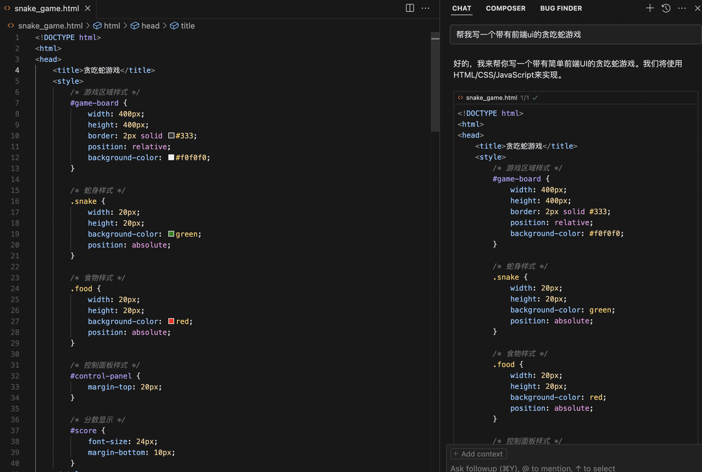
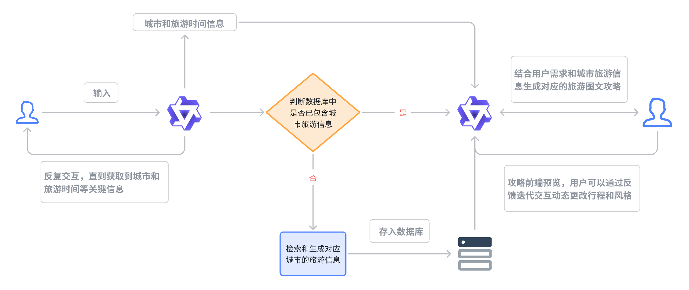

# 5. 第五章 综合案例

在这一节中，我们将展示如何使用CAMEL框架来搭建一个简单实用的**旅游出行规划助手**。

## 5.1 **应用概览**

在大模型时代，代码能力基本已经不再是初学者想要开发AI应用的障碍，单纯地使用一些模型的Web端就可以搭建一些简单的应用，搭配一些AI编程工具可以让我们的开发效率更高，只需要写一些提示词就可以搭建一个简单的带有前端UI的应用。

AI的写的代码直接复制就能跑！

得益于现在大模型的强大代码能力，我们可以将更多的精力放在我们的应用架构以及产品上，包括我们要实现的功能呀、架构设计、目标用户等等。能不能捕捉到用户的需求很重要，以什么形式满足？也就是说，现在的AI时代，产品思维对于应用开发者也是很重要的。

以下是我们使用CAMEL框架搭建一个真实可用的软件应用——NavigatorAI（旅游出行规划助手），其中使用到了非常多常见而实用的CAMEL模块和知识点。

> **特别注意**：NavigatorAI遵循[CC BY-NC](https://creativecommons.org/licenses/by-nc/4.0/)协议，仅供学习使用，不能商用！！！

### 5.1.1 目标和交互形式

首先明确我们的目标，项目的核心目标是实现一个智能化的旅游出行规划助手：用户**只需输入目的地和天数**，系统即可自动生成详细的旅游行程，包括每日活动安排、餐饮推荐、景点信息等。系统**还支持根据用户反馈动态调整行程，支持在线阅览和编辑**，同时提供多种格式（Markdown，HTML 或 PDF）的导出，方便用户保存或分享。这不仅提升了行程规划的效率，也能为用户带来更为便捷和专业的旅游体验。

根据目标我们可以设计出我们的整体应用架构图如下：

### 5.1.2 模块化设计

在现代软件开发中，一般会选择模块化的设计思路，旨在通过将系统分解为多个独立、可重用的模块来提升代码的可维护性、可扩展性和开发效率。模块化设计的核心思想是**解耦**，即通过清晰的边界和接口将系统的不同功能分离，使得每个模块可以独立开发、测试和维护，而不会对其他模块产生过多依赖。

因此通过模块化设计，开发团队可以更高效地构建复杂系统，同时降低长期维护的难度，可以帮助开发团队在短时间协同完成整个项目的开发设计和测试。

旅游出行规划助手NavigatorAI也采取了模块化的设计思想，整个综合应用可以分成四个子模块——

#### 5.1.2.1 **信息收集模块**

在该模块中，用户和**信息收集Agent**进行多轮往复的对话，直到Agent认为能够通过用户的表达和上下文提取出用户的目标出行城市和出行天数等关键信息，并将信息传递到下一个模块。&#x20;

#### 5.1.2.2 **攻略生成模块**

* **验证数据是否存在**：&#x20;

  * 如果数据库中存在对应的城市和天数的旅游数据，（即缓存命中），则直接加载复用数据。&#x20;

  * 如果数据库中没有查询到对应的信息，则调用Tool Calling中的搜索工具（Google Search 或 DuckDuckGo）进行实时的信息检索（检索的内容包括著名景点，当地美食，天气情况等数据，可以根据需要自由添加）

* **攻略初稿生成**：&#x20;

  * 接下来，**攻略生成Agent**会结合上述检索到的基础数据，按预先定义的默认格式生成 HTML 格式的详细行程攻略，包含每日的活动安排和推荐内容。&#x20;

* **格式转换**：&#x20;

  * 将生成的 HTML 导出为 PDF 格式，并在前端提供在线预览，方便用户进行下载/转发/保存/修改。&#x20;

#### 5.1.2.3 **反馈优化模块**

* **收集用户反馈**：&#x20;

  * 用户可以在前端预览中对生成的攻略初稿中的任意部分和内容进行评价，支持手动标记圈画需要优化的部分，这意味着我们接受反馈的形式是多模态的（图像理解+文字评述）。

* **使用反馈优化Agent进行意图理解并迭代式地调整攻略**：&#x20;

  * **反馈优化Agent**分析用户反馈并理解具体修改需求；&#x20;

  * 基于用户反馈，结合多模态能力和工具调用生成新内容并迭代式优化。&#x20;

* **输出最终攻略版本**：&#x20;

  * 根据用户确认的最终行程生成 PDF 文档。&#x20;

  * 将优化后的行程存入数据库以供未来复用。