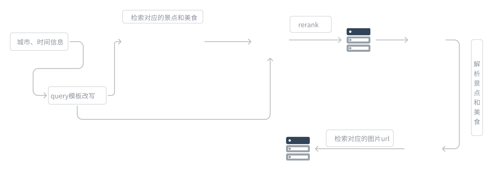

## 5.3 旅游信息检索

旅游信息检索是系统中实现数据获取和处理的关键环节，负责根据用户输入的目的地城市和出游天数，动态获取并生成高质量的旅游数据。

模块的工作流程分为以下几个阶段：首先，对用户输入的信息进行标准化处理，将城市名称和时间信息改写为适合搜索引擎的查询模板（query）。随后，系统调用 **Google Search API** 进行景点和美食信息的文本检索，包括景点描述、距离、推荐美食等详细内容；同时，为了补充图片资源，模块还调用 **DuckDuckGo 搜索引擎**，专注于获取高质量的景点和美食图片链接。

在数据检索完成后，模块进一步利用大语言模型（LLM）对初步搜索结果进行智能解析与重排序（rerank），从相关性和用户需求角度优化数据质量，确保信息全面、准确、优先级清晰。经过优化后的数据会以结构化的形式存储到数据库中，包含每个景点和美食的名称、详细描述、推荐理由以及图片 URL。




````python
from camel.toolkits import SearchToolkit
from camel.agents import ChatAgent
from camel.models import ModelFactory
from camel.types import ModelPlatformType
from camel.loaders import Firecrawl
from typing import List, Dict, Any

from flask import Flask, request, jsonify
import json
import os
from dotenv import load_dotenv

load_dotenv()

os.environ["GOOGLE_API_KEY"] = os.getenv("GOOGLE_API_KEY")
os.environ["SEARCH_ENGINE_ID"] = os.getenv("SEARCH_ENGINE_ID")
os.environ["FIRECRAWL_API_KEY"] = os.getenv("FIRECRAWL_API_KEY")
os.environ["QWEN_API_KEY"] = os.getenv("QWEN_API_KEY")

app = Flask(__name__)

class TravelPlanner:
    def __init__(self, city: str, days: int):
        
        #定义地点和时间，设置默认值
        self.city = city
        self.days = days
        self.res = None        

        # 初始化模型和智能体
        self.model = ModelFactory.create(
            model_platform=ModelPlatformType.OPENAI_COMPATIBLE_MODEL,
            model_type="Qwen/Qwen2.5-72B-Instruct",
            url='https://api-inference.modelscope.cn/v1/',
            api_key=os.getenv('QWEN_API_KEY')
        )

        # 初始化各种工具
        #重排序模型
        self.reranker_agent = ChatAgent(
            system_message="你是一搜索质量打分专家，要从{搜索结果}里找出和{query}里最相关的2条结果，保存他们的结果，保留result_id、title、description、url，严格以json格式输出",
            model=self.model,
            output_language='中文'
        )
        #景点抓取agent
        self.attraction_agent = ChatAgent(
            system_message="你是一个旅游信息提取专家，要根据内容提取出景点信息并返回json格式，严格以json格式输出",
            model=self.model,
            output_language='中文'
        )
        #美食抓取agent
        self.food_agent = ChatAgent(
            system_message="你是一个旅游信息提取专家，要根据内容提取出美食信息并返回json格式，严格以json格式输出",
            model=self.model,
            output_language='中文'
        )
        #base攻略生成agent
        self.base_guide_agent = ChatAgent(
            system_message="你是一个旅游攻略生成专家，要根据内容生成一个旅游攻略，严格以json格式输出",
            model=self.model,
            output_language='中文'
        )
        # self.firecrawl = Firecrawl()#后续功能
        self.search_toolkit = SearchToolkit()

    def extract_json_from_response(self,response_content: str) -> List[Dict[str, Any]]:
            """从LLM响应中提取JSON内容"""
            try:
                # 找到JSON内容的开始和结束位置
                start = response_content.find('```json\n') + 8
                end = response_content.find('\n```', start)
                if start == -1 or end == -1:
                    print("未找到JSON内容的标记")
                    return []
                
                json_str = response_content[start:end].strip()
                print(f"提取的JSON字符串: {json_str}")  # 调试信息
                
                # 解析 JSON 字符串
                parsed = json.loads(json_str)
                
                # 处理不同的JSON结构
                if isinstance(parsed, dict) and "related_results" in parsed:
                    return parsed["related_results"]
                elif isinstance(parsed, list):
                    return parsed
                else:
                    print("未找到预期的JSON结构")
                    return []
                
            except json.JSONDecodeError as e:
                print(f"解析JSON失败: {str(e)}")
                print(f"原始内容: {response_content}")
                return []
            except Exception as e:
                print(f"发生错误: {str(e)}")
                return []

    def search_and_rerank(self) -> Dict[str, Any]:
        """多次搜索并重排序，整合信息"""
        city = self.city
        days = self.days
        all_results = {}
    
        # 第一次搜索：旅游攻略
        try:
            query = f"{city}{days}天旅游攻略 最佳路线"
            search_results = self.search_toolkit.search_google(query=query, num_result_pages=5)
            prompt = f"请从以下搜索结果中筛选出最相关的{self.days}条{city}{days}天旅游攻略信息，并按照相关性排序：\n{json.dumps(search_results, ensure_ascii=False, indent=2)}"
            response = self.reranker_agent.step(prompt)
            all_results["guides"] = self.extract_json_from_response(response.msgs[0].content)
        except Exception as e:
            print(f"旅游攻略搜索失败: {str(e)}")
            all_results["guides"] = []
        
        # 第二次搜索：必去景点
        try:
            query = f"{city} 必去景点 top10 著名景点"
            search_results = self.search_toolkit.search_google(query=query, num_result_pages=5)
            prompt = f"请从以下搜索结果中筛选出最多{self.days}条{city}最值得去的景点信息，并按照热门程度排序：\n{json.dumps(search_results, ensure_ascii=False, indent=2)}"
            response = self.reranker_agent.step(prompt)
            all_results["attractions"] = self.extract_json_from_response(response.msgs[0].content)
        except Exception as e:
            print(f"景点搜索失败: {str(e)}")
            all_results["attractions"] = []
        
        # 第三次搜索：必吃美食
        try:
            query = f"{city} 必吃美食 特色小吃 推荐"
            search_results = self.search_toolkit.search_google(query=query, num_result_pages=5)
            prompt = f"请从以下搜索结果中筛选出最多{self.days}条{city}最具特色的美食信息，并按照推荐度排序：\n{json.dumps(search_results, ensure_ascii=False, indent=2)}"
            response = self.reranker_agent.step(prompt)
            all_results["must_eat"] = self.extract_json_from_response(response.msgs[0].content)
        except Exception as e:
            print(f"必吃美食搜索失败: {str(e)}")
            all_results["must_eat"] = []
        
        # 第四次搜索：特色美食
        try:
            query = f"{city} 特色美食 地方小吃 传统美食"
            search_results = self.search_toolkit.search_google(query=query, num_result_pages=5)
            prompt = f"请从以下搜索结果中筛选出最多{self.days}条{city}独特的地方特色美食信息，并按照特色程度排序：\n{json.dumps(search_results, ensure_ascii=False, indent=2)}"
            response = self.reranker_agent.step(prompt)
            all_results["local_food"] = self.extract_json_from_response(response.msgs[0].content)
        except Exception as e:
            print(f"特色美食搜索失败: {str(e)}")
            all_results["local_food"] = []
        
        # 整合所有信息
        final_result = {
            "city": city,
            "days": days,
            "travel_info": {
                "guides": [
                    {
                        "result_id": item.get("result_id"),
                        "title": item.get("title"),
                        "description": item.get("description"),
                        "long_description": item.get("long_description"),
                    }
                    for item in all_results["guides"]
                ],
                "attractions": [
                    {
                        "result_id": item.get("result_id"),
                        "title": item.get("title"),
                        "description": item.get("description"),
                        "long_description": item.get("long_description"),
                    }
                    for item in all_results["attractions"]
                ],
                "must_eat": [
                    {
                        "result_id": item.get("result_id"),
                        "title": item.get("title"),
                        "description": item.get("description"),
                        "long_description": item.get("long_description"),
                    }
                    for item in all_results["must_eat"]
                ],
                "local_food": [
                    {
                        "result_id": item.get("result_id"),
                        "title": item.get("title"),
                        "description": item.get("description"),
                        "long_description": item.get("long_description"),
                    }
                    for item in all_results["local_food"]
                ]
            }
        }
        
        return final_result
    
    def extract_attractions_and_food(self) -> Dict:
        travel_info = self.search_and_rerank()

        # 提供一个base攻略路线，直接根据整个travel_info生成
        prompt = f"""
        参考以下信息，生成一个{self.city}{self.days}天攻略路线，直接根据整个travel_info生成
        {travel_info}
        【输出格式】
        {{
            "base_guide": "攻略内容"
        }}
        """
        base_guide = self.base_guide_agent.step(prompt)
        print(f"这是base攻略: {base_guide.msgs[0].content}")

        """提取景点和美食信息"""
        # 从描述中提取具体的景点和美食
        attractions_text = " ".join([item["description"] for item in travel_info["travel_info"]["attractions"] + travel_info["travel_info"]["guides"]])
        print(f"这是景点信息: {attractions_text}")
        food_text = " ".join([
            item["description"] 
            for item in travel_info["travel_info"]["must_eat"] + travel_info["travel_info"]["local_food"]
        ])
        print(f"这是美食信息: {food_text}")
        # 使用LLM提取并整理信息
        attractions_prompt = f"""
        请从以下文本中提取出具体的景点名称，注意不能遗漏景点信息，要尽量多提取景点信息，并为每个景点提供简短描述：
        {attractions_text}
        请以JSON格式返回，格式如下：
        {{
            "attractions": [
                {{"name": "景点名称", "description": "简短描述"}}
            ]
        }}
        """
        
        food_prompt = f"""
        请从以下文本中提取出具体的美食名称或者美食店铺，注意不能遗漏美食信息，要尽量多提取美食信息，并为每个美食和店铺提供简短描述：
        {food_text}
        请以JSON格式返回，格式如下：
        {{
            "foods": [
                {{"name": "美食名称", "description": "简短描述"}}
            ],
            "food_shop": [
                {{"name": "美食店铺", "description": "简短描述"}}
            ]
        }}
        """
        
        # 使用attraction_agent处理提取
        attractions_response = self.attraction_agent.step(attractions_prompt)
        foods_response = self.food_agent.step(food_prompt)
        
        print(f"这是景点信息: {attractions_response.msgs[0].content}")
        print(f"这是美食信息: {foods_response.msgs[0].content}")
        
        return {
            "base_guide": base_guide.msgs[0].content,
            "attractions": attractions_response.msgs[0].content,
            "foods": foods_response.msgs[0].content
        }
    
    def process_attractions_and_food(self) -> Dict:
        def clean_json_string(json_str: str) -> str:
            """清理JSON字符串，移除markdown代码块标记"""
            # 移除 ```json 开头
            if '```json' in json_str:
                json_str = json_str.split('```json')[-1]
            # 移除 ``` 结尾
            if '```' in json_str:
                json_str = json_str.split('```')[0]
            return json_str.strip()
        
        city = self.city
        """处理景点和美食信息，添加图片URL"""
        # 获取原始数据
        results = self.extract_attractions_and_food()
        
        # 解析JSON字符串
        base_guide = json.loads(clean_json_string(results['base_guide']))
        attractions_data = json.loads(clean_json_string(results['attractions']))
        foods_data= json.loads(clean_json_string(results['foods']))
        foods_list = foods_data['foods']
        food_shops_list = foods_data['food_shop']
        
        # 创建结果字典
        result = {
            "city": city,
            "days": self.days,
            "base路线": base_guide,
            "景点": [],
            "美食": [],
            "美食店铺": []
        }
        
        # 处理景点信息
        for attraction in attractions_data['attractions']:
            try:
                # 使用DuckDuckGo搜索图片
                images = self.search_toolkit.search_duckduckgo(
                    query=f"{city} {attraction['name']} 实景图",
                    source="images",
                    max_results=1
                )
                
                # 添加图片URL
                attraction_with_image = {
                    "name": attraction['name'],
                    "describe": attraction['description'],
                    "图片url": images[0]["image"] if images else "",
                }
                result['景点'].append(attraction_with_image)
                
            except Exception as e:
                print(f"搜索{attraction['name']}的图片时出错: {str(e)}")
                # 如果出错，仍然添加景点信息，但不包含图片URL
                result['景点'].append({
                    "name": attraction["name"],
                    "describe": attraction["description"],
                    "图片url": "",
                })
        
        # 处理美食信息
        for food in foods_list:
            try:
                # 使用DuckDuckGo搜索图片
                images = self.search_toolkit.search_duckduckgo(
                    query=f"{city} {food['name']} 美食",
                    source="images",
                    max_results=1
                )
                
                # 添加图片URL
                food_with_image = {
                    "name": food["name"],
                    "describe": food["description"],
                    "图片url": images[0]["image"] if images else "",
                }
                result['美食'].append(food_with_image)
                
            except Exception as e:
                print(f"搜索{food['name']}的图片时出错: {str(e)}")
                # 如果出错，仍然添加美食信息，但不包含图片URL
                result['美食'].append({
                    "name": food["name"],
                    "describe": food["description"],
                    "图片url": ""
                })
        # 处理美食店铺信息
        for food_shop in food_shops_list:
            try:
                # 使用DuckDuckGo搜索图片
                images = self.search_toolkit.search_duckduckgo(
                    query=f"{city} {food_shop['name']} 美食店铺",
                    source="images",
                    max_results=1
                )
                # 添加图片URL
                food_shop_with_image = {
                    "name": food_shop["name"],
                    "describe": food_shop["description"],
                    "图片url": images[0]["image"] if images else "",
                }
                result['美食店铺'].append(food_shop_with_image)
            except Exception as e:
                print(f"搜索{food_shop['name']}的图片时出错: {str(e)}")
                # 如果出错，仍然添加美食店铺信息，但不包含图片URL
                result['美食店铺'].append({
                    "name": food_shop["name"],
                    "describe": food_shop["description"],
                    "图片url": ""
                })
        try:
            # 获取当前脚本所在目录
            current_dir = os.path.dirname(os.path.abspath(__file__))
            # 创建storage目录路径
            storage_dir = os.path.join(current_dir, "storage")
            # 确保storage目录存在
            os.makedirs(storage_dir, exist_ok=True)
            
            # 生成文件名（使用城市名和日期）
            filename = os.path.join(storage_dir, f"{self.city}{self.days}天旅游信息.json")
            
            # 将结果写入JSON文件
            with open(filename, 'w', encoding='utf-8') as f:
                json.dump(result, f, ensure_ascii=False, indent=4)
            print(f"旅游攻略已保存到文件：{filename}")
        except Exception as e:
            print(f"保存JSON文件时出错: {str(e)}")
        
        return result

@app.route('/get_travel_plan', methods=['POST'])
def get_travel_plan():
   try:
       # 获取请求数据
       data = request.get_json()
       
       # 验证输入数据
       if not data or 'city' not in data or 'days' not in data:
           return jsonify({
               'status': 'error',
               'message': '请求必须包含city和days参数'
           }), 400
           
       city = data['city']
       days = data['days']
       
       # 验证days是否为整数
       try:
           days = int(days)
       except ValueError:
           return jsonify({
               'status': 'error',
               'message': 'days参数必须为整数'
           }), 400
           
       # 创建TravelPlanner实例并获取结果
       travel_planner = TravelPlanner(city=city, days=days)
       results = travel_planner.process_attractions_and_food()
       
       return jsonify({
           'status': 'success',
           'data': results
       })
       
   except Exception as e:
       return jsonify({
           'status': 'error',
           'message': f'处理请求时发生错误: {str(e)}'
       }), 500
if __name__ == '__main__':
   app.run(host='0.0.0.0', port=5002, debug=True)
````

同样的，我们在本地的5002端口启动了一个服务，我们使用requests库来调用测试一下效果：

```python
import requests
import json

# API端点
url = "http://localhost:5000/get_travel_plan"

# 请求数据
data = {
    "city": "上海",
    "days": 3
}

# 发送POST请求
try:
    response = requests.post(url, json=data)
    
    # 检查响应状态
    if response.status_code == 200:
        result = response.json()
        print("获取到的旅游计划：")
        print(json.dumps(result, ensure_ascii=False, indent=2))
    else:
        print(f"请求失败: {response.status_code}")
        print(f"错误信息: {response.text}")
        
except requests.exceptions.RequestException as e:
    print(f"发送请求时发生错误: {e}")
```

这个模块用于搜集和整理旅游信息。信息主要包括旅游的一些景点、美食信息及对应图片的url，以便于我们后面将他们转成图文攻略。

在大语言模型的应用开发中，我们常常使用JSON作为中间数据的逻辑保存格式，因为交互方便，很好地表示结构化的信息且方便人类阅读和理解。

以下是生成的三份参考结果

```python
filename = os.path.join(storage_dir, f"{self.city}{self.days}天旅游信息.json")
```

命名逻辑是 {地点}+{时间}+旅游信息.json

[新疆7天旅游信息.json](../files/新疆7天旅游信息.json)

[成都3天旅游信息.json](../files/成都3天旅游信息.json)

[上海3天旅游信息.json](../files/上海3天旅游信息.json)