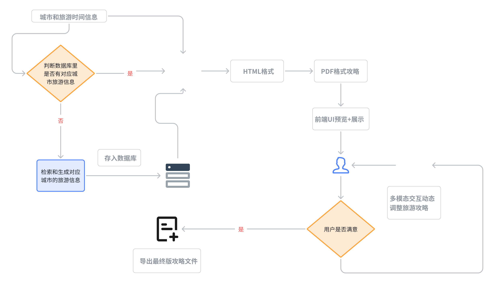
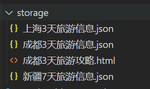
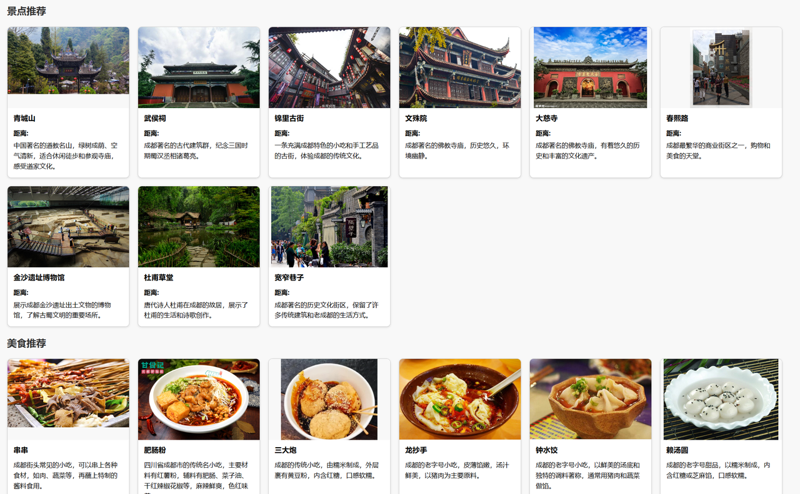
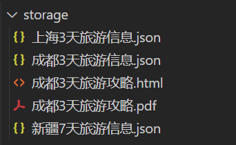

## 5.4 攻略生成模块

这个模块实现了一个旅行行程规划服务，主要流程如下： &#x20;

核心思路是通过前端传来的城市和出游天数信息，先在本地数据库中查找是否已存有相应的旅游数据（例如景点、美食等），如果没有就自动检索和生成对应的旅游信息并存储起来。随后，后端会使用 CAME 库与 Qwen2.5-72B-Instruct 模型，结合一段包含行程规划规则的系统消息，指导大模型生成完整的多日行程安排。为了让结果在前端方便查看，代码会将模型给出的文本格式化成 HTML，并在必要时将其中的图片链接转换成 `` 标签，使用户可以直接预览行程攻略页面。如果用户想要下载，后端还可以将该 HTML 转换成 PDF 供导出。当用户对当前结果不满意时，可以再次与大模型交互，通过多轮对话来动态调整和优化最终的旅行方案。整个过程如图所示：当有城市与天数信息输入时，系统先判断本地库中是否存在可用数据；若存在则直接调用大模型生成行程，若不存在则先行检索并存储数据后再进行行程生成；最后通过前端界面查看生成的 HTML 或者 PDF，如果用户仍需修改，则再次通过大模型进行迭代。这样就完成了一套从检索数据到生成和展示定制化旅游攻略的完整流程。











```python
import os
import json
import re
from flask import Flask, request, jsonify

from camel.configs import QwenConfig
from camel.models import ModelFactory
from camel.types import ModelPlatformType
from camel.toolkits import SearchToolkit
from camel.agents import ChatAgent
from dotenv import load_dotenv

load_dotenv()

app = Flask(__name__)

# 环境变量
os.environ["GOOGLE_API_KEY"] = os.getenv("GOOGLE_API_KEY")
os.environ["SEARCH_ENGINE_ID"] = os.getenv("SEARCH_ENGINE_ID")

# 模型初始化
qwen_model = ModelFactory.create(
    model_platform=ModelPlatformType.OPENAI_COMPATIBLE_MODEL,
    model_type="Qwen/Qwen2.5-72B-Instruct",
    api_key=os.getenv("QWEN_API_KEY"),
    url="https://api-inference.modelscope.cn/v1",
    model_config_dict=QwenConfig(temperature=0.2).as_dict(),
)

tools_list = [
    *SearchToolkit().get_tools(),
]

sys_msg = """
你是一位专业的旅游规划师。请你根据用户输入的旅行需求，包括旅行天数、景点/美食的距离、描述、图片URL、预计游玩/就餐时长等信息，为用户提供一个详细的行程规划。

请遵循以下要求：
1. 按照 Day1、Day2、... 的形式组织输出，直到满足用户指定的天数。
2. 每一天的行程请从早餐开始，食物尽量选用当地特色小吃美食，列出上午活动、午餐、下午活动、晚餐、夜间活动（若有），并在末尾总结住宿或返程安排。
3. 对每个景点或美食，提供其基本信息： 
   - 名称
   - 描述
   - 预计游玩/就餐时长（如果用户未提供，可以不写或自行估计）
   - 图片URL（如果有）
4. 请调用在线搜索工具在行程中对移动或出行所需时长做出合理估计。
5. 输出语言为中文。
6. 保持回复简洁、有条理，但必须包含用户想要的所有信息。
"""

agent = ChatAgent(
    system_message=sys_msg,
    model=qwen_model,
    message_window_size=10,
    output_language='Chinese',
    tools=tools_list
)

def create_usr_msg(data: dict) -> str:
    """
    同你原先的实现，用于生成给大模型的用户输入消息
    """
    city = data.get("city", "")
    days_str = data.get("days", "1")
    try:
        days = int(days_str)
    except ValueError:
        days = 1

    lines = []
    lines.append(f"我准备去{city}旅行，共 {days} 天。下面是我提供的旅行信息：\n")
    
    scenic_spots = data.get("景点", [])
    foods = data.get("美食", [])

    if scenic_spots:
        lines.append("- 景点：")
        for i, spot in enumerate(scenic_spots, 1):
            lines.append(f"  {i}. {spot.get('name', '未知景点名称')}")
            if '距离' in spot:
                lines.append(f"     - 距离：{spot['距离']}")
            if 'describe' in spot:
                lines.append(f"     - 描述：{spot['describe']}")
            if '图片url' in spot:
                lines.append(f"     - 图片URL：{spot['图片url']}")

    if foods:
        lines.append("\n- 美食：")
        for i, food in enumerate(foods, 1):
            lines.append(f"  {i}. {food.get('name', '未知美食名称')}")
            if 'describe' in food:
                lines.append(f"     - 描述：{food['describe']}")
            if '图片url' in food:
                lines.append(f"     - 图片URL：{food['图片url']}")

    lines.append(f"""
    \n请你根据以上信息，规划一个 {days} 天的行程表。
    从每天的早餐开始，到晚餐结束，列出一天的行程，包括对出行方式或移动距离的简单说明。
    如果有多种景点组合，你可以给出最优的路线推荐。请按以下格式输出：

    Day1:
    - 早餐：
    - 上午：
    - 午餐：
    - 下午：
    - 晚餐：
    ...

    Day2:
    ...

    Day{days}:
    ...
    """
    )
    return "\n".join(lines)

def fix_exclamation_link(text: str) -> str:
    """
    先把类似  的写法，提取出其中的 http://xx.jpg，
    替换成纯 http://xx.jpg
    """
    md_pattern = re.compile(r'!\[.*?\]\((https?://\S+)\)')
    # 将  只保留 http://xxx
    # 比如把 "" -> "http://xx.jpg"
    return md_pattern.sub(lambda m: m.group(1), text)

def convert_picurl_to_img_tag(text: str, width: int = 300, height: int = 200) -> str:
    """
    将文本中的图片URL替换为带样式的HTML img标签，并让图片居中显示和统一大小
    兼容两步：先处理 ，再匹配 - 图片URL: http://url
    """
    # 第一步：把  变成纯 url
    text_fixed = fix_exclamation_link(text)

    pattern = re.compile(r'-\s*图片URL：\s*(https?://\S+)')
    replaced_text = pattern.sub(
        rf'''
        <div style="text-align: center;">
            
        </div>
        ''',
        text_fixed
    )
    return replaced_text

def generate_cards_html(data_dict):
    """
    生成景点和美食卡片的 HTML 片段
    """
    spots = data_dict.get("景点", [])
    foods = data_dict.get("美食", [])

    html_parts = []
    # 景点推荐
    html_parts.append("<h2>景点推荐</h2>")
    if spots:
        html_parts.append('<div class="card-container">')
        for spot in spots:
            name = spot.get("name", "")
            desc = spot.get("describe", "")
            distance = spot.get("距离", "")
            url = spot.get("图片url", "")
            card_html = f"""
            <div class="card">
            <div class="card-image">
                
            </div>
            <div class="card-content">
                <h3>{name}</h3>
                <p><strong>距离:</strong> {distance}</p>
                <p>{desc}</p>
            </div>
            </div>
            """
            html_parts.append(card_html)
        html_parts.append("</div>")
    else:
        html_parts.append("<p>暂无景点推荐</p>")

    # 美食推荐
    html_parts.append("<h2>美食推荐</h2>")
    if foods:
        html_parts.append('<div class="card-container">')
        for food in foods:
            name = food.get("name", "")
            desc = food.get("describe", "")
            url = food.get("图片url", "")
            card_html = f"""
            <div class="card">
            <div class="card-image">
                
            </div>
            <div class="card-content">
                <h3>{name}</h3>
                <p>{desc}</p>
            </div>
            </div>
            """
            html_parts.append(card_html)
        html_parts.append("</div>")
    else:
        html_parts.append("<p>暂无美食推荐</p>")

    return "\n".join(html_parts)

def generate_html_report(itinerary_text, data_dict):
    """
    将多日行程文本 + 景点美食卡片，合并生成完整HTML
    """
    html_parts = []
    html_parts.append("<!DOCTYPE html>")
    html_parts.append("<html><head><meta charset='utf-8'><title>旅行推荐</title>")
    # 可以内联一些 CSS 样式
    html_parts.append("<style>")
    html_parts.append("""
    body {
       font-family: "Microsoft YaHei", sans-serif;
       margin: 20px;
       background-color: #f8f8f8;
       line-height: 1.6;
    }
    h1, h2 {
       color: #333;
    }
    .itinerary-text {
       background-color: #fff;
       padding: 20px;
       border-radius: 8px;
       box-shadow: 0 2px 5px rgba(0,0,0,0.1);
       margin-bottom: 30px;
    }
    .card-container {
       display: flex;
       flex-wrap: wrap;
       gap: 20px;
       margin: 20px 0;
    }
    .card {
       flex: 0 0 calc(300px);
       border: 1px solid #ccc;
       border-radius: 10px;
       overflow: hidden;
       box-shadow: 0 2px 5px rgba(0,0,0,0.1);
       background-color: #fff;
    }
    .card-image {
       width: 100%;
       height: 200px;
       overflow: hidden;
       background: #f8f8f8;
       text-align: center;
    }
    .card-image img {
       max-width: 100%;
       max-height: 100%;
       object-fit: cover;
    }
    .card-content {
       padding: 10px 15px;
    }
    .card-content h3 {
       margin-top: 0;
       margin-bottom: 10px;
       font-size: 18px;
    }
    .card-content p {
       margin: 5px 0;
    }
    .image-center {
        text-align: center;
        margin: 20px 0;
    }
    .image-center img {
        width: 300px;
        height: 200px;
        object-fit: cover;
    }
    """)
    html_parts.append("</style></head><body>")

    # 标题
    html_parts.append("<h1>旅行行程与推荐</h1>")

    # 行程文本
    html_parts.append('<div class="itinerary-text">')
    for line in itinerary_text.split("\n"):
        if not line.strip():
            continue
        if line.strip().startswith("Day"):
            html_parts.append(f"<h2>{line.strip()}</h2>")
        else:
            html_parts.append(f"<p>{line}</p>")
    html_parts.append('</div>')

    # 景点/美食卡片
    cards_html = generate_cards_html(data_dict)
    html_parts.append(cards_html)

    html_parts.append("</body></html>")
    return "\n".join(html_parts)

def save_html_file(city: str, days: str, html_content: str) -> str:
    """
    保存HTML内容到文件
    
    Args:
        city: 城市名
        days: 旅行天数
        html_content: HTML内容
        
    Returns:
        str: 保存的文件路径
    """
    # 确保storage目录存在
    storage_dir = "storage"
    if not os.path.exists(storage_dir):
        os.makedirs(storage_dir)
        
    # 生成文件名
    filename = f"{storage_dir}/{city}{days}天旅游攻略.html"
    
    # 保存HTML内容
    with open(filename, "w", encoding="utf-8") as f:
        f.write(html_content)
        
    return filename

@app.route("/generate_itinerary_html", methods=["POST"])
def generate_itinerary_html():
    """
    请求 JSON 格式：
    {
      "city": "成都",
      "days": "3"
    }
    返回生成的HTML文件路径和内容
    """
    req_data = request.json or {}
    city = req_data.get("city", "")
    days = req_data.get("days", "1")

    json_filename = f"storage/{city}{days}天旅游信息.json"
    if not os.path.exists(json_filename):
        return jsonify({"error": f"文件 {json_filename} 不存在，请检查输入的目的地和天数！"}), 404

    try:
        with open(json_filename, "r", encoding="utf-8") as f:
            data = json.load(f)
    except json.JSONDecodeError:
        return jsonify({"error": f"文件 {json_filename} 格式错误，请检查文件内容！"}), 400

    # 1. 生成用户输入并调用大模型
    usr_msg = create_usr_msg(data)
    response = agent.step(usr_msg)

    # 2. 将模型输出中的图片URL替换成 
    model_output = response.msgs[0].content
    end_output = convert_picurl_to_img_tag(model_output)

    # 3. 生成完整 HTML 报告
    html_content = generate_html_report(end_output, data)

    # 4. 保存HTML文件
    saved_file = save_html_file(city, days, html_content)

    # 5. 返回文件路径和HTML内容
    return jsonify({
        "file_path": saved_file,
        "html_content": html_content
    }), 200

if __name__ == "__main__":
    app.run(host="0.0.0.0", port=5003, debug=True)
```

这里我们使用另一种方式来测试服务接口，熟悉软件开发的小伙伴应该用过Postman


我们在postman中使用Post请求发送一份数据来模拟前端的请求，从而得到后端返回的数据，即html\_content，然后由save逻辑保存到本地的storage数据库中


此时其实我们已经得到了一份不错的可展示的攻略了，在本地的浏览器中双击即可打开并看到渲染效果

[成都3天旅游攻略.html](../files/成都3天旅游攻略.html)


最后我们再把HTML转成在任何显示设备上都一致的PDF格式，保证了攻略的统一性，不必担心错位，换行等一系列问题。


[output.lin.pdf](../files/output.lin.pdf)