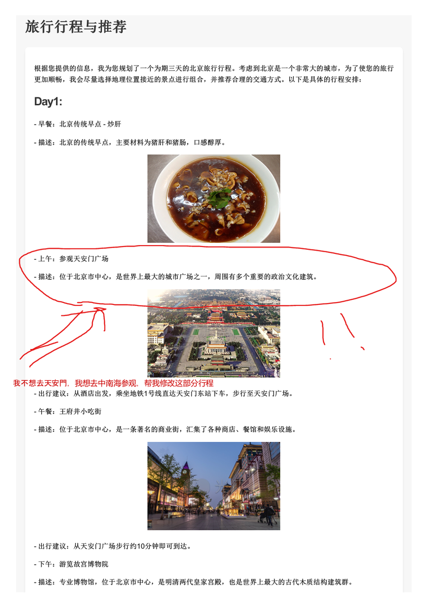
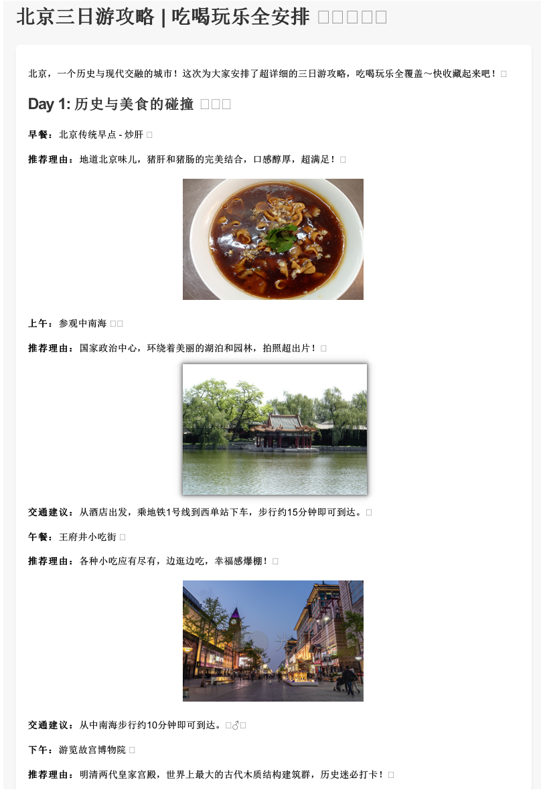

## 5.5 反馈优化模块

反馈优化模块需要使用到具备多模态能力的大语言模型，因此需要大家再申请一个具有图像理解能力的大模型（这里我们以gpt-4o演示），CAMEL中具体的支持列表如下：

在反馈优化中，我们所有的操作都是基于PDF的，虽然存在中间过程，但是对于用户来说是无感知的。具体而言，对于一个PDF，我们会先识别出用户做过标记圈画的部分，然后将其所在的整页转化为image的形式作为输出源的一部分交给有多模态理解能力的**反馈优化Agent。**

**反馈优化Agent**能够很好的理解用户的修改提示和意图，在HTML层面做出修正，重复之前的旅游信息检索和攻略生成模块，完成闭环，从而迭代式的优化旅游攻略，直到用户满意为止。

在线编辑PDF，调整需求：
需求一：红色部分帮我替换成中南海

需求二：文案帮我调整成小红书风格

观察到文案风格确实更加活泼，且红圈部分正确修改成了中南海和配图也十分吻合。