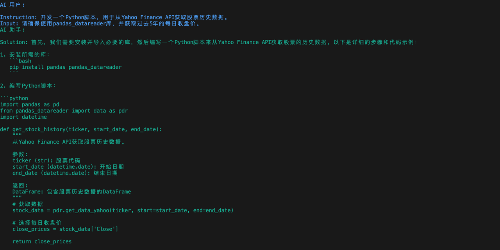

# 1. 第一章：环境配置&#x20;

## 1.1 获取CAMEL

本章节内我们将详细介绍如何获取CAMEL，CAMEL提供了几种安装的方式，我们可以根据自己的需求来选择安装的方式。

**请确保你的系统已安装Python 3.10+**。你可以通过以下命令进行检查：

PS：在windows系统中 python3 有可能会被错误的链接到windows商店，运行上述命令时可能不会正常输出python版本，运行如下命令来检查

### 1.1.1 通过 PyPI 安装

利用 pip 直接安装基础 CAMEL 库：

如果想体验完整功能，还需要安装额外的依赖项(本文档代码基于camel-ai 0.2.23a0版本运行)：

（大约2G）

### 1.1.2 通过源码安装

#### 1.1.2.1 **使用 Poetry 工具从源码安装**

建议在开始一个新项目时，使用虚拟环境，这样这避免与系统环境发生冲突。Poetry是一个管理虚拟环境的工具。可以类似 pip 用于管理第三方模块的管理，但是比 pip 的功能强大许多，同时还包含 venv 的虚拟环境管理功能。大致的功能如下：

(1) 管理第三方模块的安装与卸载

(2) 管理虚拟环境

(3) 管理虚拟环境的依赖

1. **安装Poetry：**

*类 Unix 系统 (Linux / MacOS)*

*Windows*

* **克隆Github仓库**：

* **切换到项目目录**：

* 我们建议使用Python 3.10：

* **激活 camel 虚拟环境**：

* 安装所有依赖：

#### 1.1.2.2 **使用Conda和Pip从源码安装**

1. **创建Conda虚拟环境**：

2. **激活Conda虚拟环境**：

3. **克隆Github仓库**：

4. **切换到项目目录**：

5. **从源代码安装**：

## 1.2 API 设置

关于如何部署智能体的问题，可以选择使用 API 或者本地模型。总的来说，选择使用 API 还是本地模型部署智能体，取决于具体的应用场景和资源限制。如果网络连接稳定且可以承受一定的使用费用，那么 API 可能是一个好选择。如果硬件资源充足且希望智能体能在离线环境下工作（注重数据隐私和安全），那么本地模型可能更合适。

### 1.2.1 获取  API KEY

使用 API 调用大模型需要 API 密钥，这里我们以Qwen为例，您可以从[ModelScope](https://modelscope.cn/docs/model-service/API-Inference/intro)获取，它提供Qwen系列的免费（OpenAI）兼容格式的API，每天免费2000次调用。

请确保您拥有一个正常注册且可使用的ModelScope账户。要生成您的私有 API KEY可以参考我们的图示。

图中的SDK令牌就是我们的API KEY。

> 请注意，需要在**模型服务**先绑定[阿里巴巴云账号](https://modelscope.cn/docs/accounts/aliyun-binding)， 不然api会显示无法使用

**可选模型范围**

在ModelScope中的[模型库](https://modelscope.cn/models?filter=inference_type\&page=1)中选择推理 API-Inference ，里面的模型都可以选择，我们可以体验到最新的使用DeepSeek-R1数据蒸馏出的Llama-70B模型。

### 1.2.2 使用API调用模型

这里我们使用CAMEL中的ChatAgent模块来简单调用一下模型，关于ChatAgent的进一步描述可以参考后续内容，这里我们简单把它理解为一个基础的模型调用模块即可。

**使用语言模型**

**使用多模态模型**

**视频理解**

如果你不想以明文的方式设置你的的API，我们可以使用dotenv 来管理 API 密钥，首先确保我们安装了python-dotenv 库。如果还没有安装，可以通过以下命令安装：

**使用poetry**

**使用 PyPI&#x20;**

之后在外面的项目根目录创建一个名为 .env 的文件，并在其中添加你的 API 密钥：

然后调用模型

## 1.3 Hello CAMEL！

让我们使用CAMEL来开发一个交易机器人吧！在这一部分我们会使用到CAMEL的核心模块之一RolePlaying，在后续章节我们会有更进一步的介绍。

`examples/ai_society/role_playing.py`：

### 1.3.1 尝试RolePlaying

根据上面的步骤配置好key和url后，运行脚本

运行效果如下，可以看到模型会自我反复对话来解决问题，这段对话展示了如何为股票市场开发一个交易机器人。

运行成功后，我们也可以看到各个模块的初始prompt，总得来说，RolePlaying会将将初始的task一步步拆解，由AI User指导AI Assistant完成整个任务，这些我们会在[第二章](https://fmhw1n4zpn.feishu.cn/docx/AF4XdOZpIo6TOaxzDK8cxInNnCe#share-X1VwdB394o7hoEx43CWc7WbenEg)详细说明。

如果出现**openai.APIConnectionError: Connection error.错误**，可以在role\_playing.py中加入下列代码，并检查自己的代理。

代理IP地址可以在你使用的代理中查得，或者在系统设置中查得。以Win11系统为例，在设置 ->网络和Internet ->代理 ->使用代理服务器中可以查询自己的代理IP。

### 1.3.2 使用其他模型以及不同的输出语言

我们只需要使用ModelFactory创建一个模型以及修改一些参数即可切换不同的模型，具体可以参考[Models章节](https://fmhw1n4zpn.feishu.cn/docx/AF4XdOZpIo6TOaxzDK8cxInNnCe#share-Bxl5duiIHoskBwxi9eEceCj5nlc)，另外我们可以设置`output_language`参数来调整不同的输出语言，关于RolePlaying的其他参数解释可以参考[第二章](https://fmhw1n4zpn.feishu.cn/docx/AF4XdOZpIo6TOaxzDK8cxInNnCe#share-X1VwdB394o7hoEx43CWc7WbenEg)，下面给出一个参考范例：

这里的`output_language`参数其实是通过prompt告诉agent要用什么语言输出的，所以这里的输入可以稍微随意一点，如`ZH、中文、Chinese`都可以，示例如下：

## 1.4  第一章课程作业

### 基础作业

根据上面教程的介绍，部署好环境并成功运行role\_playing.py，从其中的对话体会camel框架的工作方式，并记录下你的思考。

### 进阶作业

尝试修改role\_playing.py中的task\_prompt、assistant\_role\_name及user\_role\_name部分来让camel帮你完成一个你感兴趣的事情吧!