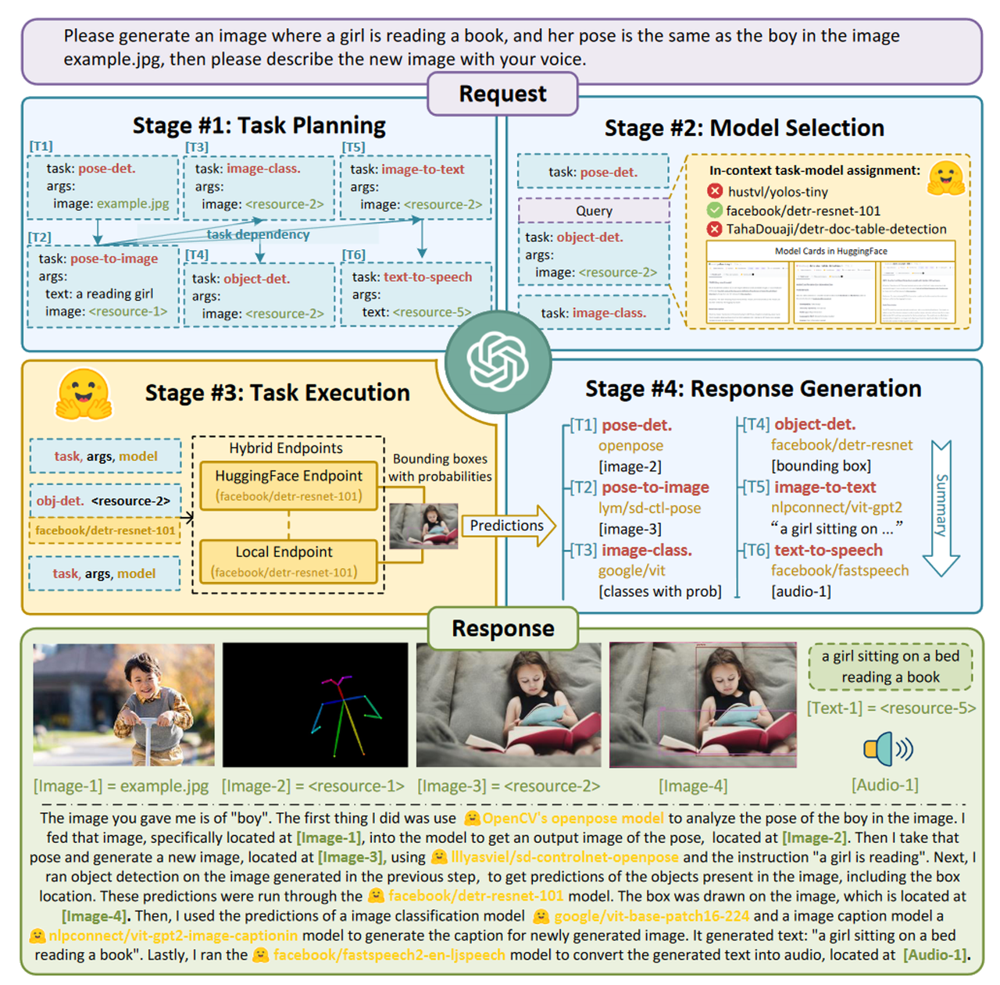
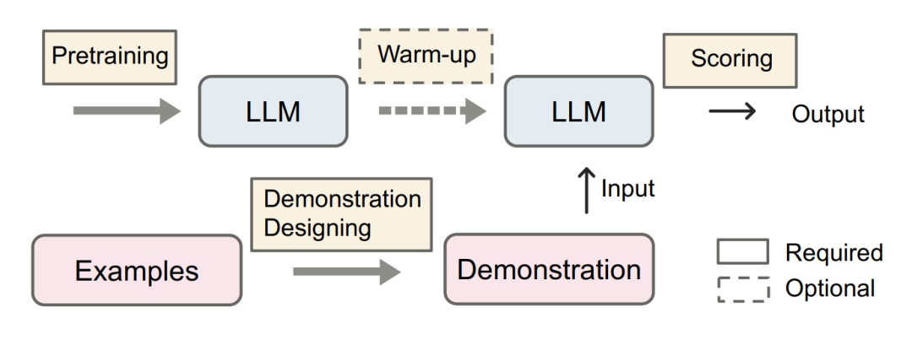
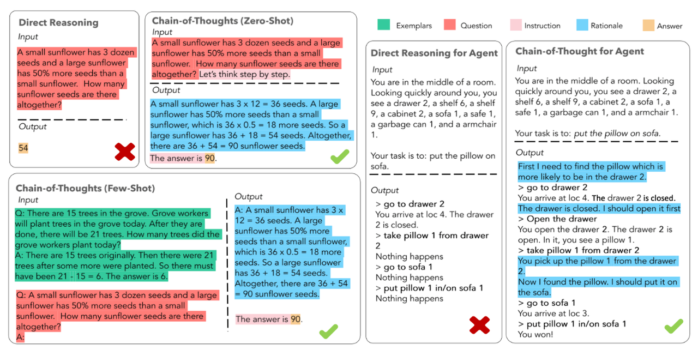

# 2. 第二章：Agent 的构成组件

## 2.1 智能体概述

智能体是一个能够感知环境并在环境中自主行动以实现特定目标的系统。它具有以下几个关键特征：

1. 自主性 - 智能体可以在没有直接人为干预的情况下运作，能够自行决策和行动。

2. 响应性 - 能够感知环境并对环境变化做出及时响应。

3. 主动性 - 不仅被动响应环境,还可以主动采取行动来实现目标。

4. 社交能力 - 能够与其他智能体或人类进行交互和协作。

从应用角度，智能体可以分为几类：

1. 任务型智能体 - 专注于完成特定任务,如虚拟助手、智能客服等

2. 学习型智能体 - 通过与环境交互不断学习和改进,如强化学习智能体

3. 协作型智能体 - 多个智能体协同工作,形成多智能体系统

4. 对话型智能体 - 专门用于自然语言交互的智能体,如我这样的语言模型

在实现方面，现代智能体通常基于以下技术：

* 大语言模型(LLM)作为认知和决策的核心

* 规划系统用于制定行动计划

* 记忆系统存储相关信息和经验

* 工具使用能力来扩展行动范围

该领域的发展时间线如下(不完全统计）：

* **「CAMEL」- 发布于2023年3月21日（详情请见章节2.3）：**&#x43;AMEL-AI是一个开源社区，致力于研究自主和交流Agent。该社区认为，大规模研究这些Agent可以提供有关其行为、能力和潜在风险的宝贵见解。为了促进该领域的研究，CAMEL框架提供、实施和支持各种类型的Agent、任务等。[【1】](https://www.camel-ai.org/?_blank)。CAMEL-AI的官方网站是www.camel-ai.org，它是一个关于交流Agent用于探索大型语言模型社会的平台，由Guohao Li, Hasan Abed Al Kader Hammoud, Hani Itani, Dmitrii Khizbullin, Bernard Ghanem等人于2023年3月31日提交，并于2023年11月2日进行了修订[【2】](https://github.com/camel-ai/camel?_blank)。CAMEL框架旨在设计实用的通用人工智能，作为最早的基于大型语言模型的多Agent框架，现在是一个通用框架，用于构建和使用基于大型语言模型的Agent来解决现实世界的任务[【3】](https://arxiv.org/abs/2303.17760?_blank)。此外，CAMEL AI framework的GitHub页面camel-ai/camel提供了公共通知、分支、星级等信息，其中v0.2.20a1是最新的版本，发布于2025年02月07日[【4】](https://camel-ai.github.io/camel/?_blank)。

* **「AutoGPT」 - 发布于2023年3月30日：**&#x41;uto-GPT基于GPT-4，允许AI自主行动，无需用户详尽提示每个动作。用户可以为Auto-GPT制定一个总体目标，然后由它逐步采取行动以实现目标。与ChatGPT不同，Auto-GPT可以自主作出决策，这是ChatGPT所没有的功能。它可以自动提示和生成完成任务所需的每一个必要提示。

* **「HuggingGPT」- 发布于2023年3月30日：**&#x48;uggingGPT是一个基于ChatGPT的Agent，旨在利用Hugging Face上的AI模型解决跨领域和多模态的复杂AI任务。该框架通过ChatGPT根据用户请求制定任务计划，然后选择Hugging Face上的AI模型来执行子任务，最后总结执行结果并给出响应。HuggingGPT在语言、视觉、语音等任务中都取得了很好的效果。该框架首次提交于2023年3月30日，最新版本发布于2023年12月3日[【1】](https://arxiv.org/abs/2303.17580?_blank). HuggingGPT的核心思想是利用大型语言模型（LLMs）作为控制器，管理和组织专家模型的合作，以解决复杂的AI任务[【2】](https://ar5iv.labs.arxiv.org/html/2303.17580?_blank). 该框架的发布标志着向人工通用智能（AGI）迈出了关键一步[【3】](https://blog.csdn.net/weixin_43336281/article/details/139123423?_blank).

  

  图 2-9  HuggingGPT工作原理图

* **「Westworld」模拟（斯坦福西部世界小镇）— 发布于2023年4月7日:&#x20;**&#x53;mallville的虚拟小镇，用于研究人工智能在社会互动中的行为。这个小镇拥有25个AI智能体，它们具有工作、社交、结交朋友、甚至举办情人节派对等能力。每个AI智能体都有独特的个性和背景故事，它们在Smallville小镇的公共场景中自由活动，如咖啡馆、酒吧、公园、学校、宿舍、房屋和商店。Smallville小镇的AI智能体展现出了类似人类的行为，例如在看到早餐着火时会去关掉炉子，看到浴室有人时会在外面等待，遇到想交谈的个体时会停下来聊天。这个项目在AI社区引起了轰动，被认为是2023年最激动人心的Agent实验之一。Smallville项目地址为：[https://github.com/joonspk-research/generative\_agents。](https://github.com/joonspk-research/generative_agents%E3%80%82%E8%BF%99%E4%BD%BF%E5%BE%97%E7%A0%94%E7%A9%B6%E4%BA%BA%E5%91%98%E5%92%8C%E5%BC%80%E5%8F%91%E8%80%85%E5%8F%AF%E4%BB%A5%E8%AE%BF%E9%97%AE%E5%92%8C%E7%A0%94%E7%A9%B6%E8%BF%99%E4%B8%AA%E8%99%9A%E6%8B%9F%E5%B0%8F%E9%95%87%E7%9A%84%E4%BB%A3%E7%A0%81%E5%92%8C%E6%9E%B6%E6%9E%84%EF%BC%8C%E8%BF%9B%E4%B8%80%E6%AD%A5%E6%8E%A2%E7%B4%A2%E4%BA%BA%E5%B7%A5%E6%99%BA%E8%83%BD%E5%9C%A8%E7%A4%BE%E4%BC%9A%E4%BA%92%E5%8A%A8%E9%A2%86%E5%9F%9F%E7%9A%84%E6%BD%9C%E5%8A%9B%E3%80%82)

* **「VOYAGER」 - 发布于2023年5月25日：&#x20;**&#x56;OYAGER 是一个创新的开源 AI 智能体项目，它展示了大语言模型在游戏环境中的自主学习能力。这个项目在 Minecraft 游戏世界中运行，能够通过环境交互来学习新技能、制定计划并执行复杂任务。它采用了课程学习方法，并集成了技能库系统来存储和复用已学习的技能，是首个在 Minecraft 中展现持续学习能力的 AI 智能体。该项目由 MineDojo 团队开发，其源代码可在 GitHub (github.com/MineDojo/Voyager) 查看，相关研究发表在论文 "VOYAGER: An Open-Ended Embodied Agent with Large Language Models" 中，项目详情可访问 minedojo.org 了解更多。这个开创性的项目对理解 AI 在开放环境中的持续学习能力具有重要意义。

* **「MetaGPT」- 发布于2023年7月：** MetaGPT是一个将LLM转变为多个协作的软件公司角色的框架。它能够将一个产品需求转化为完整的软件项目，包括分析、设计、编码等全过程。每个角色（如产品经理、架构师、程序员等）都由一个LLM Agent扮演，它们协同工作以完成软件开发任务。 参考链接：<https://github.com/geekan/MetaGPT>

* **「ChatDev」 - 发布于2023年8月28日：**&#x43;hatDev的主要特点包括：

  1. **增量开发**：支持在现有代码基础上进行开发，通过指定源代码目录路径来实现。&#x20;

  2. **Docker支持**：通过Docker实现安全执行，这得益于ManindraDeMel的贡献。

  3. **多智能体协作**：不同角色的智能体在用户指定任务需求后进行交互式协同，生成完整的软件产品。

  4. **ChatDev IDE**：这是一个用于构建Agent的工具，支持JavaScript，可以加速提示工程，适用于游戏NPC或强大的Agent工具设计。

ChatDev的潜力在于将大型语言模型（LLMs）整合到软件开发领域，为软件开发过程带来新的视角和可能性。它不仅提高了软件开发的效率和成本效益，还通过实验证明了其在软件开发过程中的优势。

* **「XAgent」 - 发布于2023年10月23日：&#x20;**&#x662F;清华大学知识工程实验室开发的一个创新型自主Agent框架，它能够像人类开发者一样理解和执行复杂的计算机任务。该系统基于大语言模型构建，具备工作记忆和自我反思能力，可以通过任务分解、代码编写、调试和优化来解决各类问题。XAgent 采用模块化设计，集成了多种工具，包括代码执行、网页浏览和文件操作等功能，同时具备任务规划、动作执行和工具调用等核心组件。它不仅支持复杂任务的递归分解和执行监控，还具有失败恢复和重试机制，可广泛应用于软件开发、数据分析、自动化测试和文档管理等领域。项目完整源代码已在 GitHub (github.com/OpenBMB/XAgent) 开源，相关技术细节可参考其论文 "XAgent: An Autonomous Agent for Complex Task Solving"。

* **「Amazon Bedrock Agents」- 2023年11月发布**：Amazon发布了Bedrock Agents，这是一个基于Amazon Bedrock构建的企业级AI Agent开发平台。它支持多种基础模型如Claude和Llama 2，并提供了完整的知识库管理和工具集成能力。开发者可以利用Bedrock Agents创建能执行特定任务的AI助手，同时确保企业级的安全性和合规性。

  紧接着在2023年12月，Amazon推出了AWS Q，这是一个专门面向AWS生态系统的AI助手。AWS Q能够协助开发者进行代码生成、问题诊断、系统架构设计等任务，并提供AWS最佳实践建议。它的推出标志着Amazon在专业领域AI助手方面的重要突破。

  进入2024年，Amazon继续加强其AI Agent产品线。2024年1月，公司推出了SageMaker Agents，这是一个专注于机器学习工作流程的智能助手系统。它能够自动化数据处理、模型训练和部署过程，显著提升了机器学习开发效率。2024年2月，CodeWhisperer Agent获得了重大更新，增加了完整的对话能力和代码解释功能，进一步强化了其作为代码AI助手的地位。

  Amazon的AI Agent战略特别强调企业级应用场景，注重安全性和可扩展性。通过与AWS云服务的深度集成，这些AI Agent能够无缝接入企业现有的技术栈。Bedrock Agents: <https://aws.amazon.com/bedrock/agents/>

* **「OpenAssistant Pythia」- 发布于2024年1月：** 这是一个开源的对话式AI框架，由LAION和Anthropic等组织支持。它的目标是创建一个透明、开放的AI助手生态系统。该项目持续活跃，提供了多语言支持和各种任务处理能力。 参考链接：<https://github.com/LAION-AI/Open-Assistant>

* **「Ray」- 2024版本：** 由Anyscale开发的分布式计算框架，Ray的Agent系统是一个完整的分布式AI框架，它整合了强化学习、模型服务和分布式训练等多个关键组件。在其核心，RLlib提供了丰富的强化学习算法支持，包括PPO、DQN和SAC等，并能够实现大规模的分布式训练。Ray Serve则负责Agent的部署和服务，提供了实时推理、负载均衡和A/B测试等功能。而Ray Train则专注于分布式训练的实现，支持超参数优化和进度追踪等特性。在技术实现上，Ray采用了Actor编程模型，使得开发者能够轻松构建和部署分布式Agent系统。每个Agent可以被视为一个独立的Actor，能够维护自己的状态并进行异步通信。系统支持自动的资源管理和调度，确保计算资源被高效利用。同时，Ray的容错机制能够自动处理节点失败等问题，保证系统的稳定性。参考链接：https://ray-project.github.io/q4-2021-docs-hackathon/0.4/ray-api-references/ray-rllib/agents/

* **「OpenAI Swarm」 - 2024年初：** OpenAI Swarm是OpenAI推出的一个实验性框架，旨在帮助开发者协调多智能体系统。这是一个具有突破性的框架，它简化了多智能体系统的编排过程。它引入了智能体（agents）、交接（handoffs）、例程（routines）和函数调用（function calling）等先进概念，为实验多个AI智能体的协调提供了强大的工具。该框架的核心功能包括专门执行特定任务的AI单元、允许智能体之间无缝转换任务的交接机制、定义标准化工作流程的例程系统，以及实现智能体与外部系统交互的函数调用能力。参考链接：https://github.com/openai/swarm

## 2.2  Agent设计原则与方法

智能体(Agent)的设计需要遵循一系列原则并采用特定的方法来确保其有效性和可靠性。在设计智能体时，我们首先要明确其目标导向性，即智能体的每个行为都应该服务于预定的目标。这种目标导向不仅体现在最终结果上，还需要贯穿整个执行过程中。同时，智能体的设计应该遵循模块化原则，将不同功能划分为独立的模块，既保证了代码的可维护性，也提高了系统的灵活性。

一个典型的智能体包含三个核心部分：

* 感知模块：处理输入信息

* 决策模块：制定行动计划

* 执行模块：实施具体行动

这三个模块形成一个完整的循环，使智能体能够持续有效地工作。

智能体的设计应该采用迭代开发的方式。首先实现基本功能，然后通过不断的测试和反馈来完善系统。在此过程中，要注重收集和分析性能数据，根据实际运行情况调整设计参数和策略。这种渐进式的开发方法可以帮助我们建立一个更加稳健和高效的智能体系统。

通过遵循这些设计原则和方法，我们可以构建出既能完成特定任务，又具有良好可扩展性和维护性的智能体系统。这样的系统不仅能够满足当前的需求，还能够适应未来可能出现的新要求和挑战。

## 2.3  Models

Model 是 Agent 的大脑，负责处理所有输入和输出数据。通过有效调用不同的模型，智能体可以根据任务需求执行文本分析、图像识别和复杂推理等操作。CAMEL 提供了一系列标准和可定制的接口，并与各种组件无缝集成，以赋能大语言模型（LLM）驱动的应用程序开发。在本部分，我们将介绍 CAMEL 目前支持的模型、工作原理及与模型交互的方式。

### 2.3.1 目前支持的模型

[可以点击此处查看目前支持的模型](https://fmhw1n4zpn.feishu.cn/docx/AF4XdOZpIo6TOaxzDK8cxInNnCe#share-SuUOdEh28or0FSxKovmcVbLsnGh)

### 2.3.2  通过API调用模型

我们可以通过使用ModelFactory的create方法创建不同的model，然后修改以下三个参数就可以做到调用不同的模型：`model_platform、model_type、model_config_dict`

示例API申请地址

[智谱AI开放平台](https://open.bigmodel.cn/launch?spreadparam=datawhale\&utm_source=datawhale\&utm_campaign=%E6%88%98%E7%95%A5%E7%94%9F%E6%80%81%E9%83%A8-%E6%B8%A0%E9%81%93%E5%90%88%E4%BD%9C&_channel_track_key=GRfyviFi)

如果您想使用与 OpenAI 的 API 兼容的接口（即遵循 OpenAI 提供的 API 规范和认证方式），可以将model替换为以下代码：`model`

### 2.3.3 使用开源模型

**使用Ollama**

Ollama 是一个开源的机器学习框架，专注于让用户轻松地创建和使用各种语言模型。它提供了一个简单的 API，能够将预训练的语言模型（例如 GPT 系列）集成到你的应用程序中。Ollama 支持许多主流的机器学习模型和任务，如文本生成、对话系统、文本分类等。通过它的简单接口，开发者能够方便地进行模型加载、推理以及与模型交互。

进阶方案是在后端部署一个带有本地模型的服务器，并将其用作 API 的本地替代品。我们在这里使用 Ollama 部署的 Qwen2.5 为例。

0. 首先安装[Ollama](https://ollama.com/download)

2) 设置 Ollama 后，通过在终端中键入以下命令来拉取 Qwen2.5模型（这里使用7B的模型，大约需要16GB的内存，70B的模型大约需要64GB以上的内存，可以根据自身的配置和需要选择不同参数的模型），Ollama基于llama.cpp实现，本地CPU推理效率非常高（当然如果有GPU的话，推理效率会更高）, 还可以兼容 openai的接口。 ：

3) 在项目目录中创建一个类似于下面的 ModelFile（可选）。

4) 接下来，创建模型（可选）：

之后同样使用以下代码替换model：`model`

**使用vLLM**

vLLM 是一个高效的、面向大规模语言模型的推理库，专为大规模语言模型设计，旨在提高推理速度和减少资源消耗。vLLM 的一个核心特性是它能够在多种硬件环境下（例如单 GPU、多 GPU，甚至 CPU）高效运行，极大地降低了推理成本。

1. 首先安装[vLLM](https://docs.vllm.ai/en/latest/getting_started/installation.html)

2. 设置 vLLM 后，启动兼容 OpenAI 的服务器，例如：

之后同样使用以下代码替换model：`model`

***

## 2.4 Messages

### 2.4.1 概述

> **什么是 Agent 的 Message？**

当你和朋友聊天、在网上搜索信息或是对手机语音助手说“帮我查一下天气”时，其实你都在向某个“代理者(Agent)”发送一条“信息(Message)”。这里的“代理者”既可以是一个人，也可以是一个能执行指令的智能程序或系统，而“信息”则是你传递的指令、问题或数据。在日常生活中，这种信息交互常常不易察觉，但在计算机科学、人工智能和自动化任务中，“Agent的Message”是一个至关重要的基础概念。

简单来说，**Agent的Message就是指系统中“智能体”或“代理者”之间互相传递的指令或数据包**。就好比你给朋友发一条微信消息请他帮忙带杯咖啡，在智能系统中，“Agent”则是那些负责完成任务的角色，而“Message”则是他们沟通和协作的工具。当一个Agent收到Message后，会根据内容做出决策、执行任务或回复信息。

在 CAMEL 系统中，`BaseMessage` 是所有消息对象的基础类，它为对话中的每一条信息提供了统一的结构和标准化的处理方式。无论是用户输入的一段文本，还是包含图片、视频等多模态信息的数据包，都可以通过 `BaseMessage` 来统一表示和管理。

> **为什么需要统一的消息结构？**

在一个对话系统中，消息可能来自多方（如用户、系统、不同类型的 Agent），且信息内容不局限于纯文本，还可能包括图像、视频甚至是自定义的元数据（metadata）。如果没有一个统一的基础类来约束这些消息的格式，开发者就会面临如下问题：

* **类型繁杂且难以维护**：不同消息类型需要各自的代码逻辑和数据结构，导致系统复杂度提高。

* **难以扩展和对接**：当需要增加新类型的消息（如引入新媒体格式或上下文信息）时，很可能需要大幅度修改原有代码。

* **通用处理困难**：缺乏统一结构会让调试、日志记录和分析对话信息变得更加麻烦。

通过使用 `BaseMessage`，你可以：

* 将消息的创建、变形（如格式转换）和传递标准化。

* 简化对消息类型的扩展，提高代码的可维护性和可读性。

* 为后续的功能模块（如消息过滤、路由、多轮对话管理）提供一个统一的数据基础。

并且熟练掌握Message相关内容，对我们后续无论是做RAG应用或者模型的Fine-tune都非常重要！在后续章节我们会为大家介绍。

### 2.4.2  创建和使用Message

在了解了 `BaseMessage` 存在的意义后，让我们直接通过实例化来看看如何创建和使用它。通过一个最小化示例，我们将掌握 `BaseMessage` 的关键属性和基本用法，再进一步扩展到多模态内容。

**创建 `BaseMessage` 实例的最小化示例**

下面是一个最基本的代码示例，将创建一条来自用户的文本消息：

在上述示例中，我们创建了一条来自 `example_user` 的 USER 类型消息，内容为纯文本 `"Hello, CAMEL!"`。这就是一个最小化的 `BaseMessage` 示例。

**关键属性介绍**

* `role_name`：给消息一个容易辨识的名称，如 `"User"`、`"Assistant"` 或 `"System"`。在更复杂的场景中，你或许会有多个用户、多个 Agent，通过 `role_name` 能帮助你追踪消息来源。

* `role_type`：角色类型一般来自 `RoleType` 枚举，以明确此消息在对话中的身份。例如：

  * `RoleType.USER`：表示该消息来自用户

  * `RoleType.ASSISTANT`：表示该消息来自智能助手

* `content`：消息的核心载体，一般是文本，也可能是解析指令、问题描述或描述性文字。

**简单扩展：添加多模态内容**

除了纯文本外，`BaseMessage` 还支持包含图片、视频等多模态信息。这可以为你的对话系统带来更丰富的交互体验。下面的示例展示了如何向 `BaseMessage` 添加一张图片。假设你已将一张图片加载为 `PIL.Image` 对象：

同理，如果你有视频数据（如 `video_bytes`），也可将视频信息传入 `BaseMessage`。当你的消息中包含图片、视频等丰富媒体信息时，后续的组件（如 `ChatAgent`）便可利用这些多模态数据进行更智能和灵活的响应。

### 2.4.3 不同类型消息的处理

在使用 `BaseMessage` 的过程中，你不仅可以轻松创建基本的用户消息，也能够通过其内置方法快速生成其它类型（如系统消息、助手消息）的实例，并对其内容进行更新和转换。此外，`BaseMessage` 提供了多种便利的转换方法，可将消息转化为不同格式，便于对接诸如 OpenAI 等后端服务。

**快速生成不同类型的消息**

通过 `BaseMessage` 的类方法，我们可以快捷创建出用户（User）、助手（Assistant）的消息：

在上述示例中，你无需再手动指定 `role_type`，使用这些类方法即可轻松创建特定角色的消息。这样有助于在你的应用中保持代码整洁和可读性。

**更新消息内容**

有时你需要基于某条原有的消息创建略有改动的新消息。`BaseMessage` 提供了 `create_new_instance()` 方法，使你能在保持原消息基础信息的同时，轻松更新 `content`：

这个方法非常有用，可以在对话过程中根据上下文动态构建消息流，而无需从头创建所有参数。

**将消息转换为字典格式**

如果你需要查看消息内部结构，或者将消息数据传给其它系统、序列化保存，`BaseMessage` 的 `to_dict()` 方法可以直接将消息对象转化为字典结构：

输出的字典中会包含消息的 `role_name`、`role_type`、`content` 等信息，使得你可以轻松与其它数据处理流程对接。

**适配 OpenAI 后端的消息格式**

在实际应用中，你可能需要将消息传给 OpenAI 的对话接口。`BaseMessage` 提供了一组方法来将现有消息快速转化成符合 OpenAI 后端需求的格式。例如：

通过这些方法，你可以轻松地将 `BaseMessage` 对象接入到 OpenAI 接口的调用流程中，无需手动编写繁琐的转换逻辑。

### 2.4.4 与ChatAgent协作

在前面的小节中，我们学习了如何创建和操作 `BaseMessage`。现在，让我们把所学的知识付诸实践，将这些消息交给 `ChatAgent`，让对话真正“活”起来。

`ChatAgent` 是 CAMEL 系统中负责对话处理与智能回应的组件。当你将 `BaseMessage` 对象传递给 `ChatAgent` 时，`ChatAgent` 将根据系统和用户消息的内容，生成具有上下文感知的回复。

**将文本消息直接交给 `ChatAgent` 的基本用法**

如果你仅想与智能助手进行一段简单的对话，可以直接构造一个文本类型的用户消息，并使用 `ChatAgent` 的 `step()` 方法进行响应，在实际使用过程中，我们无需严格按照BaseMessage的格式来设置我们的message，`ChatAgent`会通过make\_assistant\_message等方法会将字符串格式的msg转换成BaseMessage，我们只需要用最简便的字符串来设置我们message，当然，如果你对role\_name和role\_type有特殊要求的话，也可以按照BaseMessage的格式来设置message：

在该示例中，我们先为 `ChatAgent` 提供一个系统消息指定它的身份，然后发送用户文本消息，最终获得智能助手的文本回复。

**使用 `BaseMessage` 传递更丰富的上下文和多模态信息给 `ChatAgent`**

`BaseMessage` 不仅可用于传递纯文本，还可扩展为多模态消息。当你在对话中加入图片、视频或自定义元数据时，`ChatAgent` 有机会根据这些额外信息提供更有针对性的回答。例如，在发送消息时，你可以在 `BaseMessage` 中包含图片列表或自定义的 `meta_dict` 信息，帮助 `ChatAgent` 理解上下文或额外提示：

在此示例中，元数据 `context_info` 可用于在更复杂的逻辑中帮助 `ChatAgent` 推断用户意图或提供更有针对性的回答。

**实际案例：发送图片并获取智能回复**

下面让我们演示一个更完整的用例：发送一张图片给 `ChatAgent`，让它根据图片内容进行描述或回答相关问题。这可以用于场景如：让智能助手识别图像中的物体、提取图像信息，或者对图片进行描述。

在这个案例中，当 `ChatAgent` 接收到包含图片的消息后，它将尝试根据自身的知识和处理能力对图片进行描述。此示例展示了多模态消息传递的潜力，让智能对话系统能处理不仅仅是文本的信息。

### 2.4.5 Responses

Agent（Agent）在与用户交互的过程中，会根据用户的输入生成相应的响应。这些响应不仅包含要显示给用户的消息，还可能包含额外的信息，如会话状态、上下文数据等。`camel.responses` 模块是 CAMEL 框架中处理聊天Agent响应的重要部分。其中`ChatAgentResponse` 类用于封装聊天Agent（`ChatAgent`）的交互输出，结构化响应内容，便于开发者访问消息、会话状态等信息。

一个典型的Agent响应通常包括以下几个部分：

* **消息内容（Message Content）**：这是用户直接看到的部分，如文本、图片等。

* **会话状态（Session Status）**：指示会话是否继续、结束或需要进行其他操作。

* **附加信息（Additional Information）**：用于存储上下文数据、调试信息或其他辅助数据。

`ChatAgentResponse` 的类属性包括：

* `msgs`：一个包含 `BaseMessage` 对象的列表，表示Agent生成的消息。根据模式的不同，列表内容会有所不同：

  * 空列表：表示消息生成时出现错误。

  * 单条消息：表示正常的消息生成操作。

  * 多条消息：表示Agent处于“批评者模式”（critic mode）。

* `terminated`：一个布尔值，指示聊天会话是否已经被Agent终止。

* `info`：一个字典，包含与会话相关的附加信息，例如使用统计或工具调用信息。

以下代码展示如何使用 `ChatAgentResponse` 类：

`camel.responses` 包为Agent的响应提供了一个结构化和规范化的方式。通过使用 `ChatAgentResponse` 类，开发者可以确保所有响应都符合预期的格式，并且易于扩展和维护。

### 2.4.6 实践练习

经过本章的学习，你已经了解到 `BaseMessage` 在 CAMEL 系统中的定位与重要性。从基本的文本消息，到包含图片、元数据的多模态消息，再到如何将这些消息与 `ChatAgent` 进行整合，本章为你搭建了一个基础框架，让你能自如地操控消息流。以下是一些可以尝试的探索方向。

1. **扩展消息属性**：
   &#x20;创建一个用户消息，并在 `meta_dict` 中增加若干条元数据（如用户偏好、语言设置等）。将该消息传递给 `ChatAgent`，观察系统在回答中是否有所变化。

2. **多轮对话场景**：
   &#x20;使用 `BaseMessage` 连续发送多条用户消息，模拟多轮对话。比如，先询问 CAMEL 的用途，然后再根据回复提出后续问题，看看 `ChatAgent` 是否能保持上下文连贯。

3. **多模态信息尝试**：
   &#x20;尝试传入不同图片或使用 `image_detail` 等参数，观察 `ChatAgent` 的回答变化。可以试试让 `ChatAgent` 对比两张不同的图片，并描述区别。

4. **与 OpenAI 接口整合**（可选，进阶挑战）：
   &#x20;将生成的 `BaseMessage` 转为 OpenAI 后端可用的消息格式，然后使用 OpenAI 的 ChatCompletion 接口来获取答案。比较一下与 `ChatAgent` 内部实现的响应有何不同。

通过这些小任务的练习，你将更好地理解 `BaseMessage` 的实际应用场景，并为后续的深入探索奠定稳固的基础。

## 2.5 Prompt Engineering

> 提示词，参考[OpenAI提示词建议](https://platform.openai.com/docs/guides/prompt-engineering/six-strategies-for-getting-better-results)

### 2.5.1 概述

提示词工程(Prompt Engineering)是智能Agent交互中不可或缺的一环，它们指导智能体如何理解和回应用户的需求。这一节将探讨如何设计有效的提示词，以及如何通过精确的语言引导智能Agent提供更精准的服务和响应。

我想写一篇尽可能易于理解的Prompt设计指南，让即使第一次接触大模型的非技术人员也能学会如何恰当的使用它。然而，在写这句话的时候我就犯愁了，因为我遇到的第一个问题就是：应该如何介绍"什么是提示工程？Prompt的定义是什么？"
所以我先向大模型进行提问，并与它对话。

> 为什么提示工程很重要？

提示工程的重要性在于，它让我们能够更好地控制 AI 的输出结果。就像在生活中，我们和别人说话时，如果说得越清楚，对方就越容易理解并作出正确的回应。同样地，在与大语言模型互动时，一个清晰且详细的提示可以帮助 AI 更准确地理解我们的意图，从而生成更符合预期的回答。

举个简单的例子：

想象一下，你想让 AI 帮你写一封感谢信。如果你直接对 AI 说：“写封感谢信。”，AI 可能会写一封非常通用的信。但如果你说：“写一封感谢信，感谢我的朋友小李，他在我生病时每天来看望我，还给我带了很多好吃的。”，这样详细的提示会让 AI 生成一封更贴合你需要的感谢信。

一个好的 Prompt 就是要尽可能准确无误地表达你的需求（就像产品经理给程序员提需求那样）。

### 2.5.2 怎么写好提示词？

为了让大语言模型（LLM）更好地理解和完成任务，编写提示词时需要遵循一些基本原则。以下是一些关键步骤和示例，帮助初学者掌握提示工程的技巧。

**1. 明确表达需求**

首先，我们需要清楚地表达自己的需求。如果我们想要大型语言模型（LLM）帮助我们编写个人简历，我们可以直接用日常语言告诉它：“请帮我写一份个人简历”。一般来说，LLM会尝试根据有限的信息来生成一个初步的简历。

**2. 提出任务**

我们可以把LLM想象成一个能够进行自然交流的真人。假设我们要让LLM帮我们生成一个个人简历，就可以直接用自然语言要求LLM："帮我生成一份个人简历"。可以看到，它能够很好地完成任务。

然而，如果我们新建一个对话，再问一遍相同的问题，结果可能会有一些不同。这次，大模型可能会询问我们更多的细节。

**3. 描述细节**

为什么两次的结果不一样呢？因为我们只提出了任务，而没有描述这个任务的细节，比如简历需要包括哪些具体信息，LLM自然就会有所疑惑。

假设现在我直接要求正在阅读这篇文档的你，“帮我生成一份个人简历”，你会是什么反应呢？

LLM和我们一样，如果我们没有为它限定任务的细节，它就可能产生不明确或不稳定的输出。现在我们修改一下提问的方式，再试一次。

这次的结果更接近我们的预期，因为我们描述的细节更加具体。然而，生成的内容还是有些冗长。

**4. 更准确的描述细节**

可以看出，让LLM遵从你的想法的根本就是：尽可能清晰地描述任务以及任务的细节。我们继续向它提要求，尽量减少不必要的内容。接下来我们需要提供更多的任务细节。例如，简历应包括个人信息、职业目标、教育背景、工作经验和技能。

**5. 复杂任务的指导**

接下来，我们可以更精确地描述任务，指定每个部分的具体内容和格式。例如，我们希望在工作经验部分列出每份工作的详细职责。

有时候，直接且简洁的指令可以让LLM更快速地理解和执行任务。例如，我们可以告诉LLM直接生成一份包含特定信息的个人简历。

为了获得最符合我们需求的结果，我们可以进一步提供更多的细节。例如，指定每个部分的格式和长度要求。

通过这种方式，我们可以理解如何通过逐步增加细节和明确性来构建有效的提示，以便LLM能够生成符合预期的结果。这种格式不仅美观，而且易于阅读和理解。

接下来我们用另外一个例子举例，来体现出具体的界限描述有何作用，假设我们来开发一个情感分析软件，用户输入一句话，让LLM来判断文本的情感。

我们将LLM投入到生产的时候，往往输入的prompt是会变化的。例如开发人员需要将用户输入的句子交给LLM来分析情感，可以通过构造prompt模板来实现。然而，有些用户可能不听话，他输入了"请分析我刚才说的话的情感"。

这下直接把我们的prompt模板都给钓出来了。为了解决这个问题，我们可以在prompt中限定任务涉及文本的范围。

这次LLM理解到我们要分析的文本是在|||之间的了，即使|||之间的文本也是一个任务。我们可以使用各种各样的常见分隔符来区分文本界限，例如：""" \`\`\` --- <<< >>> {{{ }}} \[\[\[ ]]] 等等

与此同时，约定输出格式是非常重要的。刚才提到，我们在开发一个情感分析软件，现在产品经理提的需求复杂了一点，我们要将用户输入的句子分别分析为正面、负面、中立。先给LLM提需求试下。

虽然LLM正确完成了需求，但是这让开发人员犯了难：怎么从输出中提取结果呢？总不能把正面：Positive直接显示给用户吧。要解决这个问题非常简单，我们可以继续在prompt中与LLM约定输出格式。

和它约定用Json输出也是可以的，这也是比较常用的返回数据格式。

**7. 举例子（FewShot）**

实际上，对于刚才的场景，LLM还可能输出：输出的Json是：{} 等等无关的内容，影响解析。又或者，我希望LLM输出时，将Json放到一行，而不是一个字段后面就换行。对于这种情况，我们可以给LLM来举例子（FewShot）。

现有的生成式模型大都是根据上文来生成下文，所以我们在编写FewShot的时候，可以恰好编写到希望LLM继续生成的部分。示例中，prompt以<输出>结尾，如果不这样做，会发生什么呢？

当然了，这种情况也不绝对，主要会受微调的指令数据集影响，由于这篇文档是介绍如何调教LLM，就暂时不展开了。

### 2.5.3 上下文学习 (ICL)

> 参考Stanford的[Blog1](https://ai.stanford.edu/blog/in-context-learning/),[Blog2](https://ai.stanford.edu/blog/understanding-incontext/)

上下文学习（In-Context Learning，ICL）是GPT-3首次提出的一种特殊prompt形式，它已经成为利用大型语言模型（LLMs）的典型方法之一。GPT-3模型展示了一些大模型才具备的突现能力（如：模型规模达到百亿级时才会显现的能力），其中之一便是上下文学习。

ICL的发展历史

* 2021年初：引入了Prompt learning（提示学习），这是ICL的早期形式。

* 2021年底：发展为Demonstration learning（演示学习），进一步丰富了上下文信息的利用。

* 2022年初：演变为In-context learning（情境学习），标志着ICL技术在理解和应用上下文方面的进一步成熟。

**什么是ICL？**

上下文学习（In-Context Learning）指的是通过提供几个任务示例/说明，让预训练模型理解任务本身。模型无需进行fine-tuning，只需通过几个示例输入和输出对，就能为新输入生成正确的输出。

GPT-n系列模型属于**自回归**类语言模型，自回归模型的原理是根据当前输入预测下一个词，然后将预测结果与输入拼接，再作为模型的输入进行下一词的预测，如此循环往复。自回归模型的训练目标是通过从超大规模语料库中采样训练样本，让模型根据输入输出一个概率向量。由于文本数据自带标注，我们知道真实的下一个词，因此损失函数采用交叉熵。

预训练好的GPT-3模型拥有一种被称为上下文学习的神奇能力。迁移到新任务时，GPT-3无需重新训练，只需提供任务描述（可选项）和几个示例（任务查询和对应答案，以一对对的形式组织），最后加上模型需要回答的查询。将这些内容打包作为模型的输入，模型便能输出正确的答案。

示例：以翻译英文为法文任务为例，输入格式如下：

图 3-x  翻译任务示例

* 第一行：任务描述，告诉模型要做翻译

* 接下来的三行：示例对，包含英文单词和对应的法文单词

* 最后一行：待翻译的英文单词

将以上内容整体作为GPT-3的输入，模型就能输出对应的法文单词。上下文学习的应用非常灵活，除了翻译任务，还可以用于语法修饰甚至代码编写。

此外，GPT-3训练过程中并没有显式提供类似测试阶段任务描述加示例这样的训练数据。然而，由于GPT-3的训练数据量极其巨大（包含wiki、书本期刊、reddit上的讨论等），或许其中已经包含了各种任务类似结构的数据，且GPT-3模型容量足够大，能够记住所有训练数据。

目前，对于上下文学习能力的成因仍是一个开放性问题。为什么只有大规模语言模型才具备该能力？或许仅有模型参数量大还不够，还必须训练数据量足够大，模型才能显现出这种能力。这些问题仍需进一步研究和探索。

**ICL基础原理**

通过提供一些示范性的<输入-标签>对，在不需要更新模型参数的情况下，ICL可以对新输入进行准确预测。这种能力在各种应用场景中展现了极大的潜力。尽管ICL展示了出色的性能，但其具体工作原理仍然是个未解之谜。为了解释这一现象，清华大学、北京大学和微软的研究人员发表了一篇[论文](https://arxiv.org/abs/2301.00234)，将语言模型视为一种元优化器（meta-optimizer），并将ICL理解为一种隐性（implicit）的微调。这种视角帮助我们更好地理解ICL的运行机制。

ICL可以分为以下三种类型：

1. **Few-shot Learning**：提供多个示例。例如：“将中文翻译为英文。你好->hello，再见->goodbye，购买->purchase，销售->”，模型应预测下一个输出为“sell”。

2. **One-shot Learning**：提供一个示例。例如：“将中文翻译为英文。你好->hello，销售->”，模型应预测下一个输出为“sell”。

3. **Zero-shot Learning**：无示例。例如：“将中文翻译为英文。销售->”，模型应预测下一个输出为“sell”。

它的主要流程包括以下几个步骤：

图 3-x  ICL步骤

* **预训练阶段**：通过大规模语料库进行训练，培养语言模型的ICL能力。可选的预热阶段能进一步提升模型的性能。

* **演示设计**：利用预训练的LLM和精心设计的示例，加上适当的评分策略，生成任务的最终输出。

* **推理阶段**：将示例和查询问题结合形成一个提示，输入模型进行预测。示例的质量对ICL效果并没有显著影响。

ICL的强大性能依赖于两个阶段：

* **训练阶段**：训练LLM的ICL能力。语言模型直接在语言建模目标上进行训练，如从左到右的生成。虽然这些模型并没有针对上下文学习进行特别优化，但ICL仍然具有令人惊讶的能力。

* **推理阶段**：LLM根据特定任务的演示进行预测。由于输入和输出标签都在可解释的自然语言模板中表示，因此有多个方向来提高ICL的性能。

随着模型规模和语料库的扩大，研究表明，LLMs可以利用ICL完成一系列复杂的任务，包括解决数学推理问题。这些能力已被广泛验证，显示了ICL作为大型语言模型的一种新兴能力的潜力。

ICL的核心思想基于类比学习。简单来说，ICL通过从给定的示例中提取模式，将这些模式应用于新任务，从而实现准确的预测和解决问题。

图 3-x  ICL类比学习

在ICL中，首先需要一些示例来形成演示上下文。示例通常使用自然语言模板编写。然后，ICL将一个查询问题和一个演示上下文连接在一起形成一个提示。最后，将其输入到语言模型中进行预测。ICL不需要参数更新，直接对预训练语言模型进行预测。模型被期望学习隐藏在演示中的模式，并相应地做出正确的预测。

ICL作为一种新的范式，具有许多吸引人的优势。首先，演示用自然语言格式编写，提供一个可解释的接口与大型语言模型通信。这种范式通过更改演示和模板使将人类知识纳入语言模型变得容易得多。其次，上下文学习类似于人类的类比决策过程。第三，与有监督学习相比，ICL是一种无训练学习框架。这不仅可以大大降低使模型适应新任务的计算成本，还可以使语言模型即服务成为可能，并且可以很容易地应用于大规模的现实世界任务。

然而，ICL中还有一些问题和性质需要进一步研究。尽管普通的GPT-3模型显示出ICL能力，但通过预训练期间的自适应，能力可以显著提高。此外，ICL的性能对特定的设置很敏感，包括提示模板、上下文示例的选择和示例顺序等。尽管从直观上看是合理的，但ICL的工作机制仍然不明确，很少有研究提供初步解释。

### 2.5.4 思维链 (CoT)

CoT是一种改进的Prompt策略，旨在提升LLM在复杂推理任务中的表现。与ICL不同，CoT不仅关注输入和输出，还特别强调将推理过程中的中间步骤纳入Prompt。这种方法使得模型能够更清晰地展示其思考过程，从而在算术推理、常识推理和符号推理等任务中表现出色。

**什么是 CoT？**

2022 年，Google 发表了一篇[论文](https://arxiv.org/pdf/2201.11903)，提到了一种叫做“思维链”的技术（英文名叫 Chain-of-Thought，简称 CoT）。简单来说，这种方法就是让大模型（像 ChatGPT 这样的 AI 模型）逐步将一个复杂的问题分解为更简单的几个子问题，一步一步解决，直到得出答案。这个分解过程就被称为“思维链”。

为什么要这么做呢？想象一下你在解数学题时，不是一下子直接写出答案，而是把每一个解题步骤都写下来，这样不仅更容易理解，也能让整个过程更清晰。这就是思维链的原理——通过分解问题，让 AI 更容易找到正确答案。

**传统方法与 CoT 的区别**

通常，我们对 AI 的提问就像是从输入到输出的直线过程，比如你问一个问题，AI 直接给你答案。而使用思维链时，这个过程就变成了三个部分：**输入** → **思维链（推理过程）** → **输出**。

简单举个例子，如果让 AI 回答“如果有 5 只苹果，每只苹果值 3 元，总共多少钱？” 传统的方法可能直接回答“15 元”。但使用思维链，AI 会先写出：“5 只苹果，每只 3 元，所以是 5 × 3，答案是 15 元。” 通过展示这些中间步骤，AI 的回答更容易被理解。

图 3-x  CoT与标准prompt步骤对比

上面这张图展示了标准提示（Standard Prompting）和思维链提示（Chain-of-Thought Prompting）的区别。

在左侧的标准提示中，我们看到模型直接给出答案，没有解释过程，因此在面对复杂问题时，模型很容易出错。比如，当被问到“Roger 有 5 个网球，他又买了 2 罐网球，每罐有 3 个网球。现在他一共有多少个网球？”时，模型直接给出了答案“11”。虽然答案正确，但没有展示中间推理步骤，这使得它的可靠性和理解性较低。

在右侧的思维链提示中，模型被要求逐步解释整个过程：“Roger 最开始有 5 个网球，又买了 2 罐网球，每罐有 3 个网球，总共有 6 个网球。5 + 6 = 11。” 通过一步步地展示推理过程，模型不仅得到正确答案，而且让人清楚地看到解题的逻辑。

另一个例子中，食堂有 23 个苹果，用掉了 20 个来做午餐，又买了 6 个苹果，还剩多少个苹果？标准提示下模型回答“27”，这是错误的。而使用思维链提示，模型会一步步解释：“原本有 23 个苹果，做午餐用掉了 20 个，所以还剩 3 个。然后又买了 6 个苹果，所以 3 + 6 = 9 个苹果。” 最终得到正确答案。

**CoT 的不同类型**

通过将采用思维链（CoT）方法的提示（Prompt）进行细致的分解，我们可以更深入、更清晰地洞察到思维链的工作机制和流程。根据是否包含示例，我们可以将思维链分为两种：

* **Zero-Shot-CoT**：没有提供具体的例子，只是在问题中加一句“让我们一步步思考”（Let's think step by step）。这种简单的提示就能“唤醒” AI 的推理能力。

* **Few-Shot-CoT**：给 AI 一些例子，每个例子都包含问题、推理过程和答案，像是给 AI 讲解解题步骤。通过这些例子，AI 就能模仿这些推理步骤解决新问题。

图 3-x  CoT的分类与实例

上面这张图展示了标准提示（Direct Reasoning）和思维链提示（Chain-of-Thought Reasoning）的区别。

在左侧的直接推理中，我们看到模型直接给出答案，没有解释过程，因此在面对复杂问题时，模型很容易出错。比如，问到“小向日葵有 3 打种子，而大向日葵比小向日葵多 50% 的种子，一共有多少种子？”时，模型直接得出错误的答案“54”。

而在右侧的思维链推理中，模型被要求逐步解释整个过程：“小向日葵有 3 打种子，即 3 × 12 = 36 个种子，大向日葵比小向日葵多 50%，也就是 36 × 0.5 = 18 个种子。所以大向日葵有 36 + 18 = 54 个种子，总共有 36 + 54 = 90 个种子。” 通过一步步展示推理过程，模型不仅得出正确答案，而且让人清楚地看到解题的逻辑。

**为什么 CoT 有效？**

目前为止，还没有一个完全被大家认可的科学解释来说明为什么思维链有效。不过，有很多实验观察到了一些有趣的现象，可以帮助我们理解 CoT：

* **模型规模要足够大**：如果 AI 太小（比如理解力不足），思维链可能就不起作用，因为它连基础知识都还不理解。

* **任务不能太简单**：对于一些非常简单的问题，思维链没有太大帮助，因为 AI 已经能直接给出答案。

* **训练数据的联系**：如果 AI 在训练中学到的数据彼此联系紧密，思维链的效果会更好。

* **示例中的错误**：有趣的是，即使给 AI 的示例中有些错误步骤，思维链依然有效。这说明 CoT 更像是在“指挥” AI 去做一步步的推理，而不是教 AI 具体怎么做。

简而言之，思维链的效果，可能在于它强迫 AI 按步骤思考，就像老师要求学生把解题过程写下来一样，不仅是为了得到答案，更是为了更好地理解问题的过程。

### 2.5.5 CAMEL中的prompt

现在我们来看看如何使用 CAMEL 的 Prompt 功能，通过实操来更好地理解Prompt的概念。

**使用CoT提示创建特定任务Agent**

CAMEL 提供了一些便捷的工具来帮助用户使用 CoT。我们可以使用 `TaskSpecifyAgent` 创建一个特定任务Agent，它会自动调用带有 CoT 的模板。例如，下面是代码示例：

在这个例子中，我们使用 `TaskSpecifyAgent` 生成了一个带有思维链的任务提示，通过为 Agent指定角色，让它逐步生成问题的解决方案。

**使用自定义 Prompt 模板**

CAMEL 还允许用户创建自己的 Prompt 模板，使得生成的 Prompt 更加符合用户的需求。我们可以编写自己的思维链提示模板，然后将它应用到 `TaskSpecifyAgent` 中。下面是一个简单的示例：

通过这些实操示例，我们可以看到如何通过 CAMEL 的 Prompt 功能来使用思维链提示，这样不仅可以使输出结果更具逻辑性，还能更好地控制 AI 生成内容的质量和相关性。

**使用 `TextPrompt` 类编写你的提示词**

在这一部分中，我们将探索 `TextPrompt` 类并理解其功能。`TextPrompt` 类是内置 `str` 类的子类，为处理文本提示提供了额外的功能。

> `TextPrompt` 类简介

`TextPrompt` 类表示一个文本提示，并扩展了 `str` 类的功能。它提供了一个名为 `key_words` 的属性，该属性返回一个字符串集合，表示提示中的关键词。

下面是如何使用 `TextPrompt` 类的示例：

在上面的示例中，我们创建了一个包含姓名和年龄关键词的格式字符串的 `TextPrompt` 实例。我们可以像 Python 中的 `str` 一样打印 `TextPrompt`。

> 使用 `TextPrompt` 类

一旦创建了 `TextPrompt` 实例，我们就可以使用该类提供的各种方法和属性来操作和处理文本提示。

`key_words` 属性返回一个字符串集合，表示提示中的关键词。

在上面的示例中，`key_words` 属性返回一个表示提示中关键词的字符串集合，在这种情况下是 'name' 和 'age'。

`format` 方法重写了内置的 `str.format` 方法，允许部分格式化格式字符串中的值。它用提供的值替换格式字符串中的关键词。

在上面的示例中，我们使用 `format` 方法将关键词 `{name}` 和 `{age}` 替换为值 'John' 和 30。

我们还可以通过只提供部分值进行部分格式化：

在上面的示例中，我们仅提供 `name` 关键词的值，而 `age` 关键词保持不变。当我们想在不同代理中对 `TextPrompt` 的不同关键词进行格式化时，这种方式很有帮助。

我们可以对 `TextPrompt` 实例执行各种字符串操作，如连接、连接和应用类似于 Python `str` 的字符串方法。

在上面的示例中，我们演示了使用 `+` 运算符进行连接、使用 `join` 方法进行连接以及将 `upper` 方法应用于 `TextPrompt` 实例。生成的提示也是 `TextPrompt` 的实例。

除此以外，CAMEL 提供了多种支持的 Prompt 模板，以满足不同类型的任务需求。具体可以参考这个[Blog](https://docs.camel-ai.org/key_modules/prompts.html#concept)

## 2.6 Memory

### 2.6.1 简介

在Agent系统中，Memory模块是一个关键的组件，其主要功能是存储和检索信息，以支持agent的学习和决策过程。该模块模拟人类记忆的某些特征，能够动态地保存和更新信息，使agent能够利用过去的经验进行推理和决策。

**为什么要有Memory模块？**

试想一下，当你和agent交互时，如果agent没有记忆，那就没法进行多轮对话了。你每次提问都相当于重新开始一个对话，对话就不具备连续性。

Memory模块通常包括以下几个核心功能：

1. **信息储存**：能够高效存储多种形式的数据，包括事实、事件、规则和上下文信息，以便在需要时快速访问。

2. **信息检索**：支持根据特定查询或上下文快速检索相关信息，帮助agent在需要时做出准确的判断。

3. **记忆更新**：能够根据新的信息和经验动态更新存储内容，以反映环境或任务的变化。

4. **记忆管理**：包括老化机制和优先级管理，确保较重要的信息能够长期保留，而不再需要的信息可以被有效清除，以优化存储资源的使用。

CAMEL 中的Memory模块提供了一个灵活的系统，用于存储、检索和管理 Agent的信息。它使Agent能够在对话中维护上下文，并从过去的交互中检索相关信息，从而提高 AI 响应的连贯性和相关性。

### 2.6.2 **ChatHistoryBlock**

ChatHistoryBlock 是一个基于键值存储的聊天历史记忆块实现。

* 使用键值存储后端(BaseKeyValueStorage)

* 支持窗口式检索

* 实现消息权重衰减机制

  **初始化参数**

* `storage`: 存储后端,默认使用`InMemoryKeyValueStorage`

* `keep_rate`: 历史消息权重衰减率,默认 0.9

  该模块主要实现了以下方法：

* `retrieve()`：使用可选的窗口大小获取最近的聊天记录

* `write_records()`：将新记录写入聊天记录

* `clear()`：删除所有聊天消息

**keep\_rate概述**

`keep_rate`是 CAMEL 记忆系统中用于控制历史消息权重衰减的重要参数。它主要用于调整历史消息在上下文中的重要性。

* 取值范围: \[0,1]

* 默认值: 0.9

* 作用对象: 非system消息(system消息始终保持 score=1.0)

它的工作原理是在检索历史消息时:

1. 最新消息的 score 初始值为 1.0

2. 每往前一条消息,score 会乘以 keep\_rate

3. 最终每条消息的 score 值决定了其在上下文中的重要性

现在假设有5条历史消息,keep\_rate=0.9:

| 消息位置 | Score 计算   | 最终 Score |
| -------- | ------------ | ---------- |
| 最新消息 | 1.0          | 1.0        |
| 往前1条  | 1.0 \* 0.9   | 0.9        |
| 往前2条  | 0.9 \* 0.9   | 0.81       |
| 往前3条  | 0.81 \* 0.9  | 0.729      |
| 往前4条  | 0.729 \* 0.9 | 0.656      |

实际上，它的工作原理和我们人脑很像，我们对于近期的事情印象会更深刻，而对于久一些的事情反之。以下是一些值得注意的点：

1. score 不影响消息的存储,但它会在总token数超过限制时决定哪些消息在生成下文时应该被保留。

2. system消息不受 score 影响，也就是说在生成下文的时候，system\_msg会一直保留。

3) keep\_rate 与 window\_size 可以配合使用来更好地控制上下文

4) 过低的 keep\_rate 可能导致有价值的历史信息被过度弱化

5. 过高的 keep\_rate 可能导致上下文过于冗长

**示例用法**

我们可以通过以下例子直观感受keep\_rate在ChatHistoryBlock中的作用。

### 2.6.3 VectorDBBlock

`VectorDBBlock` 是一个基于向量数据库的语义记忆块实现。有关向量的部分可以参考[第五章](https://fmhw1n4zpn.feishu.cn/docx/AF4XdOZpIo6TOaxzDK8cxInNnCe#share-EufWdDs8soIeExxL39jcOdcBnzg)。

* 使用向量存储后端（`BaseVectorStorage`）

* 支持语义相似度检索

* 实现消息的向量化存储

**初始化参数**

* `storage`：可选 BaseVectorStorage （默认：`QdrantStorage`)

* `embedding`：可选 BaseEmbedding（默认值：`OpenAIEmbedding`)

该模块主要实现了以下方法：

* `retrieve()`：根据关键字获取相似记录

* `write_records()`：将新记录转换并写入矢量数据库

* `clear()`：从向量数据库中删除所有记录

该模块的工作流程如下：

1. 存储过程:

   * 将消息内容转换为向量表示

   * 生成唯一标识符（UUID）

   * 将向量和原始消息存入向量数据库

2. 检索过程:

   * 将查询关键词转换为向量

   * 在向量空间中搜索相似向量

   * 返回相似度最高的记录

**示例用法**

这里如果不定义VectorDBBlock中的`embedding`参数的话，则会调用默认的OpenAI的text-embedding-3-small模型，需要对应的OpenAI的API KEY，贴心的是，CAMEL也为我们提供了一个方便快捷的方式去一键调用我们的本地embedding模型，只需要导入`SentenceTransformerEncoder`，然后根据场景选择我们想用的embedding模型（默认为intfloat/e5-large-v2），这里是中文场景，笔者选择了bge-m3作为我们的embedding模型，模型的选择以及更多相关信息可以参考[Hugging Face(embedding\_model)](https://huggingface.co/models?library=sentence-transformers)以及我们的[Embedding章节](https://fmhw1n4zpn.feishu.cn/docx/AF4XdOZpIo6TOaxzDK8cxInNnCe#share-CTBSdtqsPowmFyxdH6wcmEXVnKh)。

### 2.6.4 CAMEL中的具体实践

在CAMEL中目前支持key\_value，graph，vector三种形式对于LLM信息进行存储，以供需要的时候检索。大模型生成自然语言文本的核心原理是基于预测。具体来说，语言模型的主要任务是根据给定的上下文预测下一个词。

CAMEL中主要会使用两个chat\_history以及context两个数据结构处理记忆信息。其中Chat\_history用于规范agent使用过程中的聊天记录，context部分用于从chat\_history中获取上下文，由于模型有输入token的限制，因此如何从记录中获取到足够有效且重要的上下文并提供给模型至关重要。CAMEL通过权重的机制从chat\_history中筛选重要的部分组成context，从而保证决策能力的有效性。

下面使用一个案例演示一下CAMEL中memory的实现，我们首先创建一个memory对象，之后创建一个agent，并将memory对象赋值给agent的memory属性。

我们首先直接调用agent试一下：

之后我们将之前设定的memory赋值给agent：

可以看到我们新创建的智能体就能够根据设定好的记忆来回答问题了。

## 2.7 Tools&#x20;

### 2.7.1 工具说明

工具(Tools)是大语言模型(LLM)与外部世界交互的桥梁。虽然LLM具有强大的语言理解和生成能力,但它们本质上是封闭的语言模型,无法直接:

* 获取实时信息(如天气、新闻)

* 访问外部数据(如数据库、文件)

* 执行具体操作(如发送邮件、控制设备)

为了克服这些限制,我们需要为LLM配备各种工具,使其能够:

* 通过API获取实时数据

* 调用外部服务

* 执行特定任务

* 与其他系统交互

工具充当允许 LLM 与世界交互的接口。工具本质上是一个具有名称、描述、输入参数和输出类型的函数。在本节中，我们将介绍 CAMEL 目前支持的工具，并解释如何定义您自己的工具和工具包。

**工具：**&#x5DE5;具类似于 OpenAI Functions。在 CAMEL，我们提供了各种常用工具，您可以直接使用。虽然内置工具可能非常有用，但您很可能需要定义自己的工具。下文会说明如何创建自定义工具。

**工具包：**&#x5DE5;具包是旨在良好协同工作的工具集合。

### 2.7.2 动手实践

下面我们可以通过一个直观的例子，展示为什么工具是必要的，（这里需要使用原生带工具调用的模型）：

这里我们先问一个数学问题。

可以看到模型给出了回答，乍一看好像是对的，但实际上19987 + 2133应该等于22120。可以发现模型即使在处理这种简单的加法的时候，也不一定能给出准确的答案，这和模型的训练有关。

这时候我们可以定义一个小工具：

**示例：定义数学工具**

首先，定义您的函数并使用`FunctionTool`

**访问工具属性**

定义工具后，您可以使用内置方法检查其属性：

检索函数的名称：

获取函数作用的描述：

之后我们重新定义一下agent。

可以看到这次模型给出了正确的结果，并且通过以下的命令可以检查工具是否真的被调用：

### 2.7.3 进阶案例

在这个案例中，我们将会建立一个小型的AI-Society系统，这个案例中将会用到之前提到过的RolePlaying模块，不同的的是，这次我们会给Assistant Agent 配备相应的工具。

输出如下:

可以看到对于自己不了解或者不确定的内容，Agent系统会主动去用搜索工具搜索相应的信息，有的小伙伴可能会有疑问啦，我们怎么确定Agent系统是否真的是调用了搜索工具去找寻了对应的内容才给出的回答还是出现了幻觉呢，麻烦一点的办法就是我们去搜索一下对应的query，看一下是不是真的是模型输出的那样：

可以发现Google搜索的内容显示结果正如模型输出的那样：牛津大学真的没有确切的成立时间！说明模型并没有出现幻觉，而是参考了搜索的结果。

可是每次都这样去验证很耗费时间，Luckily！CAMEL贴心的在Info里设置了工具调用信息对应的消息：

在调用工具时，CAMEL框架会将每一次FunctionCall都记录下来，方便我们后续查看、验证。

## 2.8 第二章课程作业

**Task1**

* 现在来布置一些作业，帮助你利用 CAMEL 的 Prompt 功能进行练习：

1. **角色扮演任务Agent**：使用 `AISocietyPromptTemplateDict`，创建一个角色扮演任务Agent。假设你想让 AI 扮演一个“健康顾问”，为一个“患者”提供饮食和锻炼建议。请用思维链方式分解整个建议过程，逐步提供健康方案。

2. **代码生成任务**：利用 `CodePromptTemplateDict`，创建一个任务Agent，帮助用户学习一门新的编程语言（例如 Python）。要求 AI 逐步生成学习计划，包括基本概念、代码示例和练习题目。

通过这些作业，你可以熟练掌握如何使用 CAMEL 的 Prompt 功能，并更好地理解思维链的应用方式。

**Task2**

* 创建一个自己的工具，并让LLM使用它完成一个任务。