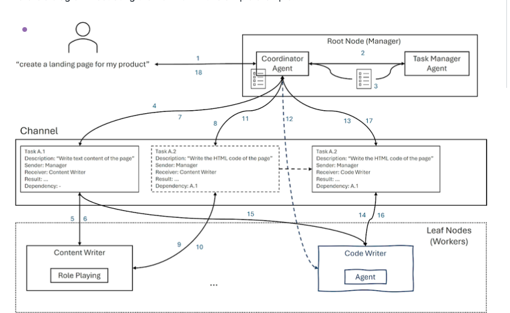
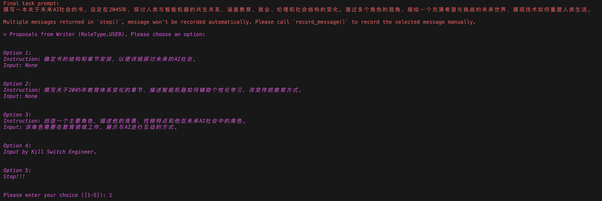
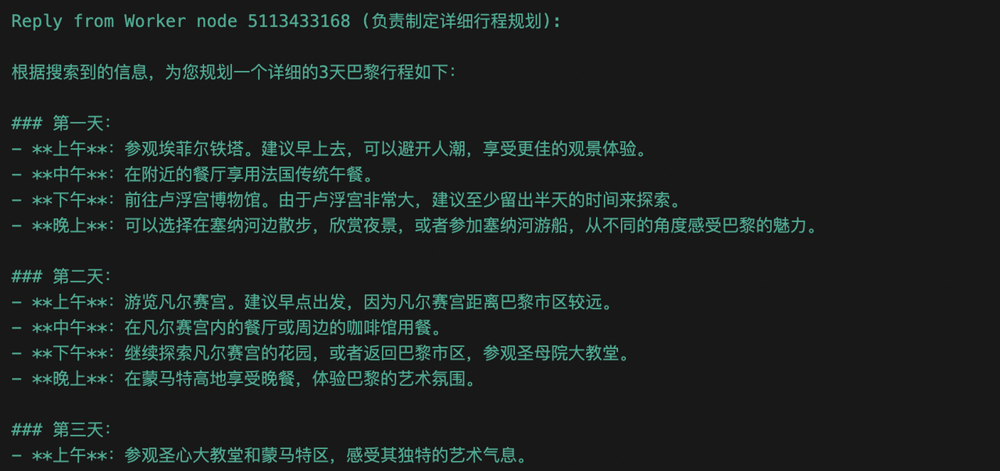
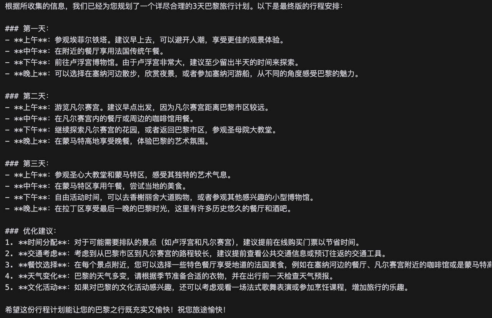

# 3. 第三章: CAMEL框架简介及实践&#x20;

在本章中，我们将简要介绍多智能系统和 CAMEL框架。

## 3.1   CAMEL框架简介&#x20;

### 3.1.1 Multiple Agent基本概念

* **定义**：多智能体（Multiple Agent）由多个相互作用的智能体组成，每个智能体都有自己的目标和策略。这些智能体可以相互通信、协作或竞争，以实现更复杂的行为和决策。

* **应用**：多智能体系统广泛应用于复杂的任务中，如交通管理、分布式机器人系统、经济市场模拟、多玩家游戏等。

* **特点**：

  * **协作**：智能体之间可以协作，共同解决问题。

  * **竞争**：智能体之间也可以存在竞争关系，如在拍卖或游戏场景中。

  * **自主性**：每个智能体都有自己的决策过程，保持一定程度的自主性。

  * **复杂性**：多智能体系统的设计与分析比单一智能体系统更复杂，因为需要考虑智能体之间的交互和协调。

  * **鲁棒性**：多智能体系统通常具有更好的鲁棒性，因为系统的稳定性和效能不完全依赖于单一决策者。&#x20;

### 3.1.2 什么是CAMEL?

CAMEL (Communicative Agents for "Mind" Exploration of Large Language Models) 是一个开源的多智能体框架，专注于构建基于大语言模型的智能体交互系统。该框架通过角色扮演和结构化对话机制，实现智能体之间的有效协作。

在CAMEL框架中，ChatAgent 是最基础的智能体单元，负责处理对话逻辑和任务执行。而`RolePlaying` 和`Workforce` 则是多智能体系统，用于协调多个智能体的协作。

详见我们的开源仓库和项目主页&#x20;

* 论文：<https://ghli.org/camel.pdf>

* 项目主页：<https://www.camel-ai.org/>&#x20;

### 3.1.3  ChatAgent 简介

ChatAgent 是 CAMEL 框架的基础构建块，其设计目标是回答以下问题：“如何设计一个自主的交互式智能体，使其能够在最少人工监督的情况下，引导对话完成任务？”

在当前实现中，我们的智能体具备以下关键特性：&#x20;

* **角色 (Role)**：结合目标和内容规范，设定智能体的初始状态，引导智能体在连续交互过程中采取行动。

* **大语言模型 (LLMs)**：每个智能体都使用大语言模型来增强认知能力。大语言模型使智能体能够理解和生成自然语言，从而解释指令、生成响应并参与复杂对话。

* **记忆 (Memory)**：包括上下文记忆和外部记忆，使智能体能够以更扎实的方式进行推理和学习。

* **工具 (Tools)**：智能体可以使用的一组功能，用于与外部世界交互，本质上是为智能体提供具身化能力。

* **通信 (Communication)**：我们的框架允许智能体之间进行灵活且可扩展的通信，这是解决关键研究问题的基础。

* **推理 (Reasoning)**：我们为智能体配备了不同的规划和奖励（评论员）学习能力，使其能够以更有指导性的方式优化任务完成。

### 3.1.4  Role Playing机制

RolePlaying是CAMEL框架的独特合作式智能体框架。该框架通过预定义的提示词为不同的智能体创建唯一的初始设置，帮助智能体克服诸如角色翻转、助手重复指令、模糊回复、消息无限循环以及对话终止条件等多个挑战。

#### 3.1.4.1 基本概念

1.1 **角色定义**

* **Assistant角色**: 负责执行具体任务并提供解决方案的智能体

* **User角色**: 负责提供指令和任务需求的智能体

* **特定领域角色**: 如程序员、交易员等专业角色

1.2 **交互规则**

**1.3 关键机制**

* **角色固定**: 防止角色翻转，维持对话的稳定性

* **格式规范**: 要求回复具有固定的开始和结束格式

* **任务分解**: 自动将复杂任务分解为可执行的子任务

* **循环对话**: 通过轮流发言推进任务进展

**2.工作流程**

2.1 **初始化阶段&#x20;**

* 设定角色身份

* 加载系统提示词

* 明确任务目标

2.2 **执行阶段&#x20;**

* User提供具体指令

* Assistant执行并给出解决方案

* 循环往复直至完成任务

**应用场景示例**

Web应用开发

创业计划设定

个性化教学辅导

金融分析

医疗健康

#### 3.1.4.2 经典案例: 股票交易机器人详解

以下是一个对于Role-Playing的经典应用， 股票交易实例。在本案例中，我们通过角色扮演的方式来构建一个交易机器人。初始阶段，人类用户提出一个概念性任务，由一个专用Agent精确化为详细的任务描述。参与完成任务的有两个agent：一个扮演股票交易员，另一个扮演Python程序员。

**工作流程：**

以上代码中，`task_prompt` 是用户输入的任务提示词，即“Develop a trading bot for the stock market”。创建 `role_play_session` 时，将 `task_prompt` 传递给了 `RolePlaying`。`RolePlaying`的作用是根据任务提示词，将任务分解为具体的任务小点，并与相应的AI角色进行交互。

具体来说，在这个例子中，助手角色是“Python Programmer”，用户角色是“Stock Trader”。通过这种方式，框架中的Agent可以将用户输入的较为抽象的任务转化为具体的任务小点，以便更好地进行交互和实现具体的功能。

这种设计可以帮助Agent更有针对性地理解任务，并根据具体的任务小点进行回答和执行操作。通过角色扮演会话，即使用户不懂技术，也能实现复杂的想法。Agent们们会通过对话和合作来帮助用户将想法转化为现实。这种方法不仅使得技术实现变得更加容易，也为人工智能的应用开辟了新的可能性，让创造变得更加简单和有趣。

&#x20;RolePlaying工作流程图

**&#x20;角色设定：** &#x20;

* Python程序员(Assistant)：负责实现交易逻辑和代码

* 股票交易员(User)：提供交易策略和业务需求

**任务具体化**

任务具体化Agent将初步想法转换成详细任务描述：“开发一个基于机器学习的股票交易机器人，能够自动分析市场趋势、执行买卖操作，并实时调整策略以优化投资组合。”

**具体过程**

* **步骤1: 任务提出**

人类用户提出希望开发一个交易机器人。

* **步骤2: 定义AI角色**

设定合适的AI角色（股票交易员和Python程序员）来实现用户的想法。

* **步骤3: 任务具像化**

任务具体化Agent为AI角色提供明确的任务描述，以便更好地理解和执行。比如：将“开发一个用于股票市场的交易机器人。”进一步具像为：“开发一个基于机器学习的股票交易机器人，能够自动分析市场趋势、执行买卖操作，并实时调整策略以优化投资组合。”

* **步骤4: 任务拆分**

总体任务会由AI用户（股票交易员）来进一步拆分为各个子任务，确保AI助手（Python程序员）能够理解并执行子任务。例如：

* **步骤5: 对话和合作**

程序员AI和交易员AI开始对话和合作：

* **步骤6: 完成任务**

通过这种对话和合作的方式，两个AI角色能够一步步地共同完成任务，最终创建出一个用于股票市场的交易机器人。

示例视频(model使用qwen2.5:7b)：

### 3.1.5 Workforce 简介

Workforce是CAMEL框架中的一个多智能体协同工作系统。它以一种简洁的方式让多个智能体协作完成任务，类似于一个高效的团队合作系统。

更详细的使用信息，请参考我们的[对应内容](https://fmhw1n4zpn.feishu.cn/docx/AF4XdOZpIo6TOaxzDK8cxInNnCe#share-T4t0dbCrqoKV1qx8EbdcIAtpnwb)

**架构设计**

Workforce采用层级架构设计。一个workforce可以包含多个工作节点(worker nodes)，每个工作节点可以包含一个或多个智能体作为工作者。工作节点由workforce内部的协调智能体(coordinator agent)管理，协调智能体根据工作节点的描述及其工具集来分配任务。

除了协调智能体外，workforce内部还有一个任务规划智能体(task planner agent)。任务规划智能体负责任务的分解和组合，使workforce能够逐步解决任务。

**通信机制**

Workforce内部的通信基于任务通道(task channel)。Workforce初始化时会创建一个所有节点共享的通道。任务会被发布到这个通道中，每个工作节点会监听通道，接受分配给它的任务并解决。

当任务完成后，工作节点会将结果发布回通道，结果会作为其他任务的"依赖项"保留在通道中，供所有工作节点共享。

通过这种机制，workforce能够以协作和高效的方式解决任务。

**故障处理**

Workforce具有故障处理机制。当任务失败时，协调智能体会采取行动修复。这些行动可以是：

* 将任务分解为更小的任务并重新分配

* 创建一个能够完成该任务的新工作者

目前，协调智能体根据任务被分解的次数来做决策：

* 如果任务已经被分解超过特定次数，协调智能体会创建新的工作者

* 如果没有超过，协调智能体会采取任务分解的行动

有些任务可能智能体根本无法解决。为了防止workforce陷入无限的智能体创建循环，如果一个任务失败次数超过特定次数（默认为3次），workforce将会停止。

**Workforce 实例讲解**

这一部分将通过以下多智能体工作流（multi agent workforce）展示如何利用多个智能体（agents）和角色分工完成复杂任务

**总体概述**

该系统由多个智能体（agents）组成，每个智能体在一个组织结构中扮演特定角色，协同完成复杂任务。流程图展示了如何通过以下智能体协作完成一个请求（如“创建一个产品的登录页面”）：

* **Root Node (Manager)**：作为系统的管理者，负责接收任务并协调任务的分解和分配。

* **Coordinator Agent (协调智能体)** 和 **Task Manager Agent (任务管理智能体)**：管理任务分解、依赖关系、分发任务，以及监控任务完成情况。

* **Leaf Nodes (Workers)**：执行任务的实际智能体，分别承担不同的角色（如“内容撰写者”和“代码撰写者”）。

**流程讲解**

**(a) 用户需求的接收**

用户发出任务请求（例如“创建一个登录页面”，图中 1）。

**Coordinator Agent** 接收需求，作为入口点。

**(b) 任务分解与定义**

**Coordinator Agent** 通过任务分解策略，将请求拆分为多个子任务（如任务 A.1 和 A.2），并定义：

这些任务被送到 **Task Manager Agent** 进行分发（图中 2 和 3）。

**(c) 任务的分配**

**Task Manager Agent** 将任务分发到 **Channel**（图中 4），这是一个任务管理中枢。

任务按角色需求分配到 **Leaf Nodes (Workers)**，包括：

**(d) Leaf Nodes 执行任务**

**内容撰写者 (Content Writer)**：

**代码撰写者 (Code Writer)**：

**(e) 结果整合与返回**

**Coordinator Agent** 汇总所有任务结果（如 A.1 和 A.2 的结果）。

将完整的任务结果返回给用户（图中 18）。

**多智能体工作流系统特性**

**任务分解**：将复杂任务分解为简单子任务。

**角色分工**：根据任务类型分配给不同智能体。

**依赖管理**：智能管理任务之间的依赖关系。

**高效协作**：智能体协同工作，快速完成目标

由于多智能体工作流的系统特性，该流程可适用于多个角色分工协作饿的场景，如软件开发、内容生产和项目管理等。

## 3.2 创建你的第一个Agent Society

### 3.2.1  准备工作

在 CAMEL 中主要是多智能体的实现主要是通过角色扮演`Role-Playing`的方式，让智能体扮演特定的角色，并拥有相应角色的专业知识背景。这些智能体通过对话和合作来共同完成任务。在多智能体系统接收到人类用户的初步想法和角色分配后，任务指定智能体将提供详细的描述，使想法更加具体化。然后，AI助理和AI用户将通过多轮对话合作完成指定的任务，直到AI用户确定任务完成为止。一方面，AI用户负责向AI助理提供指令，并引导对话朝着任务完成的方向进行；另一方面，AI助理则需要遵循AI用户的指示，做出回答并提供具体的解决方案。

面向任务的 `RolyPlaying()` 类。我们以指令跟随的方式设计这个类。其本质是，要解决复杂任务，可以让两个交流智能体一步一步地协作，共同寻找解决方案。主要概念包括：

* **任务**：任务可以简单到一个想法，由初始提示启动。

* **AI 用户**：预期提供指令的智能体。

* **AI 助手**：预期提供满足指令的解决方案的智能体。

以下展示了 `RolePlaying` 对象的主要参数配置及其默认值和描述：

| 参数名称                    | 类型                | 默认值               | 描述                                                         |
| --------------------------- | ------------------- | -------------------- | ------------------------------------------------------------ |
| assistant\_role\_name       | str                 | 无                   | 助手智能体所扮演角色的名称(合理的名称设置有利于提高agent的能力)。 |
| user\_role\_name            | str                 | 无                   | 用户智能体所扮演角色的名称(合理的名称设置有利于提高agent的能力)。 |
| critic\_role\_name          | str, optional       | "critic"             | 评审者智能体所扮演角色的名称。如果名称为 "human"，则评审者将被设置为人类Agent，否则将创建一个 CriticAgent。 |
| task\_prompt                | str, optional       | ""                   | 要执行任务的提示。                                           |
| with\_task\_specify         | bool, optional      | True                 | 是否使用任务明确化Agent。                                    |
| with\_task\_planner         | bool, optional      | False                | 是否使用任务规划Agent。                                      |
| with\_critic\_in\_the\_loop | bool, optional      | False                | 是否在循环中包含一个评审者。                                 |
| critic\_criteria            | str, optional       | None                 | 评审者Agent的评审标准。如果没有指定，则设置为提高任务性能的标准。 |
| model\_type                 | ModelType, optional | None                 | 用于角色扮演的模型类型。如果指定，它将覆盖所有Agent中的模型。 |
| task\_type                  | TaskType, optional  | TaskType.AI\_SOCIETY | 要执行的任务类型。                                           |
| output\_language            | str, optional       | None                 | Agent输出的语言。                                            |

### 3.2.2 配置Role-Playing会话

下边用一个具体的例子一步步展示我们的`RolePlaying` 案例。

1. **设置参数**

首先我们先导入相关模块及设置相关参数：

* **组建我们的AI-Society**

在这里我们可以在日志里观察到CAMEL对每个智能体的system\_prompt的设定:

* **和你的AI-Society一起解决任务**

在开始我们的时间旅行前，我们来定义一个小的 helper 函数，我们在前文介绍过，RolePlaying机制是利用两个Agent之间的交互来完成任务，为了不让Agent陷入无限循环的输入输出，CAMEL在设计的时候就引入了终止机制，如果意外终止，这个函数可以为我们展现RolePlaying的终止原因：

OK！准备工作都已经完成了，是时候规划我们的路线了——为我们的AI-Society编写一个简单的循环来继续前进：

可以看到对于这样一个有趣的任务,我们的AI-Society首先会将我们的初始prompt给进一步明确化:"制定一个计划去过去并进行改变。">>>"设计一台利用量子纠缠和虫洞效应的时间机器，制定详细的时间旅行计划，包括安全返回机制，以确保能回到特定历史时刻并实施微小但关键的改变，从而影响未来。"然后再由AI\_User一步步指导AI\_Assistant完成整个任务。

**进阶学习**

引入 CrticAgent，*`with_critic_in_the_loop`&#x20;*&#x8BBE;置为`True`的时候将会在循环中引入CrticAgent，如果我们将"human"赋值&#x7ED9;*`critic_role_name`* ，我们人类将可以在与智能体之间交互中掌握主动权，去选择优化和调整，并且提升角色表现。

上述 根据 “*写一本关于AI社会的未来的书*” 的任务，将会在更详细的选择中引入人工与其交互。

输入数字可以选择你想要让AI\_Assistant去执行的选项，如果你选择第四个选项，则将由你亲自指导AI\_Assistant，该AI-Society会要求你输入内容来指导AI\_Assistant：

但是如果，将"human"以外的参数赋值&#x7ED9;*`critic_role_name`*，则将创建一个 CriticAgent，自动与其交互。

## 3.3 创建你的Workforce

### 3.3.1 简单实践

**1. 创建 Workforce 实例**

想要使用 Workforce，首先需要创建一个 Workforce 实例。下面是最简单的示例：

这段代码会生成一个名为 `一个简单的Workforce` 的实例，不过目前它还不包含任何工作节点。

> **提示：如何自定义 Workforce**
>
> 如果你只想快速上手，给 Workforce 传入一个描述就足够了；如果你需要更复杂的定制，则可以在初始化时配置工作节点列表、协调器Agent（Coordinator Agent）或任务规划Agent（Task Planner Agent）等高级参数。

***

**2. 定义worker**

接下来，我们需要给Workforce定义一些worker。我们希望在这个Workforce里有一个专业的旅游信息搜索助手、一个专业的旅行规划师、一个经验丰富的旅行爱好者。他们分别负责制定计划和评价计划，例如：

当然，你也可以按自己的喜好来定义你的Workforce。

**3. 添加工作节点**

定义好 Workforce 和worker后，你可以往里面添加工作节点（Worker Nodes）。以一个命名为 `search_agent` 的示例Agent（Agent）为例，代码如下：

如果需要一次性添加多个工作节点，可以使用方法链（Fluent Interface）来操作：

> **提示：描述很重要**
>
> 
>
> 虽然看似只是一个字符串，但**工作节点的描述在任务分配中至关重要**。协调器Agent会根据节点描述来分配具体的子任务，因此你最好为每个节点写一个精准且易读的描述。

&#x34;**. 启动 Workforce 并处理任务**

准备好工作节点后，就可以创建一个任务，并让 Workforce 来处理。下面是一个简单的任务示例：

接着，调用 `process_task()` 方法即可启动 Workforce 的任务处理流程：

此时，Workforce 会根据各工作节点的描述，为它们分配合适的子任务，最终返回处理结果。你可以通过以下方式查看任务处理的最终产出：

通过以上三个步骤——创建 Workforce、添加工作节点、启动并处理任务，你已经完成了一个最基本的 CAME&#x4C;**&#x20;Workforce** 使用示例。

### 3.3.2 利用Workforce组建hackathon评审团

在本小节中，我们将通过一个示例，展示如何使用 CAME&#x4C;**&#x20;Workforce** 协调多个智能体对黑客松项目进行多角度评审。通过为每个智能体赋予不同的角色与个性，我们可以模拟真实评审场景中“智囊团”之间的讨论和打分过程。

我们的创建过程主要分为以下几个阶段：

1. **创建不同个性的评审智能体（Judge Agents）**&#x6BCF;个智能体都拥有独立的“人设”和评价标准，能够从不同角度出发对项目进行打分和反馈。

2. **组建 Workforce**将这些个性化评审智能体（以及一个辅助搜索的研究者智能体）加入到一个 Workforce 中，方便统一管理和任务分配。

3) **创建 Task**将具体的项目描述和需要完成的目标封装到一个 Task 对象中，让 Workforce 来调度。

4) **处理 Task**通过调用 `Workforce.process_task()` 来让评审团协同完成项目评价，并最终生成结果。

下面，我们会一步步地拆解各核心代码模块，帮助你掌握多智能体协作的基本实现流程。

**1. 创建评审智能体**

* **多人格设定**：我们通过 `persona` 字符串刻画智能体的性格、使用的措辞和关注点，比如 “投资人” 注重商业潜力，“工程师” 注重技术稳健性等。 &#x20;

* **示例反馈**：`example_feedback` 中的示例给智能体一个参考，指导它的表达风格，以确保它在对项目进行评论时能符合角色定位。 &#x20;

* **评审标准**：`criteria` 为智能体提供了打分的准则，如从 1-4 分衡量项目的商业可行性、技术实现、创新程度等。

通过这个函数，我们可以快速生成多个“个性化的评审智能体”。然后我们可以定义一个虚拟的Hackathon项目描述，稍后我们会将它发给评委来打分：

**2. 创建辅助智能体**

然后，我们将创建 5 个独特的agent，它们稍后将一起协作。在这 5 个agent中，其中四个是评委，我们还创建了一个“助手”智能体（在示例中称为 `Researcher`），用于在线搜索相关资料并为评审提供更多信息参考。

另一方面，其他四名agent是具有不同角色设定和标准的评委。他们将根据描述以及帮助者收集的信息为项目打分。

* **工具集（Toolkit）**：这里示例给智能体添加了搜索能力，让它可以使用 Google 或 DuckDuckGo 等搜索引擎来获取最新资料。 &#x20;

* **系统消息**：通过“研究者”这一系统消息，将智能体定位为对 AI 和开源技术进行调研的角色。

这样一来，我们就拥有了一个既能执行网络搜索，也能将搜索到的信息反馈给评审智能体的辅助角色。

**3. 组建 Workforce**

* **Workforce 实例**：通过给 `Workforce` 传入一个描述（如“Hackathon Judges”）与一系列可选参数，我们就能快速搭建一个多智能体“工作台”。 &#x20;

* **添加智能体**：使用 `add_single_agent_worker()` 方法，将评审和研究者智能体逐个添加到同一个 Workforce 中。这里的字符串描述（如 “Visionary Veronica (Judge) ...”）非常重要，因为它会帮助内部的协调智能体区分并调配不同角色。

在这一步，我们将所有智能体统一到一个“协作环境”中，让它们可以一起完成后续的任务。

**4. 创建并分配任务（Task）**

* **Task 内容**：要交给 Workforce 处理的具体工作需求，例如“请评审这个项目，给出评分和总结意见”。 &#x20;

* **附加信息**：`additional_info` 可以储存项目背景描述等重要材料，Workforce 会在任务的拆解和传递过程中为各智能体保持这部分信息不变。 &#x20;

* **唯一标识**：`id` 用于标记任务编号，方便后续跟踪任务结果。

**5. 处理任务并获取结果**

最后，通过下面这行指令，Workforce 就会把任务分发给各个智能体进行协作，完成后可从 `task.result` 中获取最终的整合结果。

通过以上步骤，我们成功地搭建了一个“黑客松评审团”多智能体系统： &#x20;

1. **多个性格鲜明的评审**——投资人、工程师、AI 创业者、开源社区贡献者； &#x20;

2. **辅助性搜索者**——为评审提供最新的项目信息； &#x20;

3) **Workforce 协同**——统一调度、分配任务，并整合多方意见得到最终结果。

至此，你已经掌握了 CAMEL Workforce 的核心使用模式。赶快动手实践，在你的项目中让多个智能体“群策群力”，协同完成高效且富有创造性的工作吧！

## 3.4 第三章课程作业

**基础任务**

给上面的简单实践新增一个agent，重新编排功能。

**进阶任务**

用Workforce实现一个你自己的多智能体系统。