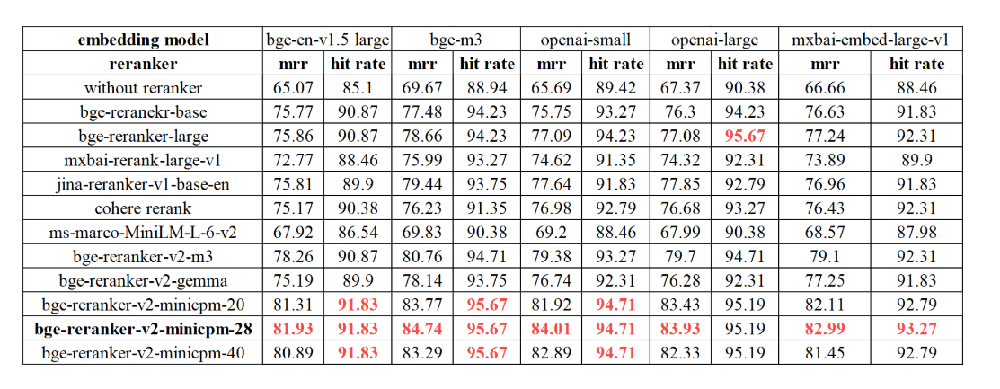
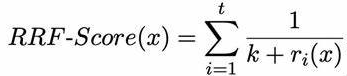

# 4. 第四章: CAMEL框架下的RAG应用&#x20;

本章将深入探讨在CAMEL框架下如何构建和应用RAG（Retrieval-Augmented Generation）技术。我们将介绍关键模块，包括存储、加载器、嵌入、检索器，以及如何搭建知识库和评估RAG应用。

## 4.1 RAG的组件介绍

### 4.1.1 RAG简介

要理解生成式AI的最新进展，可以想象一个法庭场景。

法官基于对法律的一般理解听取并裁定案件。有时，一些案件——比如医疗事故诉讼或劳动争议——需要特殊的专业知识，于是法官会派书记员去法律图书馆查找先例和具体的法律案例以供引用。

像优秀的法官一样，大型语言模型（LLM）能够回答各种人类问题。但如果需要提供权威答案并引用具体来源，模型需要一个助手来进行研究。

AI的“法庭书记员”就是一种被称为检索增强生成（RAG，Retrieval-Augmented Generation）的技术。

**"RAG"这个名字的由来**

2020年首次提出这一术语的论文主作者帕特里克·刘易斯（Patrick Lewis）对现在这一流行技术的不起眼缩写表示歉意。他认为这一方法已代表生成式AI的未来，相关研究已覆盖数百篇论文和众多商业服务。

"如果早知道我们的研究会被如此广泛应用，我们一定会更认真地起名字"刘易斯在一次新加坡区域数据库开发者会议的采访中说道。

"我们原本计划为这个技术取一个更好听的名字，但最终写论文时，大家都没有提出更好的想法。"刘易斯目前领导AI初创公司Cohere的一支RAG团队。

**什么是检索增强生成（RAG）？**

检索增强生成是一种通过从外部资源获取事实来提高生成式AI模型准确性和可靠性的技术。

换句话说，它弥补了LLM工作中的一个空白。从底层来看，LLM是神经网络，其能力通常通过参数数量来衡量。LLM的参数本质上代表了人类使用单词构造句子的通用模式。

这种深度理解（有时称为参数化知识）使得LLM能够以极快的速度对一般性提示做出回应。然而，当用户需要深入探讨某一当前或特定话题时，LLM可能力不从心。

**内部与外部资源的结合**

刘易斯及其同事开发了RAG技术，将生成式AI服务与外部资源相连，特别是那些富含最新技术细节的资源。

他们与前Facebook AI研究团队（现为Meta AI）、伦敦大学学院（UCL）和纽约大学的共同作者在论文中将RAG称为“一种通用的微调方法”，因为几乎任何LLM都可以使用它连接几乎任何外部资源。

**建立用户信任**

检索增强生成为模型提供了可引用的来源，就像研究论文中的脚注，用户可以查证这些信息。这有助于建立信任。

此外，这项技术还可以帮助模型澄清用户查询中的歧义，并减少模型“猜错”的可能性——这种现象有时被称为“幻觉”（hallucination）。

RAG的另一个显著优势在于其实现相对简单。刘易斯和论文的三位共同作者在博客中提到，开发者可以用少至五行代码来实现这一过程。这使得RAG比用额外数据集重新训练模型更快捷、更经济。此外，它还支持用户即时更换新的信息源。

**RAG的应用**

通过检索增强生成，用户可以与数据存储库进行交互，从而开辟新的应用体验。这意味着RAG的潜在应用可以是可用数据集数量的多倍。

例如，一个结合了医学索引的生成式AI模型可以成为医生或护士的得力助手。金融分析师可以借助与市场数据相连的助手提高工作效率。

事实上，几乎任何企业都可以将其技术手册、政策手册、视频或日志转化为知识库，以提升LLM的能力。这些资源可以支持诸如客户服务、员工培训和开发者生产力等用例。

正因如此，包括AWS、IBM、Glean、Google、Microsoft、NVIDIA、Oracle和Pinecone在内的公司正在广泛采用RAG技术。

在CAMEL框架中，RAG被用于构建智能问答系统、对话Agent等应用，充分利用了框架的模块化设计和强大的处理能力。

### 4.1.2 Loaders

**基本概念**

Loaders是CAMEL框架中用于数据加载和预处理的模块。简而言之就是在 **CAMEL 框架** 中，引入了两个 IO 模块：**Base IO** 和 **Unstructured IO**，用于处理多种文件类型以及非结构化数据的处理。此外，还新增了四种数据读取器：**Apify Reader**、**Chunkr Reader**、**Firecrawl Reader** 和 **Jina\_url Reader**，这些读取器能够从外部获取数据，从而提升数据集成与分析的能力。

**Base IO**

**Base IO 模块**专注于与文件相关的基础输入/输出操作，提供了表示、读取和处理多种文件格式的功能。

在实践环节中，该模块旨在读取各种格式的文件，提取其内容，并将其表示为 **File 对象**，每个对象都针对特定的文件类型进行了专门设计以便高效处理。

***

**Unstructured IO**

**Unstructured IO 模块&#x20;**&#x4E13;注于非结构化数据的处理、解析和加工。它提供了以下工具和功能：解析文件或URL、清洗数据、提取特定信息、为不同平台准备数据元素以及对数据进行分块处理。该模块的核心在于其高级ETL（提取、转换、加载）能力，可以对非结构化数据进行操作，使其适用于诸如 **检索增强生成（RAG）**&#x7B49;多种应用场景。

要开始使用 **Unstructured IO 模块**，首先需要导入模块并初始化其实例。初始化后，可以利用该模块执行多种功能，例如解析、清洗、提取数据，并与云服务（如 AWS S3 和 Azure）集成。以下是一个基本指南，帮助您快速上手：

**使用 `parse_file_or_url` 方法可以从文件或 URL 中加载并解析非结构化数据。以下是如何利用此方法的指导示例：**

**利用 `clean_text_data` 进行多文本数据清洗**

**目前支持的清理操作**:

* replace\_unicode\_quotes: 将Unicode引号替换为标准引号

* clean\_dashes: 清理破折号，统一格式

* clean\_non\_ascii\_chars: 清理非ASCII字符

* clean\_extra\_whitespace: 清理多余空白

* clean\_bullets: 清理项目符号

* clean\_ordered\_bullets: 清理有序列表符号

* clean\_postfix: 清理后缀

* clean\_prefix: 清理前缀

* clean\_trailing\_punctuation: 清理尾部标点

* group\_broken\_paragraphs: 合并断开的段落

* remove\_punctuation: 移除标点符号

* bytes\_string\_to\_string: 将字节字符串转换为普通字符串

* translate\_text: 翻译文本

**利用 `extract_data_from_text` 进行文本提取操作，下面是一个抽取文本中邮件地址的范例。**

`extract_data_from_text`同样有多种使用方法，更具体的使用方法可以看源码的相关注释。

**使用 `chunk_elements` 方法对内容进行分块处理**

使用 `stage_elements` 方法进行元素分阶段处理

以下是使用 **Unstructured IO 模块**的基础指南。想要了解更多高级用法，请参考具体方法的文档以及相关资源。 [Unstructured IO Documentation](https://unstructured-io.github.io/unstructured/).

***

**Apify Reader**

Apify Reader 提供了一个 Python 接口，用于与 Apify 平台交互，以实现 Web 工作流的自动化。你可以在这里获取所需要的[APIKEY](https://console.apify.com/settings/integrations)。

初始化客户端，设置所需参数。

检索结果数据库 ID 并使用 get\_dataset\_items 方法访问它。

这个函数通常用于从Apify平台获取爬取或处理后的数据，以便在后续程序中使用这些数据。

***

**Firecrawl Reader**

你可以从[此处](https://www.firecrawl.dev/)获得你的FirecrawlAPI

Firecrawl Reader 提供了一个 Python 接口来与 Firecrawl API 交互，允许用户将网站转换为大型语言模型可读的 markdown 格式。

初始化客户端并设置要从中检索信息的 URL。当状态为 “completed” 时，信息检索已完成并可供阅读。

直接从返回的结果中检索信息。

***

**Jina\_url Reader**

JinaURL Reader 是 Jina AI 的 URL 读取服务的 Python 客户端，经过优化，可从 URL 提供更清晰、对 LLM 可读的内容。该reader提供一定额度的免费调用次数。无需注册API也可使用。

### 4.1.3 Embddings

**基本概念**

为不同类型的数据（文本、图像、视频）创建嵌入的过程，是将这些输入转化为机器能够理解和高效处理的数值形式。每种嵌入都专注于捕获其对应数据类型的核心特征。以下是对主要数据类型嵌入的简要说明：

**文本嵌入**

文本嵌入（Text Embeddings）将文本数据转换为数值向量，每个向量代表文本的语义含义，使我们能够基于意义而非文本的原始形式处理和比较文本。通过这种方式，机器可以捕获语言中的上下文和细微差别。

**嵌入技术**

1. **OpenAI Embedding**:

   * 使用大规模语言模型（LLM）生成嵌入，能够理解语言中的复杂语境和语义细节。

   * 例如，`text-embedding-3-small` 模型生成 1536 维嵌入向量。

2. **SentenceTransformerEncoder**:

   * 专为生成句子级别的嵌入设计，通常基于 BERT 等模型。

   * 强调对句子语义的捕获，适合文本比较或语义搜索任务。

**示例：语义比较**

**句子 1**: “A young boy is playing soccer in a park.”
**句子 2**: “A child is kicking a football on a playground.”

尽管两句话用词不同，但它们表达的语义非常相似。

&#x20;文本嵌入模型会将这些句子转换为高维向量，例如 1536 维。如果我们比较这两个向量，计算出的相似度值（如余弦相似度）会较高，表明它们具有相近的语义。

***

**语义处理的意义**

1. **语义相似性**: 嵌入捕获了“孩子在户外踢球”的共同概念，而不是简单地依赖词语的字面匹配。

2. **应用场景**:&#x20;

   * **信息检索**: 根据语义找到相关内容，而非精确关键词匹配。

   * **问答系统**: 理解用户提问的核心含义并生成精准答案。

   * **文本聚类与分类**: 根据嵌入向量的分布，聚类相似语义的文本。

通过文本嵌入，机器不仅可以理解语言表面的表达，还能更深层次地处理和分析其语义关联，使语义搜索、文本匹配等任务更为智能和高效。

***

**图像嵌入**

图像嵌入是一种将图片转化为数值向量的技术，这些向量能够表示图像中的关键特征，比如形状、颜色、纹理和空间层次。通过这种方式，机器可以理解图像的核心内容，并以此完成分类、检索和相似性比较等任务。

举个例子，当你将一张猫的图片输入模型时，模型会分析图片中的视觉特征，比如猫耳朵的形状、毛发的纹理等。最后，这些特征会被压缩为一个高维向量，这个向量就浓缩了图片的核心信息，既能让模型识别这是猫的图片，也能与其他图像进行对比，区分它与狗或其他动物的差异。

图像嵌入有很多应用场景。比如，在图像分类中，模型可以根据嵌入向量给图片打标签，识别出它是一只猫还是一辆车。在相似性比较中，嵌入向量可以用来衡量两张图片的相似程度，常见于推荐系统中，比如推荐风格相似的照片。还有图像检索，用户上传一张图片后，系统通过嵌入向量找到数据库中最相似的图片，像以图搜图这样的功能。

实现图像嵌入通常依赖卷积神经网络（CNN），比如 ResNet 或 EfficientNet 这样的模型。这些模型经过大量数据的训练，能够提取图像的高层次特征。此外，随着技术的进步，像 Vision Transformer 这样的新模型也被用于更复杂的图像理解任务。

通过图像嵌入技术，机器能够从简单的像素点处理，进化到真正理解图像内容，这也是现代计算机视觉任务的核心方法之一。

***

**动手实践**

以下是如何使用不同嵌入方法的示例代码，帮助你快速生成文本和图像的嵌入向量。

1. OpenAIEmbedding

用于生成文本嵌入，基于 OpenAI 的模型(需要OPENAI\_API\_KEY)。

* `MistralEmbedding`

基于 Mistral 模型的嵌入方法(需要MISTRAL\_API\_KEY)。

* SentenceTransformerEncoder

基于 Sentence Transformer 的文本嵌入方法，适用于高效语义表示(使用本地embedding模型，如果没有会自动下载)。

* VisionLanguageEmbedding

VisionLanguageEmbedding 是一个基于多模态模型（如 CLIP）的嵌入生成类，能够同时处理图像和文本输入，生成对应的嵌入向量。，默认使用本地的openai/clip-vit-base-patch32模型（如果没有会自动下载）。

### 4.1.4 Storages

**基本概念**

Storage模块在CAMEL框架中负责数据的存储与管理，是一个功能全面的框架，提供了统一的接口和数据结构，支持键值存储和向量存储等多种类型的数据存储机制。通过抽象基类与具体实现的结合，Storage模块能够高效地处理数据的读取、写入和检索操作，为RAG应用的实现提供了坚实的基础。

***

**键值存储**

**`BaseKeyValueStorage`**

**目的**:
&#x20;作为创建各种键值存储系统的基础抽象类。

**功能**:

* 标准化数据记录的保存、加载和清除操作。

* 主要通过 Python 字典进行接口交互。

**应用场景**:

* JSON 文件存储

* NoSQL 数据库（如 MongoDB 和 Redis）

* Python 内存中的字典存储

***

**`InMemoryKeyValueStorage`**

**描述**:
&#x20;基于 `BaseKeyValueStorage` 的具体实现，使用内存中的列表存储数据。

**特点**:

* 适用于临时存储，数据为易失性，程序终止后即丢失。

**功能**:

* 实现了在内存中保存、加载和清除记录的方法。

* 非常适合开发和测试场景，无需持久化存储需求。

**向量存储**

向量存储（Vector Store）用于存储高维度的向量数据，如文本或图像的嵌入表示。它支持高效的相似度计算和最近邻搜索，是RAG应用中检索相关信息的核心组件。向量存储的特点包括：

* **高性能**：支持大规模数据的快速检索

* **可扩展性**：适应不同规模的数据量

* **灵活性**：支持多种相似度度量方式

**`BaseVectorStorage`**

**目的**:
设计为扩展特定向量存储实现的抽象基类。

**特点**:

* 支持多种操作，如添加、删除向量，查询相似向量，以及维护向量数据库的状态。

* 提供灵活性，可指定向量维度、集合名称、距离度量等参数。

**功能**:

* 为构建多样化的向量存储解决方案提供基础架构。

**`MilvusStorage`**

**描述**:
基于 `BaseVectorStorage` 的具体实现，专为与 Milvus 交互而设计的存储方案。

**特点**:

* 针对 Milvus（一个云原生向量搜索引擎）进行优化，支持高效的大规模向量检索和管理操作。

Reference: [Milvus](https://milvus.io/docs/overview.md/)

**`QdrantStorage`**

**描述**:
基于 `BaseVectorStorage` 的具体实现，专为与 Qdrant 交互而设计。

**特点**:

* 针对 Qdrant 向量搜索引擎进行优化。

* 提供高效的向量存储、管理和查询功能，支持大规模近似最近邻（ANN）搜索。

**功能**:

* 实现向量的添加、删除、相似度查询等核心操作。

* 支持自定义向量维度、集合名称、距离度量（如欧几里得距离、余弦相似度等）。

* 与 Qdrant 的 API 无缝集成，适用于高性能向量搜索场景。

**适用场景**:

* 推荐系统、自然语言处理（NLP）嵌入查询、多媒体检索（图像、音频、视频）等需要高效向量搜索的应用场景。

Reference: [Qdrant](https://qdrant.tech/)

***

&#x20;**图存储**

**`BaseGraphStorage`**

**目的**:
&#x20;设计为扩展特定图存储实现的抽象基类。

**特点**:

* 支持多种操作，包括：&#x20;

  * `get_client`: 获取图存储的客户端连接。

  * `get_schema`: 获取当前的图存储模式信息。

  * `get_structured_schema`: 获取结构化的模式表示。

  * `refresh_schema`: 刷新图存储的模式。

  * `add_triplet`: 添加三元组（节点及边的表示）。

  * `delete_triplet`: 删除三元组。

  * `query`: 执行图查询操作。

**功能**:

* 为各种图存储解决方案提供基础架构，便于构建定制化图存储实现。

**`NebulaGraph`**

**描述**:
&#x20;基于 `BaseGraphStorage` 的具体实现，专为与 NebulaGraph 交互而设计。

**特点**:

* 面向 NebulaGraph 的优化实现，支持其分布式、高扩展性及高速图数据操作的特性。

* 提供了对 NebulaGraph API 的无缝集成，用于高效处理图形数据的存储与查询。

**功能**:

* 实现了 `BaseGraphStorage` 的所有核心方法，支持快速执行分布式图数据的增删查改操作。

* 支持复杂图查询语句，用于大规模图数据的结构化分析和推理。

**适用场景**:

* 推荐系统、知识图谱、社交网络分析、路径优化及大规模图数据挖掘等需要高性能图存储和查询的场景。

Reference: [NebulaGraph](https://www.nebula-graph.io/)

**`Neo4jGraph`**

**描述**:
&#x20;基于 `BaseGraphStorage` 的具体实现，专为与 Neo4j 交互而设计，Neo4j 是业内最受信赖的图数据库之一。

**特点**:

* 面向 Neo4j 的优化实现，充分利用其强大的关系建模能力和高效的图查询功能。

* 支持复杂的图形操作和查询语句，提供强大的可视化和分析功能。

**功能**:

* 实现 `BaseGraphStorage` 的所有核心方法，包括：&#x20;

  * `get_client`: 获取连接到 Neo4j 的客户端实例。

  * `get_schema` 和 `refresh_schema`: 管理 Neo4j 图数据库的模式。

  * `add_triplet` 和 `delete_triplet`: 实现节点和关系的添加与删除。

  * `query`: 执行基于 Cypher 的图查询操作。

**适用场景**:

* 知识图谱、社交网络分析、推荐系统、诈骗检测、供应链管理及其他需要强关系建模的应用场景。

**优势**:

* 凭借 Neo4j 的成熟生态系统和广泛支持，`Neo4jGraph` 提供了一种稳定、高性能的解决方案，用于高效存储和处理复杂的图数据。

Reference: [Neo4jGraph](https://neo4j.com/)

***

### 4.1.5 Retrievers

**基本概念**

Retrievers 模块可以理解为一个搜索引擎，专门用于在大量文本中高效查找特定信息。它的功能就像一位熟练的图书管理员，帮助你快速找到需要的主题或关键词，无论是基于语义还是关键字。

Retrievers 模块支持两种主要的检索方式：向量检索和关键词检索。

向量检索器（Vector Retriever）基于向量表示技术，将文本、图像等数据转化为高维向量，通过嵌入模型生成数学表示并存储在向量存储系统中。当用户输入查询时，嵌入模型会将其转换为向量，在存储系统中寻找最接近的匹配向量。这种方式擅长处理语义搜索，能够理解自然语言的模糊关系，常应用于推荐系统、语义查询和跨模态搜索等场景。

关键词检索器（Keyword Retriever）则更加直接，通过对文档进行预处理（如分词、建立关键词索引），解析用户的查询关键词并匹配相应的文档内容。它依赖于关键词的精确匹配，适合快速查找特定术语或短语。

向量检索器偏向语义层面的理解，适合模糊查询和深度语义挖掘；而关键词检索器则注重精确性，适合快速直接的检索需求。两者结合使用，可以在不同场景中提供高效的解决方案，是知识管理、问答系统和检索增强生成（RAG）任务的重要工具。

***

**动手实践**

1. 向量检索

初始化 VectorRetriever

我们首先需要初始化 `VectorRetriever`。可以选择传入一个嵌入模型，如果不提供嵌入模型，默认会使用 `OpenAIEmbedding`。

嵌入并存储数据

在执行检索之前，需要准备数据并将其存储在向量存储中。`process` 方法会处理输入内容（可以是文件或 URL），将内容划分为小块，并将这些小块的嵌入存储在指定的向量存储中。

执行查询

将数据存储后，可以通过查询字符串来检索相关信息。`query` 方法会根据输入的查询语句，从存储中检索最匹配的信息。

**示例输出**：

* 自动化检索

**AutoRetriever** 方法进一步简化了检索流程，它自动处理嵌入、存储数据以及执行查询的任务，非常适合需要处理多个内容输入路径的场景。

**输出示例**：

**内容输入路径**：`contents` 可以是文件路径或 URL，支持多个输入。**查询字符串**：`query` 定义了检索目标，AutoRetriever 将根据该字符串搜索相关内容。**返回详细信息**：设置 `return_detailed_info=True` 可返回包括元数据在内的详细检索信息。

***

## 4.2 向量数据库介绍

&#x20;向量数据库（Vector Database）是一种专门用于存储和检索高维向量数据的数据库系统。 在现代人工智能和机器学习应用中，数据（如文本、图像、音频等）常被转换为高维向量，以捕捉其语义或特征。 向量数据库通过高效的相似度搜索算法，能够快速检索与查询向量最相似的向量集合。&#x20;

**主要功能：**

* **向量存储**： 支持存储大量高维向量数据，通常还关联其他元数据。&#x20;

* **相似度搜索**： 实现高效的近似最近邻（Approximate Nearest Neighbor，ANN）搜索，快速找到与查询向量最相似的向量。&#x20;

* **扩展性**： 设计用于处理大规模数据，支持水平扩展以满足增长的存储和计算需求。&#x20;

**常见应用：**

* **推荐系统**： 根据用户行为或偏好，检索相似产品或内容进行推荐。&#x20;

* **图像和视频搜索**： 通过内容检索相似的图像或视频。&#x20;

* **自然语言处理**： 在嵌入空间中查找语义相似的文本或词语。&#x20;

**实现技术：**

&#x20;向量数据库通常采用多种算法和数据结构来实现高效的相似度搜索，包括：&#x20;

* **HNSW（Hierarchical Navigable Small World）图**： 一种基于图的近似最近邻搜索算法，具有高查询效率和准确性。&#x20;

* **局部敏感哈希（Locality-Sensitive Hashing，LSH）**： 通过哈希函数将相似的向量映射到相同的桶中，实现快速检索。&#x20;

* **产品量化（Product Quantization，PQ）**： 将向量分解为子空间并量化，以减少存储和计算成本。&#x20;

**常见的向量数据库系统：**

* **Milvus**： 开源的向量数据库，支持亿级向量的高效存储和检索。&#x20;

* **Pinecone**： 提供向量数据库即服务，简化向量数据的管理和查询。&#x20;

* **Weaviate**： 开源的向量搜索引擎，支持多种数据模式和扩展。&#x20;

&#x20;在 CAMEL 框架中，`camel.storages.vectordb_storages` 包提供了与向量数据库交互的功能模块，包含以下子模块：&#x20;

* **`base` 模块**： 定义了向量存储的基础类和接口，包括 `BaseVectorStorage`、`VectorDBQuery`、`VectorDBQueryResult` 等。&#x20;

* **`milvus` 模块**： 提供了与 Milvus 数据库交互的具体实现，如 `MilvusStorage` 类。&#x20;

* **`qdrant` 模块**： 提供了与 Qdrant 数据库交互的实现，如 `QdrantStorage` 类。&#x20;

* **`weaviate` 模块**： 提供了与 Weaviate 数据库交互的实现，如 `WeaviateStorage` 类。&#x20;

&#x20;这些模块的设计使得 CAMEL 框架能够灵活地与不同的向量数据库集成，满足多样化的应用需求。&#x20;

## 4.3 搭建知识库&#x20;

### 4.3.1 Embedding模型选择&#x20;

在搭建知识库时，常用的embedding model可选择：

* **Embedding API**：如OpenAI，Cohere，Mistral等的API服务，适用于项目或工程中需要方便直接的使用嵌入且不介意数据隐私的情况

* **Open Embedding Model**：适用于对数据隐私有要求或需要自定义模型本地部署的情况

以上两者的区别可以等价的理解成大语言模型API和开源本地LLM的区别。

在[HuggingFace的排行榜](https://huggingface.co/spaces/mteb/leaderboard)上可以看到各种各样开源好用的embedding模型。在具体研究和工程问题的选择中，其实没有一个明确的好坏评价标准，适合自己的数据处理场景才是最好的。一个常见的方法是构造自己应用场景的专有评测集，然后分别尝试，量化的方式来评估分数最后选择。

todo：评测集构建的例子

### 4.3.2 数据预处理&#x20;

当我们拿到一篇或多篇文章，它们的格式可能是pdf，txt，doc甚至是ppt，我们往往会对其进行数据的预处理，来帮助后续流程中更好地让大语言模型和embedding模型来发挥作用。

机器学习中有一句深刻的名言：Garbage in，Garbage out。这不仅仅可以用于机器学习模型的训练，推理时过于混乱的原始信息也可能会极大程度地干扰模型的回复效果。因此，**数据预处理至关重要！**

数据处理的常用手段包含格式统一转换和数据清洗

数据读取 → 数据格式转换 → 数据清洗

Todo：流程图

* **数据读取**：从文件、数据库或API获取原始数据

* **数据格式转换**：将多样的数据统一转换成方便模型处理的格式（常用的为Markdown format）

* **数据清洗**：去除噪声、纠正错误、信息筛选等

TODO：一个pdf转成Markdown的代码示例

## 4.4 构建RAG应用&#x20;

### 4.4.1 Basic RAG&#x20;

RAG，全称为 Retrieval Argumented Generation，检索增强生成。

大语言模型通过预训练阶段在海量文本上的自监督训练中获得了大量的人类知识，但是依然存在一些诸如时效性和幻觉的问题。而RAG正是为了补充并增强大语言模型的能力，使其尽量和现实世界对齐的一种技术路线。

一个最为简单朴素的RAG的思想为：我有一些文本数据包含了有用的信息，我想让大语言模型利用这些文本信息来生成回复，而不是直接输出答案，因此在原先的交互流程中，我们要将外部文本信息组成上下文合并到prompt中，交付给LLM，以此来达成**增强生成（Argumented Generation）**&#x7684;目的，就是这么简单！

这个时候聪明的读者可能就会发现了，欸，那 **Retrieval** 去哪儿了呢。这是一个很好的问题，如果我现在有一篇800字的作文或者5000字的论文，那我直接将其简单处理后合并进prompt中就可以了，如下所示：

但是，当我有100篇，甚至成千上万篇文章，以上亿token为单位的上下文长度时，很显然，会分分钟超出现在大语言模型所支持的上下文长度。此时，一个显而易见的解决方案便是：我只将我最关心的那一部分内容合并到 prompt 中交付给大模型。那如何才能知道大量文本中，哪些才是我最关心或者说和我的问题最相关的片段部分呢。欸，这就是 Retrieval 阶段的功能和作用。

CAMEL中对于Retrieval这一过程的功能实现在 `camel.retrievers` 中，具体参考https://docs.camel-ai.org/key\_modules/retrievers.html

根据匹配标准和算法的不同，常用的retriever大致可以分成两类，基于向量的稠密检索和基于关键词的稀疏检索，分别对应`camel.retrievers` 中的 `VectorRetriever` 和 `BM25Retriever`

`VectorRetriever`，向量检索器利用数据的向量表示，将数据（如文本、图像或其他形式的信息）转换为高维空间中的数值向量。

以下是向量检索的工作流描述：

* **分块**：对于大型文档或其他形式的数据信息而言，需要按一定的划分规则将其分解为较小的块

* **嵌入**：对于每一个分块，使用嵌入模型将文本转换为高维的向量形式。

* **存储**：这些得到的向量会被存储在数据库中。

* **检索**：当提出问题或进行查询时，嵌入模型会将问题转换为向量，然后在此向量数据库中搜索相似度高的匹配向量（这里一般会用余弦相似度来计算两个向量之间的距离），从而返回最相关的信息片段。

`BM25Retriever`，关键词检索器从结果而言是一样的，只不过是从更加稀疏的关键词的维度来对文本进行召回。通过关键词匹配的算法获取相似度高的文本片段，尽可能筛选出最相关的信息片段。

最后将最相关的信息片段像之前演示的那样合并到 prompt 中，交给大语言模型生成检索增强后的回复

接下来我们通过一个demo来学习以下如何快速搭建一个Basic RAG的系统

**读取示例数据：**

这里我们首先下载一篇CAMEL的论文作为文本示例，该PDF就是我们的原始文件

**实例化Embedding Model：**

这里使用 `VectorRetriever`，使用本地模型作为嵌入模型。

**向量嵌入和存储数据：**

接下来，我们将原始的文档读取，分块并且通过embedding模型生成向量表示和索引并将其存储在专门用来存储向量数据的向量数据库，VectorDB中。CAMEL框架中的 `process` 函数其本质上就是将**文件读取、切块、嵌入并储存**这个固定的处理流程统一封装成了一个方法，使得开发者更加方便快速的搭建RAG应用。

这里如果出现`UserWarning: Failed to partition the file: local_data/camel_paper.pdf`

`warnings.warn(f"Failed to partition the file: {input_path}")`需要补充这个环境：

**Windows**

**Mac和Linux**

**执行检索，查看效果：**

完成向量数据库的构建和存储后，就可以根据问题来进行检索。这里调用 `query` 方法执行查询

这里的参数`top_k=1`是指定检索器返回最相关的文本内容，同时还有一个相似度阈值参数`similarity_threshold`，其值介于0到1之间，默认值是`0.75`，从而确保检索到的内容的相关程度，可以根据自己应用场景的实际需求更改 `top_k 或 similarity_threshold` 值。&#x20;

`"What is CAMEL"`得到回复为

返回的字典包括：

* `similarity score` 相似性分数

* `content path` 内容路径

* `metadata` 元数据

* `text` 文本

当然，如果在实际应用中我们往往只关心模型的文本回复部分，我们可以在字典中取出`text`的值。

我们再尝试一个与论文内容无关的提问`"Compared with dumpling and rice, which should I take for dinner?"`：

我们可以看到在相似度阈值为0.8的情况下，检索器没有找到论文中与提问有关内容，这和我们的预期是十分符合的。

到目前为止，整个RAG的流程还没结束，因为我们实际上目前为止只是把最相关的内容检索了出来，还差最后一步，结合大语言模型的生成。

聪明的读者可能已经想到了，此时我们只需要实例化一个LLM或者Agent就可以了，CAMEL中的一个用于一般对话场景的Agent为 `camel.agents` 中的 \`ChatAgent\`。

更进一步我们可以将这一个步骤封装到一个函数里：

至此，恭喜您已经搭建了一个Basic RAG，接下来我们将介绍更多RAG中的小技巧\~

**作业**：在自己准备的数据集上尝试搭建一个RAG应用并测试一下效果，如果效果不理想，是否有改进的方法呢？

### 4.4.2 Rewriting&#x20;

带着上一章作业的问题来看接下来的章节会更有收获哦！

在实际的应用中，很多时候我们可能会发现，用户的提问是不一定准确的，比如存在错别字，语义顺序颠倒等情况，甚至有时候用户对于自己的Query究竟要如何表达也是模糊不清的，而阅读并实践了上一章节的读者可能会有一个直观的感受，就是Query不仅会作用在检索的部分，还会作用在最后生成回复的部分，简而言之，Query的质量可能会极大程度地影响整个RAG系统的表现和性能。

因此在这里，我们尝试加入一个对于初始Query的改写或者澄清模块，又称为 `Rewriting` ，来尽可能提高Query的质量或增强之后RAG环节的质量。

我们不妨针对之前的分析来思考一下如何进行改写才能缓解之前提到的问题。

* **错字校正**：修正用户输入中可能存在的错别字的情况

* **句式调整**：重构Query来使得句子表达更加通顺严谨

对于这两个常规问题，我们可以使用LLM自我调整，通过提示词工程的方式令其自我优化提示词。

这里优化的轮数取决于需求，你可以让LLM不断优化，直到满足你的预期为止。

此外，Rewriting模块还存在很多其他优化技巧，比如：

* 子问题策略

也称为子查询，是一种用于生成子问题的技术。其核心思想是在问答过程中生成并提出与主问题相关的子问题，以便更好地理解和回答主问题。这些子问题通常更具体，可以帮助系统更深入地理解主问题，从而提高检索准确性和提供正确的答案。

* HyDE 查询转换

论&#x6587;**「Precise Zero-Shot Dense Retrieval without Relevance Labels」** 提出了一种名为假设文档嵌入 (HyDE) 的方法。HyDE (Hypothetical Document Embeddings) 的本质是使用 LLM 为用户查询生成假设文档。这些文档是根据 LLM 本身的知识生成的，可能包含错误或不准确之处。但是，它们与 RAG 知识库中的文档相关联。然后，通过使用这些假设文档来检索具有相似向量的真实文档，从而提高检索的准确性。

我们可以对比一下加入了Rewriting之后的回复生成效果和Basic RAG的结果

TODO：对比效果

作业：你还知道其他Rewriting的优化技巧和方法吗？能在CAMEL框架中实现上述的两个

### 4.4.3 Rerank

之前我们提到了可以通过向量和关键字等多种方式和不同的维度来进行检索，为了检索这一步结果的精确性和强相关性，我们往往会引入Rerank这一模块来对多路召回(多路指的是向量相似度，关键字匹配，基于规则的匹配，甚至结构化搜索等多种方式并行召回，往往召回的片段结果数量加起来比较多)的文档片段结果进行重排。因为数量越多，召回的内容相关度越可能存在问题，多数情况下score最高的片段相关度没问题，但是top2-5及往后的相关度就很随机了，这会对最终生成效果造成影响。

Rerank模块对初步检索结果重新排序可以简单概括为以下几步：

1. **初步检索**：获取（多路召回）初始文档片段

2. **特征计算**：评估每个文档的相关性

3. **重新排序**：根据特征得分排序

4. **选择最佳结果**：根据重排结果倒序排列，取前TOP-K个作为最终的最相关结果交给LLM生成回复

为了量化我们系统的有效性，我们主要依赖于两个被广泛接受的指标：**命中率(hit rate)&#x20;**&#x548C; **平均倒数排名(MRR)**。

**命中率(Hit Rate)：**

Hit rate计算在前k个检索文档中找到正确答案的查询比例。简单来说，它是关于我们的系统在前几次猜测中正确的频率。

**平均倒数排名(MRR)：**

对于每个查询，MRR通过查看排名最高的相关文档的排名来评估系统的准确性。具体来说，它是所有查询中这些秩的倒数的平均值。因此，如果第一个相关文档是顶部结果，则倒数排名为1; 如果是第二个，倒数是1/2，以此类推。

如果还没有太懂，不要紧，我们可以通过BAAI提供的Evaluation测评的结果来直观的理解，简单而言对于同一个embedding model，使用不同的rerank model，mrr和hit rate指标的分数越高，意味着效果越好！https://huggingface.co/BAAI/bge-reranker-v2-minicpm-layerwise

我们这里使用比较经典的RRF（Reciprocal Rank Fusion）算法来实现一个reranker。

倒数排序融合(RRF) 是一种将具有不同相关性指标的多个结果集组合成单个结果集的方法，不同的相关性指标也不必相互关联即可获得高质量的结果。该方法的优势在于不利用相关分数，而仅靠排名计算。

我们可以进一步对比一下加入了ReRank之后的回复生成效果和Basic RAG的结果

TODO：对比效果

作业1：思考CAMEL框架中是否集成了reranker，能够通过调用API或本地部署reranker模型来快速将rerank模块集成到RAG应用中

https://github.com/camel-ai/camel/blob/master/camel/retrievers/cohere\_rerank\_retriever.py

作业2：使用大语言模型和简单的提示词工程在CAMEL框架下实现一个ReRanker，达成重排的效果（灵感来自CAMEL Shanghai Hackathon韬子哥QAQ）

https://github.com/fengju0213/NavigatorAI/blob/main/2Travel\_information\_generation.py

***

## 4.5 RAG应用的评估

### 4.5.1 如何评估一个RAG应用

RAG（检索增强生成）是一种结合了信息检索和自然语言生成的技术，广泛应用于知识问答、客户服务等领域。要实现高质量的RAG应用，必须对其进行全面的评估和优化。本文将从以下几个方面展开介绍：如何评估RAG应用，如何评估及优化检索模块，以及如何评估及优化生成模块。

评估RAG应用需要综合考虑：

* **检索性能**：检索的准确率和召回率

检索模块决定了从知识库中找到的文档质量，是RAG应用的基础。主要评估指标包括：

* 准确率（Precision）：检索结果中相关文档的比例。

* 召回率（Recall）：所有相关文档中被检索出的比例。

* F1值：准确率和召回率的调和平均值。

* **生成质量**：回答的准确性、流畅度和相关性

* 准确性：回答是否正确。

* 流畅性：语言是否自然。

* 相关性：回答是否与问题紧密相关。

* **用户体验**：响应速度、交互友好性

用户体验评估主要关注应用的交互友好性，包括：

* 响应速度：回答的生成时间。

* 交互性：系统界面和交互设计是否直观。

* 稳定性：系统是否可靠，无明显错误。

***

### 4.5.2 评估及优化检索模块

**评估检索模块的方法**：

* **指标评估**：使用准确率、召回率、F1值等指标

评估检索模块时，常用以下指标：

* 准确率：衡量检索结果的相关性。

* 召回率：衡量检索结果的覆盖范围。

* F1值：综合考虑准确率和召回率。

**评估检索模块**

这里可以使用我们用LLM生成的一个示例md文档作为我们要检索的文档，使用本地的embedding模型和向量检索器。

在这里我们设置一些问题和我们预期的标准答案。

之后，我们定义我们的评估指标，我们计算检索出的结果和我们预期结果之间的余弦相似度，并且认为超过一定范围时检索的结果是符合预期的。

下面我们执行评估：

通过以上的步骤，我们可以完成一个简单检索模块的评估。下面我们来看一下如何优化我们的检索模块。

首先我们会发现在上面第三条检索的结果其实是涵盖了我们的预期结果的，但是由于我们使用的是基于TF-IDF的余弦相似度。导致了其得分较低

首先，我们简单介绍一下TF-IDF的基本原理和它在相似度计算中的应用。TF-IDF（词频-逆向文件频率）是一种用于信息检索和文本挖掘的常用加权技术，用于评估一个词在文档中的重要程度。其核心思想是：如果某个词在一篇文档中出现的频率高，并且在其他文档中很少出现，则认为该词具有很好的类别区分能力。

这种方法在我们第三条结果出现的问题是：

**忽略语义信息**：TF-IDF基于词频统计，无法捕捉词语之间的语义关系。例如，“汽车”和“车辆”在语义上是相近的，但TF-IDF会将其视为完全不同的词。

而且预期的结果和检索到的结果字数差距较大，导致两条结果的在基于TF-IDF的余弦相似度下相差较大。这里我们可以尝试使用Embedding模型来将结果转成向量之后再计算余弦相似度。它的特点如下：

**优点**：精准捕捉语义和语境。
**缺点**：计算资源消耗大。

然后再重新运行一下评估函数：

可以发现，这次评估的结果更加符合我们人类的标准。

另外我们可以发现，我们每次检索到的内容其实完全一样，这是因为VectorRetriever会默认将文档按照500字为间隔来划分，我们将这里我们可以调整一下chunk的大小，之后重新划分文档：

然后再次检索：

可以发现效果又更近了一步。

更多的调整方向可以参考以下几点：

* **参数调整**：优化嵌入模型和检索算法的参数

优化嵌入模型和检索算法的参数，例如：

* 调整嵌入向量的维度。

* 优化检索的相似度计算方法（如欧几里得距离、余弦相似度）。

* 在自身场景下微调嵌入模型通过效果是明显的

* **数据增强**：扩充知识库，提高覆盖面

通过扩充知识库提高覆盖面，例如：

* 添加更多高质量的知识数据。

* 利用数据增强技术生成多样化的知识表达。

* **检索策略优化**：

* 分阶段检索

* 混合检索(如TF-IDF + 语义模型)

* 实时反优化

### 4.5.3 评估及优化生成模块

优化生成模块的方法：

* **质量评估**：使用BLEU、ROUGE等自动指标和人工评估

生成模块的评估可以分为自动评估和人工评估：

* 自动评估：使用BLEU、ROUGE等指标衡量生成文本的质量。

* 人工评估：通过专家或用户打分，评估文本的准确性、流畅性和相关性。

* **上下文增强**：提供更丰富的上下文信息

* 为生成模型提供更丰富的上下文信息，例如问题背景或用户历史记录。

代码示例：以下展示了如何评估生成模块的回答质量。

## 4.6 Graph RAG应用实战&#x20;

### 4.6.1 Graph RAG以及与传统RAG的优劣

Graph RAG 是将知识图谱（Knowledge Graph）引入检索增强生成（RAG）框架的一种扩展形式。它利用结构化的知识显式表示实体及其关系，从而显著提升系统的推理能力和回答准确性。相比于传统 RAG 仅基于向量检索的机制，Graph RAG 在复杂任务中具有独特的优势。

**优点：深度理解**：通过显式的实体和关系表达，Graph RAG 能够支持复杂的问答和逻辑推理。**高准确性**：由于知识图谱中知识的结构化表示，减少了生成模型出现幻觉现象（hallucination）的可能性。

**缺点：构建复杂**：知识图谱的构建和维护需要大量时间和资源投入。**灵活性有限**：对于实时更新和动态信息支持较差，难以应对快速变化的场景。

### 4.6.2 图数据库介绍

图数据库是 Graph RAG 的核心组件，用于存储和管理知识图谱。它能够高效处理复杂的关系查询，同时提供灵活的结构和强大的查询能力。

**特点：高效的关系查询**：图数据库优化了实体与实体之间关系的查找和操作，性能优于传统关系型数据库。**灵活的结构**：支持动态添加节点（实体）和边（关系），能够应对多样化的数据变化。**强大的查询语言**：如 Neo4j 的 Cypher，方便用户编写复杂查询逻辑。

**常用图数据库：**

* **Neo4j**：功能强大，易于使用的企业级图数据库。

* **JanusGraph**：分布式的开源图数据库，适合大规模图数据管理。

### 4.6.3 构建三元组并上传图数据库

知识图谱的核心是三元组（Triplets），由节点、关系、属性组成：

**节点（Node/Entity）**：表示实体，是图中的顶点

**关系（Relationship/Edge）**：表示实体之间的联系，是图中的边

**属性（Property/Attribute）**：节点或关系的特征描述

例如我们的有一段文本：

我们可以从中找出CAMEL、DataWhale等等这些节点，那么CAMEL和人工智能技术的发展之间的关系可以表述为：CAMEL"致力于"人工智能技术的发展。而CAMEL的属性可以为"AI开源社区"。

1. **信息抽取**

之前我们可能通过一些NLP技术来做信息的抽取，现在我们可以直接使用LLM来完成这件事情。例如我们通过一些简单的prompt工程来完成这个目的：

我们首先通过一个prompt来定义来agent的功能，以及设置好我们案例文本。

可以看到，对于信息抽取这个任务，LLM能完成的相当出色。当然如果不想自己写prompt的话，CAMEL也有预设好的KnowledgeGraphAgent供我们一键调用，更改这里的参&#x6570;*`parse_graph_elements`*&#x53EF;以设定Agent返回的信息格式，False返回的是一个字符串，设置为True则返回一个自定义的GraphElement类：

* **上传数据库**

现在我们有了节点和关系信息，下一步就该把他们上传到数据库里了。

首先我们要初始化我们的图数据库，这里我们可以使用[Neo4j(点击跳转)](https://neo4j.com/):

CAMEL已经将上传到图数据这一个操作为我们一键集成，我们只需要使用一个简单的命令调用即可(需要搭配KnowledgeGraphAgent一起使用，设定parse\_graph\_elements=True)：

将提取的图信息添加到 Neo4j 数据库中：

我们再回到neo4j就可以看到我们构建的知识图谱啦！

### 4.6.4 实践案例

在这个案例中，我们将展示如何以混合方式运行 RAG，结合向量检索和知识图谱检索，以查询和探索存储的知识。

首先我们使用本地部署的e5-large-v2作为我们的embedding模型(如果本地没有的话会自动下载)。

之后我们设置好我们想了解的内容，这里我们首先让它根据向量检索的方式来检索相关信息：

接下来，我们可以创建我们的知识图谱：

下面这个漂亮的图谱就是我们创建的结果啦！

有细心的小伙伴应该发现了，我们在text中并没有给DataWhale或者CAMEL有'Organization'的描述，但是最后的结果却含有，这是因为在使用KnowledgeGraphAgent的run函数时会将检索的到的结果再经过一遍大模型的润色，我们如果想查询原始的数据可以使用neo4j的查询语句：

**匹配知识图谱存储中的实体：**

这样就可以检索出我们query对应的这些信息啦。

至此恭喜你学会了如何使用基础的向量检索和基于图数据库的检索！下面让我们看看，Graph还有哪些可以用的地方吧。

### 4.6.5 进阶案例

接下来的案例会演示如何利用设置和利用 CAMEL 的检索增强生成 （RAG） 与 Firecrawl 相结合，以实现高效的 Web 抓取、多代理角色扮演任务和知识图谱构建。我们将使用LLM 对 2024 年巴黎奥运会上的土耳其射击运动员进行全面研究。

在本笔记本中，您将探索：

* **CAMEL：**&#x4E00;个强大的多代理框架，支持 Retrieval-Augmented Generation 和多代理角色扮演场景，允许执行复杂的 AI 驱动任务。

* **Firecrawl**：一个强大的网络抓取工具，可简化从各种网页中提取和清理内容的过程。

* **AgentOps**：跟踪和分析 CAMEL Agent 的运行情况。

* **Qdrant**：一种高效的向量存储系统，与 Camel 的 AutoRetriever 一起使用，根据向量相似性存储和检索相关信息。

* **Neo4j**：领先的图数据库管理系统，用于构建和存储知识图谱，使实体之间的复杂关系能够高效映射和查询。

* **DuckDuckGo 搜索**： 在 SearchToolkit 中用于从 Web 收集相关 URL 和信息，作为检索初始内容的主要搜索引擎。

* **非结构化 IO：**&#x7528;于内容分块，便于管理非结构化数据以实现更高效的处理。

首先我要给所需要的工具设置好API 密钥

您可以到[这里](https://app.agentops.ai/signin)从 AgentOps 获取**免费的** API 密钥

您可以到[这里](https://www.firecrawl.dev/)从 Firecrawl 获取**免费** API 密钥

Firecrawl 是一个强大的工具，可简化网页抓取和清理网页内容的过程。在本节中，我们将从 CAMEL AI 网站上的特定帖子中抓取内容作为示例。

* **🛠️ 使用 CAMEL 的 RAG 和 Firecrawl 进行 Web 信息检索**

在本节中，我们将演示如何使用 Camel 的 RAG 模型从 URL 列表中检索相关信息。这对于聚合和分析来自多个来源的数据特别有用。

首先我们定义一个检索方法：

让我们通过收集有关 2024 年奥运会的一些信息来测试检索功能。第一次运行可能需要大约 50 秒，因为它需要构建本地向量数据库。

* 📹 **使用 AgentOps 监控 AI 代理**

CAMEL 的一个强大功能是它能够从文本数据构建和存储知识图谱。这很方便我们对数据中的关系进行高级分析和可视化。

首先我们定义一个函数用于处理输入文本以创建和提取节点和关系，并将其作为知识图谱添加到Neo4j数据库中。

然后我们设置我们的RolePlaying,AI 代理在其中交互以使用各种工具完成任务。我们将指导助理代理对 2024 年巴黎奥运会的土耳其射击运动员进行全面研究。

导入模块及定义我们的任务：

我们将为助理代理配置用于数学计算、Web 信息检索和知识图谱构建的工具。

开始我们的Agent交互。

**注意**：此会话大约需要 8 分钟。