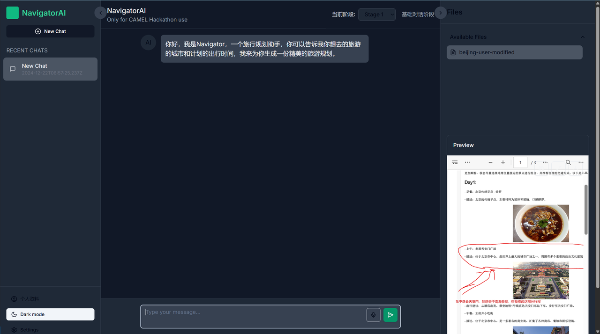
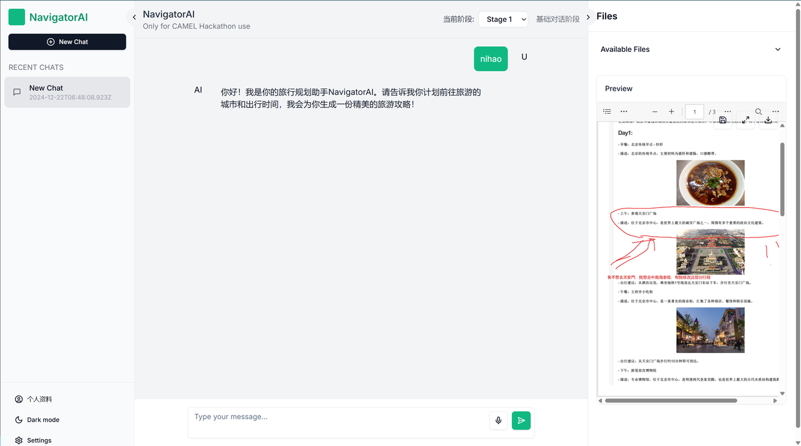
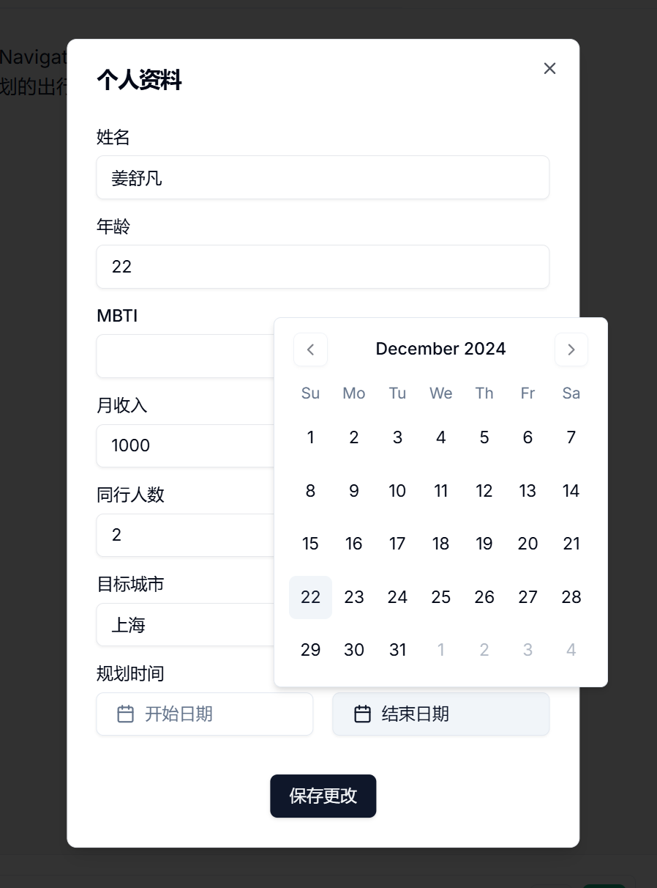

# 5. 第五章 综合案例

在这一节中，我们将展示如何使用CAMEL框架来搭建一个简单实用的**旅游出行规划助手**。

## 5.1 **应用概览**

在大模型时代，代码能力基本已经不再是初学者想要开发AI应用的障碍，单纯地使用一些模型的Web端就可以搭建一些简单的应用，搭配一些AI编程工具可以让我们的开发效率更高，只需要写一些提示词就可以搭建一个简单的带有前端UI的应用。

AI的写的代码直接复制就能跑！

得益于现在大模型的强大代码能力，我们可以将更多的精力放在我们的应用架构以及产品上，包括我们要实现的功能呀、架构设计、目标用户等等。能不能捕捉到用户的需求很重要，以什么形式满足？也就是说，现在的AI时代，产品思维对于应用开发者也是很重要的。

以下是我们使用CAMEL框架搭建一个真实可用的软件应用——NavigatorAI（旅游出行规划助手），其中使用到了非常多常见而实用的CAMEL模块和知识点。

> **特别注意**：NavigatorAI遵循[CC BY-NC](https://creativecommons.org/licenses/by-nc/4.0/)协议，仅供学习使用，不能商用！！！

### 5.1.1 目标和交互形式

首先明确我们的目标，项目的核心目标是实现一个智能化的旅游出行规划助手：用户**只需输入目的地和天数**，系统即可自动生成详细的旅游行程，包括每日活动安排、餐饮推荐、景点信息等。系统**还支持根据用户反馈动态调整行程，支持在线阅览和编辑**，同时提供多种格式（Markdown，HTML 或 PDF）的导出，方便用户保存或分享。这不仅提升了行程规划的效率，也能为用户带来更为便捷和专业的旅游体验。

根据目标我们可以设计出我们的整体应用架构图如下：

### 5.1.2 模块化设计

在现代软件开发中，一般会选择模块化的设计思路，旨在通过将系统分解为多个独立、可重用的模块来提升代码的可维护性、可扩展性和开发效率。模块化设计的核心思想是**解耦**，即通过清晰的边界和接口将系统的不同功能分离，使得每个模块可以独立开发、测试和维护，而不会对其他模块产生过多依赖。

因此通过模块化设计，开发团队可以更高效地构建复杂系统，同时降低长期维护的难度，可以帮助开发团队在短时间协同完成整个项目的开发设计和测试。

旅游出行规划助手NavigatorAI也采取了模块化的设计思想，整个综合应用可以分成四个子模块——

#### 5.1.2.1 **信息收集模块**

在该模块中，用户和**信息收集Agent**进行多轮往复的对话，直到Agent认为能够通过用户的表达和上下文提取出用户的目标出行城市和出行天数等关键信息，并将信息传递到下一个模块。&#x20;

#### 5.1.2.2 **攻略生成模块**

* **验证数据是否存在**：&#x20;

  * 如果数据库中存在对应的城市和天数的旅游数据，（即缓存命中），则直接加载复用数据。&#x20;

  * 如果数据库中没有查询到对应的信息，则调用Tool Calling中的搜索工具（Google Search 或 DuckDuckGo）进行实时的信息检索（检索的内容包括著名景点，当地美食，天气情况等数据，可以根据需要自由添加）

* **攻略初稿生成**：&#x20;

  * 接下来，**攻略生成Agent**会结合上述检索到的基础数据，按预先定义的默认格式生成 HTML 格式的详细行程攻略，包含每日的活动安排和推荐内容。&#x20;

* **格式转换**：&#x20;

  * 将生成的 HTML 导出为 PDF 格式，并在前端提供在线预览，方便用户进行下载/转发/保存/修改。&#x20;

#### 5.1.2.3 **反馈优化模块**

* **收集用户反馈**：&#x20;

  * 用户可以在前端预览中对生成的攻略初稿中的任意部分和内容进行评价，支持手动标记圈画需要优化的部分，这意味着我们接受反馈的形式是多模态的（图像理解+文字评述）。

* **使用反馈优化Agent进行意图理解并迭代式地调整攻略**：&#x20;

  * **反馈优化Agent**分析用户反馈并理解具体修改需求；&#x20;

  * 基于用户反馈，结合多模态能力和工具调用生成新内容并迭代式优化。&#x20;

* **输出最终攻略版本**：&#x20;

  * 根据用户确认的最终行程生成 PDF 文档。&#x20;

  * 将优化后的行程存入数据库以供未来复用。&#x20;

## 5.2 用户意图识别模块

该模块主要用于收集用户想要去哪，去几天的需求。我们可以通过一个合适的system prompt来实现，为了后续在软件开发中的前后端分离的设计，我们还需要进一步通过flask将该模块封装成一个本地服务——

这个模块运行之后会在本地5001端口启动一个服务，我们可以通过请求这个服务来和模块中的**信息收集Agent**进行多轮交互

使用Python requests库的示例代码

使用curl的示例命令行，这次我们不说清楚需求试试：

通过上述两个测试的示例可以观察到**信息收集模块**的核心功能会让我们在信息表述不全的情况下自主的分析问题并引导提示我们补充行程天数，有的小伙伴可能会觉得，根本没必要这样做呀，直接在开始界面设置弹窗让用户输入城市和天数不就行了，其实这个方案我们也考虑过，这样确实更方便快捷，而我们在方案中特意添加了这个模块是为了考虑到后续可能有更多的交互空间的拓展，比如情感陪伴等。当然，适合自己的方案就是最好的！Enjoy！

## 5.3 旅游信息检索

旅游信息检索是系统中实现数据获取和处理的关键环节，负责根据用户输入的目的地城市和出游天数，动态获取并生成高质量的旅游数据。

模块的工作流程分为以下几个阶段：首先，对用户输入的信息进行标准化处理，将城市名称和时间信息改写为适合搜索引擎的查询模板（query）。随后，系统调用 **Google Search API** 进行景点和美食信息的文本检索，包括景点描述、距离、推荐美食等详细内容；同时，为了补充图片资源，模块还调用 **DuckDuckGo 搜索引擎**，专注于获取高质量的景点和美食图片链接。

在数据检索完成后，模块进一步利用大语言模型（LLM）对初步搜索结果进行智能解析与重排序（rerank），从相关性和用户需求角度优化数据质量，确保信息全面、准确、优先级清晰。经过优化后的数据会以结构化的形式存储到数据库中，包含每个景点和美食的名称、详细描述、推荐理由以及图片 URL。

同样的，我们在本地的5002端口启动了一个服务，我们使用requests库来调用测试一下效果：

这个模块用于搜集和整理旅游信息。信息主要包括旅游的一些景点、美食信息及对应图片的url，以便于我们后面将他们转成图文攻略。

在大语言模型的应用开发中，我们常常使用JSON作为中间数据的逻辑保存格式，因为交互方便，很好地表示结构化的信息且方便人类阅读和理解。

以下是生成的三份参考结果

命名逻辑是 {地点}+{时间}+旅游信息.json

## 5.4 攻略生成模块

这个模块实现了一个旅行行程规划服务，主要流程如下： &#x20;

核心思路是通过前端传来的城市和出游天数信息，先在本地数据库中查找是否已存有相应的旅游数据（例如景点、美食等），如果没有就自动检索和生成对应的旅游信息并存储起来。随后，后端会使用 CAME 库与 Qwen2.5-72B-Instruct 模型，结合一段包含行程规划规则的系统消息，指导大模型生成完整的多日行程安排。为了让结果在前端方便查看，代码会将模型给出的文本格式化成 HTML，并在必要时将其中的图片链接转换成 `` 标签，使用户可以直接预览行程攻略页面。如果用户想要下载，后端还可以将该 HTML 转换成 PDF 供导出。当用户对当前结果不满意时，可以再次与大模型交互，通过多轮对话来动态调整和优化最终的旅行方案。整个过程如图所示：当有城市与天数信息输入时，系统先判断本地库中是否存在可用数据；若存在则直接调用大模型生成行程，若不存在则先行检索并存储数据后再进行行程生成；最后通过前端界面查看生成的 HTML 或者 PDF，如果用户仍需修改，则再次通过大模型进行迭代。这样就完成了一套从检索数据到生成和展示定制化旅游攻略的完整流程。

这里我们使用另一种方式来测试服务接口，熟悉软件开发的小伙伴应该用过Postman

我们在postman中使用Post请求发送一份数据来模拟前端的请求，从而得到后端返回的数据，即html\_content，然后由save逻辑保存到本地的storage数据库中

此时其实我们已经得到了一份不错的可展示的攻略了，在本地的浏览器中双击即可打开并看到渲染效果

最后我们再把HTML转成在任何显示设备上都一致的PDF格式，保证了攻略的统一性，不必担心错位，换行等一系列问题。

## 5.5 反馈优化模块

反馈优化模块需要使用到具备多模态能力的大语言模型，因此需要大家再申请一个具有图像理解能力的大模型（这里我们以gpt-4o演示），CAMEL中具体的支持列表如下：

在反馈优化中，我们所有的操作都是基于PDF的，虽然存在中间过程，但是对于用户来说是无感知的。具体而言，对于一个PDF，我们会先识别出用户做过标记圈画的部分，然后将其所在的整页转化为image的形式作为输出源的一部分交给有多模态理解能力的**反馈优化Agent。**

**反馈优化Agent**能够很好的理解用户的修改提示和意图，在HTML层面做出修正，重复之前的旅游信息检索和攻略生成模块，完成闭环，从而迭代式的优化旅游攻略，直到用户满意为止。

在线编辑PDF，调整需求：
需求一：红色部分帮我替换成中南海

需求二：文案帮我调整成小红书风格

观察到文案风格确实更加活泼，且红圈部分正确修改成了中南海和配图也十分吻合。

## 5.6 搭配前端食用

综合案例中为了尽可能让大家直观的感受到基于CAMEL框架的Agent产品开发的乐趣，我们还为大家准备了精美的前端，搭配之前的几个后端模块一起构成我们的NavigatorAI旅游出行规划助手应用。

这里只给出一些功能上的描述和简介，前端的具体框架和原理不属于本次我们教程的讨论范围，感兴趣的同学可以自行拓展\~

### UI在线交互模块

UI 在线交互模块是系统中与用户交互的关键部分，旨在通过直观的界面实现对生成行程内容的在线预览、编辑和反馈。用户可以在界面中直接查看生成的 PDF 文档，实时圈选、标注或输入修改意见，系统会根据用户提供的反馈动态调整行程内容。

左右两边的侧边栏分别是历史记录+设置栏和文件交互栏，两侧都支持展开和隐藏，非常便捷和人性化。

支持昼夜模式切换

> Dark mode

> Light mode

1. **PDF 在线渲染** &#x20;

   * 将生成的行程文案以 PDF 格式直接嵌入到界面中，用户可以实时浏览内容。

   * 支持高质量的 PDF 渲染，确保用户能直观查看文字、图片和布局。

2. **动态交互编辑** &#x20;

   * 用户可以直接点击 PDF 文档中的任意内容进行标注或编辑。

   * 提供圈选工具，允许用户高亮文中需要修改的部分并附加文本说明。

   * 输入框支持对具体段落、景点描述或图片的修改建议。

3. **反馈与动态调整** &#x20;

   * 用户的修改意见将自动传递给大模型（LLM），系统分析反馈并对行程内容进行优化。

   * 支持多轮交互，用户可以反复调整文案，直至满意为止。

4. **实时预览** &#x20;

   * 调整后的内容会立即在界面中重新渲染，用户无需等待即可看到更新后的 PDF 文档。

   * 保持高效的交互流程，提升用户体验。

### 个人信息输入模块

个人信息输入模块是系统的重要组成部分，用于收集用户的基础信息以便生成更符合个性化需求的旅游行程。通过直观友好的界面设计，用户可以快速填写相关信息，模块根据这些输入数据定制化生成行程内容。

1. **用户基础信息录入** &#x20;

   * 支持用户输入包括姓名、年龄、MBTI（个性类型）、月收入等个人信息。 &#x20;

   * 数据用于优化旅游规划的推荐内容，例如推荐适合预算的活动和美食。

2. **出行偏好设置** &#x20;

   * 用户可以指定目标城市、同行人数以及出行的具体日期（开始日期和结束日期）。 &#x20;

   * 系统会根据这些信息计算出行程天数并匹配对应的景点和活动。

3) **交互式日历组件** &#x20;

   * 嵌入式日历设计，方便用户快速选择出发日期和返回日期。 &#x20;

   * 界面清晰，操作直观，同时支持日期范围校验，避免选择无效的时间范围。

4) **即时保存与更新** &#x20;

   * 提供“保存更改”按钮，允许用户修改输入信息并实时保存，确保数据更新准确。 &#x20;

   * 便捷的数据交互设计减少了用户的操作负担，提高了使用效率。

### 模型选择

我们的模型选择模块是一款针对多语言模型应用需求设计的配置工具。用户只需要简单几步，就可以在界面中切换模型，并快速完成初始化配置，**随时切换和管理多种主流模型**。

下拉菜单集成了目前支持的模型：

* **Qwen2.5-72B-Instruct**：通义千问团队的最新开源模型。（综合案例中的大部分演示是基于此API）

* **gpt-4o**：拥有强大的推理能力和多模态能力，能够处理一系列复杂任务。

* **gpt-3.5-turbo**：轻量级、响应快。

* **claude-3.5-sonnet**：适合对话生成和自然语言理解的场景。

> **再次提醒**：NavigatorAI遵循[CC BY-NC](https://creativecommons.org/licenses/by-nc/4.0/)协议，仅供学习使用，不能商用！！！