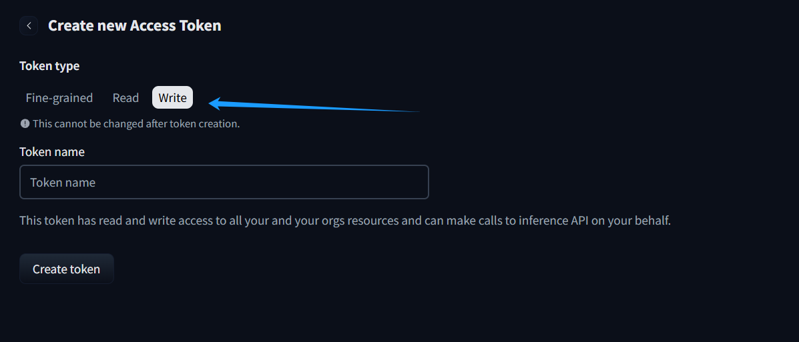
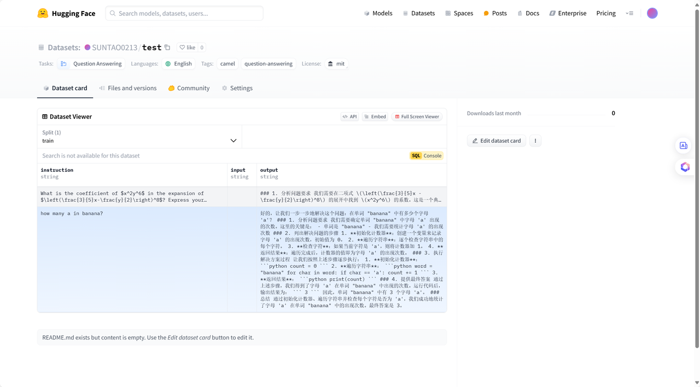

# 6. （以下内容为后续规划，现供参考）第六章 CAMEL的特色功能——数据合成

## 6.1 前言

在大模型时代，高质量数据正在成为越来越重要的一部分，然而通过人工的标注的方式获取数据的成本太高，并且真实世界的数据正迅速耗尽，于是就有了使用AI来合成数据的方法，下面我们来介绍如何使用CAMEL帮助我们合成SFT数据。

CAMEL 和 Unsloth 是一对出色的搭档。在此章节中，我们将两者结合起来，以训练模型精通页面上的内容。您将学习如何使用 CAMEL 进行数据生成、如何训练以及如何运行模型。

**Unsloth 需要 GPU 环境，要在您自己的计算机上安装 Unsloth，请按照[此处](https://github.com/unslothai/unsloth?tab=readme-ov-file#-installation-instructions)的安装说明进行操作。**

以下流程，笔者使用移动版Nvidia GTX4070显卡，显存为8GB。

## 6.2 CoT数据生成及模型微调

设置好后面用于进行数据合成的LLM

**数据准备**

我们需要准备一份Q\&A 数据，这里我们采用json格式的QA数据，格式如下：

`''' { “问题1”： “答案1”， “问题2”： “答案2”， ... }‘’’`

可以发现我们的示例数据是单纯的一问一答的数据，并没有中间的思考过程，这就让人没有那么容易相信模型的回答是真正准确的，就和我们解题的时候，没有中间过程，只有最后的结果的话通常不太会让老师相信我们是真的会这套题。我们现在让模型帮助我们补上中间的思考过程。

可以发现，Agent自动帮我们补全了中间过程，这里我们可以简单了解一下`CoTDataGenerator`的工作原理，这个类实现了生成 Chain of Thought (CoT) 数据的功能，主要通过以下几个关键机制：

* **双代理系统**

使用 generator\_agent 生成答案

使用 verifier\_agent 验证答案

也可以使用单一代理同时负责生成和验证

* **蒙特卡洛树搜索 (MCTS)**

在 solve\_question 方法中实现

通过多次迭代搜索最佳答案

每次迭代都会生成新的答案并评估其质量

* **二分查找错误定位**

通过 binary\_search\_error 方法定位答案中的错误位置

可以精确找到答案中出错的部分

生成 CoT 数据的具体流程如下：

1. 初始化时传入预定义的正确答案 (golden\_answers)

2. 对于每个问题：

   先尝试直接生成答案

   如果答案不正确，则启动 MCTS 搜索

   在搜索过程中不断评估答案质量

   使用二分查找定位错误

   基于正确部分生成新的解决方案

3. 将最终解决方案存储在 solution\_tree 中

**将生成的答案导出到 JSON 文件，并将其转换为 Alpaca traing 数据格式**

我们可以将其封装成函数：

**将数据上传到 Huggingface**

这里定义了一个函数 upload\_to\_huggingface 将数据集上传到 Hugging Face。该脚本是模块化的，帮助程序函数处理特定任务，例如数据集名称生成、数据集创建、元数据卡创建和记录添加

**配置 Huggingface 的 Access Token**

我们可以到[这里](https://huggingface.co/settings/tokens/new?tokenType=write)从 Huggingface 获取 API Key

我们可以在自己的主页看到自己上传的数据集。

***

**配置 Unsloth 环境**

这里我们准备用一个Qwen2.5-1.5B的模型来进行微调

**将 CoT 数据转换为符合 SFT 标准的训练数据格式**

现在我们准备训练模型 让我们使用 Huggingface TRL 的 ！更多相关文档在这里： [TRL SFT 文档](https://huggingface.co/docs/trl/sft_trainer)。我们执行 60 个步骤来加快速度。

**开始模型训练**

# 附录

## 支持的模型

下表列举了Camel目前支持的模型

# **结语**

恭喜您！在阅读到这里时，您已经掌握了 CAMEL-AI 应用开发框架的基础知识，并能够利用 Agent 实例在您的代码逻辑中执行复杂的任务。此外，您还可以尝试将 Agent 实例整合到更复杂的工作流中，或实现 Agent 实例之间的协同工作。

以下是我们精心挑选的几个案例，供您进一步学习。这些案例旨在展示如何在特定业务场景中运用 CAMEL 框架实现复杂的业务流程。

* 多智能体 Agent 与定制化数据结合，解决特点领域专家问题

  &#x20;参考: https://github.com/camel-ai/camel/wiki/RAG-Cookbook

同时，我们诚挚地邀请您继续关注我们的文档更新。在未来的文档中，我们将对 CAMEL 框架的高级特性进行深入探讨，包括如何使用 Workflow 组织和编排 LLMs 应用工作流程、如何理解和开发框架的插件能力，以及如何构建多 Agent 协作方案等。

祝您学习愉快，学有所获，期待下次的相聚！

## 关注我们

请扫描下方二维码，关注我们的公众号：

Datawhale

CAMEL-AI

