**本文档的目的**

本文档是Handy Multi-Agent Tutorial的速通教学，帮助你快速理解CAMEL Multi-Agent框架的核心概念，并从头开始使用CAMEL框架构建一个自己的agent系统。我们将从基础开始，逐步深入到更高级的主题。首先是环境配置部分。


**Handy Multi-Agent Tutorial 完整教程：[ Handy Multi-Agent Tutorial](https://fmhw1n4zpn.feishu.cn/docx/AF4XdOZpIo6TOaxzDK8cxInNnCe?from=from_copylink)**

**Github链接，欢迎Star！**

* **教程地址：https://github.com/datawhalechina/handy-multi-agent**

* **CAMEL: https://github.com/camel-ai/camel**

# 第一章：环境配置&#x20;


## 1. 确保python版本

本章节内我们将详细介绍如何获取CAMEL，CAMEL提供了几种安装的方式，我们可以根据自己的需求来选择安装的方式。

**请确保你的系统已安装Python 3.10+**。你可以通过以下命令进行检查：

```bash
python3 --version
```

PS：在windows系统中 python3 有可能会被错误的链接到windows商店，运行上述命令时可能不会正常输出python版本，运行如下命令来检查

```bash
python --version
```


## 2. 通过 PyPI 安装

利用 pip 直接安装完整 CAMEL 库（避免后续进阶任务报错）：

```bash
pip install "camel-ai[all]==0.2.19"
```

## 3. API 设置

关于如何部署智能体的问题，可以选择使用 API 或者本地模型。总的来说，选择使用 API 还是本地模型部署智能体，取决于具体的应用场景和资源限制。如果网络连接稳定且可以承受一定的使用费用，那么 API 可能是一个好选择。如果硬件资源充足且希望智能体能在离线环境下工作（注重数据隐私和安全），那么本地模型可能更合适。

### 3.1 获取  API KEY

使用 API 调用大模型需要 API 密钥，这里我们以Qwen为例，您可以从[ModelScope](https://modelscope.cn/docs/model-service/API-Inference/intro)获取，它提供Qwen系列的免费（OpenAI）兼容格式的API，每天免费2000次调用。

请确保您拥有一个正常注册且可使用的ModelScope账户。要生成您的私有 API KEY可以参考我们的图示。


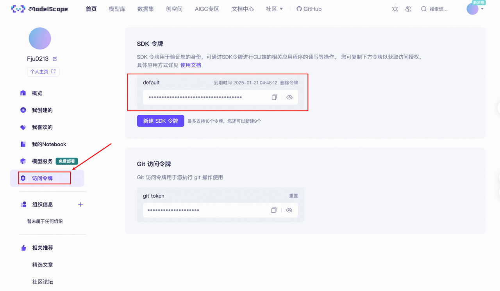

图中的SDK令牌就是我们的API KEY。

> 请注意，需要在**模型服务**先绑定[阿里巴巴云账号](https://modelscope.cn/docs/accounts/aliyun-binding)，不然api会显示无法使用

### 3.2 使用API调用模型

这里我们使用CAMEL中的ChatAgent模块来简单调用一下模型，关于ChatAgent的进一步描述可以参考后续内容，这里我们简单把它理解为一个基础的模型调用模块即可。

```python
from camel.agents import ChatAgent
from camel.models import ModelFactory
from camel.types import ModelPlatformType

model = ModelFactory.create(
    model_platform=ModelPlatformType.OPENAI_COMPATIBLE_MODEL,
    model_type="Qwen/Qwen2.5-72B-Instruct",
    url='https://api-inference.modelscope.cn/v1/',
    api_key='你的api_key'
)

agent = ChatAgent(
    model=model,
    output_language='中文'
)

response = agent.step("你好，你是谁？")
print(response.msgs[0].content)

>>>
你好，我是来自阿里云的大规模语言模型，我叫通义千问。
```

# 第二章：Hello CAMEL！

## 1. RolePlaying

让我们使用CAMEL来开发一个交易机器人吧！在这一部分我们会使用到CAMEL的核心模块之一，RolePlaying。

这个代码演示了如何利用 `RolePlaying` 模块构建一个 AI 辅助系统，模拟助手与用户角色之间的交互对话。具体目标是：

* 定义一个任务场景（开发股票交易机器人）。

* 设置不同的角色（Python 程序员和股票交易员）。

* 模拟 AI 助手与用户之间多轮对话，解决任务目标。


首先创建一个role\_playing.py文件，将以下代码复制进去。

```python
from colorama import Fore

from camel.societies import RolePlaying
from camel.utils import print_text_animated
from camel.models import ModelFactory
from camel.types import ModelPlatformType

from dotenv import load_dotenv

import os


api_key = 'QWEN_API_KEY'

model = ModelFactory.create(
    model_platform=ModelPlatformType.OPENAI_COMPATIBLE_MODEL,
    model_type="Qwen/Qwen2.5-72B-Instruct",
    url='https://api-inference.modelscope.cn/v1/',
    api_key=api_key
)

def main(model=model, chat_turn_limit=50) -> None:
    task_prompt = "为股票市场开发一个交易机器人"#设置任务目标
    role_play_session = RolePlaying(
        assistant_role_name="Python 程序员",#设置AI助手角色名
        assistant_agent_kwargs=dict(model=model),
        user_role_name="股票交易员",#设置用户角色名，在roleplay中，user用于指导AI助手完成任务
        user_agent_kwargs=dict(model=model),
        task_prompt=task_prompt,
        with_task_specify=True,
        task_specify_agent_kwargs=dict(model=model),
        output_language='中文'#设置输出语言
    )

    print(
        Fore.GREEN
        + f"AI 助手系统消息:\n{role_play_session.assistant_sys_msg}\n"
    )
    print(
        Fore.BLUE + f"AI 用户系统消息:\n{role_play_session.user_sys_msg}\n"
    )

    print(Fore.YELLOW + f"原始任务提示:\n{task_prompt}\n")
    print(
        Fore.CYAN
        + "指定的任务提示:"
        + f"\n{role_play_session.specified_task_prompt}\n"
    )
    print(Fore.RED + f"最终任务提示:\n{role_play_session.task_prompt}\n")

    n = 0
    input_msg = role_play_session.init_chat()
    while n < chat_turn_limit:
        n += 1
        assistant_response, user_response = role_play_session.step(input_msg)

        if assistant_response.terminated:
            print(
                Fore.GREEN
                + (
                    "AI 助手已终止。原因: "
                    f"{assistant_response.info['termination_reasons']}."
                )
            )
            break
        if user_response.terminated:
            print(
                Fore.GREEN
                + (
                    "AI 用户已终止。"
                    f"原因: {user_response.info['termination_reasons']}."
                )
            )
            break

        print_text_animated(
            Fore.BLUE + f"AI 用户:\n\n{user_response.msg.content}\n"
        )
        print_text_animated(
            Fore.GREEN + "AI 助手:\n\n"
            f"{assistant_response.msg.content}\n"
        )

        if "CAMEL_TASK_DONE" in user_response.msg.content:
            break

        input_msg = assistant_response.msg

if __name__ == "__main__":
    main()

```

根据上面的步骤配置好key和url后，运行脚本，

```bash
python role_playing.py
```

运行效果如下，可以看到模型会自我反复对话来解决问题，这段对话展示了如何为股票市场开发一个交易机器人。


运行成功后，我们也可以看到各个模块的初始prompt，总得来说，RolePlaying会将初始的task一步步拆解，由AI User指导AI Assistant完成整个任务，这些我们在完整版教程[第二章](https://fmhw1n4zpn.feishu.cn/docx/AF4XdOZpIo6TOaxzDK8cxInNnCe#share-X1VwdB394o7hoEx43CWc7WbenEg)详细说明。


下面将讲解最重要的几个部分。

**模型加载**

```sql
model = ModelFactory.create(
    model_platform=ModelPlatformType.OPENAI_COMPATIBLE_MODEL,
    model_type="Qwen/Qwen2.5-72B-Instruct",
    url='https://api-inference.modelscope.cn/v1/',
    api_key=api_key
)
```

* 使用 `ModelFactory.create` 方法创建推理模型。

* `model_platform` 指定了平台类型为 `OPENAI_COMPATIBLE_MODEL`，兼容 OpenAI 接口。

* `url` 设置模型推理 API 的地址。

**角色扮演会话初始化**

```sql
role_play_session = RolePlaying(
    assistant_role_name="Python 程序员",
    assistant_agent_kwargs=dict(model=model),
    user_role_name="股票交易员",
    user_agent_kwargs=dict(model=model),
    task_prompt=task_prompt,
    with_task_specify=True,
    task_specify_agent_kwargs=dict(model=model),
    output_language='中文'
)
```

* 设置了两个角色：

  * **AI 助手角色**：Python 程序员，用于完成任务。

  * **用户角色**：股票交易员，提供任务指导。

* `task_prompt`: 明确任务目标（开发股票交易机器人）。

* `output_language`: 输出语言为中文。

* `with_task_specify`: 开启任务细化功能（由模型帮助分解任务）。


**多轮对话控制**

```sql
n = 0
input_msg = role_play_session.init_chat()
while n < chat_turn_limit:
    n += 1
    assistant_response, user_response = role_play_session.step(input_msg)
    ...
    input_msg = assistant_response.msg
```


* 每一轮对话，调用 `role_play_session.step` 获取助手与用户的消息。

* `chat_turn_limit` 限制对话轮数，避免死循环。

* 检查对话终止条件，如 `terminated` 或包含任务完成标志 `CAMEL_TASK_DONE`。


**输出内容**

使用 `colorama` 为不同的消息添加颜色：

* **绿色**：AI 助手系统消息。

* **蓝色**：AI 用户系统消息。

* **黄色**：原始任务提示。

* **青色**：指定任务提示。

* **红色**：最终任务提示。

***

如果出现**openai.APIConnectionError: Connection error.错误**，可以在role\_playing.py中加入下列代码，并检查自己的代理。

```python
import os
os.environ["http_proxy"] = "http://127.0.0.0:7890"#这里替换成自己的代理IP地址
os.environ["https_proxy"] = "http://127.0.0.0:7890"#这里替换成自己的代理IP地址
```

代理IP地址可以在你使用的代理中查得，或者在系统设置中查得。以Win11系统为例，在设置 ->网络和Internet ->代理 ->使用代理服务器中可以查询自己的代理IP。

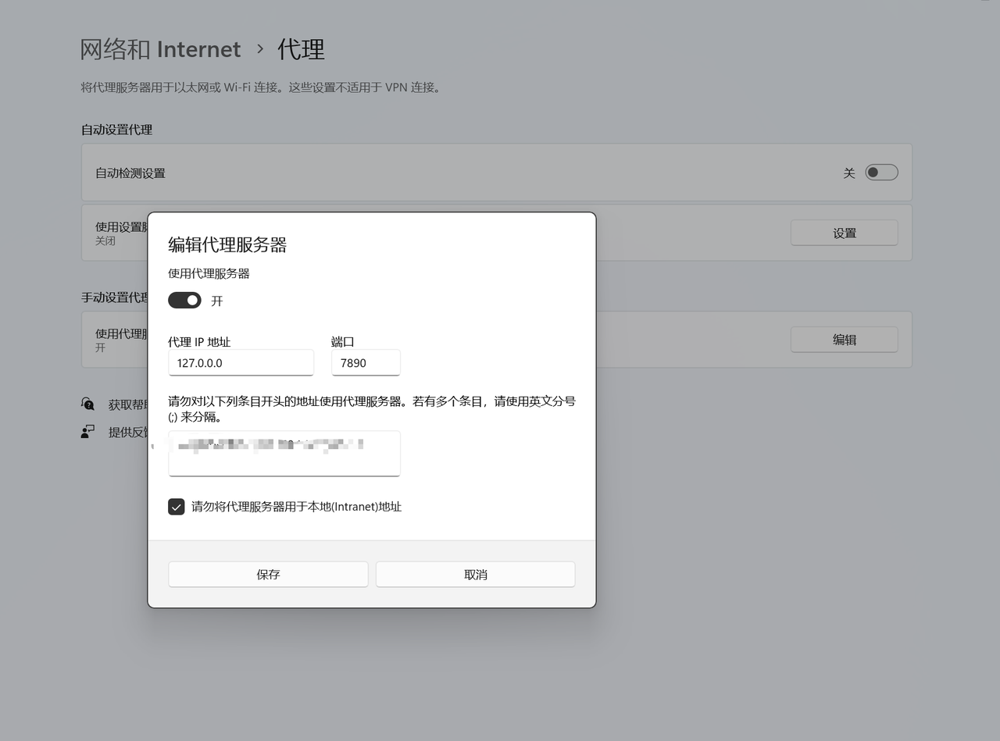


## 2. Workforce

Workforce是CAMEL框架中的一个多智能体协同工作系统。它以一种简洁的方式让多个智能体协作完成任务，类似于一个高效的团队合作系统。更详细的使用信息，请参考我们的[对应内容](https://fmhw1n4zpn.feishu.cn/docx/AF4XdOZpIo6TOaxzDK8cxInNnCe#share-T4t0dbCrqoKV1qx8EbdcIAtpnwb)。


**1. 创建 Workforce 实例**

想要使用 Workforce，首先需要创建一个 Workforce 实例。下面是最简单的示例：

```python
from camel.agents import ChatAgent
from camel.models import ModelFactory
from camel.types import ModelPlatformType
from camel.messages import BaseMessage
from camel.societies.workforce import Workforce
from camel.toolkits import SearchToolkit
from camel.tasks import Task
from camel.toolkits import FunctionTool

import os

api_key = 'QWEN_API_KEY'

model = ModelFactory.create(
    model_platform=ModelPlatformType.OPENAI_COMPATIBLE_MODEL,
    model_type="Qwen/Qwen2.5-72B-Instruct",
    url='https://api-inference.modelscope.cn/v1/',
    api_key=api_key
)

# 创建一个 Workforce 实例
workforce = Workforce(description="旅游攻略制作与评估工作组",new_worker_agent_kwargs={'model':model},coordinator_agent_kwargs={'model':model},task_agent_kwargs={'model':model})
```

这段代码会生成一个名为 `一个简单的Workforce` 的实例，不过目前它还不包含任何工作节点。

> **提示：如何自定义 Workforce**
>
> 如果你只想快速上手，给 Workforce 传入一个描述就足够了；如果你需要更复杂的定制，则可以在初始化时配置工作节点列表、协调器Agent（Coordinator Agent）或任务规划Agent（Task Planner Agent）等高级参数。

***

**2. 定义worker**

接下来，我们需要给Workforce定义一些worker。我们希望在这个Workforce里有一个专业的旅游信息搜索助手、一个专业的旅行规划师、一个经验丰富的旅行爱好者。他们分别负责制定计划和评价计划，例如：

```python
search_tool = FunctionTool(SearchToolkit().search_duckduckgo)

search_agent = ChatAgent(
            system_message="""你是一个专业的旅游信息搜索助手。你的职责是:
                1. 搜索目的地的主要景点信息
                2. 搜索当地特色美食信息
                3. 搜索交通和住宿相关信息
                请确保信息的准确性和实用性。""",
            model=model,
            tools=[search_tool],
            output_language='中文'
        )

planner_agent = ChatAgent(
            system_message="""你是一个专业的旅行规划师。你的职责是:
                1. 根据景点分布规划合理的游览顺序
                2. 为每天安排适量的景点和活动
                3. 考虑用餐、休息等时间
                4. 注意不同季节的特点
                请确保行程安排合理且具有可行性。""",
            model=model,
            output_language='中文'
        )

reviewer_agent = ChatAgent(
    system_message="""你是一个经验丰富的旅行爱好者。你的职责是:
        1. 从游客角度评估行程的合理性
        2. 指出可能的问题和改进建议
        3. 补充实用的旅行小贴士
        4. 评估行程的性价比
        请基于实际旅行经验给出中肯的建议。""",
    model=model,
    output_language='中文'
)

```

当然，你也可以按自己的喜好来定义你的Workforce。

**3. 添加工作节点**

定义好 Workforce 和worker后，你可以往里面添加工作节点（Worker Nodes）。以一个命名为 `search_agent` 的示例Agent（Agent）为例，代码如下：

```python
# 添加一个执行网页搜索的Agent
workforce.add_single_agent_worker(
    "一个能够执行网页搜索的Agent",    worker=search_agent,
)
```

如果需要一次性添加多个工作节点，可以使用方法链（Fluent Interface）来操作：

```python
# 添加工作节点
workforce.add_single_agent_worker(
    "负责搜索目的地相关信息",
    worker=search_agent
).add_single_agent_worker(
    "负责制定详细行程规划",
    worker=planner_agent
).add_single_agent_worker(
    "负责从游客角度评估行程",
    worker=reviewer_agent
)
```


> **提示：描述很重要**
>
>
>
> 虽然看似只是一个字符串，但**工作节点的描述在任务分配中至关重要**。协调器Agent会根据节点描述来分配具体的子任务，因此你最好为每个节点写一个精准且易读的描述。


&#x34;**. 启动 Workforce 并处理任务**

准备好工作节点后，就可以创建一个任务，并让 Workforce 来处理。下面是一个简单的任务示例：

```python
from camel.tasks import Task

# 创建一个用于测试的任务
task = Task(
    content="规划一个3天的巴黎旅行计划。",
    id="0",  # id可以是任何标记字符串
)
```

接着，调用 `process_task()` 方法即可启动 Workforce 的任务处理流程：

```python
# 使用jupyter来运行代码请打开下面两行注释
# import nest_asyncio
# nest_asyncio.apply()


# 让 Workforce 处理这个任务
task = workforce.process_task(task)
```

此时，Workforce 会根据各工作节点的描述，为它们分配合适的子任务，最终返回处理结果。你可以通过以下方式查看任务处理的最终产出：

```python
print(task.result)
```

通过以上三个步骤——创建 Workforce、添加工作节点、启动并处理任务，你已经完成了一个最基本的 CAME&#x4C;**&#x20;Workforce** 使用示例。


## 3. RAG


RAG，全称为 Retrieval Argumented Generation，检索增强生成。大语言模型通过预训练阶段在海量文本上的自监督训练中获得了大量的人类知识，但是依然存在一些诸如时效性和幻觉的问题。而RAG正是为了补充并增强大语言模型的能力，使其尽量和现实世界对齐的一种技术路线。

一个最为简单朴素的RAG的思想为：我有一些文本数据包含了有用的信息，我想让大语言模型利用这些文本信息来生成回复，而不是直接输出答案，因此在原先的交互流程中，我们要将外部文本信息组成上下文合并到prompt中，交付给LLM，以此来达成**增强生成（Argumented Generation）**&#x7684;目的，就是这么简单！

这个时候聪明的读者可能就会发现了，欸，那 **Retrieval** 去哪儿了呢。这是一个很好的问题，如果我现在有一篇800字的作文或者5000字的论文，那我直接将其简单处理后合并进prompt中就可以了，如下所示：

```python
essay = "800字的作文，以下省略800字..."
paper = "5000字的论文，以下省略5000字..."

system_prompt = "you are a helpful assistant"
user_prompt = f"帮我总结一下这篇文章，全文信息如下：{essay}"

prompt = system_prompt + user_prompt
```

但是，当我有100篇，甚至成千上万篇文章，以上亿token为单位的上下文长度时，很显然，会分分钟超出现在大语言模型所支持的上下文长度。此时，一个显而易见的解决方案便是：我只将我最关心的那一部分内容合并到 prompt 中交付给大模型。那如何才能知道大量文本中，哪些才是我最关心或者说和我的问题最相关的片段部分呢。欸，这就是 Retrieval 阶段的功能和作用。

CAMEL中对于Retrieval这一过程的功能实现在 `camel.retrievers` 中，具体参考https://docs.camel-ai.org/key\_modules/retrievers.html

接下来我们通过一个demo来学习以下如何快速搭建一个Basic RAG的系统

1. **读取示例数据：**

这里我们首先下载一篇CAMEL的论文作为文本示例，该PDF就是我们的原始文件

```python
import os
import requests

os.makedirs('local_data', exist_ok=True)

url = "https://arxiv.org/pdf/2303.17760.pdf"
response = requests.get(url)
with open('local_data/camel_paper.pdf', 'wb') as file:
    file.write(response.content)
```

* **实例化Embedding Model：**

这里使用 `AutoRetriever`，使用的嵌入模型 `intfloat/e5-large-v2` ，可以更换为别的模型。

```python
from camel.retrievers import VectorRetriever
from camel.types import StorageType
from camel.embeddings import SentenceTransformerEncoder

embedding_model=SentenceTransformerEncoder(model_name='intfloat/e5-large-v2')

# 国内无法运行上述代码，可以注释掉使用以下方案
# embedding_model=SentenceTransformerEncoder(model_name='./embedding_model/')
# 下载方案2：打开这个链接https://hf-mirror.com/intfloat/e5-large-v2/tree/main，下载除了model.safetensors的以外部分，保存到当前代码同级目录的embedding_model文件夹下。
# 也可以从百度云盘直接下载embedding_model文件夹放到当前代码同级目录下。
# https://pan.baidu.com/s/1xt0Tg_Wmr8iJuyGiPfgJrw 提取码: 7pzr 

# 初始化VectorRetriever实例并使用本地模型作为嵌入模型
vr = VectorRetriever(embedding_model= embedding_model)
```

* **向量嵌入和存储数据：**

接下来，我们将原始的文档读取，分块并且通过embedding模型生成向量表示和索引并将其存储在专门用来存储向量数据的向量数据库，VectorDB中。CAMEL框架中的 `process` 函数其本质上就是将**文件读取、切块、嵌入并储存**这个固定的处理流程统一封装成了一个方法，使得开发者更加方便快速的搭建RAG应用。

```python
# 创建并初始化一个向量数据库 (以QdrantStorage为例)
from camel.storages.vectordb_storages import QdrantStorage

vector_storage = QdrantStorage(
    vector_dim=embedding_model.get_output_dim(),
    collection="demo_collection",
    path="storage_customized_run",
    collection_name="论文"
)


# 将文件读取、切块、嵌入并储存在向量数据库中
vr.process(
    content="local_data/camel_paper.pdf", 
    storage=vector_storage
)
```

这里如果出现`UserWarning: Failed to partition the file: local_data/camel_paper.pdf`

`warnings.warn(f"Failed to partition the file: {input_path}")`需要补充这个环境：

**Windows**

```python
pip install python-magic-bin
```

**Mac和Linux**

```python
pip install python-magic
#brew install libmagic#Mac需要额外配置
```

* **执行检索，查看效果：**

完成向量数据库的构建和存储后，就可以根据问题来进行检索。这里调用 `query` 方法执行查询

```python
# 设定一个查询语句
query = "CAMEL是什么"

# 执行查询并获取结果
results = vr.query(query=query, top_k=1)
print(results)
```

这里的参数`top_k=1`是指定检索器返回最相关的文本内容，同时还有一个相似度阈值参数`similarity_threshold`，其值介于0到1之间，默认值是`0.75`，从而确保检索到的内容的相关程度，可以根据自己应用场景的实际需求更改 `top_k 或 similarity_threshold` 值。&#x20;

`"What is CAMEL"`得到回复为

```markdown
[{'similarity score': '0.8193796123510835', 'content path': 'local_data/camel_paper.pdf', 'metadata': {'filetype': 'application/pdf', 'languages': ['eng'], 'page_number': 1}, 'extra_info': {}, 'text': '3 2 0 2\n\nv o N 2\n\n] I\n\nA . s c [\n\n2 v 0 6 7 7 1 . 3 0 3 2 : v i X r a\n\nCAMEL: Communicative Agents for “Mind” Exploration of Large Language Model Society https://www.camel-ai.org\n\nGuohao Li∗ Hasan Abed Al Kader Hammoud*\n\nHani Itani*\n\nDmitrii Khizbullin\n\nBernard Ghanem\n\nKing Abdullah University of Science and Technology (KAUST)\n\nAbstract'}]
```

返回的字典包括：

* `similarity score` 相似性分数

* `content path` 内容路径

* `metadata` 元数据

* `text` 文本

我们再尝试一个与论文内容无关的提问`"Compared with dumpling and rice, which should I take for dinner?"`：

```python
retrieved_info_irrevelant = vr.query(
    query="我今天晚上该吃些什么?",
    top_k=1,
    similarity_threshold=0.8
)

print(retrieved_info_irrevelant)
```

```markdown
[{'text': 'No suitable information retrieved from local_data/camel_paper.pdf with similarity_threshold = 0.8.'}]
```

我们可以看到在相似度阈值为0.75的情况下，检索器没有找到论文中与提问有关内容，这和我们的预期是十分符合的。

到目前为止，整个RAG的流程还没结束，因为我们实际上目前为止只是把最相关的内容检索了出来，还差最后一步，结合大语言模型来完成最终的生成。

聪明的读者可能已经想到了，此时我们只需要实例化一个LLM或者Agent就可以了，CAMEL中的一个用于一般对话场景的Agent为 `camel.agents` 中的 `ChatAgent`。

```python
from camel.agents import ChatAgent
from camel.models import ModelFactory
from camel.types import ModelPlatformType

retrieved_info_irrevelant = vr.query(
    query="what is roleplaying?",
    top_k=1,
)

assistant_sys_msg = """
你是一个帮助回答问题的助手，
我会给你原始查询和检索到的上下文，
根据检索到的上下文回答原始查询，
如果你无法回答问题就说我不知道。
"""

model = ModelFactory.create(
        model_platform=ModelPlatformType.OPENAI_COMPATIBLE_MODEL,
        model_type="Qwen/Qwen2.5-72B-Instruct",
        url='https://api-inference.modelscope.cn/v1/',
        api_key='你的api'
    )

# 将之前的retrieved_info转换为字符串形式
user_msg = str(retrieved_info_irrevelant)

agent = ChatAgent(assistant_sys_msg,model=model)
# 使用step方法获得最终的检索增强生成的回复并打印
assistant_response = agent.step(user_msg)
print(assistant_response.msg.content)
```

```markdown
根据提供的上下文，这个新的沟通代理框架被称为角色扮演（role-playing）。这种方法通过使用初始提示（inception prompting）来引导聊天代理完成任务，同时保持与人类意图的一致性。我们展示了如何利用角色扮演生成对话数据，以研究代理社会的行为和能力，为调查对话语言模型提供宝贵的资源。特别是，我们对指令遵循进行了全面的研究。
```

更进一步我们可以将这一个步骤封装到一个函数里：


```python
from camel.agents import ChatAgent
from camel.messages import BaseMessage
from camel.types import RoleType
from camel.retrievers import AutoRetriever
from camel.types import StorageType

def single_agent(query: str) ->str :
    # 设置agent角色
    assistant_sys_msg = """你是一个帮助回答问题的助手，
        我会给你原始查询和检索到的上下文，
        根据检索到的上下文回答原始查询，
        如果你无法回答问题就说我不知道。"""

    # 添加自动检索器
    auto_retriever = AutoRetriever(
            vector_storage_local_path="local_data2/",
            storage_type=StorageType.QDRANT,
            embedding_model=embedding_model)

    # 运行向量检索器
    retrieved_info = auto_retriever.run_vector_retriever(
        query=query,
        contents=[
            "local_data/camel_paper.pdf",  # 示例本地路径
            "https://github.com/camel-ai/camel/wiki/Contributing-Guidlines",  # 示例url
        ],
        top_k=1,
        return_detailed_info=False,
        similarity_threshold=0.5
    )

    # 将检索到的信息传递给agent
    user_msg = str(retrieved_info)
    agent = ChatAgent(assistant_sys_msg,model =model)

    # 获取响应
    assistant_response = agent.step(user_msg)
    return assistant_response.msg.content

print(single_agent("如果我对贡献CAMEL项目感兴趣，我应该怎么做？"))

>>>
如果您对贡献CAMEL项目感兴趣，您可以按照以下步骤进行：

1. **查看项目页面**：访问CAMEL项目的GitHub页面，了解项目的最新动态、功能和目标。
2. **阅读贡献指南**：在项目页面中查找并阅读“Contributing Guidelines”（贡献指南），了解如何参与项目、代码风格要求、提交Pull Request的流程等。
3. **参与讨论**：加入项目的Issues和Discussions部分，与其他贡献者交流，提出问题或建议。
4. **选择任务**：从Issues列表中选择一个适合您的任务开始。如果有疑问，可以在Issue下留言询问。
5. **提交代码**：完成任务后，提交Pull Request，并按照项目的要求进行代码审查。

希望您能顺利参与到CAMEL项目中！
```

```python
print(single_agent("什么是RolePlaying?"))

>>>
角色扮演（RolePlaying）是一种沟通代理框架，通过使用启发式提示来引导聊天代理完成任务，同时保持与人类意图的一致性。这种方法可以用于生成对话数据，以研究代理社会的行为和能力，为调查对话语言模型提供宝贵的资源。特别是在遵循指令方面进行了全面的研究。
```

至此，恭喜您已经搭建了一个Basic RAG，更多RAG中的小技巧可以在完整文档4.3节查看\~

## 4. Graph RAG

Graph RAG 是将知识图谱（Knowledge Graph）引入检索增强生成（RAG）框架的一种扩展形式。它利用结构化的知识显式表示实体及其关系，从而显著提升系统的推理能力和回答准确性。

### 4.1 **构建三元组并上传图数据库**

知识图谱的核心是三元组（Triplets），由节点、关系、属性组成：

**节点（Node/Entity）**：表示实体，是图中的顶点

**关系（Relationship/Edge）**：表示实体之间的联系，是图中的边

**属性（Property/Attribute）**：节点或关系的特征描述

例如我们的有一段文本：

```python
text_example = """
CAMEL和DATAWHALE是两个活跃的AI开源社区。
CAMEL致力于推动人工智能技术的发展，帮助开发者更好地进行AI研究和应用。
DateWhale通过开源项目和社区活动，促进知识分享和技术交流。这两个社区都为AI领域的创新和进步做出了重要贡献。
"""
```

我们可以从中找出CAMEL、DataWhale等等这些节点，那么CAMEL和人工智能技术的发展之间的关系可以表述为：CAMEL"致力于"人工智能技术的发展。而CAMEL的属性可以为"AI开源社区"。

1. **信息抽取**

之前我们可能通过一些NLP技术来做信息的抽取，现在我们可以直接使用LLM来完成这件事情。例如我们通过一些简单的prompt工程来完成这个目的：

```python
from camel.models import ModelFactory
from camel.types import ModelPlatformType
from camel.loaders import UnstructuredIO
from camel.agents import ChatAgent

model = ModelFactory.create(
    model_platform=ModelPlatformType.OPENAI_COMPATIBLE_MODEL,
    model_type="Qwen/Qwen2.5-72B-Instruct",
    url='https://api-inference.modelscope.cn/v1/',
    api_key='你的api'
)

sys_msg =  """
            你是一个图数据库专家，你的任务是从给定的内容中提取实体和关系，构建知识图谱。
            
            知识图谱的基本组成：
            1. 节点（Node）：表示实体，包含id和type属性
            2. 关系（Relationship）：表示实体之间的联系
            3. 属性（Property）：节点或关系的附加信息

            示例输入：
            "小明，2008年9月13日出生，男。五行属水，性格开朗。"

            期望输出：
            Nodes:
            Node(id="小明", type="人")
            Node(id="水", type="五行")
            Node(id="开朗", type="性格")
            Node(id="2008年9月13日", type="时间")

            Relationships:
            Relationship(subj=Node(id="小明", type="人"), obj=Node(id="水", type="五行"), type="五行属性")
            Relationship(subj=Node(id="小明", type="人"), obj=Node(id="开朗", type="性格"), type="性格特征")
            Relationship(subj=Node(id="小明", type="人"), obj=Node(id="2008年9月13日", type="时间"), type="出生日期")

            请从以下内容中提取实体和关系：
            """
graphprocessor = ChatAgent(
    system_message=sys_msg,
    model=model,
    )

text_example = """
CAMEL和DATAWHALE是两个活跃的AI开源社区。
CAMEL致力于推动人工智能技术的发展，帮助开发者更好地进行AI研究和应用。
DateWhale通过开源项目和社区活动，促进知识分享和技术交流。这两个社区都为AI领域的创新和进步做出了重要贡献。
"""
```

我们首先通过一个prompt来定义来agent的功能，以及设置好我们案例文本。

```python
response = graphprocessor.step(input_message= text_example)
print (response.msgs[0].content)

>>>
Nodes:
- Node(id="CAMEL", type="AI开源社区")
- Node(id="DATAWHALE", type="AI开源社区")
- Node(id="推动人工智能技术的发展", type="目标")
- Node(id="帮助开发者更好地进行AI研究和应用", type="目标")
- Node(id="通过开源项目和社区活动", type="方法")
- Node(id="促进知识分享和技术交流", type="目标")
- Node(id="AI领域的创新和进步", type="贡献")

Relationships:
- Relationship(subj=Node(id="CAMEL", type="AI开源社区"), obj=Node(id="推动人工智能技术的发展", type="目标"), type="致力于")
- Relationship(subj=Node(id="CAMEL", type="AI开源社区"), obj=Node(id="帮助开发者更好地进行AI研究和应用", type="目标"), type="帮助")
- Relationship(subj=Node(id="DATAWHALE", type="AI开源社区"), obj=Node(id="通过开源项目和社区活动", type="方法"), type="通过")
- Relationship(subj=Node(id="DATAWHALE", type="AI开源社区"), obj=Node(id="促进知识分享和技术交流", type="目标"), type="促进")
- Relationship(subj=Node(id="CAMEL", type="AI开源社区"), obj=Node(id="AI领域的创新和进步", type="贡献"), type="做出贡献")
- Relationship(subj=Node(id="DATAWHALE", type="AI开源社区"), obj=Node(id="AI领域的创新和进步", type="贡献"), type="做出贡献")
```

可以看到，对于信息抽取这个任务，LLM能完成的相当出色。当然如果不想自己写prompt的话，CAMEL也有预设好的KnowledgeGraphAgent供我们一键调用，更改这里的参&#x6570;*`parse_graph_elements`*&#x53EF;以设定Agent返回的信息格式，False返回的是一个字符串，设置为True则返回一个自定义的GraphElement类：

```python
uio = UnstructuredIO()
kg_agent = KnowledgeGraphAgent(model=model)

# 从给定文本创建一个元素
element_example = uio.create_element_from_text(
    text=text_example, element_id="0"
)

# 让知识图谱Agent提取节点和关系信息
ans_element = kg_agent.run(element_example, parse_graph_elements=False)
print(ans_element)

>>>
### Nodes

- Node(id='CAMEL', type='Community')
- Node(id='DATAWHALE', type='Community')
- Node(id='AI', type='Field')
- Node(id='Developers', type='Group')
- Node(id='Research and Application', type='Activity')
- Node(id='Knowledge Sharing', type='Activity')
- Node(id='Technical Exchange', type='Activity')

### Relationships

- Relationship(subj=Node(id='CAMEL', type='Community'), obj=Node(id='AI', type='Field'), type='ContributesTo')
- Relationship(subj=Node(id='CAMEL', type='Community'), obj=Node(id='Developers', type='Group'), type='Helps')
- Relationship(subj=Node(id='CAMEL', type='Community'), obj=Node(id='Research and Application', type='Activity'), type='Promotes')
- Relationship(subj=Node(id='DATAWHALE', type='Community'), obj=Node(id='AI', type='Field'), type='ContributesTo')
- Relationship(subj=Node(id='DATAWHALE', type='Community'), obj=Node(id='Knowledge Sharing', type='Activity'), type='Facilitates')
- Relationship(subj=Node(id='DATAWHALE', type='Community'), obj=Node(id='Technical Exchange', type='Activity'), type='Facilitates')
```

* **上传数据库**

现在我们有了节点和关系信息，下一步就该把他们上传到数据库里了。

首先我们要初始化我们的图数据库，这里我们可以使用[Neo4j(点击跳转)](https://neo4j.com/)，如何使用Neo4j看这一小节的末尾处:

```python
n4j = Neo4jGraph(
    url="你的url",
    username="neo4j",
    password="你的password",
)
```

CAMEL已经将上传到图数据这一个操作为我们一键集成，我们只需要使用一个简单的命令调用即可(需要搭配KnowledgeGraphAgent一起使用，设定parse\_graph\_elements=True)：

```python
# 检查实体信息
graph_elements = kg_agent.run(element_example, parse_graph_elements=True)
print(graph_elements)

>>>
nodes=[Node(id='CAMEL', type='Community', properties={'source': 'agent_created'}), Node(id='DATAWHALE', type='Community', properties={'source': 'agent_created'}), Node(id='Artificial Intelligence', type='Field', properties={'source': 'agent_created'}), Node(id='Developers', type='Group', properties={'source': 'agent_created'}), Node(id='Knowledge Sharing', type='Activity', properties={'source': 'agent_created'}), Node(id='Technical Exchange', type='Activity', properties={'source': 'agent_created'})] relationships=[Relationship(subj=Node(id='CAMEL', type='Community', properties={'source': 'agent_created'}), obj=Node(id='Artificial Intelligence', type='Field', properties={'source': 'agent_created'}), type='PromotesDevelopment', properties={'source': 'agent_created'}), Relationship(subj=Node(id='CAMEL', type='Community', properties={'source': 'agent_created'}), obj=Node(id='Developers', type='Group', properties={'source': 'agent_created'}), type='Helps', properties={'source': 'agent_created'}), Relationship(subj=Node(id='DATAWHALE', type='Community', properties={'source': 'agent_created'}), obj=Node(id='Artificial Intelligence', type='Field', properties={'source': 'agent_created'}), type='Promotes', properties={'source': 'agent_created'}), Relationship(subj=Node(id='DATAWHALE', type='Community', properties={'source': 'agent_created'}), obj=Node(id='Knowledge Sharing', type='Activity', properties={'source': 'agent_created'}), type='Facilitates', properties={'source': 'agent_created'}), Relationship(subj=Node(id='DATAWHALE', type='Community', properties={'source': 'agent_created'}), obj=Node(id='Technical Exchange', type='Activity', properties={'source': 'agent_created'}), type='Facilitates', properties={'source': 'agent_created'}), Relationship(subj=Node(id='CAMEL', type='Community', properties={'source': 'agent_created'}), obj=Node(id='Artificial Intelligence', type='Field', properties={'source': 'agent_created'}), type='ContributesTo', properties={'source': 'agent_created'}), Relationship(subj=Node(id='DATAWHALE', type='Community', properties={'source': 'agent_created'}), obj=Node(id='Artificial Intelligence', type='Field', properties={'source': 'agent_created'}), type='ContributesTo', properties={'source': 'agent_created'})] source=<unstructured.documents.elements.Text object at 0x000001BB8B599460>
```

将提取的图信息添加到 Neo4j 数据库中：

```python
n4j.add_graph_elements(graph_elements=[graph_elements])
```


我们再回到neo4j就可以看到我们构建的知识图谱啦！

### 4.2 实践案例

在这个案例中，我们将展示如何以混合方式运行 RAG，结合向量检索和知识图谱检索，以查询和探索存储的知识。

首先我们使用本地部署的e5-large-v2作为我们的embedding模型(如果本地没有的话会自动下载)。

```python
from camel.models import ModelFactory
from camel.types import ModelPlatformType, ModelType
from camel.loaders import UnstructuredIO
from camel.storages import Neo4jGraph
from camel.retrievers import AutoRetriever
from camel.types import StorageType
from camel.agents import ChatAgent, KnowledgeGraphAgent
from camel.messages import BaseMessage
from camel.embeddings import SentenceTransformerEncoder

# 设置检索器
camel_retriever = AutoRetriever(
    vector_storage_local_path="local_data/embedding_storage",
    storage_type=StorageType.QDRANT,
    embedding_model=SentenceTransformerEncoder(model_name='intfloat/e5-large-v2'),
)

model = ModelFactory.create(
    model_platform=ModelPlatformType.OPENAI_COMPATIBLE_MODEL,
    model_type="Qwen/Qwen2.5-72B-Instruct",
)

n4j = Neo4jGraph(
    url="你的url",
    username="你的username",
    password="你的密码",
)

uio = UnstructuredIO()
kg_agent = KnowledgeGraphAgent(model=model)
```

之后我们设置好我们想了解的内容，这里我们首先让它根据向量检索的方式来检索相关信息：

```python
# 设置query
query="DataWhale和CAMEL之间是什么关系。"

# 使用向量检索器获取相关内容
vector_result = camel_retriever.run_vector_retriever(
    query=query,
    contents="""在一个神奇的动物王国里，住着一只聪明的骆驼，名叫CAMEL，以及一只智慧的鲸鱼，名叫DataWhale。CAMEL生活在辽阔的沙漠中，而DataWhale则畅游在无边无际的海洋里。虽然它们的栖息地截然不同，但它们都对探索新知充满了浓厚的兴趣。

有一天，CAMEL在沙漠中偶然发现了一块古老的石板，上面刻满了奇怪的符号和图案。CAMEL意识到这可能是一份通往巨大宝藏的地图，但它无法解读这些符号。于是，它决定去寻找帮助。

与此同时，DataWhale在海洋深处发现了一卷古老的羊皮纸，上面也布满了类似的符号。这让DataWhale感到非常好奇，因为它知道这些符号可能蕴藏着某种秘密，但它同样无法破译。

通过一只飞翔在天空中的信使鸟，CAMEL和DataWhale得知彼此的发现，并决定合作解开这个谜团。骆驼踏上了漫长的旅程，穿越沙漠来到了海洋边缘，而鲸鱼则游到岸边，与CAMEL会合。

在一起研究这些古老的符号时，CAMEL运用了它在沙漠中磨炼出的耐心和智慧，而DataWhale则利用它在海洋中获得的知识和洞察力。经过一番努力，它们终于解读出这些符号的含义。原来，这些符号描绘的是一个连接沙漠和海洋的秘密通道，通道的尽头藏着一座知识的宝库。

满怀着激动与期待，CAMEL和DataWhale沿着地图所指引的方向，一同踏上了寻找宝库的旅程。一路上，它们克服了重重困难，彼此扶持与信任，终于找到了那座传说中的宝库。里面并不是金银财宝，而是无数的古老书籍和知识卷轴。

通过这次冒险，CAMEL和DataWhale不仅获得了丰富的知识，还建立了深厚的友谊。它们将这些知识带回了各自的家园，与其他动物分享，从而推动了整个动物王国的进步与发展。

这个故事告诉我们，不同背景和能力的个体，通过合作与分享，能够创造出超越想象的成果，开拓出更为广阔的未来。CAMEL和DataWhale的友谊也成为了动物王国中流传不息的传奇。""",
)

# 打印向量检索的结果
print(vector_result)

>>>
{'Original Query': 'DataWhale和CAMEL之间是什么关系。', 'Retrieved Context': ['在一个神奇的动物王国里，住着一只聪明的骆驼，名叫CAMEL，以及一只智慧的鲸鱼，名叫DataWhale。CAMEL生活在辽阔的沙漠中，而DataWhale则畅游在无边无际的海洋里。虽然它们的栖息地截然不同，但它们都对探索新知充满了浓厚的兴趣。\n\n有一天，CAMEL在沙漠中偶然发现了一块古老的石板，上面刻满了奇怪的符号和图案。CAMEL意识到这可能是一份通往巨大宝藏的地图，但它无法解读这些符号。于是，它决定去寻找帮助。\n\n与此同时，DataWhale在海洋深处发现了一卷古老的羊皮纸，上面也布满了类似的符号。这让DataWhale感到非常好奇，因为它知道这些符号可能蕴藏着某种秘密，但它同样无法破译。\n\n通过一只飞翔在天空中的信使鸟，CAMEL和DataWhale得知彼此的发现，并决定合作解开这个谜团。骆驼踏上了漫长的旅程，穿越沙漠来到了海洋边缘，而鲸鱼则游到岸边，与CAMEL会合。']}

```

接下来，我们可以创建我们的知识图谱：

```python
# 从CRAB网站解析内容，并使用知识图谱Agent创建知识图谱数据，将信息存储到图数据库中。

elements = uio.create_element_from_text(
    text="""在一个神奇的动物王国里，住着一只聪明的骆驼，名叫CAMEL，以及一只智慧的鲸鱼，名叫DataWhale。CAMEL生活在辽阔的沙漠中，而DataWhale则畅游在无边无际的海洋里。虽然它们的栖息地截然不同，但它们都对探索新知充满了浓厚的兴趣。

有一天，CAMEL在沙漠中偶然发现了一块古老的石板，上面刻满了奇怪的符号和图案。CAMEL意识到这可能是一份通往巨大宝藏的地图，但它无法解读这些符号。于是，它决定去寻找帮助。

与此同时，DataWhale在海洋深处发现了一卷古老的羊皮纸，上面也布满了类似的符号。这让DataWhale感到非常好奇，因为它知道这些符号可能蕴藏着某种秘密，但它同样无法破译。

通过一只飞翔在天空中的信使鸟，CAMEL和DataWhale得知彼此的发现，并决定合作解开这个谜团。骆驼踏上了漫长的旅程，穿越沙漠来到了海洋边缘，而鲸鱼则游到岸边，与CAMEL会合。

在一起研究这些古老的符号时，CAMEL运用了它在沙漠中磨炼出的耐心和智慧，而DataWhale则利用它在海洋中获得的知识和洞察力。经过一番努力，它们终于解读出这些符号的含义。原来，这些符号描绘的是一个连接沙漠和海洋的秘密通道，通道的尽头藏着一座知识的宝库。

满怀着激动与期待，CAMEL和DataWhale沿着地图所指引的方向，一同踏上了寻找宝库的旅程。一路上，它们克服了重重困难，彼此扶持与信任，终于找到了那座传说中的宝库。里面并不是金银财宝，而是无数的古老书籍和知识卷轴。

通过这次冒险，CAMEL和DataWhale不仅获得了丰富的知识，还建立了深厚的友谊。它们将这些知识带回了各自的家园，与其他动物分享，从而推动了整个动物王国的进步与发展。

这个故事告诉我们，不同背景和能力的个体，通过合作与分享，能够创造出超越想象的成果，开拓出更为广阔的未来。CAMEL和DataWhale的友谊也成为了动物王国中流传不息的传奇。"""
)


graph_element = kg_agent.run(elements, parse_graph_elements=True)
n4j.add_graph_elements(graph_elements=[graph_element])
```

下面这个漂亮的图谱就是我们创建的结果啦！

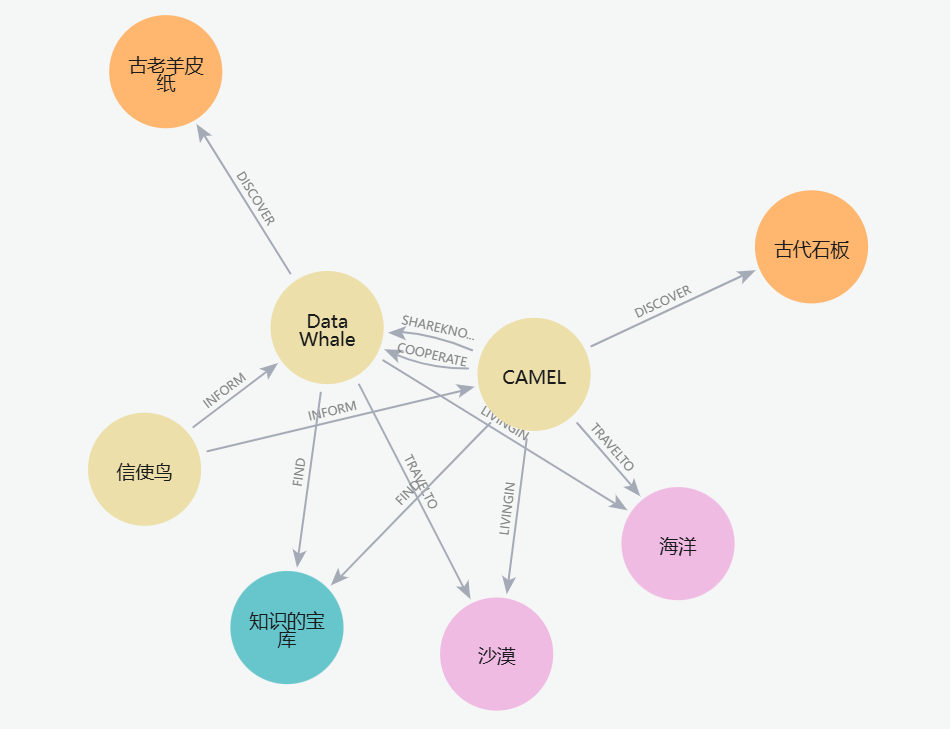

```python
# 根据query创建一个元素
query_element = uio.create_element_from_text(
    text=query, element_id="1"
)

# 让知识图谱agent从查询中提取节点和关系信息
ans_element = kg_agent.run(query_element, parse_graph_elements=True)

>>>
nodes=[Node(id='DataWhale', type='Organization', properties={'source': 'agent_created'}), Node(id='CAMEL', type='Organization', properties={'source': 'agent_created'})] relationships=[Relationship(subj=Node(id='DataWhale', type='Organization', properties={'source': 'agent_created'}), obj=Node(id='CAMEL', type='Organization', properties={'source': 'agent_created'}), type='合作关系', properties={'source': 'agent_created'})] source=<unstructured.documents.elements.Text object at 0x00000202AF30AC30>
```

有细心的小伙伴应该发现了，我们在text中并没有给DataWhale或者CAMEL有'Organization'的描述，但是最后的结果却含有，这是因为在使用KnowledgeGraphAgent的run函数时会将检索的到的结果再经过一遍大模型的润色，我们如果想查询原始的数据可以使用neo4j的查询语句：

**匹配知识图谱存储中的实体：**

```python
# 匹配从query中获得的实体在知识图谱存储内容中的信息
kg_result = []
for node in ans_element.nodes:
    n4j_query = f"""
MATCH (n {{id: '{node.id}'}})-[r]->(m)
RETURN 'Node ' + n.id + ' (label: ' + labels(n)[0] + ') has relationship ' + type(r) + ' with Node ' + m.id + ' (label: ' + labels(m)[0] + ')' AS Description
UNION
MATCH (n)<-[r]-(m {{id: '{node.id}'}})
RETURN 'Node ' + m.id + ' (label: ' + labels(m)[0] + ') has relationship ' + type(r) + ' with Node ' + n.id + ' (label: ' + labels(n)[0] + ')' AS Description
"""
    result = n4j.query(query=n4j_query)
    kg_result.extend(result)

kg_result = [item['Description'] for item in kg_result]

# 显示来自知识图谱数据库的结果
print(kg_result)

>>>
['Node DataWhale (label: Animal) has relationship LIVINGIN with Node 海洋 (label: Location)', 'Node DataWhale (label: Animal) has relationship DISCOVER with Node 古老羊皮纸 (label: Artifact)', 'Node DataWhale (label: Animal) has relationship TRAVELTO with Node 沙漠 (label: Location)', 'Node DataWhale (label: Animal) has relationship FIND with Node 知识的宝库 (label: Treasure)', 'Node CAMEL (label: Animal) has relationship LIVINGIN with Node 沙漠 (label: Location)', 'Node CAMEL (label: Animal) has relationship DISCOVER with Node 古代石板 (label: Artifact)', 'Node CAMEL (label: Animal) has relationship COOPERATE with Node DataWhale (label: Animal)', 'Node CAMEL (label: Animal) has relationship TRAVELTO with Node 海洋 (label: Location)', 'Node CAMEL (label: Animal) has relationship FIND with Node 知识的宝库 (label: Treasure)', 'Node CAMEL (label: Animal) has relationship SHAREKNOWLEDGE with Node DataWhale (label: Animal)']
```

这样就可以检索出我们query对应的这些信息啦。

```python
# 合并来自向量搜索和知识图谱实体搜索的结果
comined_results = str(vector_result) + "\n".join(kg_result)

print(comined_results)
>>>
{'Original Query': 'DataWhale和CAMEL之间是什么关系', 'Retrieved Context': ['在一个神奇的动物王国里，住着一只聪明的骆驼，名叫CAMEL，以及一只智慧的鲸鱼，名叫DataWhale。CAMEL生活在辽阔的沙漠中，而DataWhale则畅游在无边无际的海洋里。虽然它们的栖息地截然不同，但它们都对探索新知充满了浓厚的兴趣。\n\n有一天，CAMEL在沙漠中偶然发现了一块古老的石板，上面刻满了奇怪的符号和图案。CAMEL意识到这可能是一份通往巨大宝藏的地图，但它无法解读这些符号。于是，它决定去寻找帮助。\n\n与此同时，DataWhale在海洋深处发现了一卷古老的羊皮纸，上面也布满了类似的符号。这让DataWhale感到非常好奇，因为它知道这些符号可能蕴藏着某种秘密，但它同样无法破译。\n\n通过一只飞翔在天空中的信使鸟，CAMEL和DataWhale得知彼此的发现，并决定合作解开这个谜团。骆驼踏上了漫长的旅程，穿越沙漠来到了海洋边缘，而鲸鱼则游到岸边，与CAMEL会合。']}Node DataWhale (label: Animal) has relationship LIVINGIN with Node 海洋 (label: Location)
Node DataWhale (label: Animal) has relationship DISCOVER with Node 古老羊皮纸 (label: Artifact)
Node DataWhale (label: Animal) has relationship TRAVELTO with Node 沙漠 (label: Location)
Node DataWhale (label: Animal) has relationship FIND with Node 知识的宝库 (label: Treasure)
Node CAMEL (label: Animal) has relationship LIVINGIN with Node 沙漠 (label: Location)
Node CAMEL (label: Animal) has relationship DISCOVER with Node 古代石板 (label: Artifact)
Node CAMEL (label: Animal) has relationship COOPERATE with Node DataWhale (label: Animal)
Node CAMEL (label: Animal) has relationship TRAVELTO with Node 海洋 (label: Location)
Node CAMEL (label: Animal) has relationship FIND with Node 知识的宝库 (label: Treasure)
Node CAMEL (label: Animal) has relationship SHAREKNOWLEDGE with Node DataWhale (label: Animal)
```

```python
# 设置代理
sys_msg = BaseMessage.make_assistant_message(
    role_name="CAMEL Agent",
    content="""您是一个有用的助手来回答问题，
        我将给您原始查询和检索到的上下文，
    根据检索到的上下文回答原始查询。""",
)

camel_agent = ChatAgent(system_message=sys_msg,
                        model=model)

# 将检索到的信息传递给智能体
user_prompt=f"""
原始查询是 {query}
检索到的上下文是 {comined_results}
"""

user_msg = BaseMessage.make_user_message(
    role_name="CAMEL User", content=user_prompt
)

# 获取响应
agent_response = camel_agent.step(user_msg)

print(agent_response.msg.content)

>>>
DataWhale 和 CAMEL 之间的关系是合作和知识共享。尽管它们生活在不同的环境中——CAMEL 生活在沙漠，而 DataWhale 生活在海洋，但它们都发现了神秘的古代文物，分别是古代石板和古老羊皮纸。通过一只信使鸟的帮助，它们了解到对方的发现并决定合作解开这些文物的秘密。CAMEL 跨越沙漠来到海洋边缘，而 DataWhale 也游到岸边与 CAMEL 会合。最终，它们共同努力找到了知识的宝库。
```

配置neo4J教程

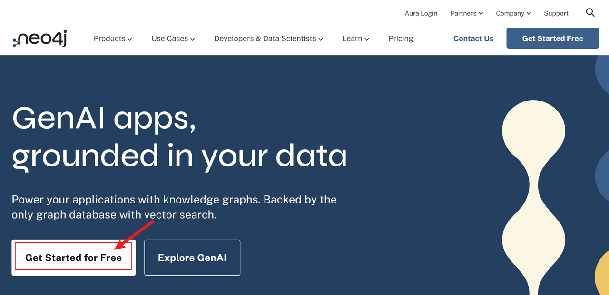

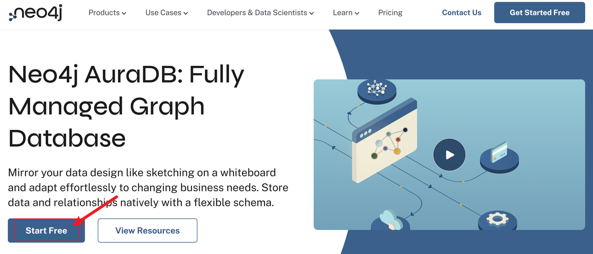

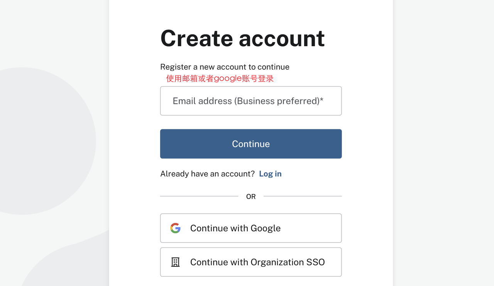

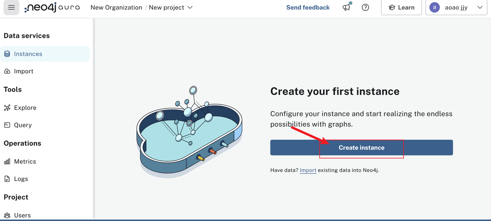

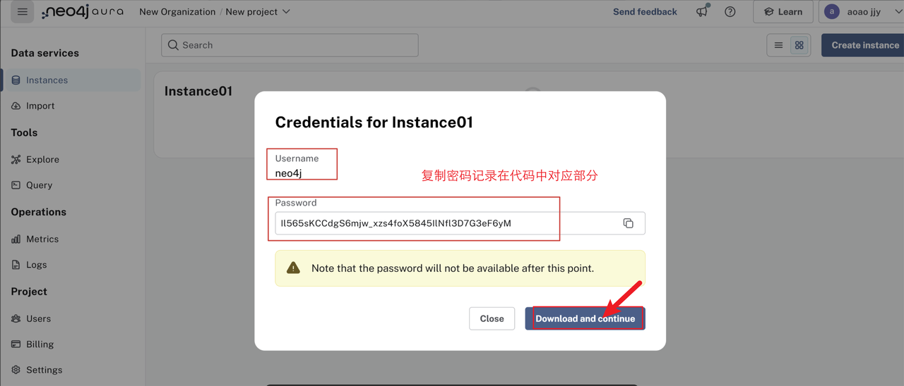

url，username，password都在这个创建实例下载的txt里。

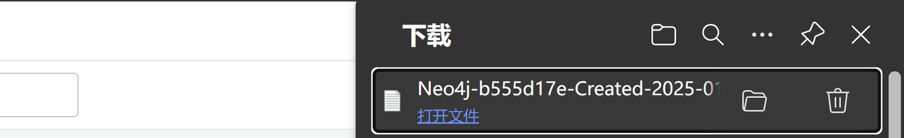


# 第三章：综合案例

在这一节中，我们将展示如何使用CAMEL框架来搭建一个简单实用的**旅游出行规划助手**。

## 1. **应用概览**

在大模型时代，代码能力基本已经不再是初学者想要开发AI应用的障碍，单纯地使用一些模型的Web端就可以搭建一些简单的应用，搭配一些AI编程工具可以让我们的开发效率更高，只需要写一些提示词就可以搭建一个简单的带有前端UI的应用。


AI的写的代码直接复制就能跑！

得益于现在大模型的强大代码能力，我们可以将更多的精力放在我们的应用架构以及产品上，包括我们要实现的功能呀、架构设计、目标用户等等。能不能捕捉到用户的需求很重要，以什么形式满足？也就是说，现在的AI时代，产品思维对于应用开发者也是很重要的。

以下是我们使用CAMEL框架搭建一个真实可用的软件应用——NavigatorAI（旅游出行规划助手），其中使用到了非常多常见而实用的CAMEL模块和知识点。

> **特别注意**：NavigatorAI遵循[CC BY-NC](https://creativecommons.org/licenses/by-nc/4.0/)协议，仅供学习使用，不能商用！！！

### 1.1 目标和交互形式

首先明确我们的目标，项目的核心目标是实现一个智能化的旅游出行规划助手：用户**只需输入目的地和天数**，系统即可自动生成详细的旅游行程，包括每日活动安排、餐饮推荐、景点信息等。系统**还支持根据用户反馈动态调整行程，支持在线阅览和编辑**，同时提供多种格式（Markdown，HTML 或 PDF）的导出，方便用户保存或分享。这不仅提升了行程规划的效率，也能为用户带来更为便捷和专业的旅游体验。

根据目标我们可以设计出我们的整体应用架构图如下：

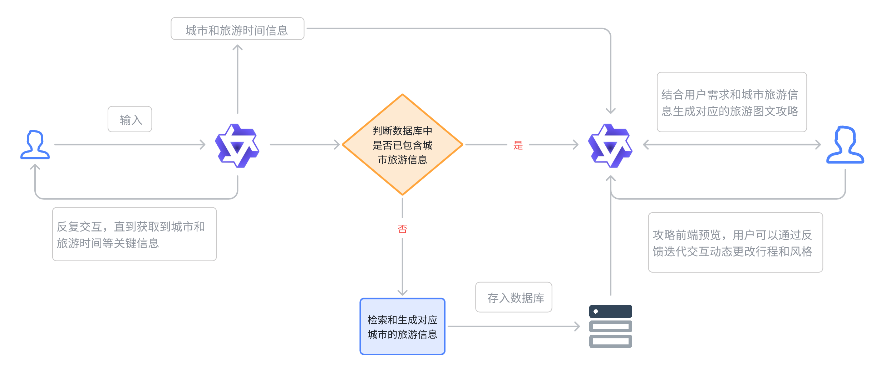

### 1.2 模块化设计

在现代软件开发中，一般会选择模块化的设计思路，旨在通过将系统分解为多个独立、可重用的模块来提升代码的可维护性、可扩展性和开发效率。模块化设计的核心思想是**解耦**，即通过清晰的边界和接口将系统的不同功能分离，使得每个模块可以独立开发、测试和维护，而不会对其他模块产生过多依赖。

因此通过模块化设计，开发团队可以更高效地构建复杂系统，同时降低长期维护的难度，可以帮助开发团队在短时间协同完成整个项目的开发设计和测试。

旅游出行规划助手NavigatorAI也采取了模块化的设计思想，整个综合应用可以分成四个子模块——

#### 1.2.1 **信息收集模块**

在该模块中，用户和**信息收集Agent**进行多轮往复的对话，直到Agent认为能够通过用户的表达和上下文提取出用户的目标出行城市和出行天数等关键信息，并将信息传递到下一个模块。&#x20;

#### 1.2.2 **攻略生成模块**

* **验证数据是否存在**：&#x20;

  * 如果数据库中存在对应的城市和天数的旅游数据，（即缓存命中），则直接加载复用数据。&#x20;

  * 如果数据库中没有查询到对应的信息，则调用Tool Calling中的搜索工具（Google Search 或 DuckDuckGo）进行实时的信息检索（检索的内容包括著名景点，当地美食，天气情况等数据，可以根据需要自由添加）

* **攻略初稿生成**：&#x20;

  * 接下来，**攻略生成Agent**会结合上述检索到的基础数据，按预先定义的默认格式生成 HTML 格式的详细行程攻略，包含每日的活动安排和推荐内容。&#x20;

* **格式转换**：&#x20;

  * 将生成的 HTML 导出为 PDF 格式，并在前端提供在线预览，方便用户进行下载/转发/保存/修改。&#x20;

#### 1.2.3 **反馈优化模块**

* **收集用户反馈**：&#x20;

  * 用户可以在前端预览中对生成的攻略初稿中的任意部分和内容进行评价，支持手动标记圈画需要优化的部分，这意味着我们接受反馈的形式是多模态的（图像理解+文字评述）。

* **使用反馈优化Agent进行意图理解并迭代式地调整攻略**：&#x20;

  * **反馈优化Agent**分析用户反馈并理解具体修改需求；&#x20;

  * 基于用户反馈，结合多模态能力和工具调用生成新内容并迭代式优化。&#x20;

* **输出最终攻略版本**：&#x20;

  * 根据用户确认的最终行程生成 PDF 文档。&#x20;

  * 将优化后的行程存入数据库以供未来复用。&#x20;


## 2. 用户意图识别模块

该模块主要用于收集用户想要去哪，去几天的需求。我们可以通过一个合适的system prompt来实现，为了后续在软件开发中的前后端分离的设计，我们还需要进一步通过flask将该模块封装成一个本地服务——

````python
import os
import sys
import json
from typing import Optional
from flask import Flask, request, jsonify,Response

from dotenv import load_dotenv
from camel.configs import QwenConfig
from camel.models import ModelFactory
from camel.types import ModelPlatformType
from camel.agents import ChatAgent

load_dotenv()

API_KEY = os.getenv('QWEN_API_KEY')

SYSTEM_PROMPT = """
你是一个旅游信息提取助手。你的任务是从用户的输入中提取旅游目的地城市和行程天数，并根据提取情况决定是否需要用户补充信息。

用户输入可能包含以下信息：
* 旅游目的地城市名称（例如：北京、上海、巴黎、东京）
* 行程天数（例如：3天、5天、一周、两周）
* 可能会有其他无关信息，请忽略。

你需要将提取到的城市名称和行程天数以 JSON 格式返回，格式如下：
{"city": "城市名称", "days": 天数, "need_more_info": boolean}
* "city" 的值：
    * 如果成功提取到城市名称，则为城市名称字符串。
    * 如果无法提取到城市名称，则为 null。
* "days" 的值：
    * 如果成功提取到行程天数，则为数字。
    * 如果无法提取到行程天数，则为 null。
* "need_more_info" 的值：
    * 如果 "city" 或 "days" 中有任何一个为 null，则为 true，表示需要用户提供更多信息。
    * 如果 "city" 和 "days" 都不为 null，则为 false，表示不需要用户提供更多信息。
* 如果提取到的天数包含“天”或“日”等字样，请将其转换为数字。
* 如果提取到的天数包含“周”或“星期”，请将其转换为7的倍数。例如，“一周”转换为7，“两周”转换为14。
* 如果用户输入中包含多个城市，请只提取第一个城市。
* 如果用户输入中包含多个天数，请只提取第一个天数。

请严格按照 JSON 格式返回结果。

**示例：**

**用户输入：**
我想去北京玩三天，顺便看看长城。

**你的输出：**
{"city": "北京", "days": 3, "need_more_info": false,"response": "信息在Navigator的数据库中查询到啦，正在努力为您生成攻略~"}

**用户输入：**
我想去北京。

**你的输出：**
{"city": "北京", "days": null, "need_more_info": true,"response": "Navigator还不知道您打算去玩几天呢，请补充你计划的行程天数~"}
"""

app = Flask(__name__)

def create_travel_agent():
    qwen_model = ModelFactory.create(
        model_platform=ModelPlatformType.OPENAI_COMPATIBLE_MODEL,
        model_type="Qwen/Qwen2.5-72B-Instruct",
        api_key=API_KEY,
        url="https://api-inference.modelscope.cn/v1",
        model_config_dict=QwenConfig(temperature=0.2).as_dict(),
    )

    agent = ChatAgent(
        system_message=SYSTEM_PROMPT,
        model=qwen_model,
        message_window_size=10,
        output_language='Chinese'
    )
    return agent

travel_agent = create_travel_agent()

def get_travel_info_camel(user_input: str, agent: ChatAgent) -> dict:
    try:
        response = agent.step(user_input)
        # 回到原始状态
        agent.reset()
        if not response or not response.msgs:
            raise ValueError("模型没有返回任何消息")
        json_output = response.msgs[0].content.strip().replace("```json", "").replace("```", "").strip()
        json_output = json.loads(json_output)
        json_output["query"] = user_input
        return json_output
    except json.JSONDecodeError:
        print("Error: 模型返回的不是有效的 JSON 格式。")
        return {
            'city': None,
            'days': None,
            'need_more_info': True,
            'query': user_input,
            'response': None
        }
    except Exception as e:
        print(f"An unexpected error occurred: {e}")
        return {
            'city': None,
            'days': None,
            'need_more_info': True,
            'query': user_input,
            'response': None
        }

@app.route('/extract_travel_info', methods=['POST'])
def extract_travel_info():
    try:
        request_data = request.get_json()
        if not request_data or 'query' not in request_data:
            return jsonify({'error': '请求数据无效'}), 400

        result = get_travel_info_camel(request_data['query'], travel_agent)
        response = {
            'city': result['city'],
            'days': result['days'],
            'need_more_info': result['need_more_info'],
            'query': result['query'],
            'response': result['response']
        }
        response_json = json.dumps(response, ensure_ascii=False)
        return Response(response_json, status=200, mimetype='application/json; charset=utf-8')
    except Exception as e:
        return jsonify({'error': f'服务器内部错误: {str(e)}'}), 500

if __name__ == "__main__":
    app.run(host="0.0.0.0", port=5001)
    
````

这个模块运行之后会在本地8000端口启动一个服务，我们可以通过请求这个服务来和模块中的**信息收集Agent**进行多轮交互

使用Python requests库的示例代码

```python
import requests

url = "http://localhost:8000/extract_travel_info"
data = {"query": "我想去北京玩三天"}
response = requests.post(url, json=data)
print(response.json())

>>>
{'city': '北京', 'days': 3, 'need_more_info': False, 'query': '我想去北京玩三天', 'response': '信息已经获取，正在帮你生成攻略。'}
```

使用curl的示例命令行，这次我们不说清楚需求试试：

```python
curl -X POST http://localhost:8000/extract_travel_info \
-H "Content-Type: application/json" \
-d '{"query": "我想去北京玩"}'

>>>
{"city": "北京", "days": null, "need_more_info": true, "query": "我想去北京玩", "response": "请补充旅游天数，你打算去玩几天呀。"}
```

通过上述两个测试的示例可以观察到**信息收集模块**的核心功能会让我们在信息表述不全的情况下自主的分析问题并引导提示我们补充行程天数，有的小伙伴可能会觉得，根本没必要这样做呀，直接在开始界面设置弹窗让用户输入城市和天数不就行了，其实这个方案我们也考虑过，这样确实更方便快捷，而我们在方案中特意添加了这个模块是为了考虑到后续可能有更多的交互空间的拓展，比如情感陪伴等。当然，适合自己的方案就是最好的！Enjoy！

## 3. 旅游信息检索

旅游信息检索是系统中实现数据获取和处理的关键环节，负责根据用户输入的目的地城市和出游天数，动态获取并生成高质量的旅游数据。

模块的工作流程分为以下几个阶段：首先，对用户输入的信息进行标准化处理，将城市名称和时间信息改写为适合搜索引擎的查询模板（query）。随后，系统调用 **Google Search API** 进行景点和美食信息的文本检索，包括景点描述、距离、推荐美食等详细内容；同时，为了补充图片资源，模块还调用 **DuckDuckGo 搜索引擎**，专注于获取高质量的景点和美食图片链接。

在数据检索完成后，模块进一步利用大语言模型（LLM）对初步搜索结果进行智能解析与重排序（rerank），从相关性和用户需求角度优化数据质量，确保信息全面、准确、优先级清晰。经过优化后的数据会以结构化的形式存储到数据库中，包含每个景点和美食的名称、详细描述、推荐理由以及图片 URL。

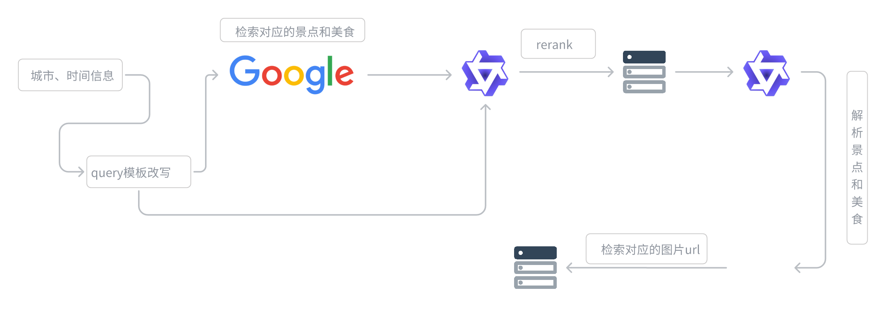


````python
from camel.toolkits import SearchToolkit
from camel.agents import ChatAgent
from camel.models import ModelFactory
from camel.types import ModelPlatformType
from camel.loaders import Firecrawl
from typing import List, Dict, Any

from flask import Flask, request, jsonify
import json
import os
from dotenv import load_dotenv

load_dotenv()

os.environ["GOOGLE_API_KEY"] = os.getenv("GOOGLE_API_KEY")
os.environ["SEARCH_ENGINE_ID"] = os.getenv("SEARCH_ENGINE_ID")
os.environ["FIRECRAWL_API_KEY"] = os.getenv("FIRECRAWL_API_KEY")
os.environ["QWEN_API_KEY"] = os.getenv("QWEN_API_KEY")

app = Flask(__name__)

class TravelPlanner:
    def __init__(self, city: str, days: int):
        
        #定义地点和时间，设置默认值
        self.city = city
        self.days = days
        self.res = None        

        # 初始化模型和智能体
        self.model = ModelFactory.create(
            model_platform=ModelPlatformType.OPENAI_COMPATIBLE_MODEL,
            model_type="Qwen/Qwen2.5-72B-Instruct",
            url='https://api-inference.modelscope.cn/v1/',
            api_key=os.getenv('QWEN_API_KEY')
        )

        # 初始化各种工具
        #重排序模型
        self.reranker_agent = ChatAgent(
            system_message="你是一搜索质量打分专家，要从{搜索结果}里找出和{query}里最相关的2条结果，保存他们的结果，保留result_id、title、description、url，严格以json格式输出",
            model=self.model,
            output_language='中文'
        )
        #景点抓取agent
        self.attraction_agent = ChatAgent(
            system_message="你是一个旅游信息提取专家，要根据内容提取出景点信息并返回json格式，严格以json格式输出",
            model=self.model,
            output_language='中文'
        )
        #美食抓取agent
        self.food_agent = ChatAgent(
            system_message="你是一个旅游信息提取专家，要根据内容提取出美食信息并返回json格式，严格以json格式输出",
            model=self.model,
            output_language='中文'
        )
        #base攻略生成agent
        self.base_guide_agent = ChatAgent(
            system_message="你是一个旅游攻略生成专家，要根据内容生成一个旅游攻略，严格以json格式输出",
            model=self.model,
            output_language='中文'
        )
        # self.firecrawl = Firecrawl()#后续功能
        self.search_toolkit = SearchToolkit()

    def extract_json_from_response(self,response_content: str) -> List[Dict[str, Any]]:
            """从LLM响应中提取JSON内容"""
            try:
                # 找到JSON内容的开始和结束位置
                start = response_content.find('```json\n') + 8
                end = response_content.find('\n```', start)
                if start == -1 or end == -1:
                    print("未找到JSON内容的标记")
                    return []
                
                json_str = response_content[start:end].strip()
                print(f"提取的JSON字符串: {json_str}")  # 调试信息
                
                # 解析 JSON 字符串
                parsed = json.loads(json_str)
                
                # 处理不同的JSON结构
                if isinstance(parsed, dict) and "related_results" in parsed:
                    return parsed["related_results"]
                elif isinstance(parsed, list):
                    return parsed
                else:
                    print("未找到预期的JSON结构")
                    return []
                
            except json.JSONDecodeError as e:
                print(f"解析JSON失败: {str(e)}")
                print(f"原始内容: {response_content}")
                return []
            except Exception as e:
                print(f"发生错误: {str(e)}")
                return []

    def search_and_rerank(self) -> Dict[str, Any]:
        """多次搜索并重排序，整合信息"""
        city = self.city
        days = self.days
        all_results = {}
    
        # 第一次搜索：旅游攻略
        try:
            query = f"{city}{days}天旅游攻略 最佳路线"
            search_results = self.search_toolkit.search_google(query=query, num_result_pages=5)
            prompt = f"请从以下搜索结果中筛选出最相关的{self.days}条{city}{days}天旅游攻略信息，并按照相关性排序：\n{json.dumps(search_results, ensure_ascii=False, indent=2)}"
            response = self.reranker_agent.step(prompt)
            all_results["guides"] = self.extract_json_from_response(response.msgs[0].content)
        except Exception as e:
            print(f"旅游攻略搜索失败: {str(e)}")
            all_results["guides"] = []
        
        # 第二次搜索：必去景点
        try:
            query = f"{city} 必去景点 top10 著名景点"
            search_results = self.search_toolkit.search_google(query=query, num_result_pages=5)
            prompt = f"请从以下搜索结果中筛选出最多{self.days}条{city}最值得去的景点信息，并按照热门程度排序：\n{json.dumps(search_results, ensure_ascii=False, indent=2)}"
            response = self.reranker_agent.step(prompt)
            all_results["attractions"] = self.extract_json_from_response(response.msgs[0].content)
        except Exception as e:
            print(f"景点搜索失败: {str(e)}")
            all_results["attractions"] = []
        
        # 第三次搜索：必吃美食
        try:
            query = f"{city} 必吃美食 特色小吃 推荐"
            search_results = self.search_toolkit.search_google(query=query, num_result_pages=5)
            prompt = f"请从以下搜索结果中筛选出最多{self.days}条{city}最具特色的美食信息，并按照推荐度排序：\n{json.dumps(search_results, ensure_ascii=False, indent=2)}"
            response = self.reranker_agent.step(prompt)
            all_results["must_eat"] = self.extract_json_from_response(response.msgs[0].content)
        except Exception as e:
            print(f"必吃美食搜索失败: {str(e)}")
            all_results["must_eat"] = []
        
        # 第四次搜索：特色美食
        try:
            query = f"{city} 特色美食 地方小吃 传统美食"
            search_results = self.search_toolkit.search_google(query=query, num_result_pages=5)
            prompt = f"请从以下搜索结果中筛选出最多{self.days}条{city}独特的地方特色美食信息，并按照特色程度排序：\n{json.dumps(search_results, ensure_ascii=False, indent=2)}"
            response = self.reranker_agent.step(prompt)
            all_results["local_food"] = self.extract_json_from_response(response.msgs[0].content)
        except Exception as e:
            print(f"特色美食搜索失败: {str(e)}")
            all_results["local_food"] = []
        
        # 整合所有信息
        final_result = {
            "city": city,
            "days": days,
            "travel_info": {
                "guides": [
                    {
                        "result_id": item.get("result_id"),
                        "title": item.get("title"),
                        "description": item.get("description"),
                        "long_description": item.get("long_description"),
                    }
                    for item in all_results["guides"]
                ],
                "attractions": [
                    {
                        "result_id": item.get("result_id"),
                        "title": item.get("title"),
                        "description": item.get("description"),
                        "long_description": item.get("long_description"),
                    }
                    for item in all_results["attractions"]
                ],
                "must_eat": [
                    {
                        "result_id": item.get("result_id"),
                        "title": item.get("title"),
                        "description": item.get("description"),
                        "long_description": item.get("long_description"),
                    }
                    for item in all_results["must_eat"]
                ],
                "local_food": [
                    {
                        "result_id": item.get("result_id"),
                        "title": item.get("title"),
                        "description": item.get("description"),
                        "long_description": item.get("long_description"),
                    }
                    for item in all_results["local_food"]
                ]
            }
        }
        
        return final_result
    
    def extract_attractions_and_food(self) -> Dict:
        travel_info = self.search_and_rerank()

        # 提供一个base攻略路线，直接根据整个travel_info生成
        prompt = f"""
        参考以下信息，生成一个{self.city}{self.days}天攻略路线，直接根据整个travel_info生成
        {travel_info}
        【输出格式】
        {{
            "base_guide": "攻略内容"
        }}
        """
        base_guide = self.base_guide_agent.step(prompt)
        print(f"这是base攻略: {base_guide.msgs[0].content}")

        """提取景点和美食信息"""
        # 从描述中提取具体的景点和美食
        attractions_text = " ".join([item["description"] for item in travel_info["travel_info"]["attractions"] + travel_info["travel_info"]["guides"]])
        print(f"这是景点信息: {attractions_text}")
        food_text = " ".join([
            item["description"] 
            for item in travel_info["travel_info"]["must_eat"] + travel_info["travel_info"]["local_food"]
        ])
        print(f"这是美食信息: {food_text}")
        # 使用LLM提取并整理信息
        attractions_prompt = f"""
        请从以下文本中提取出具体的景点名称，注意不能遗漏景点信息，要尽量多提取景点信息，并为每个景点提供简短描述：
        {attractions_text}
        请以JSON格式返回，格式如下：
        {{
            "attractions": [
                {{"name": "景点名称", "description": "简短描述"}}
            ]
        }}
        """
        
        food_prompt = f"""
        请从以下文本中提取出具体的美食名称或者美食店铺，注意不能遗漏美食信息，要尽量多提取美食信息，并为每个美食和店铺提供简短描述：
        {food_text}
        请以JSON格式返回，格式如下：
        {{
            "foods": [
                {{"name": "美食名称", "description": "简短描述"}}
            ],
            "food_shop": [
                {{"name": "美食店铺", "description": "简短描述"}}
            ]
        }}
        """
        
        # 使用attraction_agent处理提取
        attractions_response = self.attraction_agent.step(attractions_prompt)
        foods_response = self.food_agent.step(food_prompt)
        
        print(f"这是景点信息: {attractions_response.msgs[0].content}")
        print(f"这是美食信息: {foods_response.msgs[0].content}")
        
        return {
            "base_guide": base_guide.msgs[0].content,
            "attractions": attractions_response.msgs[0].content,
            "foods": foods_response.msgs[0].content
        }
    
    def process_attractions_and_food(self) -> Dict:
        def clean_json_string(json_str: str) -> str:
            """清理JSON字符串，移除markdown代码块标记"""
            # 移除 ```json 开头
            if '```json' in json_str:
                json_str = json_str.split('```json')[-1]
            # 移除 ``` 结尾
            if '```' in json_str:
                json_str = json_str.split('```')[0]
            return json_str.strip()
        
        city = self.city
        """处理景点和美食信息，添加图片URL"""
        # 获取原始数据
        results = self.extract_attractions_and_food()
        
        # 解析JSON字符串
        base_guide = json.loads(clean_json_string(results['base_guide']))
        attractions_data = json.loads(clean_json_string(results['attractions']))
        foods_data= json.loads(clean_json_string(results['foods']))
        foods_list = foods_data['foods']
        food_shops_list = foods_data['food_shop']
        
        # 创建结果字典
        result = {
            "city": city,
            "days": self.days,
            "base路线": base_guide,
            "景点": [],
            "美食": [],
            "美食店铺": []
        }
        
        # 处理景点信息
        for attraction in attractions_data['attractions']:
            try:
                # 使用DuckDuckGo搜索图片
                images = self.search_toolkit.search_duckduckgo(
                    query=f"{city} {attraction['name']} 实景图",
                    source="images",
                    max_results=1
                )
                
                # 添加图片URL
                attraction_with_image = {
                    "name": attraction['name'],
                    "describe": attraction['description'],
                    "图片url": images[0]["image"] if images else "",
                }
                result['景点'].append(attraction_with_image)
                
            except Exception as e:
                print(f"搜索{attraction['name']}的图片时出错: {str(e)}")
                # 如果出错，仍然添加景点信息，但不包含图片URL
                result['景点'].append({
                    "name": attraction["name"],
                    "describe": attraction["description"],
                    "图片url": "",
                })
        
        # 处理美食信息
        for food in foods_list:
            try:
                # 使用DuckDuckGo搜索图片
                images = self.search_toolkit.search_duckduckgo(
                    query=f"{city} {food['name']} 美食",
                    source="images",
                    max_results=1
                )
                
                # 添加图片URL
                food_with_image = {
                    "name": food["name"],
                    "describe": food["description"],
                    "图片url": images[0]["image"] if images else "",
                }
                result['美食'].append(food_with_image)
                
            except Exception as e:
                print(f"搜索{food['name']}的图片时出错: {str(e)}")
                # 如果出错，仍然添加美食信息，但不包含图片URL
                result['美食'].append({
                    "name": food["name"],
                    "describe": food["description"],
                    "图片url": ""
                })
        # 处理美食店铺信息
        for food_shop in food_shops_list:
            try:
                # 使用DuckDuckGo搜索图片
                images = self.search_toolkit.search_duckduckgo(
                    query=f"{city} {food_shop['name']} 美食店铺",
                    source="images",
                    max_results=1
                )
                # 添加图片URL
                food_shop_with_image = {
                    "name": food_shop["name"],
                    "describe": food_shop["description"],
                    "图片url": images[0]["image"] if images else "",
                }
                result['美食店铺'].append(food_shop_with_image)
            except Exception as e:
                print(f"搜索{food_shop['name']}的图片时出错: {str(e)}")
                # 如果出错，仍然添加美食店铺信息，但不包含图片URL
                result['美食店铺'].append({
                    "name": food_shop["name"],
                    "describe": food_shop["description"],
                    "图片url": ""
                })
        try:
            # 获取当前脚本所在目录
            current_dir = os.path.dirname(os.path.abspath(__file__))
            # 创建storage目录路径
            storage_dir = os.path.join(current_dir, "storage")
            # 确保storage目录存在
            os.makedirs(storage_dir, exist_ok=True)
            
            # 生成文件名（使用城市名和日期）
            filename = os.path.join(storage_dir, f"{self.city}{self.days}天旅游信息.json")
            
            # 将结果写入JSON文件
            with open(filename, 'w', encoding='utf-8') as f:
                json.dump(result, f, ensure_ascii=False, indent=4)
            print(f"旅游攻略已保存到文件：{filename}")
        except Exception as e:
            print(f"保存JSON文件时出错: {str(e)}")
        
        return result

@app.route('/get_travel_plan', methods=['POST'])
def get_travel_plan():
   try:
       # 获取请求数据
       data = request.get_json()
       
       # 验证输入数据
       if not data or 'city' not in data or 'days' not in data:
           return jsonify({
               'status': 'error',
               'message': '请求必须包含city和days参数'
           }), 400
           
       city = data['city']
       days = data['days']
       
       # 验证days是否为整数
       try:
           days = int(days)
       except ValueError:
           return jsonify({
               'status': 'error',
               'message': 'days参数必须为整数'
           }), 400
           
       # 创建TravelPlanner实例并获取结果
       travel_planner = TravelPlanner(city=city, days=days)
       results = travel_planner.process_attractions_and_food()
       
       return jsonify({
           'status': 'success',
           'data': results
       })
       
   except Exception as e:
       return jsonify({
           'status': 'error',
           'message': f'处理请求时发生错误: {str(e)}'
       }), 500
if __name__ == '__main__':
   app.run(host='0.0.0.0', port=5002, debug=True)
````

同样的，我们在本地的5000端口启动了一个服务，我们使用requests库来调用测试一下效果：

```python
import requests
import json

# API端点
url = "http://localhost:5000/get_travel_plan"

# 请求数据
data = {
    "city": "上海",
    "days": 3
}

# 发送POST请求
try:
    response = requests.post(url, json=data)
    
    # 检查响应状态
    if response.status_code == 200:
        result = response.json()
        print("获取到的旅游计划：")
        print(json.dumps(result, ensure_ascii=False, indent=2))
    else:
        print(f"请求失败: {response.status_code}")
        print(f"错误信息: {response.text}")
        
except requests.exceptions.RequestException as e:
    print(f"发送请求时发生错误: {e}")
```

这个模块用于搜集和整理旅游信息。信息主要包括旅游的一些景点、美食信息及对应图片的url，以便于我们后面将他们转成图文攻略。

在大语言模型的应用开发中，我们常常使用JSON作为中间数据的逻辑保存格式，因为交互方便，很好地表示结构化的信息且方便人类阅读和理解。

以下是生成的三份参考结果

```python
filename = os.path.join(storage_dir, f"{self.city}{self.days}天旅游信息.json")
```

命名逻辑是 {地点}+{时间}+旅游信息.json

[新疆7天旅游信息.json](files/新疆7天旅游信息.json)

[成都3天旅游信息.json](files/成都3天旅游信息.json)

[上海3天旅游信息.json](files/上海3天旅游信息.json)

## 4. 攻略生成模块

这个模块实现了一个旅行行程规划服务，主要流程如下： &#x20;

核心思路是通过前端传来的城市和出游天数信息，先在本地数据库中查找是否已存有相应的旅游数据（例如景点、美食等），如果没有就自动检索和生成对应的旅游信息并存储起来。随后，后端会使用 CAME 库与 Qwen2.5-72B-Instruct 模型，结合一段包含行程规划规则的系统消息，指导大模型生成完整的多日行程安排。为了让结果在前端方便查看，代码会将模型给出的文本格式化成 HTML，并在必要时将其中的图片链接转换成 `` 标签，使用户可以直接预览行程攻略页面。如果用户想要下载，后端还可以将该 HTML 转换成 PDF 供导出。当用户对当前结果不满意时，可以再次与大模型交互，通过多轮对话来动态调整和优化最终的旅行方案。整个过程如图所示：当有城市与天数信息输入时，系统先判断本地库中是否存在可用数据；若存在则直接调用大模型生成行程，若不存在则先行检索并存储数据后再进行行程生成；最后通过前端界面查看生成的 HTML 或者 PDF，如果用户仍需修改，则再次通过大模型进行迭代。这样就完成了一套从检索数据到生成和展示定制化旅游攻略的完整流程。

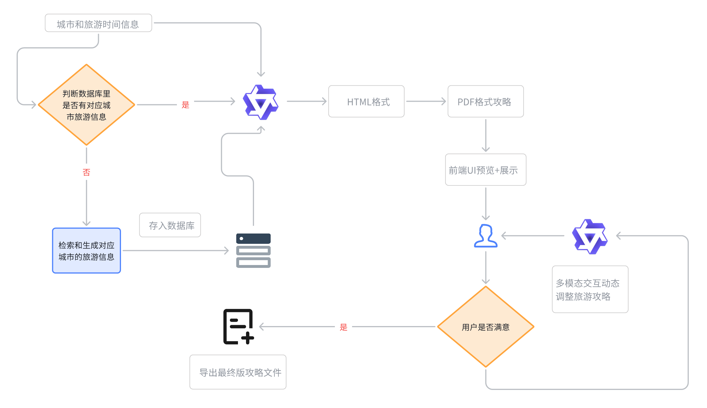

```python
import os
import json
import re
from flask import Flask, request, jsonify

from camel.configs import QwenConfig
from camel.models import ModelFactory
from camel.types import ModelPlatformType
from camel.toolkits import SearchToolkit
from camel.agents import ChatAgent
from dotenv import load_dotenv

load_dotenv()

app = Flask(__name__)

# 环境变量
os.environ["GOOGLE_API_KEY"] = os.getenv("GOOGLE_API_KEY")
os.environ["SEARCH_ENGINE_ID"] = os.getenv("SEARCH_ENGINE_ID")

# 模型初始化
qwen_model = ModelFactory.create(
    model_platform=ModelPlatformType.OPENAI_COMPATIBLE_MODEL,
    model_type="Qwen/Qwen2.5-72B-Instruct",
    api_key=os.getenv("QWEN_API_KEY"),
    url="https://api-inference.modelscope.cn/v1",
    model_config_dict=QwenConfig(temperature=0.2).as_dict(),
)

tools_list = [
    *SearchToolkit().get_tools(),
]

sys_msg = """
你是一位专业的旅游规划师。请你根据用户输入的旅行需求，包括旅行天数、景点/美食的距离、描述、图片URL、预计游玩/就餐时长等信息，为用户提供一个详细的行程规划。

请遵循以下要求：
1. 按照 Day1、Day2、... 的形式组织输出，直到满足用户指定的天数。
2. 每一天的行程请从早餐开始，食物尽量选用当地特色小吃美食，列出上午活动、午餐、下午活动、晚餐、夜间活动（若有），并在末尾总结住宿或返程安排。
3. 对每个景点或美食，提供其基本信息： 
   - 名称
   - 描述
   - 预计游玩/就餐时长（如果用户未提供，可以不写或自行估计）
   - 图片URL（如果有）
4. 请调用在线搜索工具在行程中对移动或出行所需时长做出合理估计。
5. 输出语言为中文。
6. 保持回复简洁、有条理，但必须包含用户想要的所有信息。
"""

agent = ChatAgent(
    system_message=sys_msg,
    model=qwen_model,
    message_window_size=10,
    output_language='Chinese',
    tools=tools_list
)

def create_usr_msg(data: dict) -> str:
    """
    同你原先的实现，用于生成给大模型的用户输入消息
    """
    city = data.get("city", "")
    days_str = data.get("days", "1")
    try:
        days = int(days_str)
    except ValueError:
        days = 1

    lines = []
    lines.append(f"我准备去{city}旅行，共 {days} 天。下面是我提供的旅行信息：\n")
    
    scenic_spots = data.get("景点", [])
    foods = data.get("美食", [])

    if scenic_spots:
        lines.append("- 景点：")
        for i, spot in enumerate(scenic_spots, 1):
            lines.append(f"  {i}. {spot.get('name', '未知景点名称')}")
            if '距离' in spot:
                lines.append(f"     - 距离：{spot['距离']}")
            if 'describe' in spot:
                lines.append(f"     - 描述：{spot['describe']}")
            if '图片url' in spot:
                lines.append(f"     - 图片URL：{spot['图片url']}")

    if foods:
        lines.append("\n- 美食：")
        for i, food in enumerate(foods, 1):
            lines.append(f"  {i}. {food.get('name', '未知美食名称')}")
            if 'describe' in food:
                lines.append(f"     - 描述：{food['describe']}")
            if '图片url' in food:
                lines.append(f"     - 图片URL：{food['图片url']}")

    lines.append(f"""
    \n请你根据以上信息，规划一个 {days} 天的行程表。
    从每天的早餐开始，到晚餐结束，列出一天的行程，包括对出行方式或移动距离的简单说明。
    如果有多种景点组合，你可以给出最优的路线推荐。请按以下格式输出：

    Day1:
    - 早餐：
    - 上午：
    - 午餐：
    - 下午：
    - 晚餐：
    ...

    Day2:
    ...

    Day{days}:
    ...
    """
    )
    return "\n".join(lines)

def fix_exclamation_link(text: str) -> str:
    """
    先把类似  的写法，提取出其中的 http://xx.jpg，
    替换成纯 http://xx.jpg
    """
    md_pattern = re.compile(r'!\[.*?\]\((https?://\S+)\)')
    # 将  只保留 http://xxx
    # 比如把 "" -> "http://xx.jpg"
    return md_pattern.sub(lambda m: m.group(1), text)

def convert_picurl_to_img_tag(text: str, width: int = 300, height: int = 200) -> str:
    """
    将文本中的图片URL替换为带样式的HTML img标签，并让图片居中显示和统一大小
    兼容两步：先处理 ，再匹配 - 图片URL: http://url
    """
    # 第一步：把  变成纯 url
    text_fixed = fix_exclamation_link(text)

    pattern = re.compile(r'-\s*图片URL：\s*(https?://\S+)')
    replaced_text = pattern.sub(
        rf'''
        <div style="text-align: center;">
            
        </div>
        ''',
        text_fixed
    )
    return replaced_text

def generate_cards_html(data_dict):
    """
    生成景点和美食卡片的 HTML 片段
    """
    spots = data_dict.get("景点", [])
    foods = data_dict.get("美食", [])

    html_parts = []
    # 景点推荐
    html_parts.append("<h2>景点推荐</h2>")
    if spots:
        html_parts.append('<div class="card-container">')
        for spot in spots:
            name = spot.get("name", "")
            desc = spot.get("describe", "")
            distance = spot.get("距离", "")
            url = spot.get("图片url", "")
            card_html = f"""
            <div class="card">
            <div class="card-image">
                
            </div>
            <div class="card-content">
                <h3>{name}</h3>
                <p><strong>距离:</strong> {distance}</p>
                <p>{desc}</p>
            </div>
            </div>
            """
            html_parts.append(card_html)
        html_parts.append("</div>")
    else:
        html_parts.append("<p>暂无景点推荐</p>")

    # 美食推荐
    html_parts.append("<h2>美食推荐</h2>")
    if foods:
        html_parts.append('<div class="card-container">')
        for food in foods:
            name = food.get("name", "")
            desc = food.get("describe", "")
            url = food.get("图片url", "")
            card_html = f"""
            <div class="card">
            <div class="card-image">
                
            </div>
            <div class="card-content">
                <h3>{name}</h3>
                <p>{desc}</p>
            </div>
            </div>
            """
            html_parts.append(card_html)
        html_parts.append("</div>")
    else:
        html_parts.append("<p>暂无美食推荐</p>")

    return "\n".join(html_parts)

def generate_html_report(itinerary_text, data_dict):
    """
    将多日行程文本 + 景点美食卡片，合并生成完整HTML
    """
    html_parts = []
    html_parts.append("<!DOCTYPE html>")
    html_parts.append("<html><head><meta charset='utf-8'><title>旅行推荐</title>")
    # 可以内联一些 CSS 样式
    html_parts.append("<style>")
    html_parts.append("""
    body {
       font-family: "Microsoft YaHei", sans-serif;
       margin: 20px;
       background-color: #f8f8f8;
       line-height: 1.6;
    }
    h1, h2 {
       color: #333;
    }
    .itinerary-text {
       background-color: #fff;
       padding: 20px;
       border-radius: 8px;
       box-shadow: 0 2px 5px rgba(0,0,0,0.1);
       margin-bottom: 30px;
    }
    .card-container {
       display: flex;
       flex-wrap: wrap;
       gap: 20px;
       margin: 20px 0;
    }
    .card {
       flex: 0 0 calc(300px);
       border: 1px solid #ccc;
       border-radius: 10px;
       overflow: hidden;
       box-shadow: 0 2px 5px rgba(0,0,0,0.1);
       background-color: #fff;
    }
    .card-image {
       width: 100%;
       height: 200px;
       overflow: hidden;
       background: #f8f8f8;
       text-align: center;
    }
    .card-image img {
       max-width: 100%;
       max-height: 100%;
       object-fit: cover;
    }
    .card-content {
       padding: 10px 15px;
    }
    .card-content h3 {
       margin-top: 0;
       margin-bottom: 10px;
       font-size: 18px;
    }
    .card-content p {
       margin: 5px 0;
    }
    .image-center {
        text-align: center;
        margin: 20px 0;
    }
    .image-center img {
        width: 300px;
        height: 200px;
        object-fit: cover;
    }
    """)
    html_parts.append("</style></head><body>")

    # 标题
    html_parts.append("<h1>旅行行程与推荐</h1>")

    # 行程文本
    html_parts.append('<div class="itinerary-text">')
    for line in itinerary_text.split("\n"):
        if not line.strip():
            continue
        if line.strip().startswith("Day"):
            html_parts.append(f"<h2>{line.strip()}</h2>")
        else:
            html_parts.append(f"<p>{line}</p>")
    html_parts.append('</div>')

    # 景点/美食卡片
    cards_html = generate_cards_html(data_dict)
    html_parts.append(cards_html)

    html_parts.append("</body></html>")
    return "\n".join(html_parts)

def save_html_file(city: str, days: str, html_content: str) -> str:
    """
    保存HTML内容到文件
    
    Args:
        city: 城市名
        days: 旅行天数
        html_content: HTML内容
        
    Returns:
        str: 保存的文件路径
    """
    # 确保storage目录存在
    storage_dir = "storage"
    if not os.path.exists(storage_dir):
        os.makedirs(storage_dir)
        
    # 生成文件名
    filename = f"{storage_dir}/{city}{days}天旅游攻略.html"
    
    # 保存HTML内容
    with open(filename, "w", encoding="utf-8") as f:
        f.write(html_content)
        
    return filename

@app.route("/generate_itinerary_html", methods=["POST"])
def generate_itinerary_html():
    """
    请求 JSON 格式：
    {
      "city": "成都",
      "days": "3"
    }
    返回生成的HTML文件路径和内容
    """
    req_data = request.json or {}
    city = req_data.get("city", "")
    days = req_data.get("days", "1")

    json_filename = f"storage/{city}{days}天旅游信息.json"
    if not os.path.exists(json_filename):
        return jsonify({"error": f"文件 {json_filename} 不存在，请检查输入的目的地和天数！"}), 404

    try:
        with open(json_filename, "r", encoding="utf-8") as f:
            data = json.load(f)
    except json.JSONDecodeError:
        return jsonify({"error": f"文件 {json_filename} 格式错误，请检查文件内容！"}), 400

    # 1. 生成用户输入并调用大模型
    usr_msg = create_usr_msg(data)
    response = agent.step(usr_msg)

    # 2. 将模型输出中的图片URL替换成 
    model_output = response.msgs[0].content
    end_output = convert_picurl_to_img_tag(model_output)

    # 3. 生成完整 HTML 报告
    html_content = generate_html_report(end_output, data)

    # 4. 保存HTML文件
    saved_file = save_html_file(city, days, html_content)

    # 5. 返回文件路径和HTML内容
    return jsonify({
        "file_path": saved_file,
        "html_content": html_content
    }), 200

if __name__ == "__main__":
    app.run(host="0.0.0.0", port=5003, debug=True)
```

这里我们使用另一种方式来测试服务接口，熟悉软件开发的小伙伴应该用过Postman

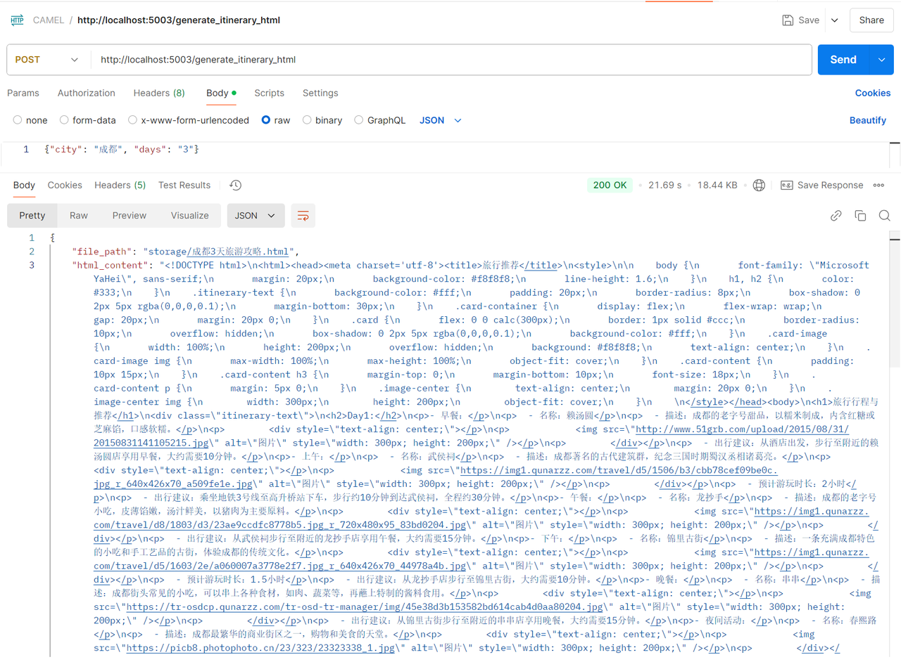

我们在postman中使用Post请求发送一份数据来模拟前端的请求，从而得到后端返回的数据，即html\_content，然后由save逻辑保存到本地的storage数据库中


此时其实我们已经得到了一份不错的可展示的攻略了，在本地的浏览器中双击即可打开并看到渲染效果

[成都3天旅游攻略.html](files/成都3天旅游攻略.html)

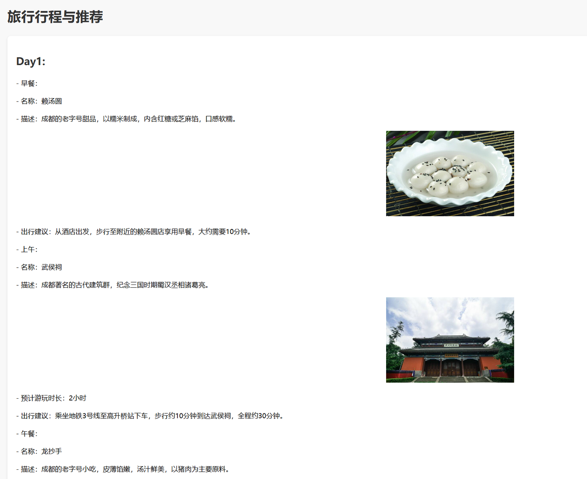


最后我们再把HTML转成在任何显示设备上都一致的PDF格式，保证了攻略的统一性，不必担心错位，换行等一系列问题。


[成都3天旅游攻略.pdf](files/成都3天旅游攻略.pdf)

## 5. 反馈优化模块

反馈优化模块需要使用到具备多模态能力的大语言模型，因此需要大家再申请一个具有图像理解能力的大模型（这里我们以gpt-4o演示），CAMEL中具体的支持列表如下：

在反馈优化中，我们所有的操作都是基于PDF的，虽然存在中间过程，但是对于用户来说是无感知的。具体而言，对于一个PDF，我们会先识别出用户做过标记圈画的部分，然后将其所在的整页转化为image的形式作为输出源的一部分交给有多模态理解能力的**反馈优化Agent。**

**反馈优化Agent**能够很好的理解用户的修改提示和意图，在HTML层面做出修正，重复之前的旅游信息检索和攻略生成模块，完成闭环，从而迭代式的优化旅游攻略，直到用户满意为止。

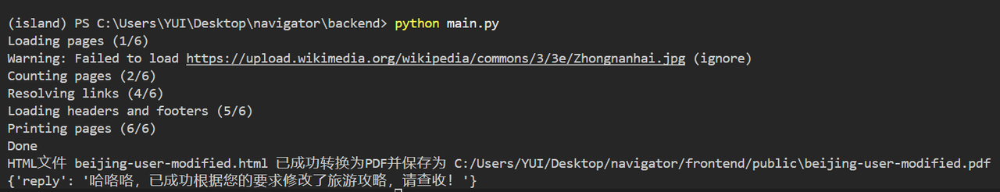

在线编辑PDF，调整需求：
需求一：红色部分帮我替换成中南海

需求二：文案帮我调整成小红书风格


观察到文案风格确实更加活泼，且红圈部分正确修改成了中南海和配图也十分吻合。

## 6. 搭配前端食用

综合案例中为了尽可能让大家直观的感受到基于CAMEL框架的Agent产品开发的乐趣，我们还为大家准备了精美的前端，搭配之前的几个后端模块一起构成我们的NavigatorAI旅游出行规划助手应用。

这里只给出一些功能上的描述和简介，前端的具体框架和原理不属于本次我们教程的讨论范围，感兴趣的同学可以自行拓展\~

### UI在线交互模块

UI 在线交互模块是系统中与用户交互的关键部分，旨在通过直观的界面实现对生成行程内容的在线预览、编辑和反馈。用户可以在界面中直接查看生成的 PDF 文档，实时圈选、标注或输入修改意见，系统会根据用户提供的反馈动态调整行程内容。

左右两边的侧边栏分别是历史记录+设置栏和文件交互栏，两侧都支持展开和隐藏，非常便捷和人性化。

支持昼夜模式切换

> Dark mode


> Light mode


1. **PDF 在线渲染** &#x20;

   * 将生成的行程文案以 PDF 格式直接嵌入到界面中，用户可以实时浏览内容。

   * 支持高质量的 PDF 渲染，确保用户能直观查看文字、图片和布局。


2. **动态交互编辑** &#x20;

   * 用户可以直接点击 PDF 文档中的任意内容进行标注或编辑。

   * 提供圈选工具，允许用户高亮文中需要修改的部分并附加文本说明。

   * 输入框支持对具体段落、景点描述或图片的修改建议。


3. **反馈与动态调整** &#x20;

   * 用户的修改意见将自动传递给大模型（LLM），系统分析反馈并对行程内容进行优化。

   * 支持多轮交互，用户可以反复调整文案，直至满意为止。


4. **实时预览** &#x20;

   * 调整后的内容会立即在界面中重新渲染，用户无需等待即可看到更新后的 PDF 文档。

   * 保持高效的交互流程，提升用户体验。

### 个人信息输入模块


个人信息输入模块是系统的重要组成部分，用于收集用户的基础信息以便生成更符合个性化需求的旅游行程。通过直观友好的界面设计，用户可以快速填写相关信息，模块根据这些输入数据定制化生成行程内容。

1. **用户基础信息录入** &#x20;

   * 支持用户输入包括姓名、年龄、MBTI（个性类型）、月收入等个人信息。 &#x20;

   * 数据用于优化旅游规划的推荐内容，例如推荐适合预算的活动和美食。

2. **出行偏好设置** &#x20;

   * 用户可以指定目标城市、同行人数以及出行的具体日期（开始日期和结束日期）。 &#x20;

   * 系统会根据这些信息计算出行程天数并匹配对应的景点和活动。

3) **交互式日历组件** &#x20;

   * 嵌入式日历设计，方便用户快速选择出发日期和返回日期。 &#x20;

   * 界面清晰，操作直观，同时支持日期范围校验，避免选择无效的时间范围。

4) **即时保存与更新** &#x20;

   * 提供“保存更改”按钮，允许用户修改输入信息并实时保存，确保数据更新准确。 &#x20;

   * 便捷的数据交互设计减少了用户的操作负担，提高了使用效率。

### 模型选择

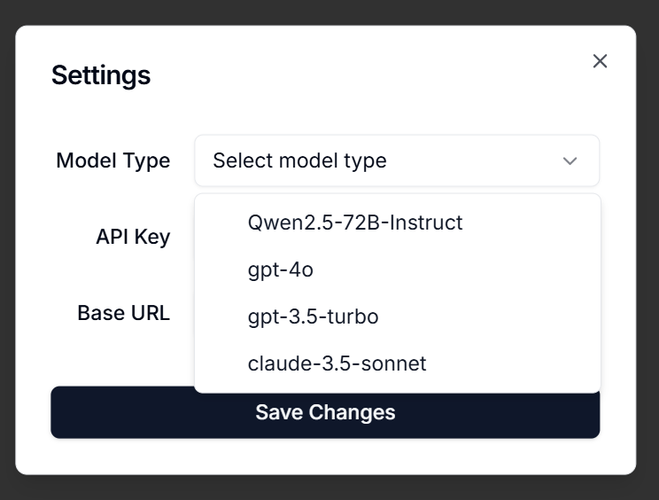

我们的模型选择模块是一款针对多语言模型应用需求设计的配置工具。用户只需要简单几步，就可以在界面中切换模型，并快速完成初始化配置，**随时切换和管理多种主流模型**。

下拉菜单集成了目前支持的模型：

* **Qwen2.5-72B-Instruct**：通义千问团队的最新开源模型。（综合案例中的大部分演示是基于此API）

* **gpt-4o**：拥有强大的推理能力和多模态能力，能够处理一系列复杂任务。

* **gpt-3.5-turbo**：轻量级、响应快。

* **claude-3.5-sonnet**：适合对话生成和自然语言理解的场景。


> **再次提醒**：NavigatorAI遵循[CC BY-NC](https://creativecommons.org/licenses/by-nc/4.0/)协议，仅供学习使用，不能商用！！！

